# 瑞吉外卖-项目介绍- 开发环境搭建- 后台登录功能开发- 后台退出功能开发

## 课程内容

- 软件开发整体介绍

- 瑞吉外卖项目介绍

- 开发环境搭建

- 后台登录功能开发

- 后台退出功能开发


## 1. 软件开发整体介绍

作为一名软件开发工程师,我们需要了解在软件开发过程中的开发流程， 以及软件开发过程中涉及到的岗位角色，角色的分工、职责， 并了解软件开发中涉及到的三种软件环境。那么这一小节，我们将从 软件开发流程、角色分工、软件环境 三个方面，来整体上介绍一下软件开发。


### 1.1 软件开发流程

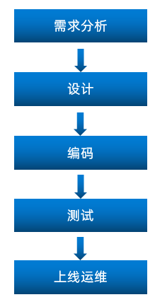 


**1). 第1阶段: 需求分析**

完成产品原型、需求规格说明书的编写。  

产品原型，一般是通过网页(html)的形式展示当前的页面展示什么样的数据, 页面的布局是什么样子的，点击某个菜单，打开什么页面，点击某个按钮，出现什么效果，都可以通过产品原型看到。 

需求规格说明书， 一般来说就是使用 Word 文档来描述当前项目有哪些功能，每一项功能的需求及业务流程是什么样的，都会在文档中描述。


**2). 第2阶段: 设计**

设计的内容包含 产品设计、UI界面设计、概要设计、详细设计、数据库设计。

在设计阶段，会出具相关的UI界面、及相关的设计文档。比如数据库设计，需要设计当前项目中涉及到哪些数据库，每一个数据库里面包含哪些表，这些表结构之间的关系是什么样的，表结构中包含哪些字段，字段类型都会在文档中描述清楚。


**3). 第3阶段: 编码**

编写项目代码、并完成单元测试。

作为软件开发工程师，我们主要的工作就是在该阶段， 对分配给我们的模块功能，进行编码实现。编码实现完毕后，进行单元测试，单元测试通过后再进入到下一阶段。


**4). 第4阶段: 测试**

在该阶段中主要由测试人员, 对部署在测试环境的项目进行功能测试, 并出具测试报告。


**5). 第5阶段: 上线运维**

在项目上线之前， 会由运维人员准备服务器上的软件环境安装、配置， 配置完毕后， 再将我们开发好的项目，部署在服务器上运行。


我们作为软件开发工程师， 我们主要的任务是在编码阶段， 但是在一些小的项目组当中， 也会涉及到数据库的设计、测试等方面的工作。


### 1.2 角色分工

学习了软件开发的流程之后， 我们还有必要了解一下在整个软件开发过程中涉及到的岗位角色，以及各个角色的职责分工。

 

| 岗位/角色                           | 职责/分工                                  |
| ----------------------------------- | ------------------------------------------ |
| 项目经理                            | 对整个项目负责，任务分配、把控进度         |
| 产品经理                            | 进行需求调研，输出需求调研文档、产品原型等 |
| UI设计师                            | 根据产品原型输出界面效果图                 |
| 架构师                              | 项目整体架构设计、技术选型等               |
| <font color='red'>开发工程师</font> | <font color='red'>功能代码实现</font>      |
| 测试工程师                          | 编写测试用例，输出测试报告                 |
| 运维工程师                          | 软件环境搭建、项目上线                     |


上述我们讲解的角色分工, 是在一个项目组中比较标准的角色分工, 但是在实际的项目中, 有一些项目组由于人员配置紧张, 可能并没有专门的架构师或测试人员, 这个时候可能需要有项目经理或者程序员兼任。


### 1.3 软件环境

 

在我们日常的软件开发中，会涉及到软件开发中的三套环境， 那么这三套环境分别是: 开发环境、测试环境、生产环境。 接下来，我们分别介绍一下这三套环境的作用和特点。


**1). 开发环境(development)**

我们作为软件开发人员，在开发阶段使用的环境，就是开发环境，一般外部用户无法访问。

比如，我们在开发中使用的MySQL数据库和其他的一些常用软件，我们可以安装在本地， 也可以安装在一台专门的服务器中， 这些应用软件仅仅在软件开发过程中使用， 项目测试、上线时，我们不会使用这套环境了，这个环境就是开发环境。


**2). 测试环境(testing)**

当软件开发工程师，将项目的功能模块开发完毕，并且单元测试通过后，就需要将项目部署到测试服务器上，让测试人员对项目进行测试。那这台测试服务器就是专门给测试人员使用的环境， 也就是测试环境，用于项目测试，一般外部用户无法访问。


**3). 生产环境(production)**

当项目开发完毕，并且由测试人员测试通过之后，就可以上线项目，将项目部署到线上环境，并正式对外提供服务，这个线上环境也称之为生产环境。


> <font color='gree'> <b>拓展知识:</b></font> 
>
> ​	**准生产环境:** 对于有的公司来说，项目功能开发好, 并测试通过以后，并不是直接就上生产环境。为了保证我们开发的项目在上线之后能够完全满足要求，就需要把项目部署在真实的环境中, 测试一下是否完全符合要求啊，这时候就诞生了准生产环境，你可以把他当做生产环境的克隆体，准生产环境的服务器配置, 安装的应用软件(JDK、Tomcat、数据库、中间件 ...) 的版本都一样，这种环境也称为 "仿真环境"。
>
> ​	ps.由于项目的性质和类型不同，有的项目可能不需要这个环境


## 2. 瑞吉外卖项目介绍

在开发瑞吉外卖这个项目之前，我们需要全方位的来介绍一下当前我们学习的这个项目。接下来，我们将从以下的五个方面， 来介绍瑞吉外卖这个项目。


### 2.1 项目介绍

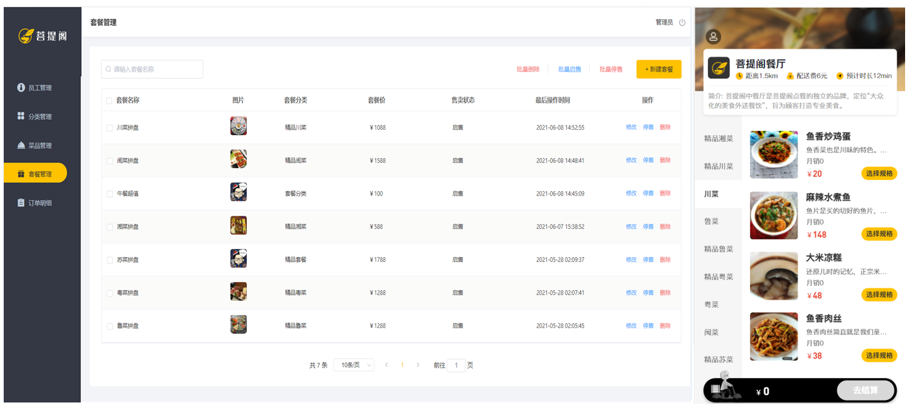 


本项目（瑞吉外卖）是专门为餐饮企业（餐厅、饭店）定制的一款软件产品，包括 系统管理后台 和 移动端应用 两部分。其中系统管理后台主要提供给餐饮企业内部员工使用，可以对餐厅的分类、菜品、套餐、订单、员工等进行管理维护。移动端应用主要提供给消费者使用，可以在线浏览菜品、添加购物车、下单等。


本项目共分为3期进行开发：

| 阶段   | 功能实现                                                     |
| ------ | ------------------------------------------------------------ |
| 第一期 | 主要实现基本需求，其中移动端应用通过H5实现，用户可以通过手机浏览器访问 |
| 第二期 | 主要针对移动端应用进行改进，使用微信小程序实现，用户使用起来更加方便 |
| 第三期 | 主要针对系统进行优化升级，提高系统的访问性能                 |


### 2.2 产品原型

**产品原型**，就是一款产品成型之前，由产品经理绘制的一个简单的框架，就是将页面的排版布局展现出来，使产品的初步构思有一个可视化的展示。通过原型展示，可以更加直观的了解项目的需求和提供的功能。

> **<font color='red'>注意事项：</font>** 产品原型主要用于展示项目的功能，并不是最终的页面效果。


在课程资料的产品原型文件夹下,提供了两份产品原型。

 


**1). 管理端**

餐饮企业内部员工使用。 主要功能有: 

| 模块      | 描述                                                         |
| --------- | ------------------------------------------------------------ |
| 登录/退出 | 内部员工必须登录后,才可以访问系统管理后台                    |
| 员工管理  | 管理员可以在系统后台对员工信息进行管理，包含查询、新增、编辑、禁用等功能 |
| 分类管理  | 主要对当前餐厅经营的 菜品分类 或 套餐分类 进行管理维护， 包含查询、新增、修改、删除等功能 |
| 菜品管理  | 主要维护各个分类下的菜品信息，包含查询、新增、修改、删除、启售、停售等功能 |
| 套餐管理  | 主要维护当前餐厅中的套餐信息，包含查询、新增、修改、删除、启售、停售等功能 |
| 订单明细  | 主要维护用户在移动端下的订单信息，包含查询、取消、派送、完成，以及订单报表下载等功能 |


**2). 用户端**

移动端应用主要提供给消费者使用。主要功能有:

| 模块        | 描述                                                         |
| ----------- | ------------------------------------------------------------ |
| 登录/退出   | 在移动端, 用户也需要登录后使用APP进行点餐                    |
| 点餐-菜单   | 在点餐界面需要展示出菜品分类/套餐分类, 并根据当前选择的分类加载其中的菜品信息, 供用户查询选择 |
| 点餐-购物车 | 用户选中的菜品就会加入用户的购物车, 主要包含 查询购物车、加入购物车、删除购物车、清空购物车等功能 |
| 订单支付    | 用户选完菜品/套餐后, 可以对购物车菜品进行结算支付, 这时就需要进行订单的支付 |
| 个人信息    | 在个人中心页面中会展示当前用户的基本信息, 用户可以管理收货地址, 也可以查询历史订单数据 |


### 2.3 技术选型

关于本项目的技术选型, 我们将会从 用户层、网关层、应用层、数据层 这几个方面进行介绍，而对于我们服务端开发工程师来说，在项目开发过程中，我们主要关注应用层及数据层技术的应用。

 

**1). 用户层**

本项目中在构建系统管理后台的前端页面，我们会用到H5、Vue.js、ElementUI等技术。而在构建移动端应用时，我们会使用到微信小程序。


**2). 网关层**

Nginx是一个服务器，主要用来作为Http服务器，部署静态资源，访问性能高。在Nginx中还有两个比较重要的作用： 反向代理和负载均衡， 在进行项目部署时，要实现Tomcat的负载均衡，就可以通过Nginx来实现。


**3). 应用层**

SpringBoot： 快速构建Spring项目, 采用 "约定优于配置" 的思想, 简化Spring项目的配置开发。

Spring: 统一管理项目中的各种资源(bean), 在web开发的各层中都会用到。

SpringMVC：SpringMVC是spring框架的一个模块，springmvc和spring无需通过中间整合层进行整合，可以无缝集成。

SpringSession: 主要解决在集群环境下的Session共享问题。

lombok：能以简单的注解形式来简化java代码，提高开发人员的开发效率。例如开发中经常需要写的javabean，都需要花时间去添加相应的getter/setter，也许还要去写构造器、equals等方法。

Swagger： 可以自动的帮助开发人员生成接口文档，并对接口进行测试。


**4). 数据层**

MySQL： 关系型数据库, 本项目的核心业务数据都会采用MySQL进行存储。

MybatisPlus： 本项目持久层将会使用MybatisPlus来简化开发, 基本的单表增删改查直接调用框架提供的方法即可。

Redis： 基于key-value格式存储的内存数据库, 访问速度快, 经常使用它做缓存(降低数据库访问压力, 提供访问效率), 在后面的性能优化中会使用。


**5). 工具**

git: 版本控制工具, 在团队协作中, 使用该工具对项目中的代码进行管理。

maven: 项目构建工具。

junit：单元测试工具，开发人员功能实现完毕后，需要通过junit对功能进行单元测试。


### 2.4 功能架构

 

**1). 移动端前台功能**

手机号登录 , 微信登录 , 收件人地址管理 , 用户历史订单查询 , 菜品规格查询 , 购物车功能 , 下单 , 分类及菜品浏览。


**2). 系统管理后台功能**

员工登录/退出 , 员工信息管理 , 分类管理 , 菜品管理 , 套餐管理 , 菜品口味管理 , 订单管理 。


### 2.5 角色

在瑞吉外卖这个项目中，存在以下三种用户，这三种用户对应三个角色： 后台系统管理员、后台系统普通员工、C端(移动端)用户。

| 角色             | 权限操作                                                     |
| ---------------- | ------------------------------------------------------------ |
| 后台系统管理员   | 登录后台管理系统，拥有后台系统中的所有操作权限               |
| 后台系统普通员工 | 登录后台管理系统，对菜品、套餐、订单等进行管理 (不包含员工管理) |
| C端用户          | 登录移动端应用，可以浏览菜品、添加购物车、设置地址、在线下单等 |


## 3. 开发环境搭建

### 3.1 数据库环境搭建

#### 3.1.1 创建数据库

可以通过以下两种方式中的任意一种, 来创建项目的数据库:

**1).图形界面**

 

注意: 本项目数据库的字符串, 选择 utf8mb4


**2).命令行**

 


#### 3.1.2 数据库表导入

项目的数据库创建好了之后, 可以直接将 资料/数据模型/db_reggie.sql 直接导入到数据库中, 也可以通过两种方式实现:

**1).图形界面**

 


**2).命令行**

 


> **<font color='red'>注意:</font>** 通过命令导入表结构时，注意sql文件不要放在中文目录中


#### 3.1.3 数据库表介绍

数据库表导入之后, 接下来介绍一下本项目中所涉及到的表结构: 

| **序号** | **表名**      | **说明**         |
| -------- | ------------- | ---------------- |
| 1        | employee      | 员工表           |
| 2        | category      | 菜品和套餐分类表 |
| 3        | dish          | 菜品表           |
| 4        | setmeal       | 套餐表           |
| 5        | setmeal_dish  | 套餐菜品关系表   |
| 6        | dish_flavor   | 菜品口味关系表   |
| 7        | user          | 用户表（C端）    |
| 8        | address_book  | 地址簿表         |
| 9        | shopping_cart | 购物车表         |
| 10       | orders        | 订单表           |
| 11       | order_detail  | 订单明细表       |


上述的表结构, 我们目前先简单的结合页面原型了解一下, 大概有那些表, 每张表结构中存储什么样的数据, 有一个印象。对于具体的表结构, 以及表结构中的字段, 在讲解具体的功能开发时, 我们再详细介绍。


### 3.2 Maven项目搭建

#### 3.2.1 创建maven项目

**1). 在idea中创建maven project, 项目名称 reggie_take_out** 

 


**2). 检查项目编码**

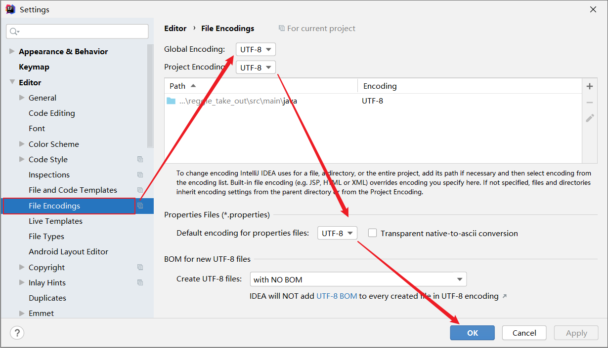 


**3). 检查maven配置**

 


**4). 检查JDK版本**

 

JDK的版本选择1.8;


#### 3.2.2 搭建基础环境

1).在pom.xml中导入依赖

```xml
<properties>
    <java.version>1.8</java.version>
</properties>

<parent>
    <groupId>org.springframework.boot</groupId>
    <artifactId>spring-boot-starter-parent</artifactId>
    <version>2.4.5</version>
    <relativePath/> <!-- lookup parent from repository -->
</parent>

<dependencies>
    <dependency>
        <groupId>org.springframework.boot</groupId>
        <artifactId>spring-boot-starter</artifactId>
    </dependency>
    <dependency>
        <groupId>org.springframework.boot</groupId>
        <artifactId>spring-boot-starter-test</artifactId>
        <scope>test</scope>
    </dependency>
    <dependency>
        <groupId>org.springframework.boot</groupId>
        <artifactId>spring-boot-starter-web</artifactId>
        <scope>compile</scope>
    </dependency>
    <dependency>
        <groupId>com.baomidou</groupId>
        <artifactId>mybatis-plus-boot-starter</artifactId>
        <version>3.4.2</version>
    </dependency>
    <dependency>
        <groupId>org.projectlombok</groupId>
        <artifactId>lombok</artifactId>
        <version>1.18.20</version>
    </dependency>
    <dependency>
        <groupId>com.alibaba</groupId>
        <artifactId>fastjson</artifactId>
        <version>1.2.76</version>
    </dependency>
    <dependency>
        <groupId>commons-lang</groupId>
        <artifactId>commons-lang</artifactId>
        <version>2.6</version>
    </dependency>
    <dependency>
        <groupId>mysql</groupId>
        <artifactId>mysql-connector-java</artifactId>
        <scope>runtime</scope>
    </dependency>
    <dependency>
        <groupId>com.alibaba</groupId>
        <artifactId>druid-spring-boot-starter</artifactId>
        <version>1.1.23</version>
    </dependency>
</dependencies>

<build>
    <plugins>
        <plugin>
            <groupId>org.springframework.boot</groupId>
            <artifactId>spring-boot-maven-plugin</artifactId>
            <version>2.4.5</version>
        </plugin>
    </plugins>
</build>
```


2).在工程的resources目录下创建application.yml文件,并引入配置

```yml
server:
  port: 8080
spring:
  application:
  	#应用名称 , 可选
    name: reggie_take_out
  datasource:
    druid:
      driver-class-name: com.mysql.cj.jdbc.Driver
      url: jdbc:mysql://localhost:3306/reggie?serverTimezone=Asia/Shanghai&useUnicode=true&characterEncoding=utf-8&zeroDateTimeBehavior=convertToNull&useSSL=false&allowPublicKeyRetrieval=true
      username: root
      password: root
mybatis-plus:
  configuration:
    #在映射实体或者属性时，将数据库中表名和字段名中的下划线去掉，按照驼峰命名法映射 address_book ---> AddressBook
    map-underscore-to-camel-case: true
    #日志输出
    log-impl: org.apache.ibatis.logging.stdout.StdOutImpl
  global-config:
    db-config:
      id-type: ASSIGN_ID
```


3).创建包 com.itheima.reggie , 并编写启动类

```java
import lombok.extern.slf4j.Slf4j;
import org.springframework.boot.SpringApplication;
import org.springframework.boot.autoconfigure.SpringBootApplication;

@Slf4j
@SpringBootApplication
public class ReggieApplication {
    public static void main(String[] args) {
        SpringApplication.run(ReggieApplication.class,args);
        log.info("项目启动成功...");
    }
}
```


> @Slf4j : 
>
> ​	是lombok中提供的注解, 用来通过slf4j记录日志。


当搭建完上述的基础环境之后, 就可以通过引导类, 启动该项目。


#### 3.2.3 前端静态资源导入

我们作为服务端开发工程师， 我们课程学习的重心应该放在后端的业务代码上， 前端的页面我们只需要导入课程资料中的前端资源， 前端页面的代码我们只需要能看懂即可。


**1). 导入静态资源**

前端资源存放位置为  资料/前端资源 :  

将上述两个目录中的静态资源文件, 导入到项目的resources目录下: 

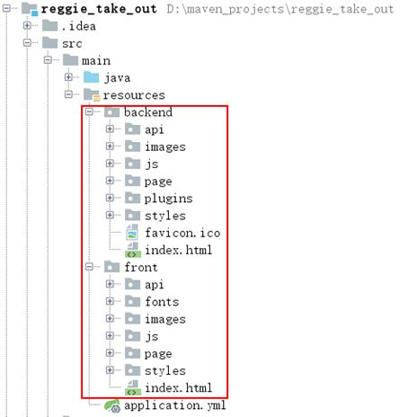 


**2). 创建配置类WebMvcConfig，设置静态资源映射**

用于在Springboot项目中, 默认静态资源的存放目录为 : "classpath:/resources/", "classpath:/static/", "classpath:/public/" ; 而在我们的项目中静态资源存放在 backend, front 目录中, 那么这个时候要想访问到静态资源, 就需要设置静态资源映射。

```java
import lombok.extern.slf4j.Slf4j;
import org.springframework.context.annotation.Configuration;
import org.springframework.web.servlet.config.annotation.ResourceHandlerRegistry;
import org.springframework.web.servlet.config.annotation.WebMvcConfigurationSupport;

@Slf4j
@Configuration
public class WebMvcConfig extends WebMvcConfigurationSupport {
    /**
     * 设置静态资源映射
     * @param registry
     */
    @Override
    protected void addResourceHandlers(ResourceHandlerRegistry registry) {
        log.info("开始进行静态资源映射...");
        registry.addResourceHandler("/backend/**").addResourceLocations("classpath:/backend/");
        registry.addResourceHandler("/front/**").addResourceLocations("classpath:/front/");
    }
}
```


**3). 访问测试**

http://localhost:8080/backend/index.html

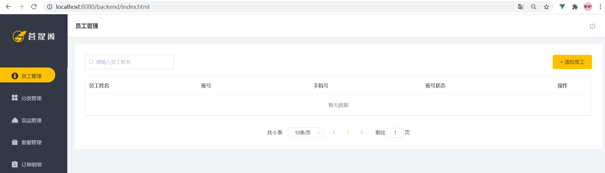 


## 4. 后台系统登录功能

### 4.1 需求分析

**1). 页面原型展示**

   


**2). 登录页面成品展示**

登录页面存放目录 /resources/backend/page/login/login.html

 


**3). 查看登录请求**

通过浏览器调试工具（F12），可以发现，点击登录按钮时，页面会发送请求（请求地址为http://localhost:8080/employee/login）并提交参数 username和password, 请求参数为json格式数据 {"username":"admin","password":"123456"}。

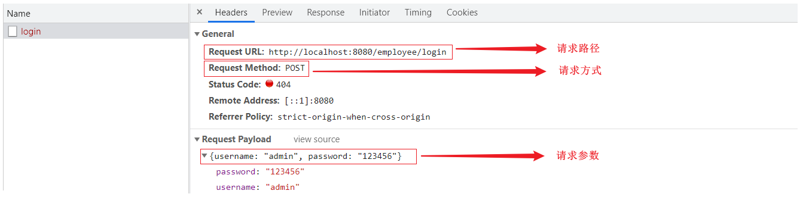 

> 此时报404，是因为我们的后台系统还没有响应此请求的处理器，所以我们需要创建相关类来处理登录请求 ；
>
> 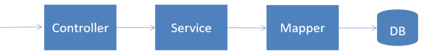 


**4). 数据模型(employee表)**

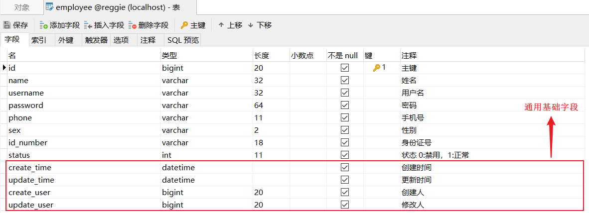 


**5). 前端页面分析**

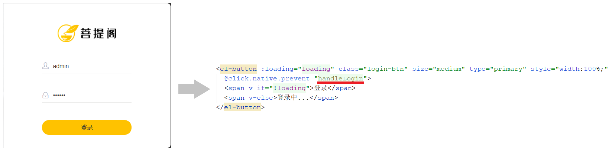 


当点击 "登录" 按钮, 会触发Vue中定义的 handleLogin 方法:

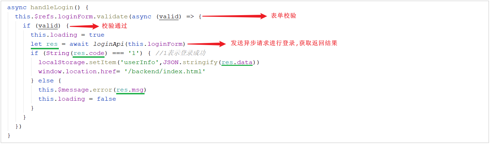 

在上述的前端代码中, 大家可以看到, 发送登录的异步请求之后, 获取到响应结果, 在响应结果中至少包含三个属性: code、data、msg 。


由前端代码，我们也可以看到，在用户登录成功之后，服务端会返回用户信息，而前端是将这些用户信息，存储在客户端的 localStorage 中了。

```js
localStorage.setItem('userInfo',JSON.stringify(res.data))
```


### 4.2 代码开发

#### 4.2.1 基础准备工作

在进行登录功能的代码实现之前， 首先在我们的工程下创建包结构： 

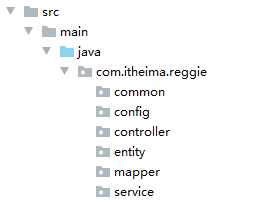 


**1). 创建实体类Employee**

该实体类主要用于和员工表 employee 进行映射。 该实体类， 也可以直接从资料( 资料/实体类 )中拷贝工程中。

所属包: com.itheima.reggie.entity

```java
import com.baomidou.mybatisplus.annotation.FieldFill;
import com.baomidou.mybatisplus.annotation.TableField;
import lombok.Data;
import java.io.Serializable;
import java.time.LocalDateTime;

@Data
public class Employee implements Serializable {
    private static final long serialVersionUID = 1L;

    private Long id;

    private String username;

    private String name;

    private String password;

    private String phone;

    private String sex;

    private String idNumber; //驼峰命名法 ---> 映射的字段名为 id_number

    private Integer status;

    private LocalDateTime createTime;

    private LocalDateTime updateTime;

    @TableField(fill = FieldFill.INSERT)
    private Long createUser;

    @TableField(fill = FieldFill.INSERT_UPDATE)
    private Long updateUser;
}
```


**2). 定义Mapper接口**

在MybatisPlus中, 自定义的Mapper接口, 需要继承自 BaseMapper。

所属包: com.itheima.reggie.mapper

```java
@Mapper
public interface EmployeeMapper extends BaseMapper<Employee>{
}
```


**3).Service接口**

本项目的Service接口, 在定义时需要继承自MybatisPlus提供的Service层接口 IService, 这样就可以直接调用 父接口的方法直接执行业务操作, 简化业务层代码实现。

所属包: com.itheima.reggie.service

```java
public interface EmployeeService extends IService<Employee> {
}
```


**4). Service实现类**

所属包: com.itheima.reggie.service.impl

```java
import com.baomidou.mybatisplus.extension.service.impl.ServiceImpl;
import com.itheima.reggie.entity.Employee;
import com.itheima.reggie.mapper.EmployeeMapper;
import com.itheima.reggie.service.EmployeeService;
import org.springframework.stereotype.Service;

@Service
public class EmployeeServiceImpl extends ServiceImpl<EmployeeMapper,Employee> implements EmployeeService{
}
```


**5). Controller基础代码**

所属包: com.itheima.reggie.controller

```java
import lombok.extern.slf4j.Slf4j;
import org.springframework.beans.factory.annotation.Autowired;
import org.springframework.web.bind.annotation.RequestMapping;
import org.springframework.web.bind.annotation.RestController;

@Slf4j
@RestController
@RequestMapping("/employee")
public class EmployeeController {

    @Autowired
    private EmployeeService employeeService;
	
}    
```


**6). 导入通用结果类R**

此类是一个通用结果类，服务端响应的所有结果最终都会包装成此种类型返回给前端页面。

所属包: com.itheima.reggie.common

```java
import lombok.Data;
import java.util.HashMap;
import java.util.Map;

/**
 * 通用返回结果，服务端响应的数据最终都会封装成此对象
 * @param <T>
 */
@Data
public class R<T> {
    private Integer code; //编码：1成功，0和其它数字为失败
    private String msg; //错误信息
    private T data; //数据
    private Map map = new HashMap(); //动态数据

    public static <T> R<T> success(T object) {
        R<T> r = new R<T>();
        r.data = object;
        r.code = 1;
        return r;
    }
    public static <T> R<T> error(String msg) {
        R r = new R();
        r.msg = msg;
        r.code = 0;
        return r;
    }
    public R<T> add(String key, Object value) {
        this.map.put(key, value);
        return this;
    }
}
```

A. 如果业务执行结果为成功, 构建R对象时, 只需要调用 success 方法; 如果需要返回数据传递 object 参数, 如果无需返回, 可以直接传递null。

B. 如果业务执行结果为失败, 构建R对象时, 只需要调用error 方法, 传递错误提示信息即可。


#### 4.2.2 登录逻辑分析

 

处理逻辑如下：

①. 将页面提交的密码password进行md5加密处理, 得到加密后的字符串

②. 根据页面提交的用户名username查询数据库中员工数据信息

③. 如果没有查询到, 则返回登录失败结果

④. 密码比对，如果不一致, 则返回登录失败结果

⑤. 查看员工状态，如果为已禁用状态，则返回员工已禁用结果

⑥. 登录成功，将员工id存入Session, 并返回登录成功结果
⑦.替换6，将session_id存入cookie和redis，防止服务器重启丢失session


#### 4.2.3 代码实现

**技术点说明:** 

A. 由于需求分析时, 我们看到前端发起的请求为post请求, 所以服务端需要使用注解 @PostMapping

B. 由于前端传递的请求参数为json格式的数据, 这里使用Employee对象接收, 但是将json格式数据封装到实体类中, 在形参前需要加注解@RequestBody

```java
/**
 * 员工登录
 * @param request
 * @param employee
 * @return
 */
@PostMapping("/login")
public R<Employee> login(HttpServletRequest request,@RequestBody Employee employee){

    //1、将页面提交的密码password进行md5加密处理
    String password = employee.getPassword();
    password = DigestUtils.md5DigestAsHex(password.getBytes());

    //2、根据页面提交的用户名username查询数据库
    LambdaQueryWrapper<Employee> queryWrapper = new LambdaQueryWrapper<>();
    queryWrapper.eq(Employee::getUsername,employee.getUsername());
    Employee emp = employeeService.getOne(queryWrapper);

    //3、如果没有查询到则返回登录失败结果
    if(emp == null){
        return R.error("登录失败");
    }

    //4、密码比对，如果不一致则返回登录失败结果
    if(!emp.getPassword().equals(password)){
        return R.error("登录失败");
    }

    //5、查看员工状态，如果为已禁用状态，则返回员工已禁用结果
    if(emp.getStatus() == 0){
        return R.error("账号已禁用");
    }
    
    //6、将员工id存入redis
    Cookie userCookie=new Cookie("employee",request.getSession().getId());
    userCookie.setPath("/");
    userCookie.setMaxAge(24*60*60);
    redisTemplate.opsForValue().set("employee"+request.getSession().getId(),emp.getId(),10, TimeUnit.MINUTES);
    //6、登录成功，将员工id存入Session并返回登录成功结果
    request.getSession().setAttribute("employee",emp.getId());
    return R.success(emp);
}
```


### 4.3 功能测试

代码实现完毕后, 启动项目, 访问url: http://localhost:8080/backend/page/login/login.html , 进行登录测试。

在测试过程中， 可以通过debug断点调试的方式来跟踪程序的执行过程，并且可以查看程序运行时各个对象的具体赋值情况。而且需要注意, 在测试过程中，需要将所有的情况都覆盖到。


**1). 问题说明**

当我们在进行debug端点调试时, 前端可能会出现如下问题: 前端页面的控制台报出错误-超时;

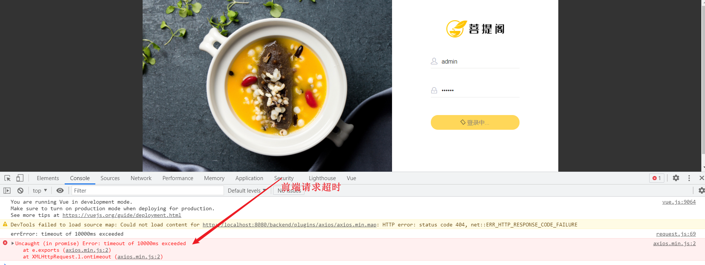 


**2). 解决方案**

前端进行异步请求时, 默认超时10000ms , 可以将该值调大一些。

 


==由于修改了JS文件，需要手动清理一下浏览器缓存，避免缓存影响，JS不能及时生效。==


## 5. 后台系统退出功能

### 5.1 需求分析

在后台管理系统中，管理员或者员工，登录进入系统之后，页面跳转到后台系统首页面(backend/index.html)，此时会在系统的右上角显示当前登录用户的姓名。

如果员工需要退出系统，直接点击右侧的退出按钮即可退出系统，退出系统后页面应跳转回登录页面。


**1). 退出页面展示**

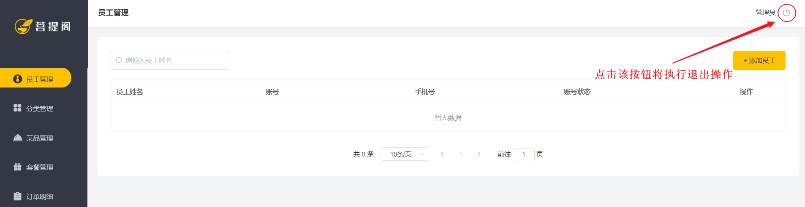 


**2).前端页面分析**

   

点击  将会调用一个js方法logout, 在logout的方法中执行如下逻辑: 

 

A. 发起post请求, 调用服务端接口 /employee/logout 执行退出操作 ;

B. 删除客户端 localStorage 中存储的用户登录信息, 跳转至登录页面 ;


### 5.2 代码实现

需要在Controller中创建对应的处理方法, 接收页面发送的POST请求 /employee/logout ，具体的处理逻辑：

A. 清理Session中的用户id

B. 返回结果

```java
/**
* 员工退出
* @param request
* @return
*/
@PostMapping("/logout")
public R<String> logout(HttpServletRequest request){
    //清理Session中保存的当前登录员工的id
    request.getSession().removeAttribute("employee");
    return R.success("退出成功");
}
```


### 5.3 功能测试

1). 代码实现完毕后, 重启服务, 访问登录界面 http://localhost:8080/backend/page/login/login.html ;

2). 登录完成之后, 进入到系统首页 backend/index.html, 点击右上角  按钮 执行退出操作, 完成后看看是否可以跳转到登录页面 , 并检查localStorage。

 


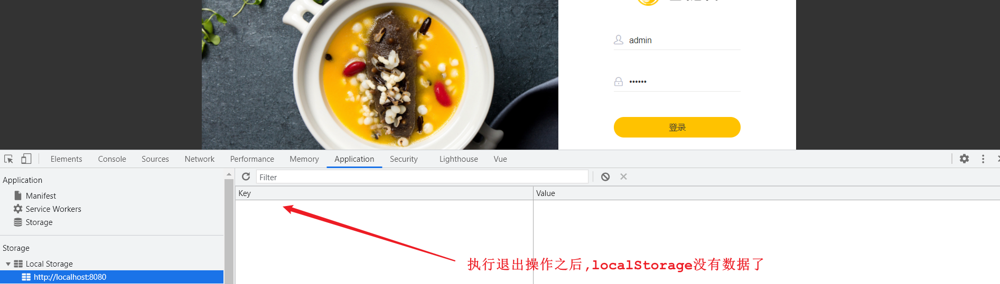 

# 完善登录功能-新增员工- 员工信息分页查询- 启用/禁用员工账号- 编辑员工信息

## 课程内容

- 完善登录功能
- 新增员工
- 员工信息分页查询
- 启用/禁用员工账号
- 编辑员工信息


## 1. 完善登录功能

### 1.1 问题分析

前面我们已经完成了后台系统的员工登录功能开发，但是目前还存在一个问题，接下来我们来说明一个这个问题， 以及如何处理。


**1). 目前现状**

用户如果不登录，直接访问系统首页面，照样可以正常访问。 

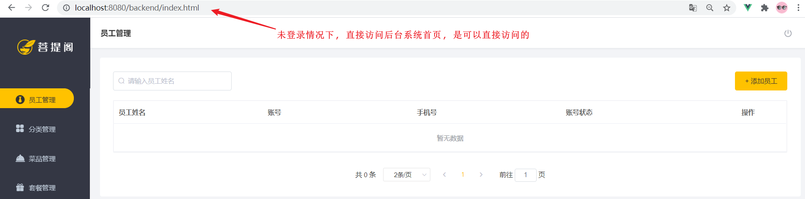 


**2). 理想效果**

上述这种设计并不合理，我们希望看到的效果应该 是，只有登录成功后才可以访问系统中的页面，如果没有登录, 访问系统中的任何界面都直接跳转到登录页面。

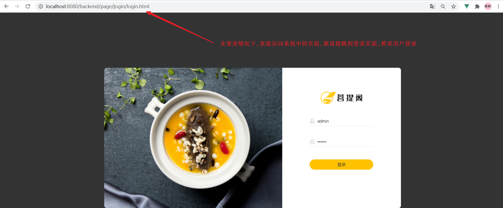 


**那么，具体应该怎么实现呢？**

可以使用我们之前讲解过的 过滤器、拦截器来实现，在过滤器、拦截器中拦截前端发起的请求，判断用户是否已经完成登录，如果没有登录则返回提示信息，跳转到登录页面。


### 1.2 思路分析

 

**过滤器具体的处理逻辑如下：**

A. 获取本次请求的URI

B. 判断本次请求, 是否需要登录, 才可以访问

C. 如果不需要，则直接放行

D. 判断登录状态，如果已登录，则直接放行

E. 如果未登录, 则返回未登录结果


如果未登录,我们需要给前端返回什么样的结果呢? 这个时候, 我们可以去看看前端是如何处理的 ?

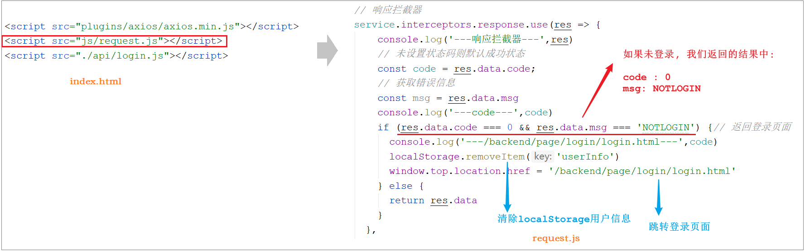 


### 1.3 代码实现

**1). 定义登录校验过滤器**

自定义一个过滤器 LoginCheckFilter 并实现 Filter 接口, 在doFilter方法中完成校验的逻辑。 那么接下来, 我们就根据上述分析的步骤, 来完成具体的功能代码实现: 


所属包: com.itheima.reggie.filter

```java
import com.alibaba.fastjson.JSON;
import com.itheima.reggie.common.R;
import lombok.extern.slf4j.Slf4j;
import org.springframework.util.AntPathMatcher;

import javax.servlet.*;
import javax.servlet.annotation.WebFilter;
import javax.servlet.http.HttpServletRequest;
import javax.servlet.http.HttpServletResponse;
import java.io.IOException;

/**
 * 检查用户是否已经完成登录
 */
@WebFilter(filterName = "loginCheckFilter",urlPatterns = "/*")
@Slf4j
public class LoginCheckFilter implements Filter{
    //路径匹配器，支持通配符
    public static final AntPathMatcher PATH_MATCHER = new AntPathMatcher();

    @Override
    public void doFilter(ServletRequest servletRequest, ServletResponse servletResponse, FilterChain filterChain) throws IOException, ServletException {
        HttpServletRequest request = (HttpServletRequest) servletRequest;
        HttpServletResponse response = (HttpServletResponse) servletResponse;

        //1、获取本次请求的URI
        String requestURI = request.getRequestURI();// /backend/index.html

        log.info("拦截到请求：{}",requestURI);

        //定义不需要处理的请求路径
        String[] urls = new String[]{
                "/employee/login",
                "/employee/logout",
                "/backend/**",
                "/front/**"
        };
		
        //2、判断本次请求是否需要处理
        boolean check = check(urls, requestURI);

        //3、如果不需要处理，则直接放行
        if(check){
            log.info("本次请求{}不需要处理",requestURI);
            filterChain.doFilter(request,response);
            return;
        }
		
        //4、判断登录状态，如果已登录，则直接放行
        if(request.getSession().getAttribute("employee") != null){
            log.info("用户已登录，用户id为：{}",request.getSession().getAttribute("employee"));
            filterChain.doFilter(request,response);
            return;
        }

        log.info("用户未登录");
        //5、如果未登录则返回未登录结果，通过输出流方式向客户端页面响应数据
        response.getWriter().write(JSON.toJSONString(R.error("NOTLOGIN")));
        return;

    }

    /**
     * 路径匹配，检查本次请求是否需要放行
     * @param urls
     * @param requestURI
     * @return
     */
    public boolean check(String[] urls,String requestURI){
        for (String url : urls) {
            boolean match = PATH_MATCHER.match(url, requestURI);
            if(match){
                return true;
            }
        }
        return false;
    }
}
```


> <font color='red'><b>AntPathMatcher 拓展:</b></font>
>
> **介绍:** Spring中提供的路径匹配器 ;
>
> **通配符规则:** 		
>
> | 符号 | 含义                   |
> | ---- | ---------------------- |
> | ?    | 匹配一个字符           |
> | *    | 匹配0个或多个字符      |
> | **   | 匹配0个或多个目录/字符 |
>


**2). 开启组件扫描**

需要在引导类上, 加上Servlet组件扫描的注解, 来扫描过滤器配置的@WebFilter注解， 扫描上之后， 过滤器在运行时就生效了。

```java
@Slf4j
@SpringBootApplication
@ServletComponentScan
public class ReggieApplication {
    public static void main(String[] args) {
        SpringApplication.run(ReggieApplication.class,args);
        log.info("项目启动成功...");
    }
}
```


> <font color='red'><b>@ServletComponentScan 的作用: </b></font>
>
> ​	在SpringBoot项目中, 在引导类/配置类上加了该注解后, 会自动扫描项目中(当前包及其子包下)的@WebServlet , @WebFilter , @WebListener 注解, 自动注册Servlet的相关组件 ;


### 1.4 功能测试

代码编写完毕之后，我们需要将工程重启一下，然后在浏览器地址栏直接输入系统管理后台首页，然后看看是否可以跳转到登录页面即可。我们也可以通过debug的形式来跟踪一下代码执行的过程。

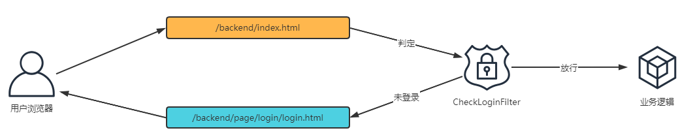 


对于前端的代码, 也可以进行debug调试。

F12打开浏览器的调试工具, 找到我们前面提到的request.js, 在request.js的响应拦截器位置打上断点。

 


## 2. 新增员工

### 2.1 需求分析

后台系统中可以管理员工信息，通过新增员工来添加后台系统用户。点击[添加员工]按钮跳转到新增页面，如下：

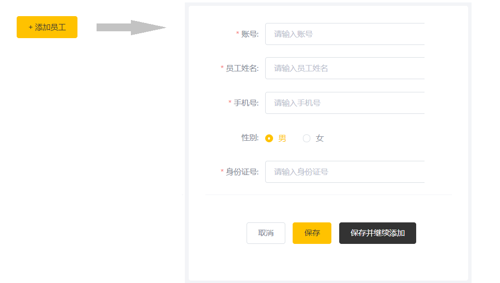 

当填写完表单信息, 点击"保存"按钮后, 会提交该表单的数据到服务端, 在服务端中需要接受数据, 然后将数据保存至数据库中。


### 2.2 数据模型

新增员工，其实就是将我们新增页面录入的员工数据插入到employee表。employee表中的status字段已经设置了默认值1，表示状态正常。

 


需要注意，employee表中对username字段加入了唯一约束，因为username是员工的登录账号，必须是唯一的。

 


### 2.3 程序执行流程

在开发代码之前，我们需要结合着前端页面发起的请求， 梳理一下整个程序的执行过程：

 


A. 点击"保存"按钮, 页面发送ajax请求，将新增员工页面中输入的数据以json的形式提交到服务端, 请求方式POST, 请求路径 /employee

B. 服务端Controller接收页面提交的数据并调用Service将数据进行保存

C. Service调用Mapper操作数据库，保存数据


### 2.4 代码实现

在EmployeeController中增加save方法, 用于保存用户员工信息。

A. 在新增员工时， 按钮页面原型中的需求描述， 需要给员工设置初始默认密码 123456， 并对密码进行MD5加密。

B. 在组装员工信息时, 还需要封装创建时间、修改时间，创建人、修改人信息(从session中获取当前登录用户)。

``` java
/**
 * 新增员工
 * @param employee
 * @return
 */
@PostMapping
public R<String> save(HttpServletRequest request,@RequestBody Employee employee){
    log.info("新增员工，员工信息：{}",employee.toString());

    //设置初始密码123456，需要进行md5加密处理
    employee.setPassword(DigestUtils.md5DigestAsHex("123456".getBytes()));
	
    employee.setCreateTime(LocalDateTime.now());
    employee.setUpdateTime(LocalDateTime.now());
	
    //获得当前登录用户的id
    Long empId = (Long) request.getSession().getAttribute("employee");

    employee.setCreateUser(empId);
    employee.setUpdateUser(empId);

    employeeService.save(employee);
    return R.success("新增员工成功");
}
```


### 2.5 功能测试

代码编写完毕之后，我们需要将工程重启, 完毕之后直接访问管理系统首页, 点击 "员工管理" 页面中的 "添加员工" 按钮, 输入员工基本信息, 然后点击 "保存" 进行数据保存, 保存完毕后, 检查数据库中是否录入员工数据。


当我们在测试中，添加用户时， 输入了一个已存在的用户名时，前端界面出现错误提示信息： 

 

而此时，服务端已经报错了， 报错信息如下： 

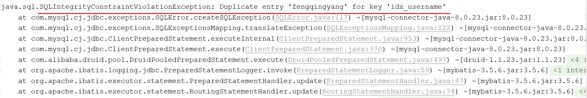 

出现上述的错误， 主要就是因为在 employee 表结构中，我们针对于username字段，建立了唯一索引，添加重复的username数据时，违背该约束，就会报错。但是此时前端提示的信息并不具体，用户并不知道是因为什么原因造成的该异常，我们需要给用户提示详细的错误信息 。


### 2.6 全局异常处理

#### 2.6.1 思路分析

要想解决上述测试中存在的问题，我们需要对程序中可能出现的异常进行捕获，通常有两种处理方式：

**A. 在Controller方法中加入 try...catch 进行异常捕获**

形式如下： 

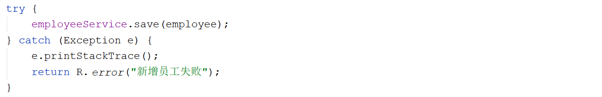 

如果采用这种方式，虽然可以解决，但是存在弊端，需要我们在保存其他业务数据时，也需要在Controller方法中加上try...catch进行处理，代码冗余，不通用。


**B. 使用异常处理器进行全局异常捕获**

采用这种方式来实现，我们只需要在项目中定义一个通用的全局异常处理器，就可以解决本项目的所有异常。


#### 2.6.2 全局异常处理器

在项目中自定义一个全局异常处理器，在异常处理器上加上注解 @ControllerAdvice,可以通过属性annotations指定拦截哪一类的Controller方法。 并在异常处理器的方法上加上注解 @ExceptionHandler 来指定拦截的是那一类型的异常。

> 异常处理方法逻辑: 
>
> - 指定捕获的异常类型为 SQLIntegrityConstraintViolationException
> - 解析异常的提示信息, 获取出是那个值违背了唯一约束 
> - 组装错误信息并返回

 


所属包: com.itheima.reggie.common

```java
import lombok.extern.slf4j.Slf4j;
import org.springframework.stereotype.Controller;
import org.springframework.web.bind.annotation.ControllerAdvice;
import org.springframework.web.bind.annotation.ExceptionHandler;
import org.springframework.web.bind.annotation.ResponseBody;
import org.springframework.web.bind.annotation.RestController;
import java.sql.SQLIntegrityConstraintViolationException;

/**
 * 全局异常处理
 */
@ControllerAdvice(annotations = {RestController.class, Controller.class})
@ResponseBody
@Slf4j
public class  GlobalExceptionHandler {

    /**
     * 异常处理方法
     * @return
     */
    @ExceptionHandler(SQLIntegrityConstraintViolationException.class)
    public R<String> exceptionHandler(SQLIntegrityConstraintViolationException ex){
        log.error(ex.getMessage());
        if(ex.getMessage().contains("Duplicate entry")){
            String[] split = ex.getMessage().split(" ");
            String msg = split[2] + "已存在";
            return R.error(msg);
        }
        return R.error("未知错误");
    }
}
```


> <font color='red'><b>注解说明:</b></font>
>
> ​	上述的全局异常处理器上使用了的两个注解 @ControllerAdvice , @ResponseBody , 他们的作用分别为: 
>
> ​	@ControllerAdvice : 指定拦截那些类型的控制器;
>
> ​	@ResponseBody: 将方法的返回值 R 对象转换为json格式的数据, 响应给页面;
>
> ​	
>
> ​	上述使用的两个注解, 也可以合并成为一个注解 @RestControllerAdvice 
>
> ​	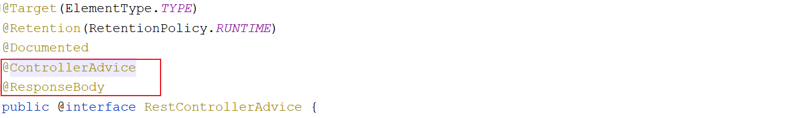 


#### 2.6.3 测试

全局异常处理器编写完毕之后，我们需要将项目重启, 完毕之后直接访问管理系统首页, 点击 "员工管理" 页面中的 "添加员工" 按钮。当我们在测试中，添加用户时， 输入了一个已存在的用户名时，前端界面出现如下错误提示信息：

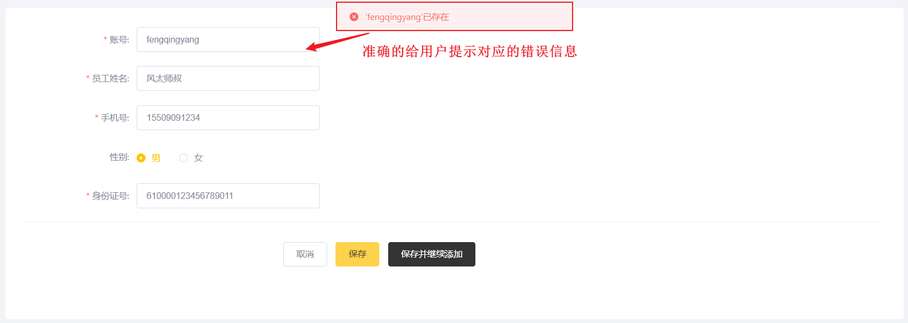 


## 3. 员工分页查询

### 3.1 需求分析

系统中的员工很多的时候，如果在一个页面中全部展示出来会显得比较乱，不便于查看，所以一般的系统中都会以分页的方式来展示列表数据。而在我们的分页查询页面中, 除了分页条件以外，还有一个查询条件 "员工姓名"。

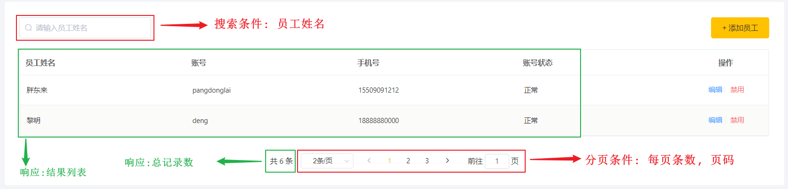 

- 请求参数

  - 搜索条件： 员工姓名(模糊查询)

  - 分页条件： 每页展示条数 ， 页码

- 响应数据

  - 总记录数

  - 结果列表


### 3.2 程序执行流程

#### 3.2.1 页面流程分析

在开发代码之前，需要梳理一下整个程序的执行过程。

A. 点击菜单，打开员工管理页面时，执行查询： 

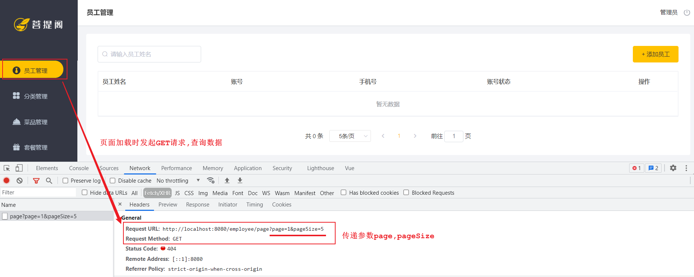 


B. 搜索栏输入员工姓名,回车,执行查询:

 


1). 页面发送ajax请求，将分页查询参数(page、pageSize、name)提交到服务端

2). 服务端Controller接收页面提交的数据, 并组装条件调用Service查询数据

3). Service调用Mapper操作数据库，查询分页数据

4). Controller将查询到的分页数据, 响应给前端页面

5). 页面接收到分页数据, 并通过ElementUI的Table组件展示到页面上


#### 3.2.2 前端代码介绍

1). 访问员工列表页面/member/list.html时, 会触发Vuejs中的钩子方法, 在页面初始化时调用created方法

 

从上述的前端代码中我们可以看到, 执行完分页查询, 我们需要给前端返回的信息中需要包含两项 : records 中封装结果列表, total中封装总记录数 。


而在组装请求参数时 , page、pageSize 都是前端分页插件渲染时的参数；

 


2). 在getMemberList方法中, 通过axios发起异步请求

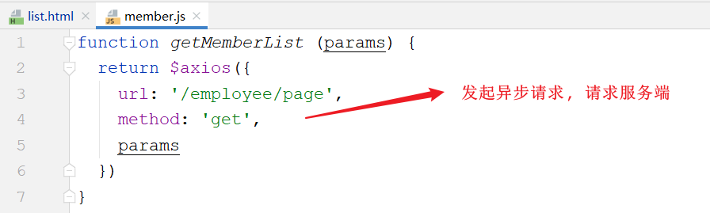 

axios发起的异步请求会被声明在 request.js 中的request拦截器拦截, 在其中对get请求进行进一步的封装处理

 


**最终发送给服务端的请求为 :** GET请求 , 请求链接 /employee/page?page=1&pageSize=10&name=xxx


### 3.3 代码实现

#### 3.3.1 分页插件配置

当前我们要实现的分页查询功能，而在MybatisPlus要实现分页功能，就需要用到MybatisPlus中提供的分页插件，要使用分页插件，就要在配置类中声明分页插件的bean对象。

所属包: com.itheima.reggie.config

```java
import com.baomidou.mybatisplus.extension.plugins.MybatisPlusInterceptor;
import com.baomidou.mybatisplus.extension.plugins.inner.PaginationInnerInterceptor;
import org.springframework.context.annotation.Bean;
import org.springframework.context.annotation.Configuration;

/**
 * 配置MP的分页插件
 */
@Configuration
public class MybatisPlusConfig {

    @Bean
    public MybatisPlusInterceptor mybatisPlusInterceptor(){
        MybatisPlusInterceptor mybatisPlusInterceptor = new MybatisPlusInterceptor();
        mybatisPlusInterceptor.addInnerInterceptor(new PaginationInnerInterceptor());
        return mybatisPlusInterceptor;
    }
}
```


#### 3.3.2 分页查询实现

在上面我们已经分析了，页面在进行分页查询时， 具体的请求信息如下:

| 请求     | 说明                   |
| -------- | ---------------------- |
| 请求方式 | GET                    |
| 请求路径 | /employee/page         |
| 请求参数 | page , pageSize , name |


那么查询完毕后我们需要给前端返回什么样的结果呢? 

在上述我们也分析了, 查询返回的结果数据data中应该封装两项信息, 分别为: records 封装分页列表数据, total 中封装符合条件的总记录数。 那么这个时候, 在定义controller方法的返回值类型R时, 我们可以直接将 MybatisPlus 分页查询的结果 Page 直接封装返回, 因为Page中的属性如下: 

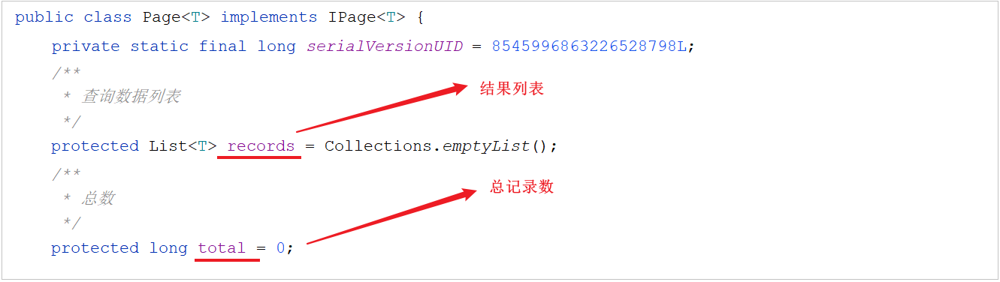 


那么接下来就依据于这些已知的需求和条件完成分页查询的代码实现。 具体的逻辑如下: 

A. 构造分页条件

B. 构建搜索条件 - name进行模糊匹配

C. 构建排序条件 - 更新时间倒序排序

D. 执行查询

E. 组装结果并返回


具体的代码实现如下: 

```java
/**
 * 员工信息分页查询
 * @param page 当前查询页码
 * @param pageSize 每页展示记录数
 * @param name 员工姓名 - 可选参数
 * @return
 */
@GetMapping("/page")
public R<Page> page(int page,int pageSize,String name){
    log.info("page = {},pageSize = {},name = {}" ,page,pageSize,name);
    //构造分页构造器
    Page pageInfo = new Page(page,pageSize);

    //构造条件构造器
    LambdaQueryWrapper<Employee> queryWrapper = new LambdaQueryWrapper();
    //添加过滤条件
    queryWrapper.like(StringUtils.isNotEmpty(name),Employee::getName,name);
    //添加排序条件
    queryWrapper.orderByDesc(Employee::getUpdateTime);

    //执行查询
    employeeService.page(pageInfo,queryWrapper);
    return R.success(pageInfo);
}
```


### 3.4 功能测试

代码编写完毕之后，我们需要将工程重启, 完毕之后直接访问管理系统首页, 默认就会打开员工管理的列表页面, 我们可以查看列表数据是否可以正常展示, 也可以通过分页插件来测试分页功能, 及员工姓名的模糊查询功能。

在进行测试时，可以使用浏览器的监控工具查看页面和服务端的数据交互细节。 并借助于debug的形式， 根据服务端参数接收及逻辑执行情况。

 


测试过程中可以发现，对于员工状态字段（status）服务端返回的是状态码（1或者0），但是页面上显示的则是“正常”或者“已禁用”，这是因为页面中在展示数据时进行了处理。

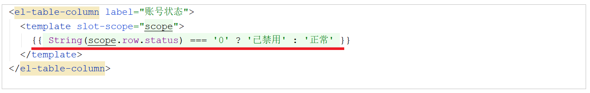 


## 4. 启用/禁用员工账号

### 4.1 需求分析

在员工管理列表页面，可以对某个员工账号进行<font color='gree'>启用</font>或者<font color='red'>禁用</font>操作。账号禁用的员工不能登录系统，启用后的员工可以正常登录。如果某个员工账号状态为正常，则按钮显示为 "禁用"，如果员工账号状态为已禁用，则按钮显示为"启用"。

==需要注意，只有管理员（admin用户）可以对其他普通用户进行启用、禁用操作，所以普通用户登录系统后启用、禁用按钮不显示。==

**A. admin 管理员登录**

 


**B. 普通用户登录**

 


### 4.2 程序执行流程

#### 4.2.1 页面按钮动态展示

在上述的需求中,我们提到需要实现的效果是 : **只有管理员（admin用户）可以对其他普通用户进行启用、禁用操作，所以普通用户登录系统后启用、禁用按钮不显示** , 页面中是怎么做到只有管理员admin能够看到启用、禁用按钮的？

1). 在列表页面(list.html)加载时, 触发钩子函数created, 在钩子函数中, 会从localStorage中获取到用户登录信息, 然后获取到用户名

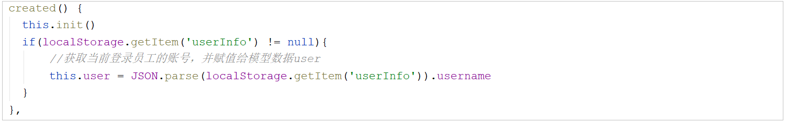 


2). 在页面中, 通过Vue指令v-if进行判断,如果登录用户为admin将展示 启用/禁用 按钮, 否则不展示

 


#### 4.2.2 执行流程分析

1). 当管理员admin点击 "启用" 或 "禁用" 按钮时, 调用方法statusHandle

 

> scope.row : 获取到的是这一行的数据信息 ;


2). statusHandle方法中进行二次确认, 然后发起ajax请求, 传递id、status参数

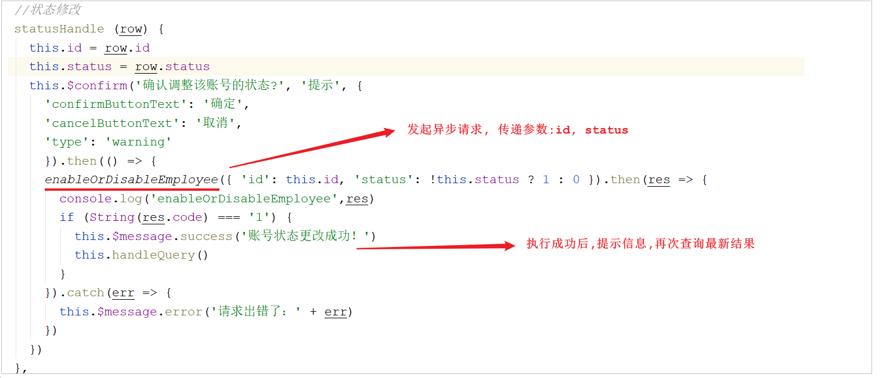 

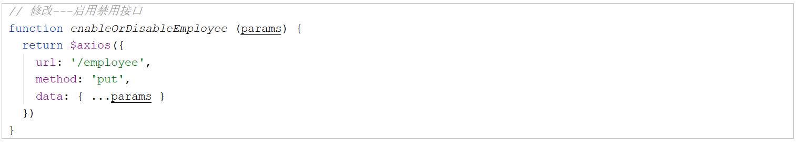 

最终发起异步请求, 请求服务端, 请求信息如下： 

| 请求     | 说明                    |
| -------- | ----------------------- |
| 请求方式 | PUT                     |
| 请求路径 | /employee               |
| 请求参数 | {"id":xxx,"status":xxx} |

> **{...params}** : 三点是ES6中出现的扩展运算符。作用是遍历当前使用的对象能够访问到的所有属性，并将属性放入当前对象中。


### 4.3 代码实现

在开发代码之前，需要梳理一下整个程序的执行过程：

1). 页面发送ajax请求，将参数(id、status)提交到服务端

2). 服务端Controller接收页面提交的数据并调用Service更新数据

3). Service调用Mapper操作数据库


启用、禁用员工账号，本质上就是一个更新操作，也就是对status状态字段进行操作。在Controller中创建update方法，此方法是一个通用的修改员工信息的方法。

```java
/**
 * 根据id修改员工信息
 * @param employee
 * @return
 */
@PutMapping
public R<String> update(HttpServletRequest request,@RequestBody Employee employee){
    log.info(employee.toString());

    Long empId = (Long)request.getSession().getAttribute("employee");

    employee.setUpdateTime(LocalDateTime.now());
    employee.setUpdateUser(empId);
    employeeService.updateById(employee);

    return R.success("员工信息修改成功");
}
```


### 4.4 功能测试

代码编写完毕之后，我们需要将工程重启。 然后访问前端页面， 进行 "启用" 或 "禁用" 的测试。

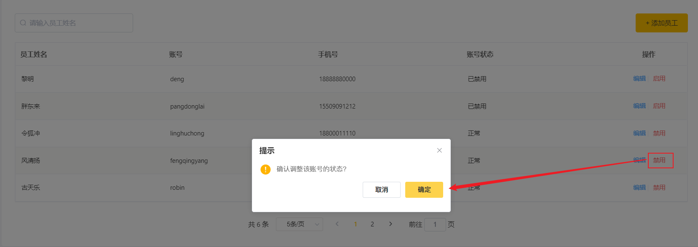 

测试过程中没有报错，但是功能并没有实现，查看数据库中的数据也没有变化。但是从控制台输出的日志， 可以看出确实没有更新成功。

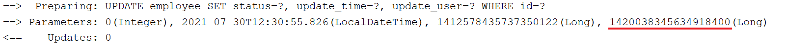 


而在我们的数据库表结构中， 并不存在该ID， 数据库中 风清扬 对应的ID为 1420038345634918401

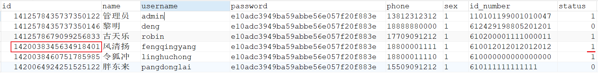 


### 4.5 代码修复

#### 4.5.1 原因分析

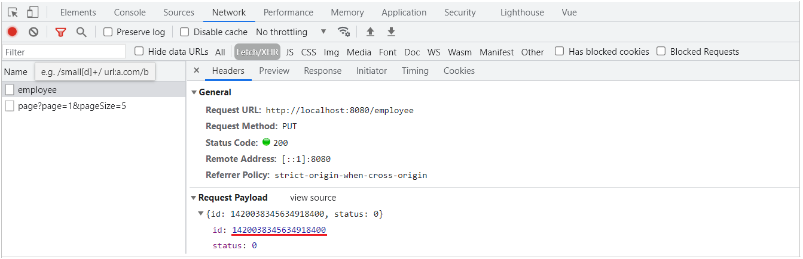 

通过观察控制台输出的SQL发现页面传递过来的员工id的值和数据库中的id值不一致，这是怎么回事呢？


在分页查询时，服务端会将返回的R对象进行json序列化，转换为json格式的数据，而员工的ID是一个Long类型的数据，而且是一个长度为 19 位的长整型数据， 该数据返回给前端是没有问题的。

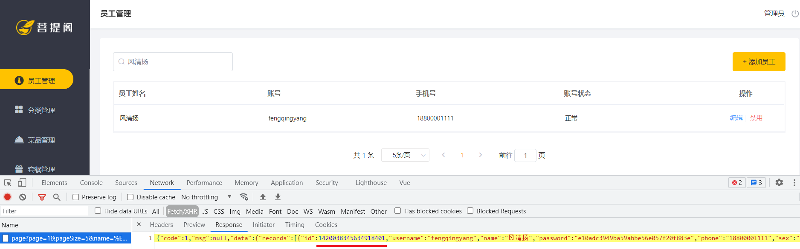 


**那么具体的问题出现在哪儿呢？**

问题实际上， 就出现在前端JS中， js在对长度较长的长整型数据进行处理时， 会损失精度， 从而导致提交的id和数据库中的id不一致。 这里，我们也可以做一个简单的测试，代码如下： 

```html
<!DOCTYPE html>
<html lang="en">
<head>
    <meta charset="UTF-8">
    <title>Title</title>
    <script>
        alert(1420038345634918401);
    </script>
</head>
<body>
</body>
</html>
```


#### 4.5.2 解决方案

要想解决这个问题，也很简单，我们只需要让js处理的ID数据类型为字符串类型即可, 这样就不会损失精度了。同样， 大家也可以做一个测试： 

```html
<!DOCTYPE html>
<html lang="en">
<head>
    <meta charset="UTF-8">
    <title>Title</title>
    <script>
        alert("1420038345634918401");
    </script>
</head>
<body>
</body>
</html>
```


那么在我们的业务中, 我们只需要让分页查询返回的json格式数据库中, long类型的属性, 不直接转换为数字类型, 转换为字符串类型就可以解决这个问题了 , 最终返回的结果为 : 

 


#### 4.5.3 代码修复

由于在SpringMVC中, 将Controller方法返回值转换为json对象, 是通过jackson来实现的, 涉及到SpringMVC中的一个消息转换器MappingJackson2HttpMessageConverter, 所以我们要解决这个问题, 就需要对该消息转换器的功能进行拓展。


**具体实现步骤：**

1). 提供对象转换器JacksonObjectMapper，基于Jackson进行Java对象到json数据的转换（资料中已经提供，直接复制到项目中使用）

2). 在WebMvcConfig配置类中扩展Spring mvc的消息转换器，在此消息转换器中使用提供的对象转换器进行Java对象到json数据的转换


**1). 引入JacksonObjectMapper**

```java
import com.fasterxml.jackson.databind.DeserializationFeature;
import com.fasterxml.jackson.databind.ObjectMapper;
import com.fasterxml.jackson.databind.module.SimpleModule;
import com.fasterxml.jackson.databind.ser.std.ToStringSerializer;
import com.fasterxml.jackson.datatype.jsr310.deser.LocalDateDeserializer;
import com.fasterxml.jackson.datatype.jsr310.deser.LocalDateTimeDeserializer;
import com.fasterxml.jackson.datatype.jsr310.deser.LocalTimeDeserializer;
import com.fasterxml.jackson.datatype.jsr310.ser.LocalDateSerializer;
import com.fasterxml.jackson.datatype.jsr310.ser.LocalDateTimeSerializer;
import com.fasterxml.jackson.datatype.jsr310.ser.LocalTimeSerializer;
import java.math.BigInteger;
import java.time.LocalDate;
import java.time.LocalDateTime;
import java.time.LocalTime;
import java.time.format.DateTimeFormatter;
import static com.fasterxml.jackson.databind.DeserializationFeature.FAIL_ON_UNKNOWN_PROPERTIES;

/**
 * 对象映射器:基于jackson将Java对象转为json，或者将json转为Java对象
 * 将JSON解析为Java对象的过程称为 [从JSON反序列化Java对象]
 * 从Java对象生成JSON的过程称为 [序列化Java对象到JSON]
 */
public class JacksonObjectMapper extends ObjectMapper {
    public static final String DEFAULT_DATE_FORMAT = "yyyy-MM-dd";
    public static final String DEFAULT_DATE_TIME_FORMAT = "yyyy-MM-dd HH:mm:ss";
    public static final String DEFAULT_TIME_FORMAT = "HH:mm:ss";
    public JacksonObjectMapper() {
        super();
        //收到未知属性时不报异常
        this.configure(FAIL_ON_UNKNOWN_PROPERTIES, false);
        //反序列化时，属性不存在的兼容处理
        this.getDeserializationConfig().withoutFeatures(DeserializationFeature.FAIL_ON_UNKNOWN_PROPERTIES);

        SimpleModule simpleModule = new SimpleModule()
                .addDeserializer(LocalDateTime.class, new LocalDateTimeDeserializer(DateTimeFormatter.ofPattern(DEFAULT_DATE_TIME_FORMAT)))
                .addDeserializer(LocalDate.class, new LocalDateDeserializer(DateTimeFormatter.ofPattern(DEFAULT_DATE_FORMAT)))
                .addDeserializer(LocalTime.class, new LocalTimeDeserializer(DateTimeFormatter.ofPattern(DEFAULT_TIME_FORMAT)))

                .addSerializer(BigInteger.class, ToStringSerializer.instance)
                .addSerializer(Long.class, ToStringSerializer.instance)

                .addSerializer(LocalDateTime.class, new LocalDateTimeSerializer(DateTimeFormatter.ofPattern(DEFAULT_DATE_TIME_FORMAT)))
                .addSerializer(LocalDate.class, new LocalDateSerializer(DateTimeFormatter.ofPattern(DEFAULT_DATE_FORMAT)))
                .addSerializer(LocalTime.class, new LocalTimeSerializer(DateTimeFormatter.ofPattern(DEFAULT_TIME_FORMAT)));
        //注册功能模块 例如，可以添加自定义序列化器和反序列化器
        this.registerModule(simpleModule);
    }
}
```

该自定义的对象转换器, 主要指定了, 在进行json数据序列化及反序列化时, LocalDateTime、LocalDate、LocalTime的处理方式, 以及BigInteger及Long类型数据，直接转换为字符串。


**2). 在WebMvcConfig中重写方法extendMessageConverters**

```java
/**
 * 扩展mvc框架的消息转换器
 * @param converters
 */
@Override
protected void extendMessageConverters(List<HttpMessageConverter<?>> converters) {
    log.info("扩展消息转换器...");
    //创建消息转换器对象
    MappingJackson2HttpMessageConverter messageConverter = new MappingJackson2HttpMessageConverter();
    //设置对象转换器，底层使用Jackson将Java对象转为json
    messageConverter.setObjectMapper(new JacksonObjectMapper());
    //将上面的消息转换器对象追加到mvc框架的转换器集合中
    converters.add(0,messageConverter);
}
```


## 5. 编辑员工信息

### 5.1 需求分析

在员工管理列表页面点击 "编辑" 按钮，跳转到编辑页面，在编辑页面回显员工信息并进行修改，最后点击 "保存" 按钮完成编辑操作。

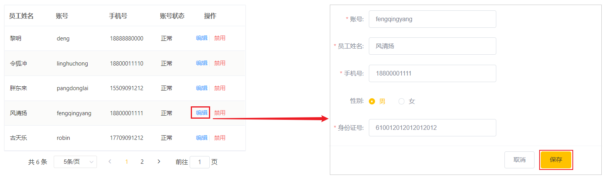 

那么从上述的分析中，我们可以看出当前实现的编辑功能,我们需要实现两个方法:

A. 根据ID查询, 用于页面数据回显

B. 保存修改


### 5.2 程序执行流程

在开发代码之前需要梳理一下操作过程和对应的程序的执行流程：

1). 点击编辑按钮时，页面跳转到add.html，并在url中携带参数[员工id]

 


2). 在add.html页面获取url中的参数[员工id]

3). 发送ajax请求，请求服务端，同时提交员工id参数

4). 服务端接收请求，根据员工id查询员工信息，将员工信息以json形式响应给页面

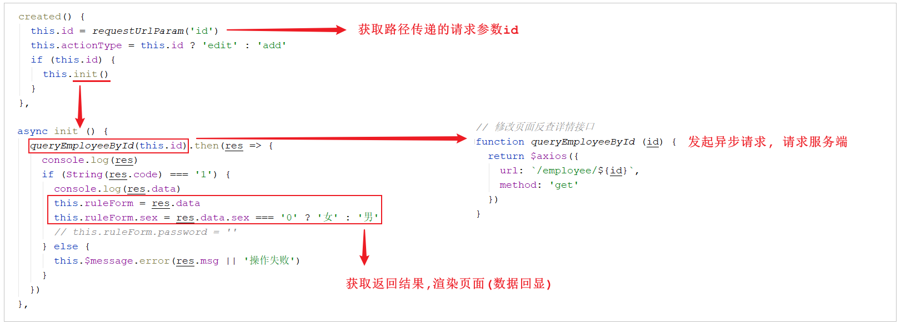 


5). 页面接收服务端响应的json数据，通过VUE的数据绑定进行员工信息回显

6). 点击保存按钮，发送ajax请求，将页面中的员工信息以json方式提交给服务端

7). 服务端接收员工信息，并进行处理，完成后给页面响应

8). 页面接收到服务端响应信息后进行相应处理

 


> 注意：add.html页面为公共页面，新增员工和编辑员工都是在此页面操作
>


### 5.3 代码实现

#### 5.3.1 根据ID查询

经过上述的分析,我们看到,在根据ID查询员工信息时,请求信息如下: 

| 请求     | 说明           |
| -------- | -------------- |
| 请求方式 | GET            |
| 请求路径 | /employee/{id} |


**代码实现:** 

在EmployeeController中增加方法, 根据ID查询员工信息。

```java
/**
 * 根据id查询员工信息
 * @param id
 * @return
 */
@GetMapping("/{id}")
public R<Employee> getById(@PathVariable Long id){
    log.info("根据id查询员工信息...");
    Employee employee = employeeService.getById(id);
    if(employee != null){
        return R.success(employee);
    }
    return R.error("没有查询到对应员工信息");
}
```


#### 5.3.2 修改员工

经过上述的分析,我们看到,在修改员工信息时,请求信息如下: 

| 请求     | 说明                   |
| -------- | ---------------------- |
| 请求方式 | PUT                    |
| 请求路径 | /employee              |
| 请求参数 | {.......} json格式数据 |


**代码实现:** 

在EmployeeController中增加方法, 根据ID更新员工信息。

```java
/**
 * 根据id修改员工信息
 * @param employee
 * @return
 */
@PutMapping
public R<String> update(HttpServletRequest request,@RequestBody Employee employee){
    log.info(employee.toString());

    Long empId = (Long)request.getSession().getAttribute("employee");

    employee.setUpdateTime(LocalDateTime.now());
    employee.setUpdateUser(empId);
    employeeService.updateById(employee);

    return R.success("员工信息修改成功");
}
```


### 5.4 功能测试

代码编写完毕之后，我们需要将工程重启。 然后访问前端页面， 按照前面分析的操作流程进行测试，查看数据是否正常修改即可。

# 公共字段自动填充-新增分类-分类信息分页查询-删除分类-修改分类

## 课程内容

- 公共字段自动填充
- 新增分类
- 分类信息分页查询
- 删除分类
- 修改分类


## 1. 公共字段自动填充

### 1.1 问题分析

前面我们已经完成了后台系统的员工管理功能的开发，在新增员工时需要设置创建时间、创建人、修改时间、修改人等字段，在编辑员工时需要设置修改时间、修改人等字段。这些字段属于公共字段，也就是也就是在我们的系统中很多表中都会有这些字段，如下：

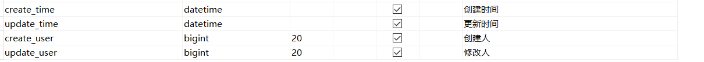 

而针对于这些字段，我们的赋值方式为： 

A. 在新增数据时, 将createTime、updateTime 设置为当前时间, createUser、updateUser设置为当前登录用户ID。

B. 在更新数据时, 将updateTime 设置为当前时间, updateUser设置为当前登录用户ID。


目前,在我们的项目中处理这些字段都是在每一个业务方法中进行赋值操作,如下:

 

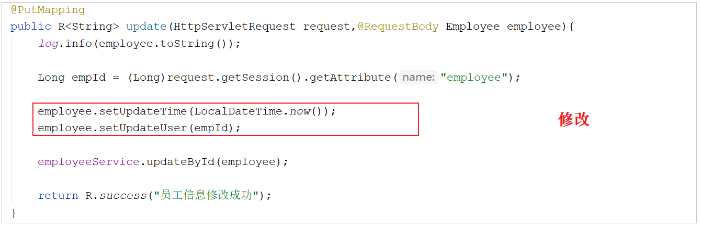 


如果都按照上述的操作方式来处理这些公共字段, 需要在每一个业务方法中进行操作, 编码相对冗余、繁琐，那能不能对于这些公共字段在某个地方统一处理，来简化开发呢？

**答案是可以的，我们使用Mybatis Plus提供的公共字段自动填充功能。**


### 1.2 基本功能实现

#### 1.2.1 思路分析

Mybatis Plus公共字段自动填充，也就是在插入或者更新的时候为指定字段赋予指定的值，使用它的好处就是可以统一对这些字段进行处理，避免了重复代码。在上述的问题分析中，我们提到有四个公共字段，需要在新增/更新中进行赋值操作, 具体情况如下: 

| 字段名     | 赋值时机                    | 说明           |
| ---------- | --------------------------- | -------------- |
| createTime | 插入(INSERT)                | 当前时间       |
| updateTime | 插入(INSERT) , 更新(UPDATE) | 当前时间       |
| createUser | 插入(INSERT)                | 当前登录用户ID |
| updateUser | 插入(INSERT) , 更新(UPDATE) | 当前登录用户ID |


实现步骤：

1、在实体类的属性上加入@TableField注解，指定自动填充的策略。

2、按照框架要求编写元数据对象处理器，在此类中统一为公共字段赋值，此类需要实现MetaObjectHandler接口。


#### 1.2.2 代码实现

**1). 实体类的属性上加入@TableField注解，指定自动填充的策略。**

在员工Employee实体类的公共字段属性上, 加上注解, 指定填充策略。(<font color='red'>ps.在资料中提供的实体类,已经添加了该注解,并指定了填充策略</font>)

 

> FieldFill.INSERT: 插入时填充该属性值
>
> FieldFill.INSERT_UPDATE: 插入/更新时填充该属性值


**2). 按照框架要求编写元数据对象处理器，在此类中统一为公共字段赋值，此类需要实现MetaObjectHandler接口。**

所属包: com.itheima.reggie.common

```java
import com.baomidou.mybatisplus.core.handlers.MetaObjectHandler;
import lombok.extern.slf4j.Slf4j;
import org.apache.ibatis.reflection.MetaObject;
import org.springframework.stereotype.Component;
import java.time.LocalDateTime;

/**
 * 自定义元数据对象处理器
 */
@Component
@Slf4j
public class MyMetaObjecthandler implements MetaObjectHandler {
    /**
     * 插入操作，自动填充
     * @param metaObject
     */
    @Override
    public void insertFill(MetaObject metaObject) {
        log.info("公共字段自动填充[insert]...");
        log.info(metaObject.toString());
        
        metaObject.setValue("createTime", LocalDateTime.now());
        metaObject.setValue("updateTime",LocalDateTime.now());
        metaObject.setValue("createUser",new Long(1));
        metaObject.setValue("updateUser",new Long(1));
    }

    /**
     * 更新操作，自动填充
     * @param metaObject
     */
    @Override
    public void updateFill(MetaObject metaObject) {
        log.info("公共字段自动填充[update]...");
        log.info(metaObject.toString());

        metaObject.setValue("updateTime",LocalDateTime.now());
        metaObject.setValue("updateUser",new Long(1));
    }
}
```


#### 1.2.3 功能测试

编写完了元数据对象处理器之后，我们就可以将之前在新增和修改方法中手动赋值的代码删除或注释掉。

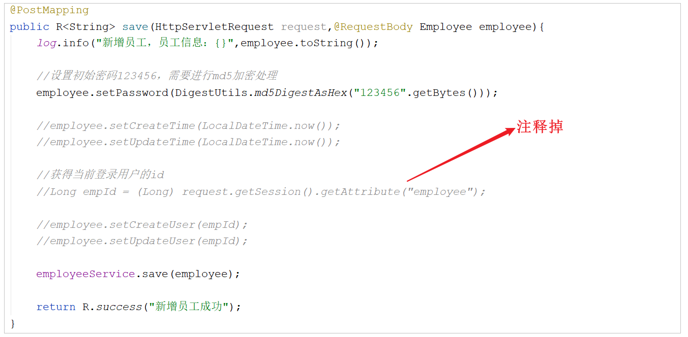  

 


然后，我们启动项目，在员工管理模块中，测试增加/更新员工信息功能，然后通过debug 或者 直接查询数据库数据变更的形式，看看我们在新增/修改数据时，这些公共字段数据是否能够完成自动填充。


### 1.3 功能完善

#### 1.3.1 思路分析

前面我们已经完成了公共字段自动填充功能的代码开发，但是还有一个问题没有解决，就是我们在自动填充createUser和updateUser时设置的用户id是固定值，现在我们需要完善，改造成动态获取当前登录用户的id。

大家可能想到，用户登录成功后我们将用户id存入了HttpSession中，现在我从HttpSession中获取不就行了？

 

注意，我们在MyMetaObjectHandler类中是不能直接获得HttpSession对象的，所以我们需要通过其他方式来获取登录用户id。


那么我先搞清楚一点,当我们在修改员工信息时, 我们业务的执行流程是什么样子的,如下图:

  

客户端发送的每次http请求，对应的在服务端都会分配一个新的线程来处理，在处理过程中涉及到下面类中的方法都属于相同的一个线程：

1). LoginCheckFilter的doFilter方法

2). EmployeeController的update方法

3). MyMetaObjectHandler的updateFill方法

我们可以在上述类的方法中加入如下代码(获取当前线程ID,并输出):

```java
long id = Thread.currentThread().getId();
log.info("线程id为：{}",id);
```

执行编辑员工功能进行验证，通过观察控制台输出可以发现，一次请求对应的线程id是相同的：

  


经过上述的分析之后,发现我们可以使用JDK提供的一个类, 来解决此问题,它是JDK中提供的 ThreadLocal。


#### 1.3.2 ThreadLocal

ThreadLocal并不是一个Thread，而是Thread的局部变量。当使用ThreadLocal维护变量时，ThreadLocal为每个使用该变量的线程提供独立的变量副本，所以每一个线程都可以独立地改变自己的副本，而不会影响其它线程所对应的副本。

ThreadLocal为每个线程提供单独一份存储空间，具有线程隔离的效果，只有在线程内才能获取到对应的值，线程外则不能访问当前线程对应的值。


**ThreadLocal常用方法：**

A. public void set(T value) : 设置当前线程的线程局部变量的值

B. public T get() : 返回当前线程所对应的线程局部变量的值

C. public void remove() : 删除当前线程所对应的线程局部变量的值 


我们可以在LoginCheckFilter的doFilter方法中获取当前登录用户id，并调用ThreadLocal的set方法来设置当前线程的线程局部变量的值（用户id），然后在MyMetaObjectHandler的updateFill方法中调用ThreadLocal的get方法来获得当前线程所对应的线程局部变量的值（用户id）。 如果在后续的操作中, 我们需要在Controller / Service中要使用当前登录用户的ID, 可以直接从ThreadLocal直接获取。


#### 1.3.3 操作步骤

实现步骤：

1). 编写BaseContext工具类，基于ThreadLocal封装的工具类

2). 在LoginCheckFilter的doFilter方法中调用BaseContext来设置当前登录用户的id

3). 在MyMetaObjectHandler的方法中调用BaseContext获取登录用户的id


#### 1.3.4 代码实现

**1). BaseContext工具类**

所属包: com.itheima.reggie.common

```java
/**
 * 基于ThreadLocal封装工具类，用户保存和获取当前登录用户id
 */
public class BaseContext {
    private static ThreadLocal<Long> threadLocal = new ThreadLocal<>();
    /**
     * 设置值
     * @param id
     */
    public static void setCurrentId(Long id){
        threadLocal.set(id);
    }
    /**
     * 获取值
     * @return
     */
    public static Long getCurrentId(){
        return threadLocal.get();
    }
}
```


**2).LoginCheckFilter中存放当前登录用户到ThreadLocal**

在doFilter方法中, 判定用户是否登录, 如果用户登录, 在放行之前, 获取HttpSession中的登录用户信息, 调用BaseContext的setCurrentId方法将当前登录用户ID存入ThreadLocal。

```java
Long empId = (Long) request.getSession().getAttribute("employee");
BaseContext.setCurrentId(empId);
```

 


**3). MyMetaObjectHandler中从ThreadLocal中获取**

将之前在代码中固定的当前登录用户1， 修改为动态调用BaseContext中的getCurrentId方法获取当前登录用户ID

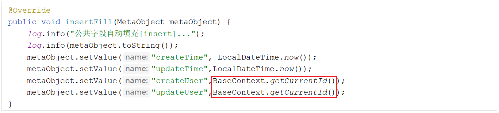 

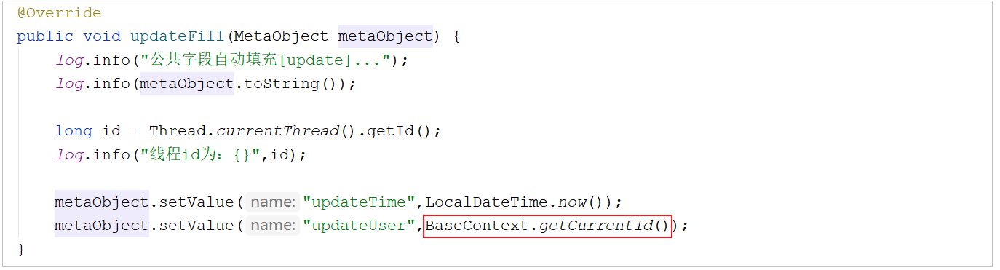 


#### 1.3.5 功能测试

完善了元数据对象处理器之后，我们就可以重新启动项目，完成登录操作后, 在员工管理模块中，测试增加/更新员工信息功能, 直接查询数据库数据变更，看看我们在新增/修改数据时，这些公共字段数据是否能够完成自动填充, 并且看看填充的create_user 及 update_user字段值是不是本地登录用户的ID。


## 2. 新增分类

### 2.1 需求分析

后台系统中可以管理分类信息，分类包括两种类型，分别是 **菜品分类** 和 **套餐分类** 。当我们在后台系统中添加菜品时需要选择一个菜品分类，当我们在后台系统中添加一个套餐时需要选择一个套餐分类，在移动端也会按照菜品分类和套餐分类来展示对应的菜品和套餐。

 


在分类管理中,我们新增分类时, 可以选择新增菜品分类(川菜、湘菜、粤菜...), 也可以选择新增套餐分类(营养早餐、超值午餐...)。 在添加套餐的时候, 输入的排序字段, 控制的是移动端套餐列表的展示顺序。

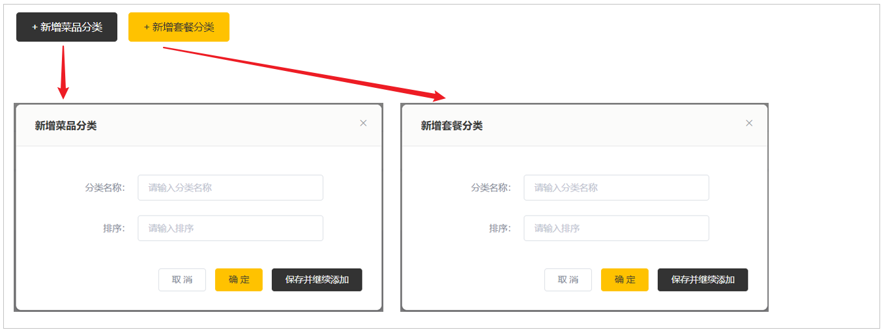 


### 2.2 数据模型

新增分类，其实就是将我们新增窗口录入的分类数据,插入到category表，具体表结构如下：

 

我们添加的套餐名称，是唯一的，不能够重复的，所以在设计表结构时，已经针对于name字段建立了唯一索引，如下：

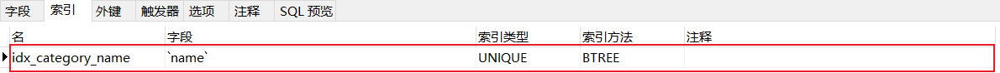 


### 2.3 前端页面分析

在开发代码之前，需要梳理一下整个程序的执行过程：

1). 在页面(backend/page/category/list.html)的新增分类表单中填写数据，点击 "确定" 发送ajax请求，将新增分类窗口输入的数据以json形式提交到服务端

2). 服务端Controller接收页面提交的数据并调用Service将数据进行保存

3). Service调用Mapper操作数据库，保存数据


可以看到新增菜品分类和新增套餐分类请求的服务端地址和提交的json数据结构相同，所以服务端只需要提供一个方法统一处理即可：

 

具体请求信息整理如下: 

| 请求     | 说明                                           |
| -------- | ---------------------------------------------- |
| 请求方式 | POST                                           |
| 请求路径 | /category                                      |
| 请求参数 | json格式 - {"name":"川菜","type":"1","sort":2} |


### 2.4 代码实现

代码实现的具体步骤如下: 

- 实体类Category（直接从课程资料中导入即可）

- Mapper接口CategoryMapper

- 业务层接口CategoryService

- 业务层实现类CategoryServiceImpl

- 控制层CategoryController


**1). 实体类Category**

所属包: com.itheima.reggie.entity

```java
import com.baomidou.mybatisplus.annotation.FieldFill;
import com.baomidou.mybatisplus.annotation.TableField;
import lombok.Data;
import java.io.Serializable;
import java.time.LocalDateTime;

/**
 * 分类
 */
@Data
public class Category implements Serializable {

    private static final long serialVersionUID = 1L;

    private Long id;

    //类型 1 菜品分类 2 套餐分类
    private Integer type;

    //分类名称
    private String name;

    //顺序
    private Integer sort;

    //创建时间
    @TableField(fill = FieldFill.INSERT)
    private LocalDateTime createTime;

    //更新时间
    @TableField(fill = FieldFill.INSERT_UPDATE)
    private LocalDateTime updateTime;
    
    //创建人
    @TableField(fill = FieldFill.INSERT)
    private Long createUser;
    
    //修改人
    @TableField(fill = FieldFill.INSERT_UPDATE)
    private Long updateUser;
}
```


**2). Mapper接口CategoryMapper**

所属包: com.itheima.reggie.mapper

```java
import com.baomidou.mybatisplus.core.mapper.BaseMapper;
import com.itheima.reggie.entity.Category;
import org.apache.ibatis.annotations.Mapper;

@Mapper
public interface CategoryMapper extends BaseMapper<Category> {
}
```


**3). 业务层接口CategoryService**

所属包: com.itheima.reggie.service

```java
import com.baomidou.mybatisplus.extension.service.IService;
import com.itheima.reggie.entity.Category;

public interface CategoryService extends IService<Category> {
}
```


**4). 业务层实现类CategoryServiceImpl**

所属包: com.itheima.reggie.service.impl

```java
import com.baomidou.mybatisplus.extension.service.impl.ServiceImpl;
import com.itheima.reggie.entity.Category;
import com.itheima.reggie.mapper.CategoryMapper;
import com.itheima.reggie.service.CategoryService;
import org.springframework.stereotype.Service;

@Service
public class CategoryServiceImpl extends ServiceImpl<CategoryMapper,Category> implements CategoryService{
}
```


**5). 控制层CategoryController**

```java
import com.itheima.reggie.common.R;
import com.itheima.reggie.entity.Category;
import com.itheima.reggie.service.CategoryService;
import lombok.extern.slf4j.Slf4j;
import org.springframework.beans.factory.annotation.Autowired;
import org.springframework.web.bind.annotation.*;

/**
 * 分类管理
 */
@RestController
@RequestMapping("/category")
@Slf4j
public class CategoryController {
    @Autowired
    private CategoryService categoryService;
	
    /**
     * 新增分类
     * @param category
     * @return
     */
    @PostMapping
    public R<String> save(@RequestBody Category category){
        log.info("category:{}",category);
        categoryService.save(category);
        return R.success("新增分类成功");
    }
}    
```


### 2.5 功能测试

新增分类的代码编写完毕之后, 我们需要重新启动项目，进入管理系统访问分类管理, 然后进行新增分类测试，需要将所有情况都覆盖全，例如：

1). 输入的分类名称不存在

2). 输入已存在的分类名称

3). 新增菜品分类

4). 新增套餐分类


## 3. 分类信息分页查询

### 3.1 需求分析

系统中的分类很多的时候，如果在一个页面中全部展示出来会显得比较乱，不便于查看，所以一般的系统中都会以分页的方式来展示列表数据。

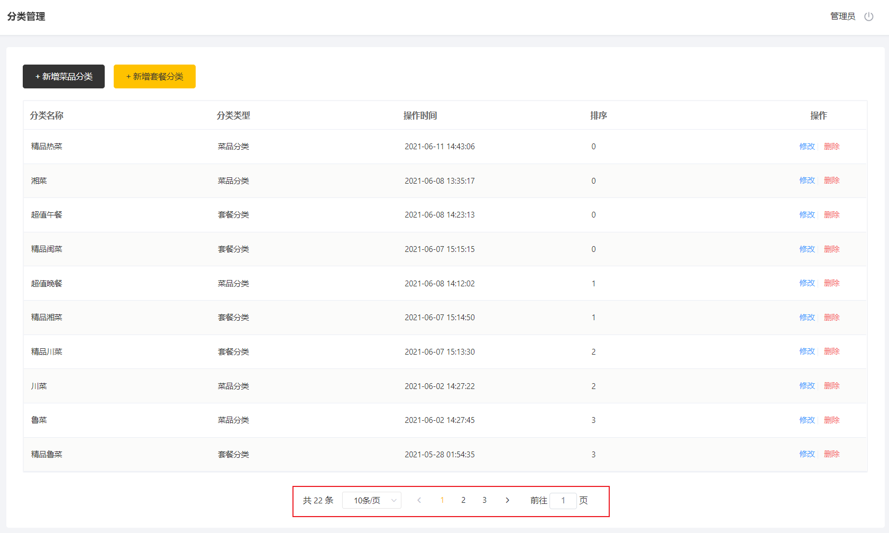 


### 3.2 前端页面分析

在开发代码之前，需要梳理一下整个程序的执行过程：

1). 页面发送ajax请求，将分页查询参数(page、pageSize)提交到服务端

2). 服务端Controller接收页面提交的数据并调用Service查询数据

3). Service调用Mapper操作数据库，查询分页数据

4). Controller将查询到的分页数据响应给页面

5). 页面接收到分页数据并通过ElementUI的Table组件展示到页面上


页面加载时,就会触发Vue声明周期的钩子方法,然后执行分页查询,发送异步请求到服务端,前端代码如下: 

  

页面中使用的是ElementUI提供的分页组件进行分页条的展示:

  


我们通过浏览器,也可以抓取到分页查询的请求信息, 如下: 

 


具体的请求信息整理如下: 

| 请求     | 说明                |
| -------- | ------------------- |
| 请求方式 | GET                 |
| 请求路径 | /category/page      |
| 请求参数 | ?page=1&pageSize=10 |


### 3.3 代码实现

在CategoryController中增加分页查询的方法，在方法中传递分页条件进行查询，并且需要对查询到的结果，安排设置的套餐顺序字段sort进行排序。

```java
/**
 * 分页查询
 * @param page
 * @param pageSize
 * @return
 */
@GetMapping("/page")
public R<Page> page(int page,int pageSize){
    //分页构造器
    Page<Category> pageInfo = new Page<>(page,pageSize);
    //条件构造器
    LambdaQueryWrapper<Category> queryWrapper = new LambdaQueryWrapper<>();
    //添加排序条件，根据sort进行排序
    queryWrapper.orderByAsc(Category::getSort);

    //分页查询
    categoryService.page(pageInfo,queryWrapper);
    return R.success(pageInfo);
}
```


### 3.4 功能测试

分页查询的代码编写完毕之后, 我们需要重新启动项目，然后登陆系统后台，点击分类管理，查询分类列表是否可以正常展示。测试过程中可以使用浏览器的监控工具查看页面和服务端的数据交互细节。

测试完毕后，大家会发现，我们查询数据库返回的类型为 1 或者 2， 但是实际展示到页面上的却是 "菜品分类" 或 "套餐分类"，这一块是在前端页面中进行处理的，处理代码如下： 

 

 


## 4. 删除分类

### 4.1 需求分析

在分类管理列表页面，可以对某个分类进行删除操作。需要注意的是当分类关联了菜品或者套餐时，此分类不允许删除。

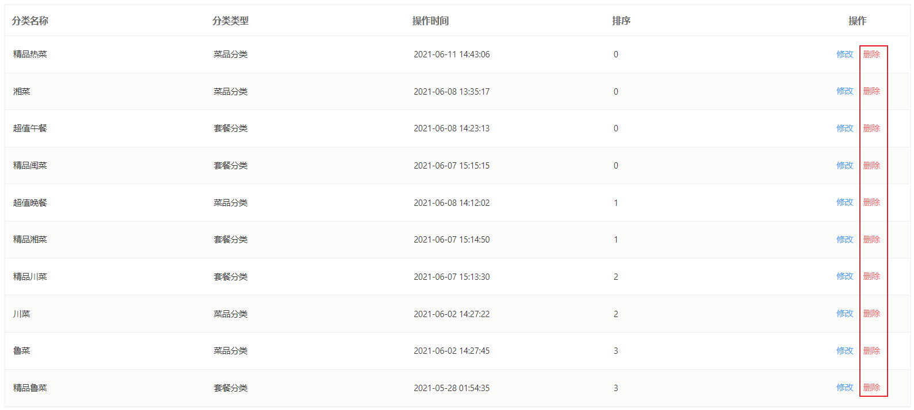 


### 4.2 前端页面分析

在前端页面中，点击 "删除" 按钮，就会触发定义的方法，然后往服务端发送异步请求，并传递参数id，执行删除分类操作。

 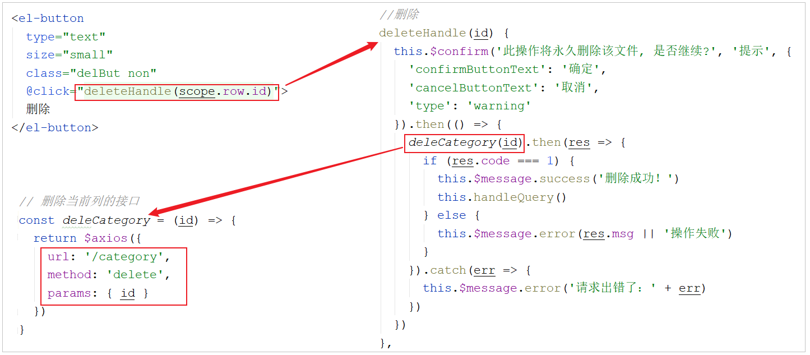  

删除操作的具体执行流程如下： 

1). 点击删除，页面发送ajax请求，将参数(id)提交到服务端

2). 服务端Controller接收页面提交的数据并调用Service删除数据

3). Service调用Mapper操作数据库

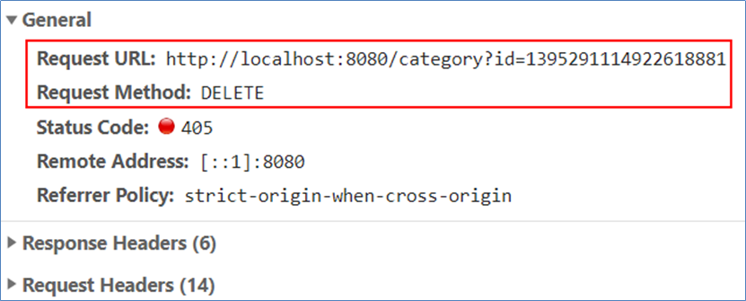 


从上述的分析中，我们可以得到请求的信息如下：

| 请求     | 说明                    |
| -------- | ----------------------- |
| 请求方式 | DELETE                  |
| 请求路径 | /category               |
| 请求参数 | ?id=1395291114922618881 |


### 4.3 代码实现

在CategoryController中增加根据ID删除的方法，在方法中接收页面传递参数id，然后执行删除操作。

```java
/**
 * 根据id删除分类
 * @param id
 * @return
 */
@DeleteMapping
public R<String> delete(Long id){
    log.info("删除分类，id为：{}",id);
    categoryService.removeById(id);
    return R.success("分类信息删除成功");
}
```


### 4.4 功能测试

基本的删除操作代码实现完毕后，重启项目，进行测试。可以通过debug断点调试进行测试，同时结合浏览器监控工具查看请求和响应的具体数据。


### 4.5 功能完善

#### 4.5.1 思路分析

在上述的测试中，我们看到分类数据是可以正常删除的。但是并没有检查删除的分类是否关联了菜品或者套餐，所以我们需要进行功能完善。完善后的逻辑为：

- 根据当前分类的ID，查询该分类下是否存在菜品，如果存在，则提示错误信息
- 根据当前分类的ID，查询该分类下是否存在套餐，如果存在，则提示错误信息
- 执行正常的删除分类操作


那么在这里又涉及到我们后面要用到的两张表结构 dish(菜品表) 和 setmeal(套餐表)。具体的表结构，我们目前先了解一下： 

 

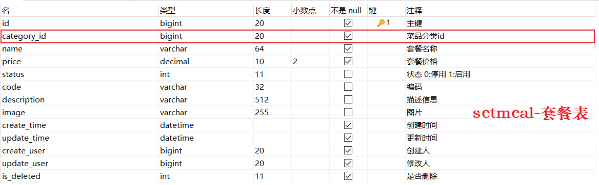 


#### 4.5.2 准备工作

**1). 准备菜品(Dish)及套餐(Setmeal)实体类(课程资料中直接拷贝)**

所属包: com.itheima.reggie.entity

```java
import com.baomidou.mybatisplus.annotation.FieldFill;
import com.baomidou.mybatisplus.annotation.TableField;
import lombok.Data;
import java.io.Serializable;
import java.math.BigDecimal;
import java.time.LocalDateTime;

/**
 菜品
 */
@Data
public class Dish implements Serializable {
    private static final long serialVersionUID = 1L;

    private Long id;

    //菜品名称
    private String name;

    //菜品分类id
    private Long categoryId;

    //菜品价格
    private BigDecimal price;

    //商品码
    private String code;

    //图片
    private String image;

    //描述信息
    private String description;

    //0 停售 1 起售
    private Integer status;

    //顺序
    private Integer sort;

    @TableField(fill = FieldFill.INSERT)
    private LocalDateTime createTime;

    @TableField(fill = FieldFill.INSERT_UPDATE)
    private LocalDateTime updateTime;

    @TableField(fill = FieldFill.INSERT)
    private Long createUser;

    @TableField(fill = FieldFill.INSERT_UPDATE)
    private Long updateUser;
}
```

```java
import com.baomidou.mybatisplus.annotation.FieldFill;
import com.baomidou.mybatisplus.annotation.TableField;
import lombok.Data;
import java.io.Serializable;
import java.math.BigDecimal;
import java.time.LocalDateTime;

/**
 * 套餐
 */
@Data
public class Setmeal implements Serializable {
    private static final long serialVersionUID = 1L;

    private Long id;

    //分类id
    private Long categoryId;

    //套餐名称
    private String name;

    //套餐价格
    private BigDecimal price;

    //状态 0:停用 1:启用
    private Integer status;

    //编码
    private String code;

    //描述信息
    private String description;

    //图片
    private String image;

    @TableField(fill = FieldFill.INSERT)
    private LocalDateTime createTime;

    @TableField(fill = FieldFill.INSERT_UPDATE)
    private LocalDateTime updateTime;

    @TableField(fill = FieldFill.INSERT)
    private Long createUser;

    @TableField(fill = FieldFill.INSERT_UPDATE)
    private Long updateUser;
}
```


**2). Mapper接口DishMapper和SetmealMapper**

所属包: com.itheima.reggie.mapper

```java
import com.baomidou.mybatisplus.core.mapper.BaseMapper;
import com.itheima.reggie.entity.Dish;
import org.apache.ibatis.annotations.Mapper;

@Mapper
public interface DishMapper extends BaseMapper<Dish> {
}
```

```java
import com.baomidou.mybatisplus.core.mapper.BaseMapper;
import com.itheima.reggie.entity.Setmeal;
import org.apache.ibatis.annotations.Mapper;

@Mapper
public interface SetmealMapper extends BaseMapper<Setmeal> {
}
```


**3). Service接口DishService和SetmealService**

所属包: com.itheima.reggie.service

```java
import com.baomidou.mybatisplus.extension.service.IService;
import com.itheima.reggie.entity.Dish;

public interface DishService extends IService<Dish> {
}
```

```java
import com.baomidou.mybatisplus.extension.service.IService;
import com.itheima.reggie.entity.Setmeal;

public interface SetmealService extends IService<Setmeal> {
}
```


**4). Service实现类DishServiceImpl和SetmealServiceImpl**

```java
import com.baomidou.mybatisplus.extension.service.impl.ServiceImpl;
import com.itheima.reggie.entity.Dish;
import com.itheima.reggie.mapper.DishMapper;
import com.itheima.reggie.service.DishService;
import lombok.extern.slf4j.Slf4j;
import org.springframework.stereotype.Service;

@Service
@Slf4j
public class DishServiceImpl extends ServiceImpl<DishMapper,Dish> implements DishService {
}
```

```java
import com.baomidou.mybatisplus.extension.service.impl.ServiceImpl;
import com.itheima.reggie.entity.Setmeal;
import com.itheima.reggie.mapper.SetmealMapper;
import com.itheima.reggie.service.SetmealService;
import lombok.extern.slf4j.Slf4j;
import org.springframework.stereotype.Service;

@Service
@Slf4j
public class SetmealServiceImpl extends ServiceImpl<SetmealMapper,Setmeal> implements SetmealService {
}
```


#### 4.5.3 代码实现

**1). 创建自定义异常**

在业务逻辑操作过程中,如果遇到一些业务参数、操作异常的情况下，我们直接抛出此异常。

所在包: com.itheima.reggie.common

```java
/**
 * 自定义业务异常类
 */
public class CustomException extends RuntimeException {
    public CustomException(String message){
        super(message);
    }
}
```


**2). 在CategoryService中扩展remove方法**

```java
public interface CategoryService extends IService<Category> {
	//根据ID删除分类
    public void remove(Long id);
}
```


**3). 在CategoryServiceImpl中实现remove方法**

```java
@Autowired
private DishService dishService;
@Autowired
private SetmealService setmealService;

/**
 * 根据id删除分类，删除之前需要进行判断
 * @param id
 */
@Override
public void remove(Long id) {
    //添加查询条件，根据分类id进行查询菜品数据
    LambdaQueryWrapper<Dish> dishLambdaQueryWrapper = new LambdaQueryWrapper<>();
    dishLambdaQueryWrapper.eq(Dish::getCategoryId,id);
    int count1 = dishService.count(dishLambdaQueryWrapper);
    //如果已经关联，抛出一个业务异常
    if(count1 > 0){
        throw new CustomException("当前分类下关联了菜品，不能删除");//已经关联菜品，抛出一个业务异常
    }

    //查询当前分类是否关联了套餐，如果已经关联，抛出一个业务异常
    LambdaQueryWrapper<Setmeal> setmealLambdaQueryWrapper = new LambdaQueryWrapper<>();
    setmealLambdaQueryWrapper.eq(Setmeal::getCategoryId,id);
    int count2 = setmealService.count(setmealLambdaQueryWrapper);
    if(count2 > 0){
        throw new CustomException("当前分类下关联了套餐，不能删除");//已经关联套餐，抛出一个业务异常
    }

    //正常删除分类
    super.removeById(id);
}
```


那么在上述的业务逻辑中，当分类下关联的有菜品或者套餐时，我们在业务代码中抛出了自定义异常，并且在异常中封装了错误提示信息，那这个错误提示信息如何提示给页面呢？

异常抛出之后，会被异常处理器捕获，我们只需要在异常处理器中捕获这一类的异常，然后给页面返回对应的提示信息即可。


**4). 在GlobalExceptionHandler中处理自定义异常**

在全局异常处理器中增加方法，用于捕获我们自定义的异常 CustomException

```java
/**
 * 异常处理方法
 * @return
 */
@ExceptionHandler(CustomException.class)
public R<String> exceptionHandler(CustomException ex){
    log.error(ex.getMessage());
    return R.error(ex.getMessage());
}
```


**5). 改造CategoryController的delete方法**

注释掉原有的代码，在delete方法中直接调用categoryService中我们自定义的remove方法。

```java
/**
* 根据id删除分类
* @param id
* @return
*/
@DeleteMapping
public R<String> delete(Long id){
    log.info("删除分类，id为：{}",id);

    //categoryService.removeById(id);
    categoryService.remove(id);

    return R.success("分类信息删除成功");
}
```


#### 4.5.4 功能测试

功能完善的代码编写完毕之后, 我们需要重新启动项目，进入管理系统访问分类管理, 然后进行删除分类的测试，需要将所有情况都覆盖全，例如：

1). 新增一个分类，然后再直接删除，检查是否可以正常删除成功。(新增的分类时没有关联菜品和套餐的)

2). 在数据库表(dish/setmeal)中，找到一个与菜品或套餐关联的分类，然后在页面中执行删除操作，检查是否可以正常的提示出对应的错误信息。

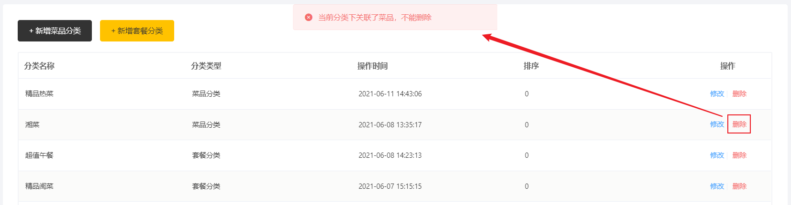 


## 5. 修改分类

### 5.1 需求分析

在分类管理列表页面点击修改按钮，弹出修改窗口，在修改窗口回显分类信息并进行修改，最后点击确定按钮完成修改操作。

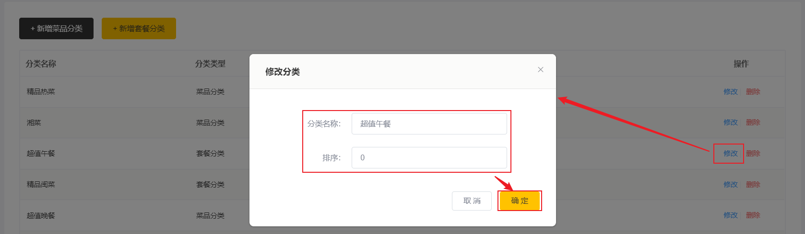 


### 5.2 前端页面分析

这里面大家会发现，修改功能我们还没有实现，但是当点击 "修改" 按钮的时候，我们并没有开发根据ID查询数据，进行页面回显的功能，但是页面的分类数据确实回显回来了。这是怎么做到的呢，我们来解析一下前端的代码实现(前端代码已经实现)：

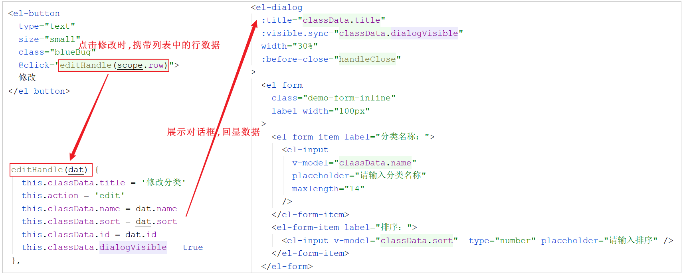 

那么回显这一步的操作前端已经实现，我们就只需要开发一个方法，修改操作的方法即可。我们可以通过浏览器来抓取一下修改操作的请求信息，如图：

 


具体的请求信息，整理如下：

| 请求     | 说明                                                   |
| -------- | ------------------------------------------------------ |
| 请求方式 | PUT                                                    |
| 请求路径 | /category                                              |
| 请求参数 | {id: "1399923597874081794", name: "超值午餐", sort: 0} |


### 5.3 代码实现

html页面中相关的代码都已经提供好了，我们已经分析了请求的信息，接下来就可以来创建服务端的CategoryController方法update方法。

```java
/**
 * 根据id修改分类信息
 * @param category
 * @return
 */
@PutMapping
public R<String> update(@RequestBody Category category){
    log.info("修改分类信息：{}",category);
    categoryService.updateById(category);
    return R.success("修改分类信息成功");
}
```


### 5.4 功能测试

按照前面分析的操作流程进行测试，查看数据是否正常修改即可。


# 文件上传下载- 菜品新增- 菜品分页查询- 菜品修改 

## 课程内容

- 文件上传下载
- 菜品新增
- 菜品分页查询
- 菜品修改 


## 1. 文件上传下载

### 1.1 上传介绍

#### 1.1.1 概述

文件上传，也称为upload，是指将本地图片、视频、音频等文件上传到服务器上，可以供其他用户浏览或下载的过程。文件上传在项目中应用非常广泛，我们经常发微博、发微信朋友圈都用到了文件上传功能。

 


文件上传时，对页面的form表单有如下要求：

| 表单属性 | 取值                | 说明                      |
| -------- | ------------------- | ------------------------- |
| method   | post                | 必须选择post方式提交      |
| enctype  | multipart/form-data | 采用multipart格式上传文件 |
| type     | file                | 使用input的file控件上传   |


#### 1.1.2 前端介绍

**1). 简单html页面表单**

```html
<form method="post" action="/common/upload" enctype="multipart/form-data">
    <input name="myFile" type="file"  />
    <input type="submit" value="提交" /> 
</form>
```


**2). ElementUI中提供的upload上传组件**

目前一些前端组件库也提供了相应的上传组件，但是底层原理还是基于form表单的文件上传。

 


#### 1.1.3 服务端介绍

服务端要接收客户端页面上传的文件，通常都会使用Apache的两个组件：

- commons-fileupload

- commons-io


而Spring框架在spring-web包中对文件上传进行了封装，大大简化了服务端代码，我们只需要在Controller的方法中声明一个MultipartFile类型的参数即可接收上传的文件，例如：

```java
/**
 * 文件上传
 * @param file
 * @return
 */
@PostMapping("/upload")
public R<String> upload(MultipartFile file){
    System.out.println(file);
    return R.success(fileName);
}
```


### 1.2 下载介绍

文件下载，也称为download，是指将文件从服务器传输到本地计算机的过程。通过浏览器进行文件下载，通常有两种表现形式：

**1). 以附件形式下载，弹出保存对话框，将文件保存到指定磁盘目录**

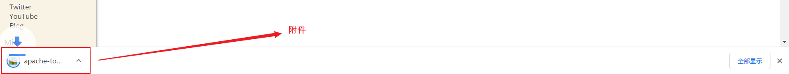 


**2). 直接在浏览器中打开**

而我们在今天所需要实现的菜品展示，表现形式为在浏览器中直接打开。

  

通过浏览器进行文件下载，本质上就是服务端将文件以流的形式写回浏览器的过程。


### 1.3 上传代码实现

#### 1.3.1 前端代码

文件上传，我们作为服务端工程师，主要关注服务端代码实现。对于前端页面，可以使用ElementUI提供的上传组件。可以直接使用资料中提供的上传页面，位置：资料/文件上传下载页面/upload.html，将其拷贝到项目的目录(resources/backend/page/demo\)下，启动项目，访问上传页面。

http://localhost:8080/backend/page/demo/upload.html

 


在上述的浏览器抓取的网络请求中，上传文件的调用url，在哪里配置的呢，这个时候，我们需要去看一下前端上传组件。

 

虽然上述是ElementUI封装的代码，但是实际上最终还通过file域上传文件，如果未指定上传文件的参数名，默认为file。

 


#### 1.3.2 服务端实现

**1). application.yml**

需要在application.yml中定义文件存储路径

```yml
reggie:
  path: D:\img\
```


**2). CommonController**

编写文件上传的方法, 通过MultipartFile类型的参数即可接收上传的文件, 方法形参的名称需要与页面的file域的name属性一致。

所在包: com.itheima.reggie.controller

上传逻辑: 

1). 获取文件的原始文件名, 通过原始文件名获取文件后缀

2). 通过UUID重新声明文件名, 文件名称重复造成文件覆盖

3). 创建文件存放目录

4). 将上传的临时文件转存到指定位置

代码实现:

```java
import com.itheima.reggie.common.R;
import lombok.extern.slf4j.Slf4j;
import org.springframework.beans.factory.annotation.Value;
import org.springframework.web.bind.annotation.*;
import org.springframework.web.multipart.MultipartFile;
import java.io.File;
import java.util.UUID;

/**
 * 文件上传和下载
 */
@RestController
@RequestMapping("/common")
@Slf4j
public class CommonController {
    @Value("${reggie.path}")
    private String basePath;
    /**
     * 文件上传
     * @param file
     * @return
     */
    @PostMapping("/upload")
    public R<String> upload(MultipartFile file){
        //file是一个临时文件，需要转存到指定位置，否则本次请求完成后临时文件会删除
        log.info(file.toString());
		
        //原始文件名
        String originalFilename = file.getOriginalFilename();//abc.jpg
        String suffix = originalFilename.substring(originalFilename.lastIndexOf("."));

        //使用UUID重新生成文件名，防止文件名称重复造成文件覆盖
        String fileName = UUID.randomUUID().toString() + suffix;//dfsdfdfd.jpg
		
        //创建一个目录对象
        File dir = new File(basePath);
        //判断当前目录是否存在
        if(!dir.exists()){
            //目录不存在，需要创建
            dir.mkdirs();
        }
		
        try {
            //将临时文件转存到指定位置
            file.transferTo(new File(basePath + fileName));
        } catch (IOException e) {
            e.printStackTrace();
        }
        return R.success(fileName);
    }
}    
```


#### 1.3.3 测试

代码编写完成之后，我们重新启动项目，访问上传页面 http://localhost:8080/backend/page/demo/upload.html，然后点击上传图片，选择图片上传时，会发现图片并不能正常的上传，而且在浏览器中可以抓取到响应的数据，从图中我们可以判断出需要登录才可以操作。

 

而这样的话，就要求我们在测试时，每一次都需要先登录，登录完成后在进行图片上传的测试，为了简化我们的测试，我们可以在 LoginCheckFilter 的doFilter方法中，在不需要处理的请求路径的数组中再加入请求路径 /common/** , 如下: 

 

然后，我们在测试文件的上传功能时，就不需要登录就可以操作了。 


我们在测试文件上传时，可以通过debug的形式来跟踪上传的整个过程，验证一下临时文件是否存在，以及上传完成之后，临时文件是否会自动删除。

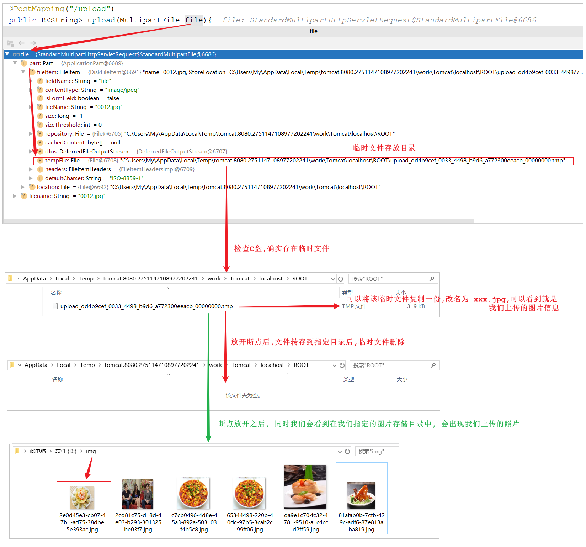 


### 1.4 下载代码实现

#### 1.4.1 前端代码

文件下载，前端页面可以使用标签展示下载的图片。

```html
</img>
```


那么，通过标签如何展示图片数据呢，接下来我们来解析一下具体的流程：

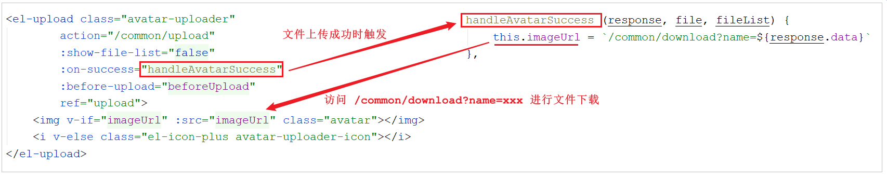 

在文件上传成功后，在 handleAvatarSuccess 方法中获取文件上传成功之后返回的数据(文件名)，然后调用 /common/download?name=xxx 进行文件的下载。在这里，我们想让上传的照片能够在页面展示出来，所以我们就需要在服务端将文件以流的形式写回浏览器。


#### 1.4.2 服务端代码

在 CommonController 中定义方法download，并接收页面传递的参数name，然后读取图片文件的数据，然后以流的形式写回浏览器。

具体逻辑如下： 

1). 定义输入流，通过输入流读取文件内容

2). 通过response对象，获取到输出流

3). 通过response对象设置响应数据格式(image/jpeg)

4). 通过输入流读取文件数据，然后通过上述的输出流写回浏览器

5). 关闭资源


代码实现:

```java
/**
 * 文件下载
 * @param name
 * @param response
 */
@GetMapping("/download")
public void download(String name, HttpServletResponse response){
    try {
        //输入流，通过输入流读取文件内容
        FileInputStream fileInputStream = new FileInputStream(new File(basePath + name));

        //输出流，通过输出流将文件写回浏览器
        ServletOutputStream outputStream = response.getOutputStream();

        response.setContentType("image/jpeg");

        int len = 0;
        byte[] bytes = new byte[1024];
        while ((len = fileInputStream.read(bytes)) != -1){
            outputStream.write(bytes,0,len);
            outputStream.flush();
        }

        //关闭资源
        outputStream.close();
        fileInputStream.close();
    } catch (Exception e) {
        e.printStackTrace();
    }
}
```


#### 1.4.3 测试

访问页面 http://localhost:8080/backend/page/demo/upload.html , 点击上传图片 , 选择图片进行上传, 上传完毕之后, 查看图片是否可以展示出来。

 

通过F12查询页面发起的请求及响应的数据：

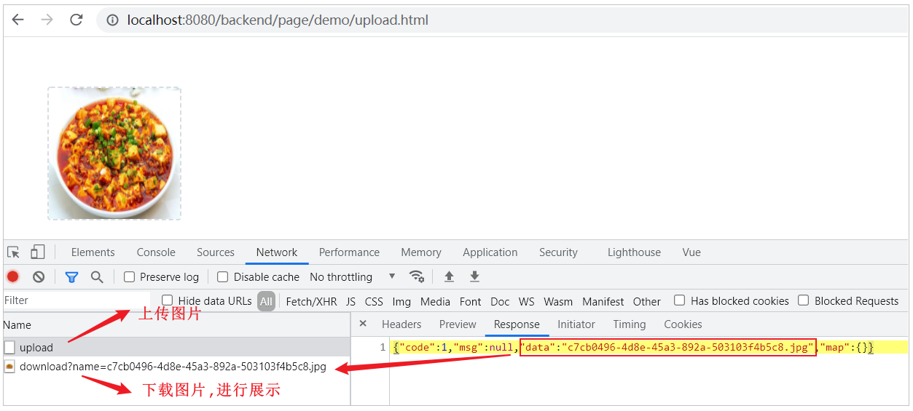 


## 2. 菜品新增

### 2.1 需求分析

后台系统中可以管理菜品信息，通过 新增功能来添加一个新的菜品，在添加菜品时需要选择当前菜品所属的菜品分类，并且需要上传菜品图片，在移动端会按照菜品分类来展示对应的菜品信息 。

 


### 2.2 数据模型

 

新增菜品，其实就是将新增页面录入的菜品信息插入到dish表，如果添加了口味做法，还需要向dish_flavor表插入数据。所以在新增菜品时，涉及到两个表：

| 表结构      | 说明       |
| ----------- | ---------- |
| dish        | 菜品表     |
| dish_flavor | 菜品口味表 |


**1). 菜品表:dish**

 


**2). 菜品口味表:dish_flavor**

 


### 2.3 准备工作

在开发业务功能前，先将需要用到的类和接口基本结构创建好：


**1). 实体类 DishFlavor**

直接从课程资料中导入即可，Dish实体前面课程中已经导入过了

所属包: com.itheima.reggie.entity

```java
import com.baomidou.mybatisplus.annotation.FieldFill;
import com.baomidou.mybatisplus.annotation.TableField;
import lombok.Data;
import java.io.Serializable;
import java.time.LocalDateTime;
/**
菜品口味
 */
@Data
public class DishFlavor implements Serializable {

    private static final long serialVersionUID = 1L;
	
    private Long id;
    //菜品id
    private Long dishId;

    //口味名称
    private String name;

    //口味数据list
    private String value;

    @TableField(fill = FieldFill.INSERT)
    private LocalDateTime createTime;

    @TableField(fill = FieldFill.INSERT_UPDATE)
    private LocalDateTime updateTime;

    @TableField(fill = FieldFill.INSERT)
    private Long createUser;

    @TableField(fill = FieldFill.INSERT_UPDATE)
    private Long updateUser;

    //是否删除
    private Integer isDeleted;
}
```


**2). Mapper接口DishFlavorMapper**

所属包: com.itheima.reggie.mapper

```java
import com.baomidou.mybatisplus.core.mapper.BaseMapper;
import com.itheima.reggie.entity.DishFlavor;
import org.apache.ibatis.annotations.Mapper;

@Mapper
public interface DishFlavorMapper extends BaseMapper<DishFlavor> {
}
```


**3). 业务层接口 DishFlavorService**

所属包: com.itheima.reggie.service

```java
import com.baomidou.mybatisplus.extension.service.IService;
import com.itheima.reggie.entity.DishFlavor;

public interface DishFlavorService extends IService<DishFlavor> {
}
```


**4). 业务层实现类 DishFlavorServiceImpl**

所属包: com.itheima.reggie.service.impl

```java
import com.baomidou.mybatisplus.extension.service.impl.ServiceImpl;
import com.itheima.reggie.entity.DishFlavor;
import com.itheima.reggie.mapper.DishFlavorMapper;
import com.itheima.reggie.service.DishFlavorService;
import org.springframework.stereotype.Service;

@Service
public class DishFlavorServiceImpl extends ServiceImpl<DishFlavorMapper,DishFlavor> implements DishFlavorService {
}
```


**5). 控制层 DishController**

菜品及菜品口味的相关操作，我们统一使用这一个controller即可。

所属包： com.itheima.reggie.controller

```java
import com.itheima.reggie.service.DishFlavorService;
import com.itheima.reggie.service.DishService;
import lombok.extern.slf4j.Slf4j;
import org.springframework.beans.factory.annotation.Autowired;
import org.springframework.web.bind.annotation.*;
/**
 * 菜品管理
 */
@RestController
@RequestMapping("/dish")
@Slf4j
public class DishController {
    @Autowired
    private DishService dishService;

    @Autowired
    private DishFlavorService dishFlavorService;
}    
```


### 2.4 前端页面分析

基本的准备工作我们已经做完了，那么接下来我们就需要来实现新增菜品功能，在开发代码之前，需要梳理一下新增菜品时前端页面和服务端的交互过程。

1). 点击新建菜品按钮, 访问页面(backend/page/food/add.html), 页面加载时发送ajax请求，请求服务端获取菜品分类数据并展示到下拉框中

 


2). 页面发送请求进行图片上传，请求服务端将图片保存到服务器(上传功能已实现)

3). 页面发送请求进行图片下载，将上传的图片进行回显(下载功能已实现)

 


4). 点击保存按钮，发送ajax请求，将菜品相关数据以json形式提交到服务端

页面代码:

 

浏览器抓取请求:

 


开发新增菜品功能，其实就是在服务端编写代码去处理前端页面发送的这4次请求(上传、下载已实现)即可。经过上述的分析，我们还需要在服务端实现两块功能：

A. 菜品分类数据列表查询, 具体请求信息整理如下 : 

| 请求     | 说明           |
| -------- | -------------- |
| 请求方式 | GET            |
| 请求路径 | /category/list |
| 请求参数 | ?type=1        |


B. 保存菜品信息, 具体请求信息整理如下 : 

| 请求     | 说明     |
| -------- | -------- |
| 请求方式 | POST     |
| 请求路径 | /dish    |
| 请求参数 | json格式 |


下面呢,我们就需要根据这里分析的结果,分别来实现菜品分类列表的展示功能、保存菜品的功能 。


### 2.5 代码实现

#### 2.5.1 菜品分类查询

在CategoryController中增加方法实现菜品分类查询，根据分类进行查询，并对查询的结果按照sort排序字段进行升序排序，如果sort相同，再按照修改时间倒序排序。

```java
/**
* 根据条件查询分类数据
* @param category
* @return
*/
@GetMapping("/list")
public R<List<Category>> list(Category category){
    //条件构造器
    LambdaQueryWrapper<Category> queryWrapper = new LambdaQueryWrapper<>();
    //添加条件
    queryWrapper.eq(category.getType() != null,Category::getType,category.getType());
    //添加排序条件
    queryWrapper.orderByAsc(Category::getSort).orderByDesc(Category::getUpdateTime);

    List<Category> list = categoryService.list(queryWrapper);
    return R.success(list);
}
```


代码编写完毕之后，我们可以打开新增菜品页面，查看响应的数据，及页面下拉列表的渲染情况： 

 


#### 2.5.2 保存菜品信息

在上述的分析中，我们可以看到在保存菜品时，页面传递过来的是json格式数据，格式如下：

```json
{
    "name":"佛跳墙",
    "price":88800,
    "code":"",
    "image":"da9e1c70-fc32-4781-9510-a1c4ccd2ff59.jpg",
    "description":"佛跳墙",
    "status":1,
    "categoryId":"1397844357980663809",
    "flavors":[
        {
            "name":"辣度",
            "value":"[\"不辣\",\"微辣\",\"中辣\",\"重辣\"]",
            "showOption":false
        },
        {
            "name":"忌口",
            "value":"[\"不要葱\",\"不要蒜\",\"不要香菜\",\"不要辣\"]",
            "showOption":false
        }
    ]
}
```

在服务端我们应该如何来封装前端传递的数据呢，我们发现，如果使用菜品类Dish来封装，只能封装菜品的基本属性，flavors属性是无法封装的。那么这个时候，我们应该如何处理呢?

这个时候，我们需要自定义一个实体类，然后继承自 Dish，并对Dish的属性进行拓展，增加 flavors 集合属性(内部封装DishFlavor)。清楚了这一点之后,接下来就进行功能开发。


**1). 导入 DishDto 实体类**

封装页面传递的请求参数。

所属包: com.itheima.reggie.dto

```java
import com.itheima.reggie.entity.Dish;
import com.itheima.reggie.entity.DishFlavor;
import lombok.Data;
import java.util.ArrayList;
import java.util.List;

@Data
public class DishDto extends Dish {
    private List<DishFlavor> flavors = new ArrayList<>();
	
    private String categoryName;
	
    private Integer copies;
}
```


<font color='red'>拓展： 我们在做项目时，经常会涉及到各种类型的实体模型。基本包含以下几种</font> 

| 实体模型 | 描述                                                         |
| -------- | ------------------------------------------------------------ |
| DTO      | Data Transfer Object(数据传输对象)，一般用于展示层与服务层之间的数据传输。 |
| Entity   | 最常用实体类，基本和数据表一一对应，一个实体类对应一张表。   |
| VO       | Value Object(值对象), 主要用于封装前端页面展示的数据对象，用一个VO对象来封装整个页面展示所需要的对象数据 |
| PO       | Persistant Object(持久层对象), 是ORM(Objevt Relational Mapping)框架中Entity，PO属性和数据库中表的字段形成一一对应关系 |


**2). DishController定义方法新增菜品**

在该Controller的方法中，不仅需要保存菜品的基本信息，还需要保存菜品的口味信息，需要操作两张表，所以我们需要在DishService接口中定义接口方法，在这个方法中需要保存上述的两部分数据。

```java
/**
 * 新增菜品
 * @param dishDto
 * @return
 */
@PostMapping
public R<String> save(@RequestBody DishDto dishDto){
    log.info(dishDto.toString());

    dishService.saveWithFlavor(dishDto);

    return R.success("新增菜品成功");
}
```


**3). DishService中增加方法saveWithFlavor**

```java
//新增菜品，同时插入菜品对应的口味数据，需要操作两张表：dish、dish_flavor
public void saveWithFlavor(DishDto dishDto);
```


**4). DishServiceImpl中实现方法saveWithFlavor**

页面传递的菜品口味信息，仅仅包含name 和 value属性，缺少一个非常重要的属性dishId， 所以在保存完菜品的基本信息后，我们需要获取到菜品ID，然后为菜品口味对象属性dishId赋值。

具体逻辑如下：

①. 保存菜品基本信息 ;

②. 获取保存的菜品ID ;

③. 获取菜品口味列表，遍历列表，为菜品口味对象属性dishId赋值;

④. 批量保存菜品口味列表;

代码实现如下: 

```java
@Autowired
private DishFlavorService dishFlavorService;
/**
* 新增菜品，同时保存对应的口味数据
* @param dishDto
*/
@Transactional
public void saveWithFlavor(DishDto dishDto) {
    //保存菜品的基本信息到菜品表dish
    this.save(dishDto);
	
    Long dishId = dishDto.getId();//菜品id
    //菜品口味
    List<DishFlavor> flavors = dishDto.getFlavors();
    flavors = flavors.stream().map((item) -> {
        item.setDishId(dishId);
        return item;
    }).collect(Collectors.toList());

    //保存菜品口味数据到菜品口味表dish_flavor
    dishFlavorService.saveBatch(flavors);
}
```

> 说明: 
>
> ​	由于在 saveWithFlavor 方法中，进行了两次数据库的保存操作，操作了两张表，那么为了保证数据的一致性，我们需要在方法上加上注解 @Transactional来控制事务。


**5). 在引导类上加注解 @EnableTransactionManagement**

Service层方法上加的注解@Transactional要想生效，需要在引导类上加上注解 @EnableTransactionManagement， 开启对事务的支持。

```java
@Slf4j
@SpringBootApplication
@ServletComponentScan
@EnableTransactionManagement //开启对事物管理的支持
public class ReggieApplication {
    public static void main(String[] args) {
        SpringApplication.run(ReggieApplication.class,args);
        log.info("项目启动成功...");
    }
}
```


### 2.6 功能测试

代码编写完毕之后，我们重新启动服务，访问项目，然后登陆到系统中，进行菜品的新增测试，在测试时，我们可以通过debug断点跟踪的形式，查看我们传输的数据，及数据的封装。

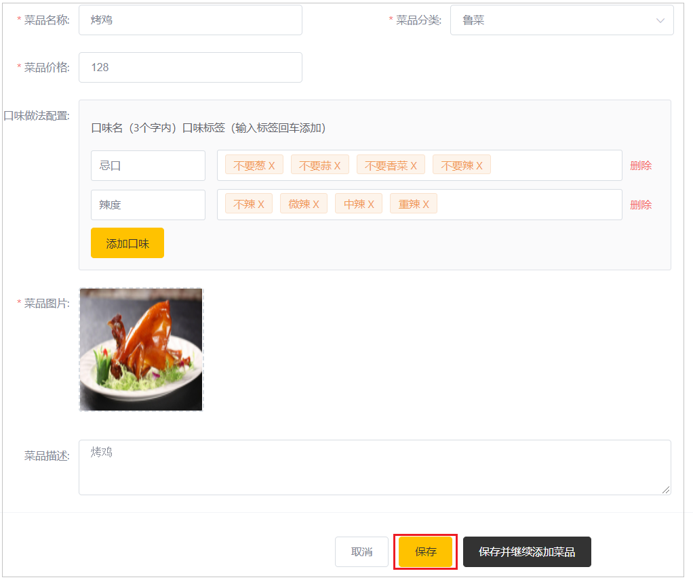 

debug跟踪数据的封装情况: 

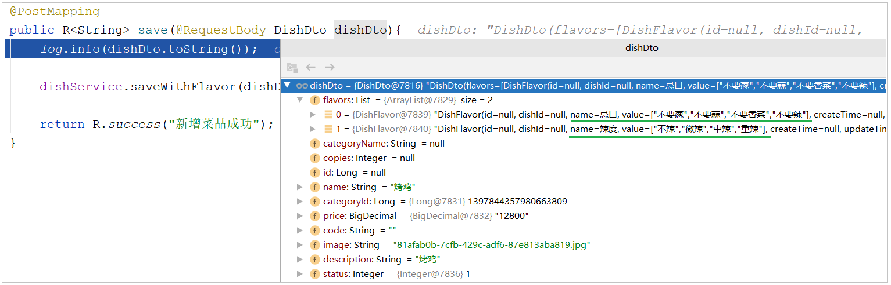 


然后在测试完毕后, 我们可以检查一下数据库中的数据保存情况:

 


## 3. 菜品分页查询

### 3.1 需求分析

系统中的菜品数据很多的时候，如果在一个页面中全部展示出来会显得比较乱，不便于查看，所以一般的系统中都会以分页的方式来展示列表数据。

 

在菜品列表展示时，除了菜品的基本信息(名称、售价、售卖状态、更新时间)外，还有两个字段略微特殊，第一个是图片字段 ，我们从数据库查询出来的仅仅是图片的名字，图片要想在表格中回显展示出来，就需要下载这个图片。第二个是菜品分类，这里展示的是分类名称，而不是分类ID，此时我们就需要根据菜品的分类ID，去分类表中查询分类信息，然后在页面展示。


### 3.2 前端页面分析

在开发代码之前，需要梳理一下菜品分页查询时前端页面和服务端的交互过程：

1). 访问页面(backend/page/food/list.html)时，发送ajax请求，将分页查询参数(page、pageSize、name)提交到服务端，获取分页数据

2). 页面发送请求，请求服务端进行图片下载，用于页面图片展示

 

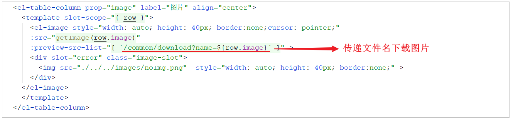 


开发菜品信息分页查询功能，其实就是在服务端编写代码去处理前端页面发送的这2次请求即可，而前端发起的请求中， 图片文件下载回显的代码，我们已经实现了。所以，我们只需要开发分页查询的功能即可，分页查询具体的请求信息如下：

| 请求     | 说明                         |
| -------- | ---------------------------- |
| 请求方式 | GET                          |
| 请求路径 | /dish/page                   |
| 请求参数 | ?page=1&pageSize=10&name=xxx |


### 3.3 代码实现

#### 3.3.1 分析

上述我们已经分析了分页查询的请求信息，那么接下来，我们就需要在 DishController中开发方法，来完成菜品的条件分页查询，在分页查询时还需要给页面返回分类的名称，而分类的名称前端在接收的时候是通过 categoryName 属性获取的，那么对应的服务端也应该封装到 categoryName 属性中。

```html
<el-table-column prop="categoryName" label="菜品分类"></el-table-column>
```


而在我们的实体类 Dish 中，仅仅包含 categoryId， 不包含 categoryName，那么我们应该如何封装查询的数据呢？ 其实，这里我们可以返回DishDto对象，在该对象中我们可以拓展一个属性 categoryName，来封装菜品分类名称。

```java
@Data
public class DishDto extends Dish {
    private List<DishFlavor> flavors = new ArrayList<>();
    private String categoryName; //菜品分类名称
    private Integer copies;
}
```


具体逻辑为： 

1). 构造分页条件对象

2). 构建查询及排序条件

3). 执行分页条件查询

4). 遍历分页查询列表数据，根据分类ID查询分类信息，从而获取该菜品的分类名称

5). 封装数据并返回


#### 3.3.2 实现

分析了具体的实现思路之后，接下来就来完成具体的代码实现。

```java
/**
 * 菜品信息分页查询
 * @param page
 * @param pageSize
 * @param name
 * @return
 */
@GetMapping("/page")
public R<Page> page(int page,int pageSize,String name){
    //构造分页构造器对象
    Page<Dish> pageInfo = new Page<>(page,pageSize);
    Page<DishDto> dishDtoPage = new Page<>();

    //条件构造器
    LambdaQueryWrapper<Dish> queryWrapper = new LambdaQueryWrapper<>();
    //添加过滤条件
    queryWrapper.like(name != null,Dish::getName,name);
    //添加排序条件
    queryWrapper.orderByDesc(Dish::getUpdateTime);

    //执行分页查询
    dishService.page(pageInfo,queryWrapper);

    //对象拷贝
    BeanUtils.copyProperties(pageInfo,dishDtoPage,"records");
    List<Dish> records = pageInfo.getRecords();
    List<DishDto> list = records.stream().map((item) -> {
        
        DishDto dishDto = new DishDto();
        BeanUtils.copyProperties(item,dishDto);
        Long categoryId = item.getCategoryId();//分类id
        //根据id查询分类对象
        Category category = categoryService.getById(categoryId);
        
        if(category != null){
            String categoryName = category.getName();
            dishDto.setCategoryName(categoryName);
        }
        return dishDto;
    }).collect(Collectors.toList());
    dishDtoPage.setRecords(list);
    
    return R.success(dishDtoPage);
}
```

> 数据库查询菜品信息时，获取到的分页查询结果 Page 的泛型为 Dish，而我们最终需要给前端页面返回的类型为 DishDto，所以这个时候就要进行转换，基本属性我们可以直接通过属性拷贝的形式对Page中的属性进行复制，而对于结果列表 records属性，我们是需要进行特殊处理的(需要封装菜品分类名称);


### 3.4 功能测试

代码编写完毕之后，我们重新启动服务，访问项目，可以通过debug端点的形式跟踪，整个分页查询过程中，数据的转换和封装。 

在测试的过程中，我们发现有一些菜品图片并没有展示出来，如下： 

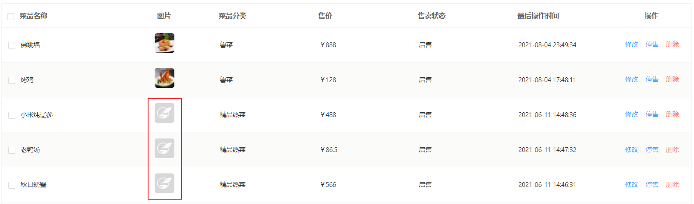 

这是因为我们在导入sql脚本时，导入了一部分菜品的数据，而菜品的图片在我们的磁盘目录中并不存在，所以才会出现图片展示不出来的情况，而我们后续自己添加的菜品信息是没有问题的。


## 4. 菜品修改

### 4.1 需求分析

在菜品管理列表页面点击修改按钮，跳转到修改菜品页面，在修改页面回显菜品相关信息并进行修改，最后点击确定按钮完成修改操作。

 


### 4.2 前端页面分析

在开发代码之前，需要梳理一下修改菜品时前端页面（add.html）和服务端的交互过程：

1). 点击菜品列表的中的修改按钮，携带菜品id跳转至add.html

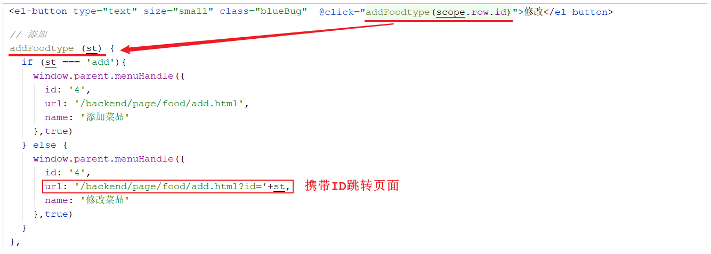 


2). 进入add.html，页面发送ajax请求，请求服务端获取分类数据，用于菜品分类下拉框中数据展示(**已实现**)

3). add.html获取id, 发送ajax请求，请求服务端，根据id查询当前菜品信息，用于菜品信息回显

 


4). 页面发送请求，请求服务端进行图片下载，用于页图片回显(**已实现**)

 


5). 点击保存按钮，页面发送ajax请求，将修改后的菜品相关数据以json形式提交到服务端

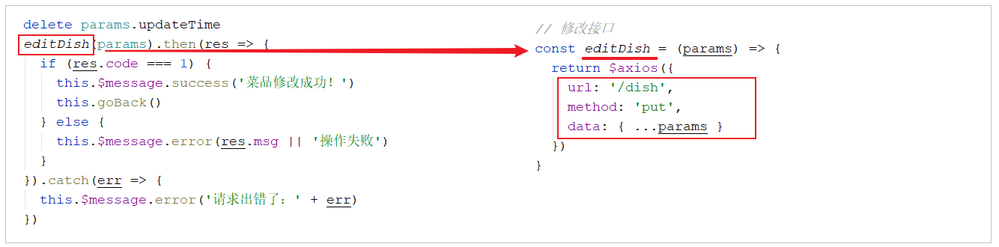 


经过上述的分析，我们发现，菜品分类下拉框的展示、图片的下载回显功能我们都已经实现了。我们只需要在这里实现两个功能即可，分别是： 

**1). 根据ID查询菜品及菜品口味信息**

具体请求信息如下： 

| 请求     | 说明       |
| -------- | ---------- |
| 请求方式 | GET        |
| 请求路径 | /dish/{id} |


**2). 修改菜品及菜品口味信息**

具体请求信息如下：

| 请求     | 说明         |
| -------- | ------------ |
| 请求方式 | PUT          |
| 请求路径 | /dish        |
| 请求参数 | json格式数据 |

具体的json格式数据，我们可以通过浏览器抓取： 

```json
{
    "id":"1422783914845487106",
    "name":"佛跳墙",
    "categoryId":"1397844357980663809",
    "price":88800,
    "code":"",
    "image":"da9e1c70-fc32-4781-9510-a1c4ccd2ff59.jpg",
    "description":"佛跳墙",
    "status":1,
    "sort":0,
    "createTime":"2021-08-04 12:58:14",
    "createUser":"1412578435737350122",
    "updateUser":"1412578435737350122",
    "flavors":[
        {
            "id":"1422783914883235842",
            "dishId":"1422783914845487106",
            "name":"辣度",
            "value":"[\"不辣\",\"微辣\",\"中辣\",\"重辣\"]",
            "createTime":"2021-08-04 12:58:14",
            "updateTime":"2021-08-04 12:58:14",
            "createUser":"1412578435737350122",
            "updateUser":"1412578435737350122",
            "isDeleted":0,
            "showOption":false
        },
        {
            "id":"1422783914895818754",
            "dishId":"1422783914845487106",
            "name":"忌口",
            "value":"[\"不要葱\",\"不要蒜\",\"不要香菜\",\"不要辣\"]",
            "createTime":"2021-08-04 12:58:14",
            "updateTime":"2021-08-04 12:58:14",
            "createUser":"1412578435737350122",
            "updateUser":"1412578435737350122",
            "isDeleted":0,
            "showOption":false
        }
    ]
}
```


### 4.3 功能实现

#### 4.3.1 根据ID查询菜品信息

##### 4.3.1.1 代码实现

页面发送ajax请求，请求服务端，根据id查询当前菜品信息和对应的口味信息，用于修改页面中菜品信息回显。


1). 在DishService接口中扩展getByIdWithFlavor方法

```java
//根据id查询菜品信息和对应的口味信息
public DishDto getByIdWithFlavor(Long id);
```


2). 在DishService实现类中实现此方法

具体逻辑为: 

A. 根据ID查询菜品的基本信息 

B. 根据菜品的ID查询菜品口味列表数据

C. 组装数据并返回

代码实现: 

```java
/**
* 根据id查询菜品信息和对应的口味信息
* @param id
* @return
*/
public DishDto getByIdWithFlavor(Long id) {
    //查询菜品基本信息，从dish表查询
    Dish dish = this.getById(id);
	
    DishDto dishDto = new DishDto();
    BeanUtils.copyProperties(dish,dishDto);
	
    //查询当前菜品对应的口味信息，从dish_flavor表查询
    LambdaQueryWrapper<DishFlavor> queryWrapper = new LambdaQueryWrapper<>();
    queryWrapper.eq(DishFlavor::getDishId,dish.getId());
    List<DishFlavor> flavors = dishFlavorService.list(queryWrapper);
    dishDto.setFlavors(flavors);
	
    return dishDto;
}
```


3). 在DishController中创建get方法

```java
/**
* 根据id查询菜品信息和对应的口味信息
* @param id
* @return
*/
@GetMapping("/{id}")
public R<DishDto> get(@PathVariable Long id){
    DishDto dishDto = dishService.getByIdWithFlavor(id);
    return R.success(dishDto);
}

```

> @PathVariable : 该注解可以用来提取url路径中传递的请求参数。


##### 4.3.1.2 功能测试

编写完代码后，重启服务进行测试，点击列表的修改按钮，查询数据回显情况。

 


#### 4.3.2 修改菜品信息

##### 4.3.2.1 代码实现

点击保存按钮，页面发送ajax请求，将修改后的菜品相关数据以json形式提交到服务端。在修改菜品信息时需要注意，除了要更新dish菜品表，还需要更新dish_flavor菜品口味表。

1). 在DishService接口中扩展方法updateWithFlavor

```java
//更新菜品信息，同时更新对应的口味信息
public void updateWithFlavor(DishDto dishDto);
```


2). 在DishServiceImpl中实现方法updateWithFlavor

在该方法中，我们既需要更新dish菜品基本信息表，还需要更新dish_flavor菜品口味表。而页面再操作时，关于菜品的口味，有修改，有新增，也有可能删除，我们应该如何更新菜品口味信息呢，其实，无论菜品口味信息如何变化，我们只需要保持一个原则： 先删除，后添加。

```java
@Override
@Transactional
public void updateWithFlavor(DishDto dishDto) {
    //更新dish表基本信息
    this.updateById(dishDto);

    //清理当前菜品对应口味数据---dish_flavor表的delete操作
    LambdaQueryWrapper<DishFlavor> queryWrapper = new LambdaQueryWrapper();
    queryWrapper.eq(DishFlavor::getDishId,dishDto.getId());

    dishFlavorService.remove(queryWrapper);

    //添加当前提交过来的口味数据---dish_flavor表的insert操作
    List<DishFlavor> flavors = dishDto.getFlavors();

    flavors = flavors.stream().map((item) -> {
        item.setDishId(dishDto.getId());
        return item;
    }).collect(Collectors.toList());

    dishFlavorService.saveBatch(flavors);
}
```


3). 在DishController中创建update方法

```java
/**
* 修改菜品
* @param dishDto
* @return
*/
@PutMapping
public R<String> update(@RequestBody DishDto dishDto){
    log.info(dishDto.toString());
    dishService.updateWithFlavor(dishDto);
    return R.success("修改菜品成功");
}
```


##### 4.3.2.2 功能测试

代码编写完成之后，重启服务，然后按照前面分析的操作流程进行测试，查看数据是否正常修改即可。

# 新增套餐- 套餐分页查询- 删除套餐- 短信发送- 手机验证码登录

## 课程内容

- 新增套餐
- 套餐分页查询
- 删除套餐

- 短信发送
- 手机验证码登录


## 1. 新增套餐

### 1.1 需求分析

套餐就是菜品的集合。

后台系统中可以管理套餐信息，通过新增套餐功能来添加一个新的套餐，在添加套餐时需要选择当前套餐所属的套餐分类和包含的菜品，并且需要上传套餐对应的图片，在移动端会按照套餐分类来展示对应的套餐。

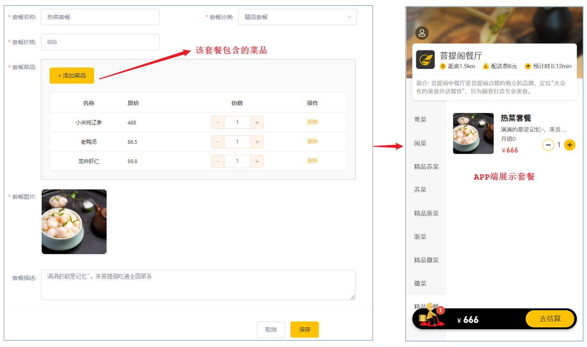 


### 1.2 数据模型

新增套餐，其实就是将新增页面录入的套餐信息插入到setmeal表，还需要向setmeal_dish表插入套餐和菜品关联数据。所以在新增套餐时，涉及到两个表：

| 表           | 说明           | 备注                                               |
| ------------ | -------------- | -------------------------------------------------- |
| setmeal      | 套餐表         | 存储套餐的基本信息                                 |
| setmeal_dish | 套餐菜品关系表 | 存储套餐关联的菜品的信息(一个套餐可以关联多个菜品) |


两张表具体的表结构如下: 

**1). 套餐表setmeal**

 

在该表中，套餐名称name字段是不允许重复的，在建表时，已经创建了唯一索引。

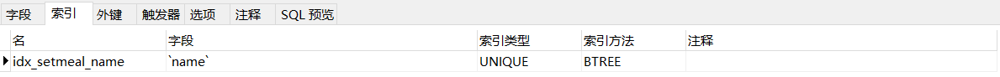 


**2). 套餐菜品关系表setmeal_dish**

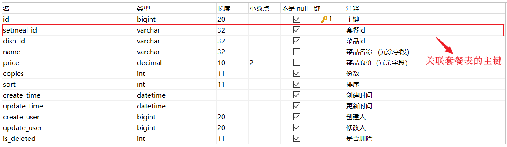 

在该表中，菜品的名称name,菜品的原价price 实际上都是冗余字段,因为我们在这张表中存储了菜品的ID(dish_id),根据该ID我们就可以查询出name,price的数据信息,而这里我们又存储了name,price,这样的话,我们在后续的查询展示操作中,就不需要再去查询数据库获取菜品名称和原价了,这样可以简化我们的操作。


### 1.3 准备工作

在开发业务功能前，先将需要用到的类和接口基本结构创建好，在做这一块儿的准备工作时，我们无需准备Setmeal的相关实体类、Mapper接口、Service接口及实现，因为之前在做分类管理的时候，我们已经引入了Setmeal的相关基础代码。 接下来，我们就来完成以下的几步准备工作： 


**1). 实体类 SetmealDish**

ps.直接从课程资料中导入即可，Setmeal实体前面课程中已经导入过了。

所属包： com.itheima.reggie.entity

```java
import com.baomidou.mybatisplus.annotation.FieldFill;
import com.baomidou.mybatisplus.annotation.TableField;
import lombok.Data;
import java.io.Serializable;
import java.math.BigDecimal;
import java.time.LocalDateTime;

/**
 * 套餐菜品关系
 */
@Data
public class SetmealDish implements Serializable {
    private static final long serialVersionUID = 1L;

    private Long id;

    //套餐id
    private Long setmealId;

    //菜品id
    private Long dishId;

    //菜品名称 （冗余字段）
    private String name;
    
    //菜品原价
    private BigDecimal price;
    
    //份数
    private Integer copies;

    //排序
    private Integer sort;

    @TableField(fill = FieldFill.INSERT)
    private LocalDateTime createTime;

    @TableField(fill = FieldFill.INSERT_UPDATE)
    private LocalDateTime updateTime;

    @TableField(fill = FieldFill.INSERT)
    private Long createUser;

    @TableField(fill = FieldFill.INSERT_UPDATE)
    private Long updateUser;

    //是否删除
    private Integer isDeleted;
}
```


**2). DTO SetmealDto**

该数据传输对象DTO,主要用于封装页面在新增套餐时传递过来的json格式的数据,其中包含套餐的基本信息,还包含套餐关联的菜品集合。直接从课程资料中导入即可。

所属包： com.itheima.reggie.dto

```java
import com.itheima.reggie.entity.Setmeal;
import com.itheima.reggie.entity.SetmealDish;
import lombok.Data;
import java.util.List;

@Data
public class SetmealDto extends Setmeal {

    private List<SetmealDish> setmealDishes;//套餐关联的菜品集合
	
    private String categoryName;//分类名称
}
```


**3). Mapper接口 SetmealDishMapper**

所属包: com.itheima.reggie.mapper

```java
import com.baomidou.mybatisplus.core.mapper.BaseMapper;
import com.itheima.reggie.entity.SetmealDish;
import org.apache.ibatis.annotations.Mapper;

@Mapper
public interface SetmealDishMapper extends BaseMapper<SetmealDish> {
}
```


**4). 业务层接口 SetmealDishService**

所属包： com.itheima.reggie.service

```java
import com.baomidou.mybatisplus.extension.service.IService;
import com.itheima.reggie.entity.SetmealDish;

public interface SetmealDishService extends IService<SetmealDish> {
}
```


**5). 业务层实现类 SetmealDishServiceImpl**

所属包： com.itheima.reggie.service.impl

```java
import com.baomidou.mybatisplus.extension.service.impl.ServiceImpl;
import com.itheima.reggie.entity.SetmealDish;
import com.itheima.reggie.mapper.SetmealDishMapper;
import com.itheima.reggie.service.SetmealDishService;
import lombok.extern.slf4j.Slf4j;
import org.springframework.stereotype.Service;

@Service
@Slf4j
public class SetmealDishServiceImpl extends ServiceImpl<SetmealDishMapper,SetmealDish> implements SetmealDishService {
}
```


**6). 控制层 SetmealController**

套餐管理的相关业务，我们都统一在 SetmealController 中进行统一处理操作。

所属包: com.itheima.reggie.service.impl

```java
import com.itheima.reggie.service.SetmealDishService;
import com.itheima.reggie.service.SetmealService;
import lombok.extern.slf4j.Slf4j;
import org.springframework.beans.factory.annotation.Autowired;
import org.springframework.web.bind.annotation.*;

/**
 * 套餐管理
 */
@RestController
@RequestMapping("/setmeal")
@Slf4j
public class SetmealController {
    @Autowired
    private SetmealService setmealService;
    @Autowired
    private SetmealDishService setmealDishService;
}    
```


### 1.4 前端页面分析

服务端的基础准备工作我们准备完毕之后，在进行代码开发之前，需要梳理一下新增套餐时前端页面和服务端的交互过程：

1). 点击新建套餐按钮，访问页面(backend/page/combo/add.html)，页面加载发送ajax请求，请求服务端获取**套餐分类**数据并展示到下拉框中(==已实现==)

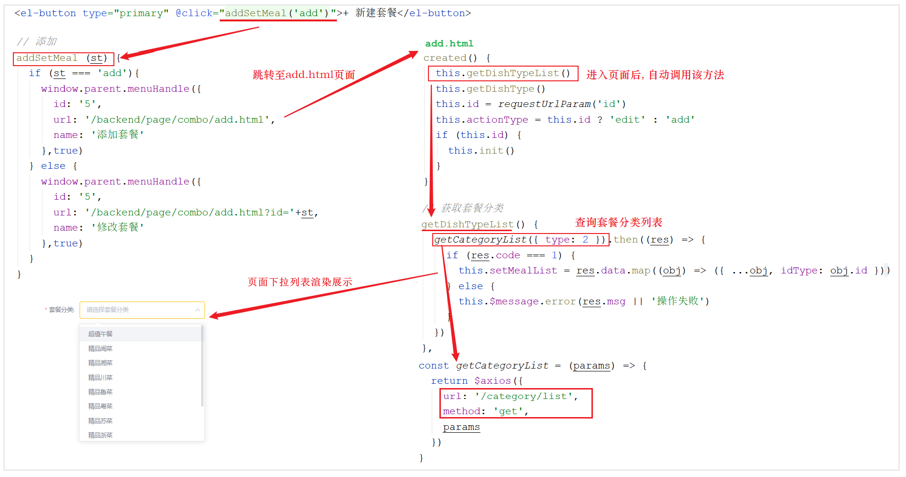 

获取套餐分类列表的功能我们不用开发，之前已经开发完成了，之前查询时type传递的是1，查询菜品分类; 本次查询时，传递的type为2，查询套餐分类列表。


2). 访问页面(backend/page/combo/add.html)，页面加载时发送ajax请求，请求服务端获取**菜品分类**数据并展示到添加菜品窗口中(==已实现==)

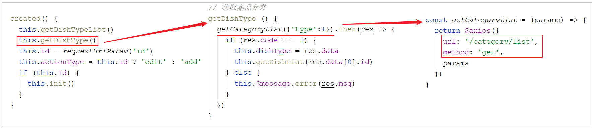 

本次查询分类列表，传递的type为1，表示需要查询的是菜品的分类。查询菜品分类的目的，是添加套餐关联的菜品时，我们需要根据菜品分类，来过滤查询菜品信息。查询菜品分类列表的代码已经实现， 具体展示效果如下： 

  


3). 当点击添加菜品窗口左侧菜单的某一个分类, 页面发送ajax请求，请求服务端，根据菜品分类查询对应的**菜品**数据并展示到添加菜品窗口中

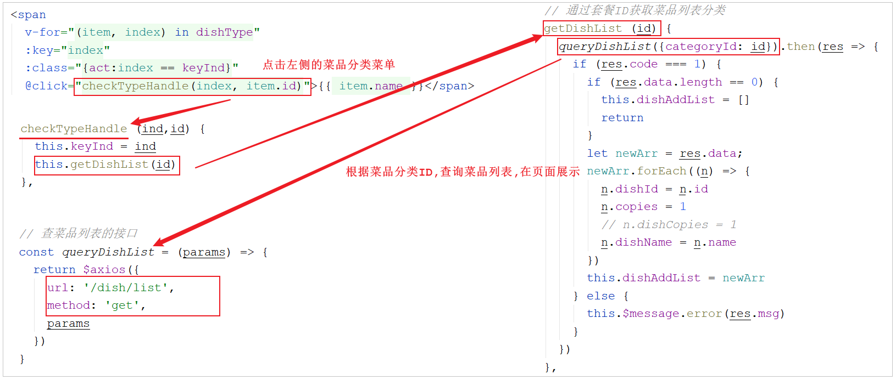 


4). 页面发送请求进行**图片上传**，请求服务端将图片保存到服务器(==已实现==)

5). 页面发送请求进行**图片下载**，将上传的图片进行回显(==已实现==)

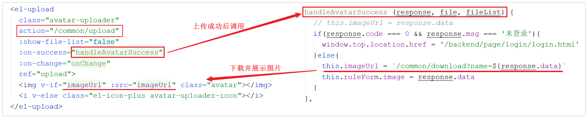 


6). 点击保存按钮，发送ajax请求，将**套餐**相关数据以json形式提交到服务端

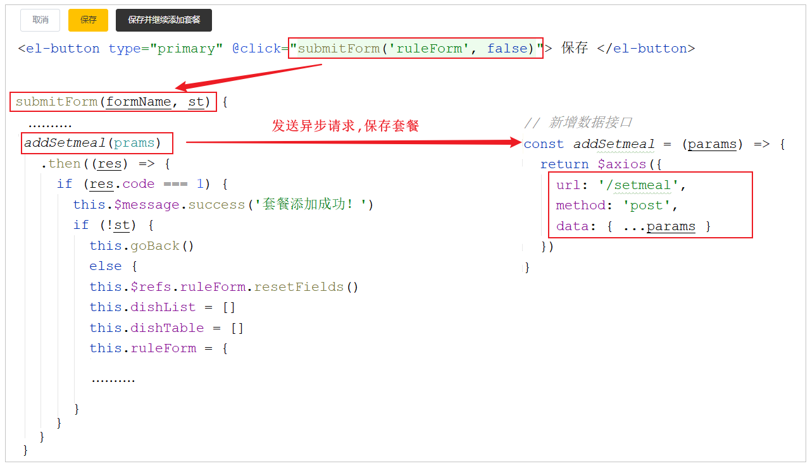 


经过上述的页面解析及流程分析，我们发送这里需要发送的请求有5个，分别是 ：

A. 根据传递的参数,查询套餐分类列表

B. 根据传递的参数,查询菜品分类列表

C. 图片上传

D. 图片下载展示

E. 根据菜品分类ID,查询菜品列表

F. 保存套餐信息


而对于以上的前4个功能我们都已经实现, 所以我们接下来需要开发的功能主要是最后两项, 具体的请求信息如下:

**1). 根据分类ID查询菜品列表**

| 请求     | 说明                            |
| -------- | ------------------------------- |
| 请求方式 | GET                             |
| 请求路径 | /dish/list                      |
| 请求参数 | ?categoryId=1397844263642378242 |


**2). 保存套餐信息**

| 请求     | 说明         |
| -------- | ------------ |
| 请求方式 | POST         |
| 请求路径 | /setmeal     |
| 请求参数 | json格式数据 |

传递的json格式数据如下: 

```json
{
    "name":"营养超值工作餐",
    "categoryId":"1399923597874081794",
    "price":3800,
    "code":"",
    "image":"9cd7a80a-da54-4f46-bf33-af3576514cec.jpg",
    "description":"营养超值工作餐",
    "dishList":[],
    "status":1,
    "idType":"1399923597874081794",
    "setmealDishes":[
    	{"copies":2,"dishId":"1423329009705463809","name":"米饭","price":200},
    	{"copies":1,"dishId":"1423328152549109762","name":"可乐","price":500},
    	{"copies":1,"dishId":"1397853890262118402","name":"鱼香肉丝","price":3800}
    ]
}
```


### 1.5 代码开发

上面我们已经分析了接下来我们需要实现的两个功能，接下来我们就需要根据上述的分析，来完成具体的功能实现。


#### 1.5.1 根据分类查询菜品

##### 1.5.1.1 功能实现

在当前的需求中，我们只需要根据页面传递的菜品分类的ID(categoryId)来查询菜品列表即可，我们可以直接定义一个DishController的方法，声明一个Long类型的categoryId，这样做是没问题的。但是考虑到该方法的拓展性，我们在这里定义方法时，通过Dish这个实体来接收参数。


在DishController中定义方法list，接收Dish类型的参数：

在查询时，需要根据菜品分类categoryId进行查询，并且还要限定菜品的状态为起售状态(status为1)，然后对查询的结果进行排序。

```java
/**
* 根据条件查询对应的菜品数据
* @param dish
* @return
*/
@GetMapping("/list")
public R<List<Dish>> list(Dish dish){
    //构造查询条件
    LambdaQueryWrapper<Dish> queryWrapper = new LambdaQueryWrapper<>();
    queryWrapper.eq(dish.getCategoryId() != null ,Dish::getCategoryId,dish.getCategoryId());
    //添加条件，查询状态为1（起售状态）的菜品
    queryWrapper.eq(Dish::getStatus,1);
    //添加排序条件
    queryWrapper.orderByAsc(Dish::getSort).orderByDesc(Dish::getUpdateTime);
	
    List<Dish> list = dishService.list(queryWrapper);
	
    return R.success(list);
}
```


##### 1.5.1.2 功能测试

代码编写完毕，我们重新启动服务器，进行测试，可以通过debug断点跟踪的形式查看页面传递的参数封装情况，及响应给页面的数据信息。

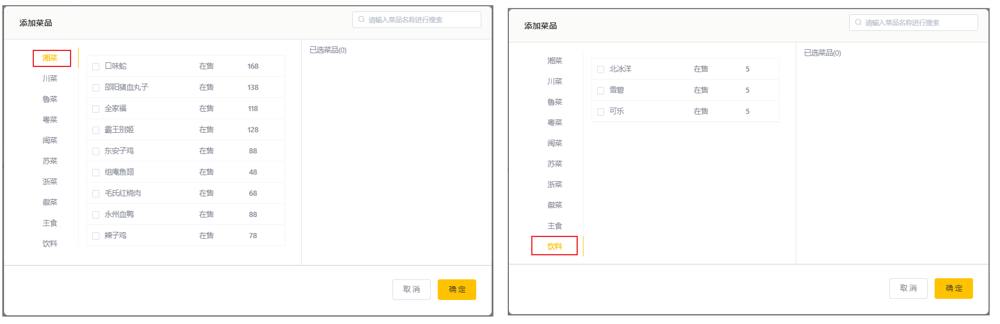 


#### 1.5.2 保存套餐

##### 1.5.2.1 功能实现

在进行套餐信息保存时，前端提交的数据，不仅包含套餐的基本信息，还包含套餐关联的菜品列表数据 setmealDishes。所以这个时候我们使用Setmeal就不能完成参数的封装了，我们需要在Setmeal的基本属性的基础上，再扩充一个属性 setmealDishes 来接收页面传递的套餐关联的菜品列表，而我们在准备工作中，导入进来的SetmealDto能够满足这个需求。


1). SetmealController中定义方法save，新增套餐

在该Controller的方法中,我们不仅需要保存套餐的基本信息，还需要保存套餐关联的菜品数据，所以我们需要再该方法中调用业务层方法,完成两块数据的保存。

页面传递的数据是json格式，需要在方法形参前面加上@RequestBody注解, 完成参数封装。

```java
@PostMapping
public R<String> save(@RequestBody SetmealDto setmealDto){
    log.info("套餐信息：{}",setmealDto);

    setmealService.saveWithDish(setmealDto);

    return R.success("新增套餐成功");
}
```


2). SetmealService中定义方法saveWithDish

```java
/**
 * 新增套餐，同时需要保存套餐和菜品的关联关系
 * @param setmealDto
 */
public void saveWithDish(SetmealDto setmealDto);
```


3). SetmealServiceImpl实现方法saveWithDish

具体逻辑: 

A. 保存套餐基本信息

B. 获取套餐关联的菜品集合，并为集合中的每一个元素赋值套餐ID(setmealId)

C. 批量保存套餐关联的菜品集合

代码实现: 

```java
/**
 * 新增套餐，同时需要保存套餐和菜品的关联关系
 * @param setmealDto
 */
@Transactional
public void saveWithDish(SetmealDto setmealDto) {
    //保存套餐的基本信息，操作setmeal，执行insert操作
    this.save(setmealDto);

    List<SetmealDish> setmealDishes = setmealDto.getSetmealDishes();
    setmealDishes.stream().map((item) -> {
        item.setSetmealId(setmealDto.getId());
        return item;
    }).collect(Collectors.toList());

    //保存套餐和菜品的关联信息，操作setmeal_dish,执行insert操作
    setmealDishService.saveBatch(setmealDishes);
}
```


##### 1.5.2.2 功能测试

代码编写完毕，我们重新启动服务器，进行测试，可以通过debug断点跟踪的形式查看页面传递的参数封装情况，及套餐相关数据的保存情况。

录入表单数据: 

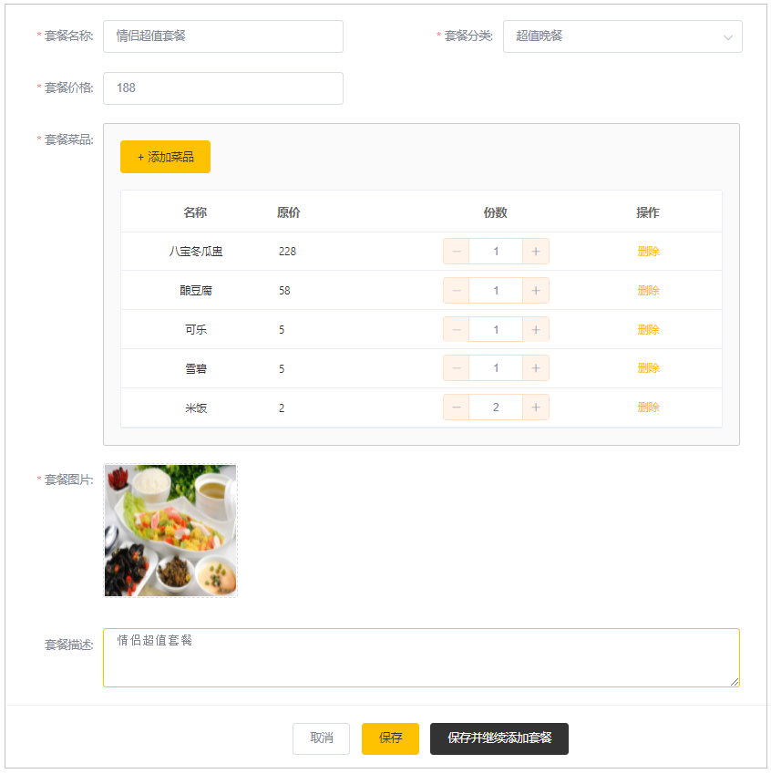 

debug跟踪数据封装:

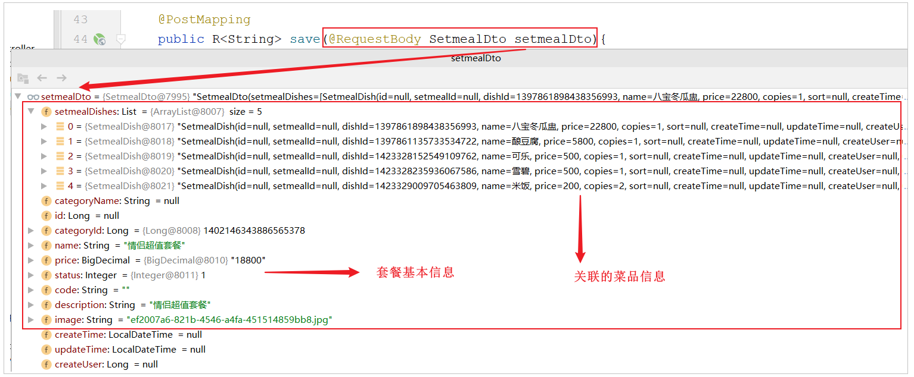 

跟踪数据库保存的数据:

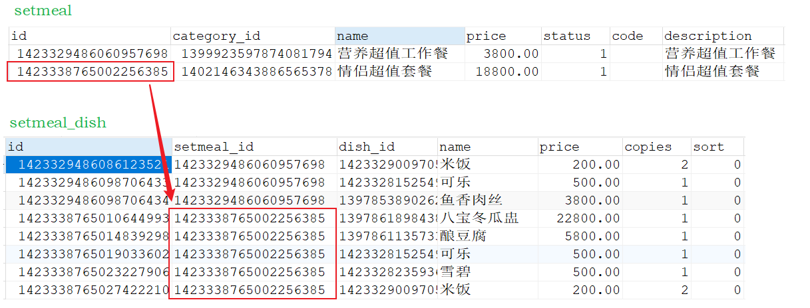 


## 2. 套餐分页查询

### 2.1 需求分析

系统中的套餐数据很多的时候，如果在一个页面中全部展示出来会显得比较乱，不便于查看，所以一般的系统中都会以分页的方式来展示列表数据。

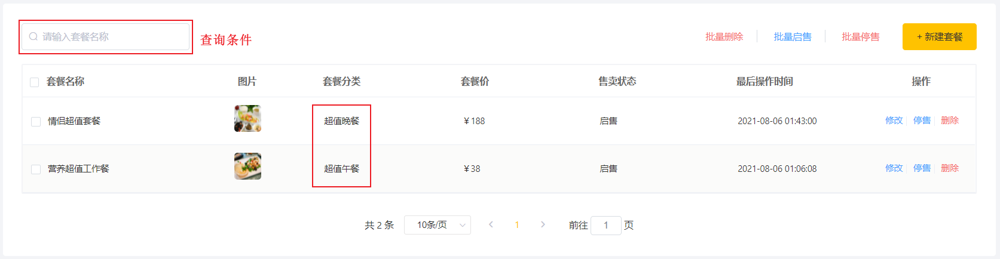 

在进行套餐数据的分页查询时，除了传递分页参数以外，还可以传递一个可选的条件(套餐名称)。查询返回的字段中，包含套餐的基本信息之外，还有一个套餐的分类名称，在查询时，需要关联查询这个字段。


### 2.2 前端页面分析

在开发代码之前，需要梳理一下套餐分页查询时前端页面和服务端的交互过程：

1). 访问页面(backend/page/combo/list.html)，页面加载时，会自动发送ajax请求，将分页查询参数(page、pageSize、name)提交到服务端，获取分页数据

 


2). 在列表渲染展示时，页面发送请求，请求服务端进行图片下载，用于页面图片展示(**已实现**)

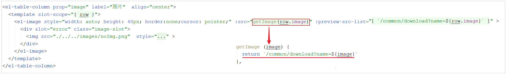 


而对于以上的流程中涉及到2个功能,文件下载功能我们已经实现,本小节我们主要实现列表分页查询功能, 具体的请求信息如下:

| 请求     | 说明                         |
| -------- | ---------------------------- |
| 请求方式 | GET                          |
| 请求路径 | /setmeal/page                |
| 请求参数 | ?page=1&pageSize=10&name=xxx |


### 2.3 代码开发

#### 2.3.1 基本信息查询

上述我们已经分析列表分页查询功能的请求信息，接下来我们就在SetmealController中创建套餐分页查询方法。

该方法的逻辑如下： 

1). 构建分页条件对象

2). 构建查询条件对象，如果传递了套餐名称，根据套餐名称模糊查询， 并对结果按修改时间降序排序

3). 执行分页查询

4). 组装数据并返回

代码实现 : 

```java
/**
  * 套餐分页查询
  * @param page
  * @param pageSize
  * @param name
  * @return
  */
@GetMapping("/page")
public R<Page> page(int page,int pageSize,String name){
    //分页构造器对象
    Page<Setmeal> pageInfo = new Page<>(page,pageSize);
	
    LambdaQueryWrapper<Setmeal> queryWrapper = new LambdaQueryWrapper<>();
    //添加查询条件，根据name进行like模糊查询
    queryWrapper.like(name != null,Setmeal::getName,name);
    //添加排序条件，根据更新时间降序排列
    queryWrapper.orderByDesc(Setmeal::getUpdateTime);

    setmealService.page(pageInfo,queryWrapper);
    return R.success(pageInfo);
}
```


#### 2.3.2 问题分析

基本分页查询代码编写完毕后，重启服务，测试列表查询，我们发现, 列表页面的数据可以展示出来, 但是套餐分类名称没有展示出来。

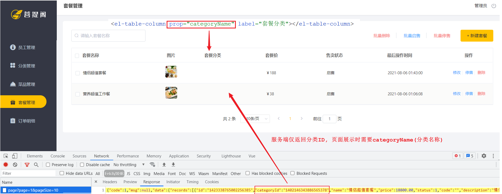 

这是因为在服务端仅返回分类ID(categoryId), 而页面展示需要的是categoryName属性。 


#### 2.3.3 功能完善

在查询套餐信息时, 只包含套餐的基本信息, 并不包含套餐的分类名称, 所以在这里查询到套餐的基本信息后, 还需要根据分类ID(categoryId), 查询套餐分类名称(categoryName)，并最终将套餐的基本信息及分类名称信息封装到SetmealDto(在第一小节已经导入)中。

```java
@Data
public class SetmealDto extends Setmeal {
    private List<SetmealDish> setmealDishes; //套餐关联菜品列表
    private String categoryName;//套餐分类名称
}
```


完善后代码: 

```java
/**
* 套餐分页查询
* @param page
* @param pageSize
* @param name
* @return
*/
@GetMapping("/page")
public R<Page> page(int page,int pageSize,String name){
    //分页构造器对象
    Page<Setmeal> pageInfo = new Page<>(page,pageSize);
    Page<SetmealDto> dtoPage = new Page<>();

    LambdaQueryWrapper<Setmeal> queryWrapper = new LambdaQueryWrapper<>();
    //添加查询条件，根据name进行like模糊查询
    queryWrapper.like(name != null,Setmeal::getName,name);
    //添加排序条件，根据更新时间降序排列
    queryWrapper.orderByDesc(Setmeal::getUpdateTime);

    setmealService.page(pageInfo,queryWrapper);

    //对象拷贝
    BeanUtils.copyProperties(pageInfo,dtoPage,"records");
    List<Setmeal> records = pageInfo.getRecords();

    List<SetmealDto> list = records.stream().map((item) -> {
        SetmealDto setmealDto = new SetmealDto();
        //对象拷贝
        BeanUtils.copyProperties(item,setmealDto);
        //分类id
        Long categoryId = item.getCategoryId();
        //根据分类id查询分类对象
        Category category = categoryService.getById(categoryId);
        if(category != null){
            //分类名称
            String categoryName = category.getName();
            setmealDto.setCategoryName(categoryName);
        }
        return setmealDto;
    }).collect(Collectors.toList());

    dtoPage.setRecords(list);
    return R.success(dtoPage);
}
```


### 2.4 功能测试

代码完善后，重启服务，测试列表查询，我们发现, 抓取浏览器的请求响应数据，我们可以获取到套餐分类名称categoryName，也可以在列表页面展示出来 。

 


## 3. 删除套餐

### 3.1 需求分析

在套餐管理列表页面,点击删除按钮，可以删除对应的套餐信息。也可以通过复选框选择多个套餐，点击批量删除按钮一次删除多个套餐。注意，对于状态为售卖中的套餐不能删除，需要先停售，然后才能删除。

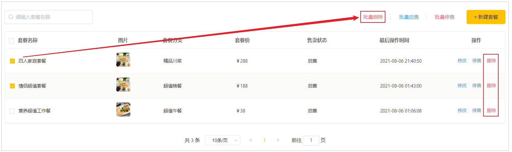 


### 3.2 前端页面分析

在开发代码之前，需要梳理一下删除套餐时前端页面和服务端的交互过程：

1). 点击删除, 删除单个套餐时，页面发送ajax请求，根据套餐id删除对应套餐

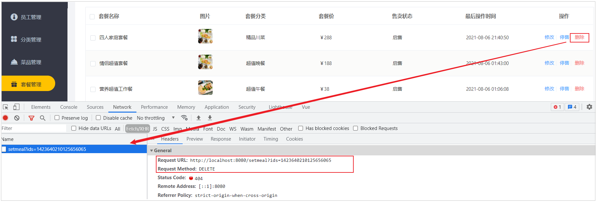 


2). 删除多个套餐时，页面发送ajax请求，根据提交的多个套餐id删除对应套餐

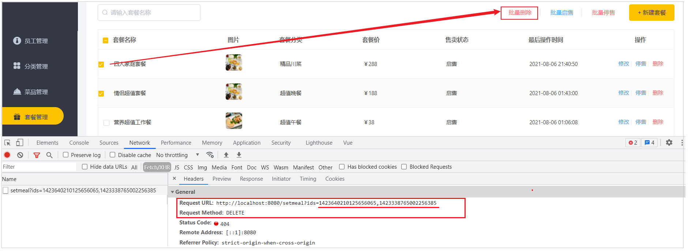 


开发删除套餐功能，其实就是在服务端编写代码去处理前端页面发送的这2次请求即可，一次请求为根据ID删除，一次请求为根据ID批量删除。

观察删除单个套餐和批量删除套餐的请求信息可以发现，两种请求的**地址**和**请求方式**都是相同的，不同的则是传递的id个数，所以在服务端可以提供一个方法来统一处理。

具体的请求信息如下： 

| 请求     | 说明                                         |
| -------- | -------------------------------------------- |
| 请求方式 | DELETE                                       |
| 请求路径 | /setmeal                                     |
| 请求参数 | ?ids=1423640210125656065,1423338765002256385 |


### 3.3 代码开发

删除套餐的流程及请求信息，我们分析完毕之后，就来完成服务端的逻辑开发。在服务端的逻辑中, 删除套餐时, 我们不仅要删除套餐, 还要删除套餐与菜品的关联关系。


**1). 在SetmealController中创建delete方法**

我们可以先测试在delete方法中接收页面提交的参数，具体逻辑后续再完善：

```java
/**
 * 删除套餐
 * @param ids
 * @return
 */
@DeleteMapping
public R<String> delete(@RequestParam List<Long> ids){
    log.info("ids:{}",ids);
    return R.success("套餐数据删除成功");
}
```

编写完代码，我们重启服务之后，访问套餐列表页面，勾选复选框，然后点击"批量删除",我们可以看到服务端可以接收到集合参数ids，并且在控制台也可以输出对应的数据 。

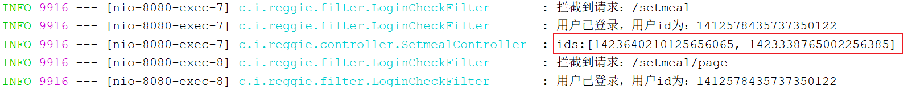 


**2). SetmealService接口定义方法removeWithDish**

```java
/**
 * 删除套餐，同时需要删除套餐和菜品的关联数据
 * @param ids
 */
public void removeWithDish(List<Long> ids);
```


**3). SetmealServiceImpl中实现方法removeWithDish**

该业务层方法具体的逻辑为: 

A. 查询该批次套餐中是否存在售卖中的套餐, 如果存在, 不允许删除

B. 删除套餐数据

C. 删除套餐关联的菜品数据

代码实现为:

```java
/**
* 删除套餐，同时需要删除套餐和菜品的关联数据
* @param ids
*/
@Transactional
public void removeWithDish(List<Long> ids) {
    //select count(*) from setmeal where id in (1,2,3) and status = 1
    //查询套餐状态，确定是否可用删除
    LambdaQueryWrapper<Setmeal> queryWrapper = new LambdaQueryWrapper();
    queryWrapper.in(Setmeal::getId,ids);
    queryWrapper.eq(Setmeal::getStatus,1);

    int count = this.count(queryWrapper);
    if(count > 0){
   	 	//如果不能删除，抛出一个业务异常
    	throw new CustomException("套餐正在售卖中，不能删除");
    }

    //如果可以删除，先删除套餐表中的数据---setmeal
    this.removeByIds(ids);

    //delete from setmeal_dish where setmeal_id in (1,2,3)
    LambdaQueryWrapper<SetmealDish> lambdaQueryWrapper = new LambdaQueryWrapper<>();
    lambdaQueryWrapper.in(SetmealDish::getSetmealId,ids);
    //删除关系表中的数据----setmeal_dish
    setmealDishService.remove(lambdaQueryWrapper);
}
```


由于当前的业务方法中存在多次数据库操作，为了保证事务的完整性，需要在方法上加注解 @Transactional 来控制事务。


**4). 完善SetmealController代码**

```java
/**
 * 删除套餐
 * @param ids
 * @return
 */
@DeleteMapping
public R<String> delete(@RequestParam List<Long> ids){
    log.info("ids:{}",ids);
    setmealService.removeWithDish(ids);
    return R.success("套餐数据删除成功");
}
```


### 3.4 功能测试

代码完善后，重启服务，测试套餐的删除功能，主要测试以下几种情况。

1). 删除正在启用的套餐

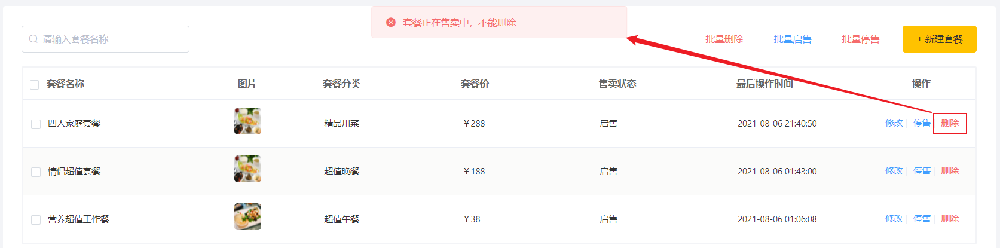 


2). 执行批量操作, 删除两条记录, 一个启售的, 一个停售的

由于当前我们并未实现启售/停售功能，所以我们需要手动修改数据库表结构的status状态，将其中的一条记录status修改为0。

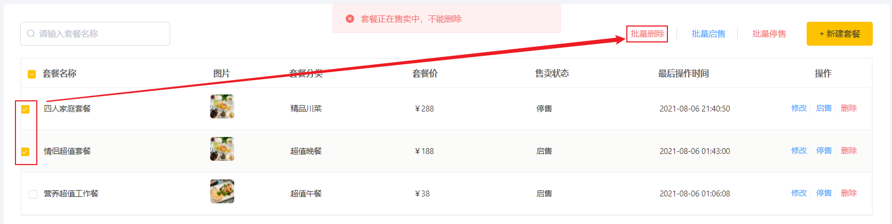 


3). 删除已经停售的套餐信息，执行删除之后， 检查数据库表结构 setmeal ， setmeal_dish表中的数据

 


## 4. 短信发送

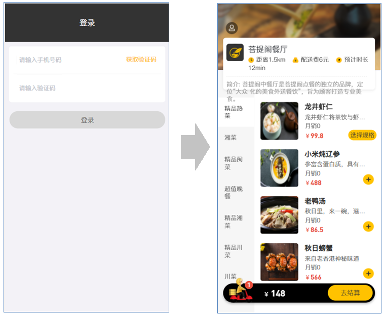 

在我们接下来要实现的移动端的业务开发中，第一块儿我们需要开发的功能就是移动端的登录功能，而移动端的登录功能，比较流行的方式就是基于短信验证码进行登录，那么这里涉及到了短信发送的知识，所以本章节，我们就来讲解，在项目开发中，我们如何发送短信。


### 4.1 短信服务介绍

在项目中，如果我们要实现短信发送功能，我们无需自己实现，也无需和运营商直接对接，只需要调用第三方提供的短信服务即可。目前市面上有很多第三方提供的短信服务，这些第三方短信服务会和各个运营商（移动、联通、电信）对接，我们只需要注册成为会员，并且按照提供的开发文档进行调用就可以发送短信。需要说明的是，这些短信服务一般都是收费服务。

常用短信服务：

- 阿里云

- 华为云

- 腾讯云

- 京东

- 梦网

- 乐信

本项目在选择短信服务的第三方服务提供商时，选择的是阿里云短信服务。


### 4.2 阿里云短信服务介绍

阿里云短信服务（Short Message Service）是广大企业客户快速触达手机用户所优选使用的通信能力。调用API或用群发助手，即可发送验证码、通知类和营销类短信；国内验证短信秒级触达，到达率最高可达99%；国际/港澳台短信覆盖200多个国家和地区，安全稳定，广受出海企业选用。

应用场景： 

| 场景     | 案例                                                         |
| -------- | ------------------------------------------------------------ |
| 验证码   | APP、网站注册账号，向手机下发验证码； 登录账户、异地登录时的安全提醒； 找回密码时的安全验证； 支付认证、身份校验、手机绑定等。 |
| 短信通知 | 向注册用户下发系统相关信息，包括： 升级或维护、服务开通、价格调整、 订单确认、物流动态、消费确认、 支付通知等普通通知短信。 |
| 推广短信 | 向注册用户和潜在客户发送通知和推广信息，包括促销活动通知、业务推广等商品与活动的推广信息。增加企业产品曝光率、提高产品的知名度。 |

 

 

阿里云短信服务官方网站： https://www.aliyun.com/product/sms?spm=5176.19720258.J_8058803260.52.5c432c4a11Dcwf

可以访问官网，熟悉一下短信服务： 

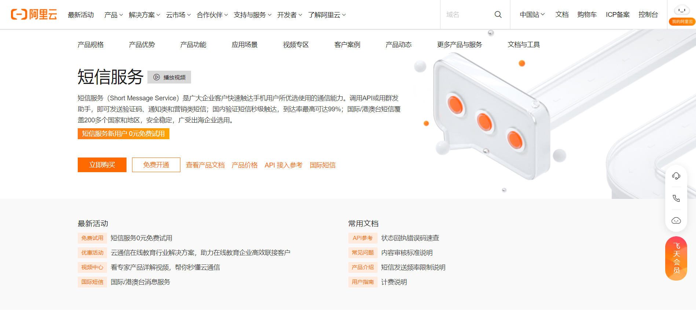  


### 4.3 阿里云短信服务准备

#### 4.3.1 注册账号

阿里云官网：https://www.aliyun.com/

 

点击官网首页注册按钮，跳转到如下注册页面：

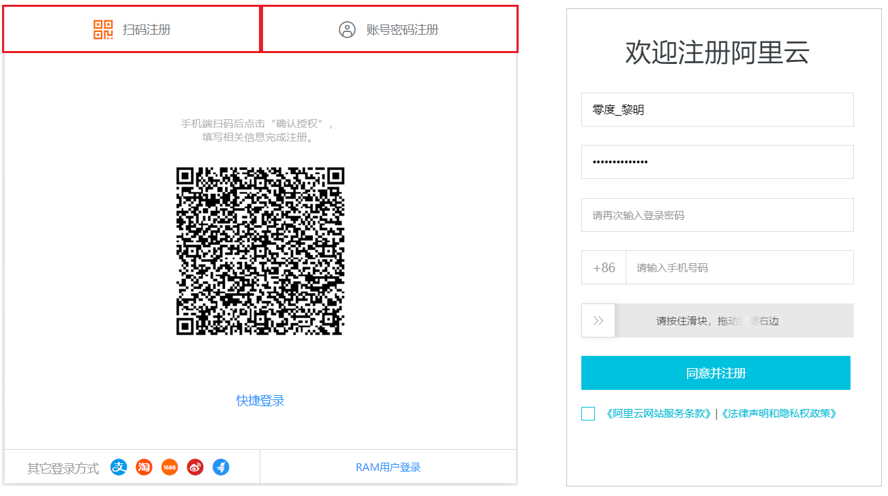 


当我们把账号注册完毕之后，我们就可以登录到阿里云系统控制台。


#### 4.3.2 开通短信服务

注册成功后，点击登录按钮进行登录。登录后进入控制台, 在左上角的菜单栏中搜索短信服务。第一次使用，需要点击，并开通短信服务。

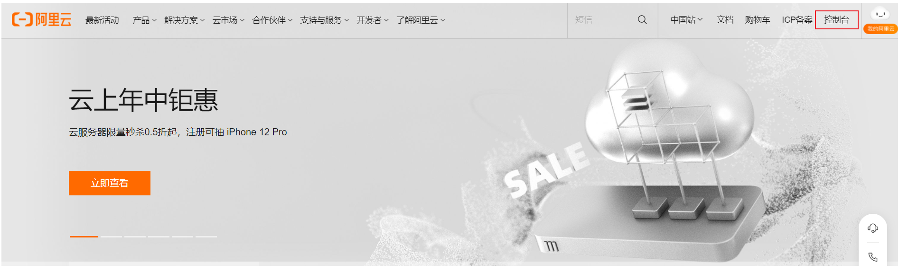 

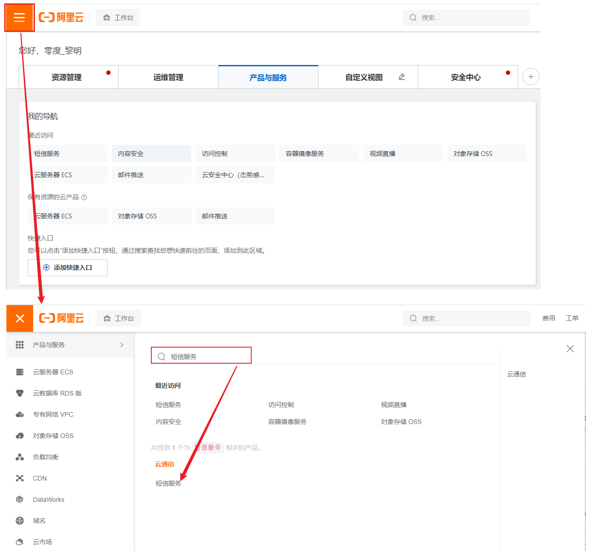 


#### 4.3.3 设置短信签名

开通短信服务之后，进入短信服务管理页面，选择国内消息菜单，我们需要在这里添加短信签名。

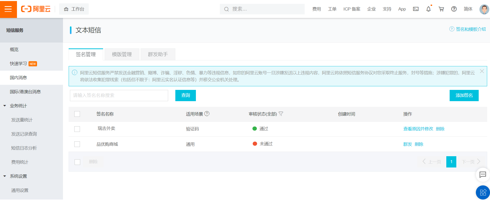 


**那么什么是短信签名呢?**

短信签名是短信发送者的署名，表示发送方的身份。我们要调用阿里云短信服务发送短信，签名是比不可少的部分。

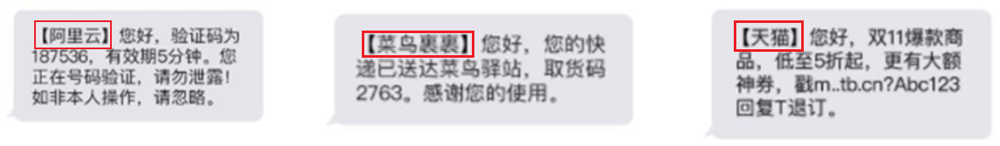 


那么接下来，我们就需要来添加短信签名。

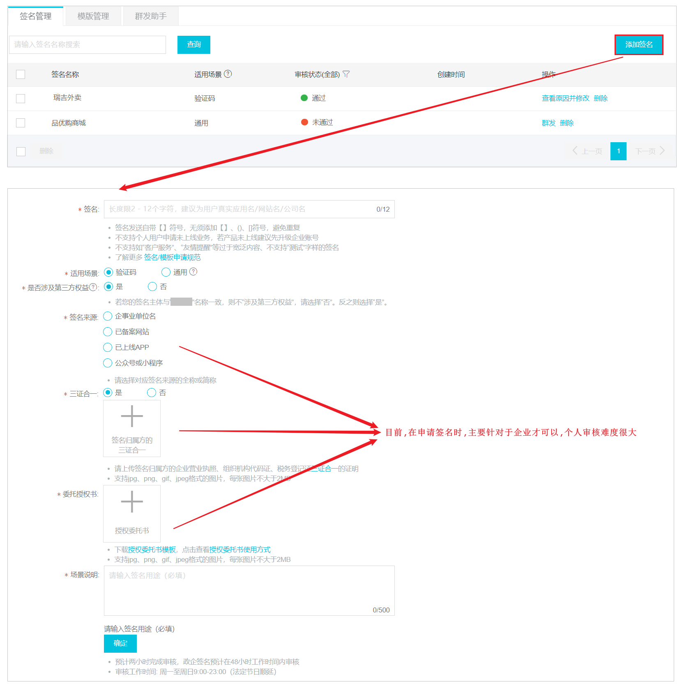 

> <font color='red'>注意：</font> 
>
> ​	<font color='red'>目前，阿里云短信服务申请签名主要针对企业开发，个人申请时有一定难度的，在审核时，会审核资质，需要上传营业执照 ；</font> 
>
> ​	<font color='red'>所以，我们课程中，主要是演示一下短信验证码如何发送，大家只需要学习这块儿的开发流程、实现方式即可，无需真正的发送短信。如果以后在企业中做项目，需要发送短信，我们会以公司的资质去申请对应的签名。</font> 


#### 4.3.4 设置短信模板

切换到【模板管理】标签页：

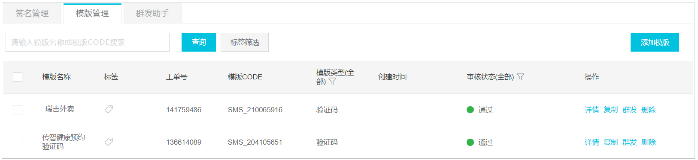 


**那么什么是模板呢?**

短信模板包含短信发送内容、场景、变量信息。模板的详情如下:

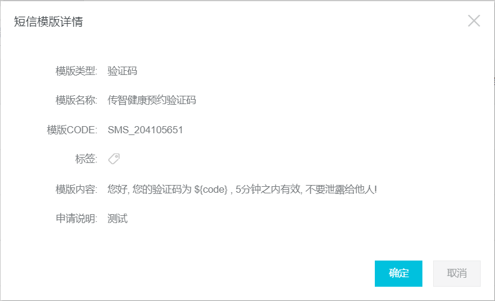 

最终我们，给用户发送的短信中，具体的短信内容，就是上面配置的这个模板内容，将${code}占位符替换成对应的验证码数据即可。如下:

```
【xxxxx】您好,您的验证码为173822,5分钟之内有效,不要泄露给他人!
```


我们可以点击右上角的按钮,添加模板,然后填写模板的基本信息及设置的模板内容:

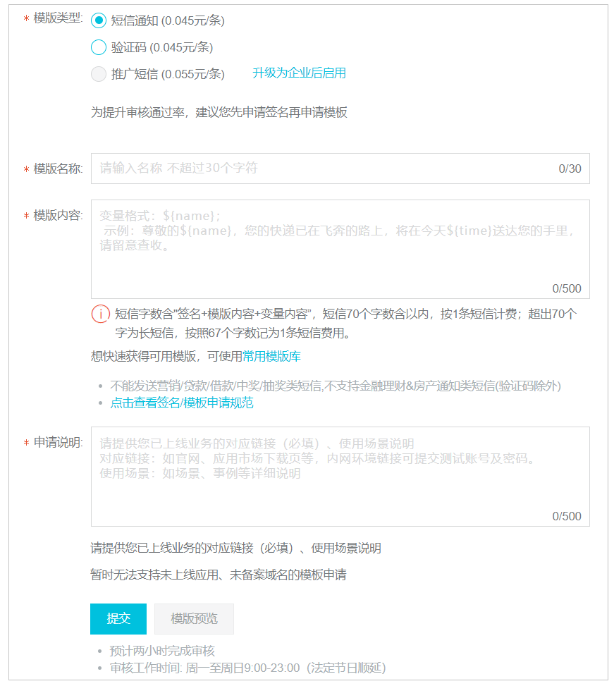 

<font color='red'>添加的短信模板，也是需要进行审核的只有审核通过，才可以正常使用。</font>


#### 4.3.5 设置AccessKey

AccessKey 是访问阿里云 API 的密钥，具有账户的完全权限，我们要想在后面通过API调用阿里云短信服务的接口发送短信，那么就必须要设置AccessKey。

我们点击右上角的用户头像，选择"AccessKey管理"，这时就可以进入到AccessKey的管理界面。

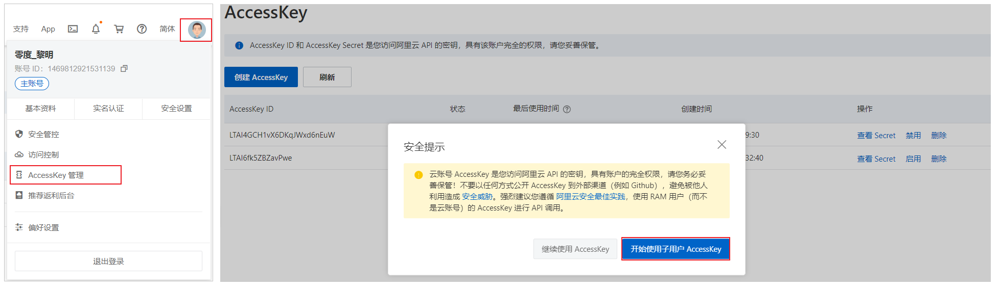

进入到AccessKey的管理界面之后，提示两个选项 "继续使用AccessKey" 和 "开始使用子用户AccessKey"，两个区别如下:

**1). 继续使用AccessKey**

如果选择的是该选项，我们创建的是阿里云账号的AccessKey，是具有账户的完全权限，有了这个AccessKey以后，我们就可以通过API调用阿里云的服务，不仅是短信服务，其他服务(OSS，语音服务，内容安全服务，视频点播服务...等)也可以调用。 相对来说，并不安全，当前的AccessKey泄露，会影响到我当前账户的其他云服务。

 

**2). 开始使用子用户AccessKey**

可以创建一个子用户,这个子用户我们可以分配比较低的权限,比如仅分配短信发送的权限，不具备操作其他的服务的权限，即使这个AccessKey泄漏了,也不会影响其他的云服务, 相对安全。


接下来就来演示一下，如何创建子用户AccessKey。

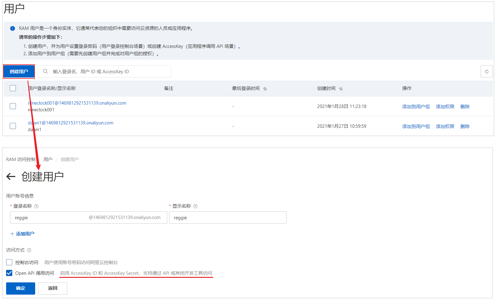 


#### 4.3.6 配置权限

上述我们已经创建了子用户, 但是这个子用户,目前没有任何权限,接下来,我们需要为创建的这个用户来分配权限。

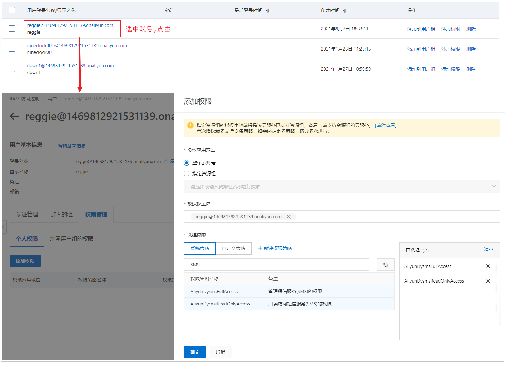 

<font color='red'>经过上述的权限配置之后，那么新创建的这个 reggie 用户，仅有短信服务操作的权限，不具备别的权限，即使当前的AccessKey泄漏了，也只会影响短信服务，其他服务是不受影响的。</font>


#### 4.3.7 禁用/删除AccessKey

如果在使用的过程中 AccessKey 不小心泄漏了,我们可以在阿里云控制台中, 禁用或者删除该AccessKey。

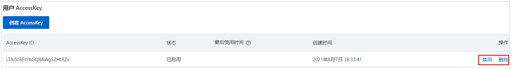 

然后再创建一个新的AccessKey, 保存好AccessKeyId和AccessKeySecret。

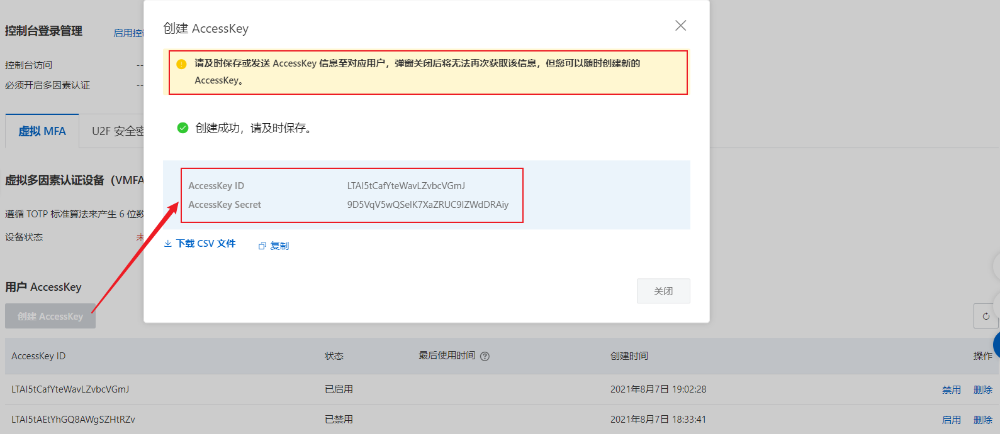 

==注意： 创建好了AccessKey后，请及时保存AccessKeyId 和 AccessKeySecret ，弹窗关闭后将无法再次获取该信息，但您可以随时创建新的 AccessKey。==


### 4.4 代码开发

使用阿里云短信服务发送短信，可以参照官方提供的文档即可。

官方文档: https://help.aliyun.com/product/44282.html?spm=5176.12212571.help.dexternal.57a91cbewHHjKq

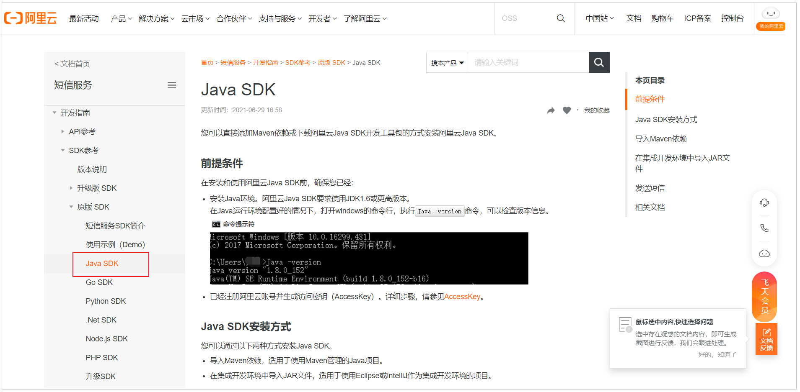 

我们根据官方文档的提示，引入对应的依赖，然后再引入对应的java代码，就可以发送消息了。

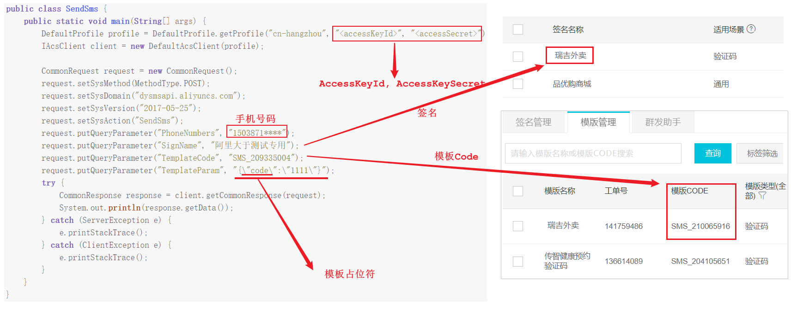 

> SDK : SDK 就是 Software Development Kit 的缩写，翻译过来——软件开发工具包，辅助开发某一类软件的相关文档、范例和工具的集合都可以叫做SDK。在我们与第三方接口相互时， 一般都会提供对应的SDK，来简化我们的开发。


**具体实现：**

1). pom.xml

```xml
<dependency>
    <groupId>com.aliyun</groupId>
    <artifactId>aliyun-java-sdk-core</artifactId>
    <version>4.5.16</version>
</dependency>
<dependency>
    <groupId>com.aliyun</groupId>
    <artifactId>aliyun-java-sdk-dysmsapi</artifactId>
    <version>2.1.0</version>
</dependency>
```


2). 将官方提供的main方法封装为一个工具类

```java
import com.aliyuncs.DefaultAcsClient;
import com.aliyuncs.IAcsClient;
import com.aliyuncs.dysmsapi.model.v20170525.SendSmsRequest;
import com.aliyuncs.dysmsapi.model.v20170525.SendSmsResponse;
import com.aliyuncs.exceptions.ClientException;
import com.aliyuncs.profile.DefaultProfile;

/**
 * 短信发送工具类
 */
public class SMSUtils {
   /**
    * 发送短信
    * @param signName 签名
    * @param templateCode 模板
    * @param phoneNumbers 手机号
    * @param param 参数
    */
   public static void sendMessage(String signName, String templateCode,String phoneNumbers,String param){
      DefaultProfile profile = DefaultProfile.getProfile("cn-hangzhou", "xxxxxxxxxxxxxxxx", "xxxxxxxxxxxxxx");
      IAcsClient client = new DefaultAcsClient(profile);

      SendSmsRequest request = new SendSmsRequest();
      request.setSysRegionId("cn-hangzhou");
      request.setPhoneNumbers(phoneNumbers);
      request.setSignName(signName);
      request.setTemplateCode(templateCode);
      request.setTemplateParam("{\"code\":\""+param+"\"}");
      try {
         SendSmsResponse response = client.getAcsResponse(request);
         System.out.println("短信发送成功");
      }catch (ClientException e) {
         e.printStackTrace();
      }
   }

}
```

> 备注 : 由于我们个人目前无法申请阿里云短信服务，所以这里我们只需要把流程跑通，具体的短信发送可以实现。


## 5. 手机验证码登录

### 5.1 需求分析

为了方便用户登录，移动端通常都会提供通过手机验证码登录的功能。手机验证码登录有如下优点：

1). 方便快捷，无需注册，直接登录

2). 使用短信验证码作为登录凭证，无需记忆密码

3). 安全

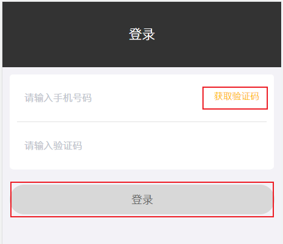  


**登录流程：**

输入手机号 > 获取验证码 > 输入验证码 > 点击登录 > 登录成功

> 注意：通过手机验证码登录，手机号是区分不同用户的标识。


### 5.2 数据模型

通过手机验证码登录时，涉及的表为user表，即用户表。结构如下:

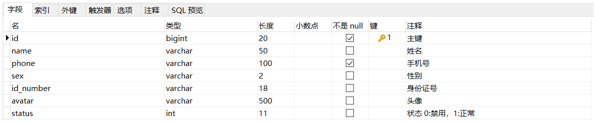 


### 5.3 前端页面分析

在开发代码之前，需要梳理一下登录时前端页面和服务端的交互过程：

1). 在登录页面(front/page/login.html)输入手机号，点击【获取验证码】按钮，页面发送ajax请求，在服务端调用短信服务API给指定手机号发送验证码短信。

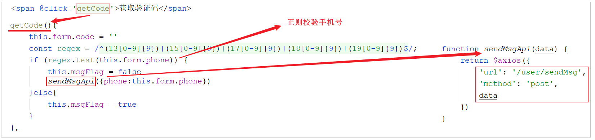 


2). 在登录页面输入验证码，点击【登录】按钮，发送ajax请求，在服务端处理登录请求。

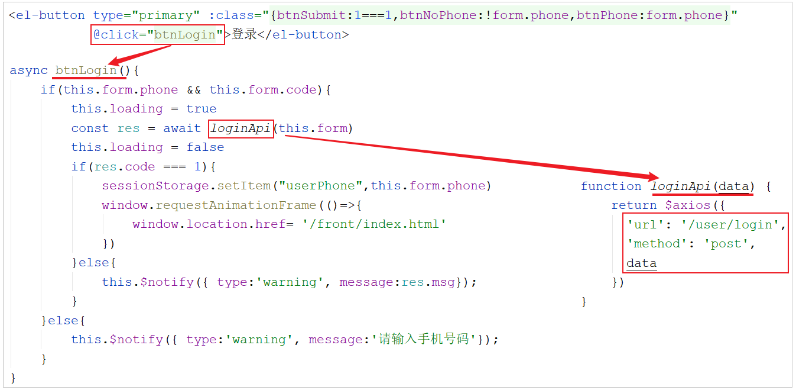 

如果服务端返回的登录成功，页面将会把当前登录用户的手机号存储在sessionStorage中，并跳转到移动的首页页面。


开发手机验证码登录功能，其实就是在服务端编写代码去处理前端页面发送的这2次请求即可，分别是获取短信验证码 和 登录请求，具体的请求信息如下： 

1). 获取短信验证码

| 请求     | 说明                    |
| -------- | ----------------------- |
| 请求方式 | POST                    |
| 请求路径 | /user/sendMsg           |
| 请求参数 | {"phone":"13100001111"} |


2). 登录

| 请求     | 说明                                   |
| -------- | -------------------------------------- |
| 请求方式 | POST                                   |
| 请求路径 | /user/login                            |
| 请求参数 | {"phone":"13100001111", "code":"1111"} |


### 5.4 代码开发

#### 5.4.1 准备工作

在开发业务功能前，先将需要用到的类和接口基本结构创建好：

1). 实体类 User（直接从课程资料中导入即可）

所属包: com.itheima.reggie.entity

```java
import lombok.Data;
import java.io.Serializable;
/**
 * 用户信息
 */
@Data
public class User implements Serializable {
    private static final long serialVersionUID = 1L;

    private Long id;

    //姓名
    private String name;

    //手机号
    private String phone;

    //性别 0 女 1 男
    private String sex;

    //身份证号
    private String idNumber;

    //头像
    private String avatar;

    //状态 0:禁用，1:正常
    private Integer status;
}
```


2). Mapper接口 UserMapper

所属包: com.itheima.reggie.mapper

```java
import com.baomidou.mybatisplus.core.mapper.BaseMapper;
import com.itheima.reggie.entity.User;
import org.apache.ibatis.annotations.Mapper;

@Mapper
public interface UserMapper extends BaseMapper<User>{
}
```


3). 业务层接口 UserService

所属包: com.itheima.reggie.service

```java
import com.baomidou.mybatisplus.extension.service.IService;
import com.itheima.reggie.entity.User;

public interface UserService extends IService<User> {
}
```


4). 业务层实现类 UserServiceImpl

所属包: com.itheima.reggie.service.impl

```java
import com.baomidou.mybatisplus.extension.service.impl.ServiceImpl;
import com.itheima.reggie.entity.User;
import com.itheima.reggie.mapper.UserMapper;
import com.itheima.reggie.service.UserService;
import org.springframework.stereotype.Service;

@Service
public class UserServiceImpl extends ServiceImpl<UserMapper,User> implements UserService{
}
```


5). 控制层 UserController

所属包: com.itheima.reggie.controller

```java
import com.itheima.reggie.service.UserService;
import lombok.extern.slf4j.Slf4j;
import org.springframework.beans.factory.annotation.Autowired;
import org.springframework.web.bind.annotation.RequestMapping;
import org.springframework.web.bind.annotation.RestController;

@RestController
@RequestMapping("/user")
@Slf4j
public class UserController {
    @Autowired
    private UserService userService;
}
```


6). 工具类SMSUtils、ValidateCodeUtils（直接从课程资料中导入即可）

所属包: com.itheima.reggie.utils

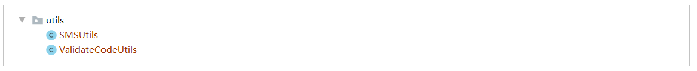 

SMSUtils : 是我们上面改造的阿里云短信发送的工具类 ;

ValidateCodeUtils : 是验证码生成的工具类 ;


#### 5.4.2 功能实现

##### 5.4.2.1 修改LoginCheckFilter

前面我们已经完成了LoginCheckFilter过滤器的开发，此过滤器用于检查用户的登录状态。我们在进行手机验证码登录时，发送的两个请求(获取验证码和登录)需要在此过滤器处理时直接放行。

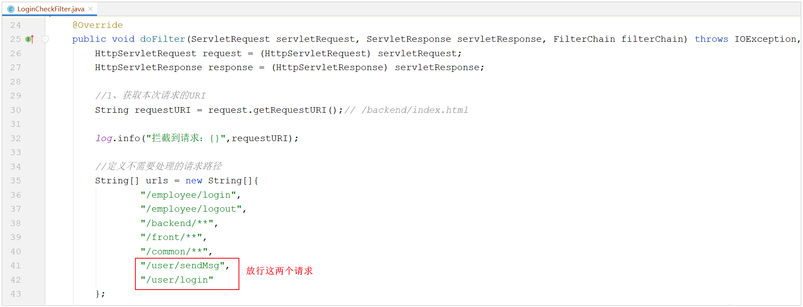 


对于移动的端的页面，也是用户登录之后，才可以访问的，那么这个时候就需要在 LoginCheckFilter 中进行判定，如果移动端用户已登录，我们获取到用户登录信息，存入ThreadLocal中(在后续的业务处理中，如果需要获取当前登录用户ID，直接从ThreadLocal中获取)，然后放行。

增加如下逻辑: 

```java
//4-2、判断登录状态，如果已登录，则直接放行
if(request.getSession().getAttribute("user") != null){
    log.info("用户已登录，用户id为：{}",request.getSession().getAttribute("user"));

    Long userId = (Long) request.getSession().getAttribute("user");
    BaseContext.setCurrentId(userId);

    filterChain.doFilter(request,response);
    return;
}
```


##### 5.4.2.2 发送短信验证码

在UserController中创建方法，处理登录页面的请求，为指定手机号发送短信验证码，同时需要将手机号对应的验证码保存到Session，方便后续登录时进行比对。

```java
/**
 * 发送手机短信验证码
 * @param user
 * @return
 */
@PostMapping("/sendMsg")
public R<String> sendMsg(@RequestBody User user, HttpSession session){
    //获取手机号
    String phone = user.getPhone();
    if(StringUtils.isNotEmpty(phone)){
        //生成随机的4位验证码
        String code = ValidateCodeUtils.generateValidateCode(4).toString();
        log.info("code={}",code);
			
        //调用阿里云提供的短信服务API完成发送短信
        //SMSUtils.sendMessage("瑞吉外卖","",phone,code);
		
        //需要将生成的验证码保存到Session
        session.setAttribute(phone,code);
        return R.success("手机验证码短信发送成功");
    }
    return R.error("短信发送失败");
}
```

> <font color='red'>备注: </font>
>
> ​	<font color='red'>这里发送短信我们只需要调用封装的工具类中的方法即可，我们这个功能流程跑通，在测试中我们不用真正的发送短信，只需要将验证码信息，通过日志输出，登录时，我们直接从控制台就可以看到生成的验证码(实际上也就是发送到我们手机上的验证码)</font>


##### 5.4.2.3 验证码登录

在UserController中增加登录的方法 login，该方法的具体逻辑为： 

1). 获取前端传递的手机号和验证码

2). 从Session中获取到手机号对应的正确的验证码

3). 进行验证码的比对 , 如果比对失败, 直接返回错误信息

4). 如果比对成功, 需要根据手机号查询当前用户, 如果用户不存在, 则自动注册一个新用户

5). 将登录用户的ID存储Session中


具体代码实现: 

```java
/**
 * 移动端用户登录
 * @param map
 * @param session
 * @return
 */
@PostMapping("/login")
public R<User> login(@RequestBody Map map, HttpSession session){
    log.info(map.toString());
    //获取手机号
    String phone = map.get("phone").toString();
    //获取验证码
    String code = map.get("code").toString();
    //从Session中获取保存的验证码
    Object codeInSession = session.getAttribute(phone);

    //进行验证码的比对（页面提交的验证码和Session中保存的验证码比对）
    if(codeInSession != null && codeInSession.equals(code)){
        //如果能够比对成功，说明登录成功

        LambdaQueryWrapper<User> queryWrapper = new LambdaQueryWrapper<>();
        queryWrapper.eq(User::getPhone,phone);

        User user = userService.getOne(queryWrapper);
        if(user == null){
            //判断当前手机号对应的用户是否为新用户，如果是新用户就自动完成注册
            user = new User();
            user.setPhone(phone);
            user.setStatus(1);
            userService.save(user);
        }
        session.setAttribute("user",user.getId());
        return R.success(user);
    }
    return R.error("登录失败");
}
```


### 5.5 功能测试

代码完成后，重启服务，测试短信验证码的发送及登录功能。

1). 测试错误验证码的情况

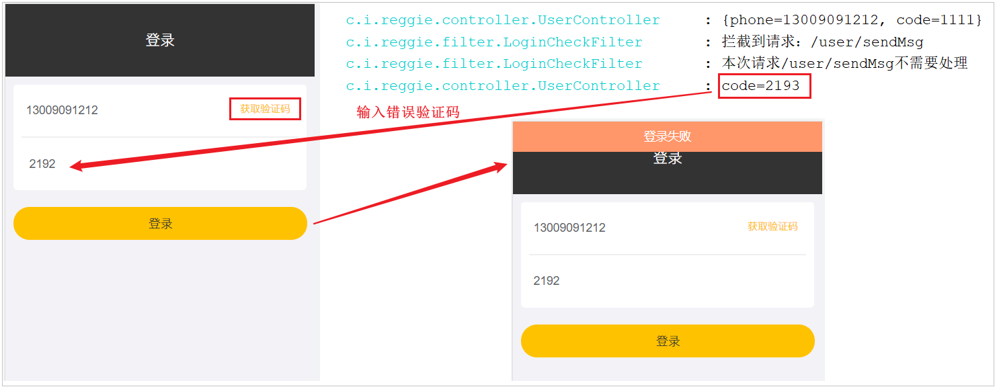 


2). 测试正确验证码的情况

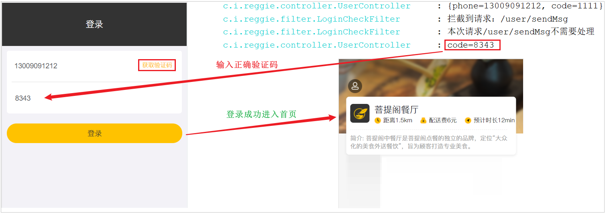 

检查user表，用户的数据也插入进来了： 

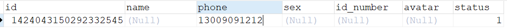 


# 用户地址簿功能- 菜品展示- 购物车- 下单

## 课程内容

- 用户地址簿功能
- 菜品展示
- 购物车
- 下单


## 1. 用户地址簿功能

### 1.1 需求分析

地址簿，指的是移动端消费者用户的地址信息，用户登录成功后可以维护自己的地址信息。同一个用户可以有多个地址信息，但是只能有一个**默认地址**。

  

 

对于地址簿管理，我们需要实现以下几个功能： 

- 新增地址
- 地址列表查询
- 设置默认地址
- 编辑地址
- 删除地址


### 1.2 数据模型

用户的地址信息会存储在address_book表，即地址簿表中。具体表结构如下：

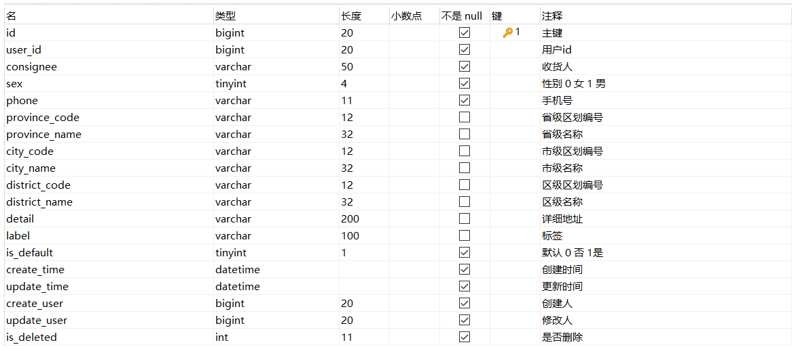 

这里面有一个字段is_default，实际上我们在设置默认地址时，只需要更新这个字段就可以了。


### 1.3 导入功能代码

对于这一类的单表的增删改查，我们已经写过很多了，基本的开发思路都是一样的，那么本小节的用户地址簿管理的增删改查功能，我们就不再一一实现了，基本的代码我们都已经提供了，直接导入进来，做一个测试即可。

对于下面的地址管理的代码，我们可以直接从资料拷贝，也可以直接从下面的讲义中复制。


**1). 实体类 AddressBook（直接从课程资料中导入即可）**

所属包: com.itheima.reggie.entity

```java
import com.baomidou.mybatisplus.annotation.FieldFill;
import com.baomidou.mybatisplus.annotation.TableField;
import lombok.Data;
import java.io.Serializable;
import java.time.LocalDateTime;
/**
 * 地址簿
 */
@Data
public class AddressBook implements Serializable {
    private static final long serialVersionUID = 1L;

    private Long id;
	
    //用户id
    private Long userId;
	
    //收货人
    private String consignee;
	
    //手机号
    private String phone;
	
    //性别 0 女 1 男
    private String sex;
	
    //省级区划编号
    private String provinceCode;
	
    //省级名称
    private String provinceName;
	
    //市级区划编号
    private String cityCode;
	
    //市级名称
    private String cityName;
	
    //区级区划编号
    private String districtCode;
	
    //区级名称
    private String districtName;
	
    //详细地址
    private String detail;
	
    //标签
    private String label;
    
    //是否默认 0 否 1是
    private Integer isDefault;
    
    //创建时间
    @TableField(fill = FieldFill.INSERT)
    private LocalDateTime createTime;

    //更新时间
    @TableField(fill = FieldFill.INSERT_UPDATE)
    private LocalDateTime updateTime;

    //创建人
    @TableField(fill = FieldFill.INSERT)
    private Long createUser;

    //修改人
    @TableField(fill = FieldFill.INSERT_UPDATE)
    private Long updateUser;

    //是否删除
    private Integer isDeleted;
}
```


**2). Mapper接口 AddressBookMapper（直接从课程资料中导入即可）**

所属包: com.itheima.reggie.mapper

```java
import com.baomidou.mybatisplus.core.mapper.BaseMapper;
import com.itheima.reggie.entity.AddressBook;
import org.apache.ibatis.annotations.Mapper;
import org.apache.ibatis.annotations.Select;
import java.util.List;

@Mapper
public interface AddressBookMapper extends BaseMapper<AddressBook> {
}
```


**3). 业务层接口 AddressBookService（直接从课程资料中导入即可）**

所属包: com.itheima.reggie.service

```java
import com.baomidou.mybatisplus.extension.service.IService;
import com.itheima.reggie.entity.AddressBook;

public interface AddressBookService extends IService<AddressBook> {
}
```


**4). 业务层实现类 AddressBookServiceImpl（直接从课程资料中导入即可）**

所属包: com.itheima.reggie.service.impl

```java
import com.baomidou.mybatisplus.extension.service.impl.ServiceImpl;
import com.itheima.reggie.entity.AddressBook;
import com.itheima.reggie.mapper.AddressBookMapper;
import com.itheima.reggie.service.AddressBookService;
import org.springframework.stereotype.Service;

@Service
public class AddressBookServiceImpl extends ServiceImpl<AddressBookMapper, AddressBook> implements AddressBookService {
}
```


**5). 控制层 AddressBookController（直接从课程资料中导入即可）**

所属包: com.itheima.reggie.controller


controller主要开发的功能: 

A. 新增地址逻辑说明： 

- 需要记录当前是哪个用户的地址(关联当前登录用户)

B. 设置默认地址 

- 每个用户可以有很多地址，但是默认地址只能有一个 ；

- 先将该用户所有地址的is_default更新为0 , 然后将当前的设置的默认地址的is_default设置为1

C. 根据ID查询地址

D. 查询默认地址

- 根据当前登录用户ID 以及 is_default进行查询，查询当前登录用户is_default为1的地址信息

E. 查询指定用户的全部地址

- 根据当前登录用户ID，查询所有的地址列表


代码实现如下： 

```java
import com.baomidou.mybatisplus.core.conditions.query.LambdaQueryWrapper;
import com.baomidou.mybatisplus.core.conditions.update.LambdaUpdateWrapper;
import com.itheima.reggie.common.BaseContext;
import com.itheima.reggie.common.R;
import com.itheima.reggie.entity.AddressBook;
import com.itheima.reggie.service.AddressBookService;
import lombok.extern.slf4j.Slf4j;
import org.springframework.beans.factory.annotation.Autowired;
import org.springframework.web.bind.annotation.*;
import java.util.List;

/**
 * 地址簿管理
 */
@Slf4j
@RestController
@RequestMapping("/addressBook")
public class AddressBookController {
    @Autowired
    private AddressBookService addressBookService;

    /**
     * 新增
     */
    @PostMapping
    public R<AddressBook> save(@RequestBody AddressBook addressBook) {
        addressBook.setUserId(BaseContext.getCurrentId());
        log.info("addressBook:{}", addressBook);
        addressBookService.save(addressBook);
        return R.success(addressBook);
    }

    /**
     * 设置默认地址
     */
    @PutMapping("default")
    public R<AddressBook> setDefault(@RequestBody AddressBook addressBook) {
        log.info("addressBook:{}", addressBook);
        LambdaUpdateWrapper<AddressBook> wrapper = new LambdaUpdateWrapper<>();
        wrapper.eq(AddressBook::getUserId, BaseContext.getCurrentId());
        wrapper.set(AddressBook::getIsDefault, 0);
        //SQL:update address_book set is_default = 0 where user_id = ?
        addressBookService.update(wrapper);

        addressBook.setIsDefault(1);
        //SQL:update address_book set is_default = 1 where id = ?
        addressBookService.updateById(addressBook);
        return R.success(addressBook);
    }

    /**
     * 根据id查询地址
     */
    @GetMapping("/{id}")
    public R get(@PathVariable Long id) {
        AddressBook addressBook = addressBookService.getById(id);
        if (addressBook != null) {
            return R.success(addressBook);
        } else {
            return R.error("没有找到该对象");
        }
    }

    /**
     * 查询默认地址
     */
    @GetMapping("default")
    public R<AddressBook> getDefault() {
        LambdaQueryWrapper<AddressBook> queryWrapper = new LambdaQueryWrapper<>();
        queryWrapper.eq(AddressBook::getUserId, BaseContext.getCurrentId());
        queryWrapper.eq(AddressBook::getIsDefault, 1);

        //SQL:select * from address_book where user_id = ? and is_default = 1
        AddressBook addressBook = addressBookService.getOne(queryWrapper);

        if (null == addressBook) {
            return R.error("没有找到该对象");
        } else {
            return R.success(addressBook);
        }
    }

    /**
     * 查询指定用户的全部地址
     */
    @GetMapping("/list")
    public R<List<AddressBook>> list(AddressBook addressBook) {
        addressBook.setUserId(BaseContext.getCurrentId());
        log.info("addressBook:{}", addressBook);

        //条件构造器
        LambdaQueryWrapper<AddressBook> queryWrapper = new LambdaQueryWrapper<>();
        queryWrapper.eq(null != addressBook.getUserId(), AddressBook::getUserId, addressBook.getUserId());
        queryWrapper.orderByDesc(AddressBook::getUpdateTime);

        //SQL:select * from address_book where user_id = ? order by update_time desc
        return R.success(addressBookService.list(queryWrapper));
    }
}
```


### 1.4 功能测试

代码导入进来，并且去阅读了一下地址管理各个功能的逻辑实现，接下来，我们就可以启动项目，进行一个测试。测试过程中，通过debug断点调试观察服务端程序的执行过程，在浏览器中使用调试工具查看页面和服务端的交互过程和请求响应数据。

**1). 新增**

填写表单数据，点击保存地址，查看网络请求。

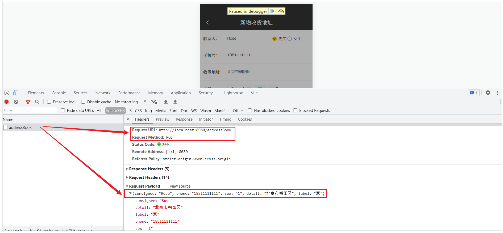 

测试完毕之后，检查数据库中的数据，是否正常插入。

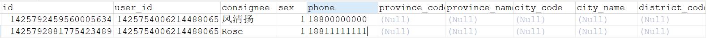 


**2). 列表查询**

当新增地址完成后，页面会再次发送一个请求，来查询该用户的所有地址列表，在界面进行展示。

 

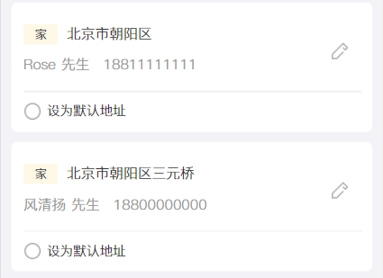 


**3). 设置默认**

在地址列表页面中，勾选 "设为默认地址" ，此时会发送PUT请求，来设置默认地址。

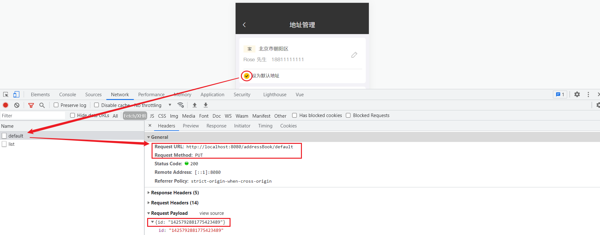 

测试完毕后，我们再次查看数据库表中的数据：

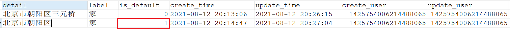 


## 2. 菜品展示

### 2.1 需求分析

用户登录成功后跳转到系统首页，在首页需要根据分类来展示菜品和套餐。如果菜品设置了口味信息，需要展示按钮，否则显示按钮。

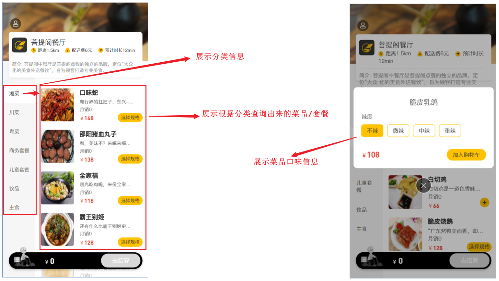 


### 2.2 前端页面分析

在开发代码之前，需要梳理一下前端页面和服务端的交互过程：


**1). 页面(front/index.html)发送ajax请求，获取分类数据（菜品分类和套餐分类）**

 

该功能在之前的业务开发中，我们都已经实现了。通过请求响应的数据，我们也可以看到数据是可以正确获取到的。

 


注意：首页加载时，不仅发送请求获取分类列表，还发送了一次ajax请求用于加载购物车数据，而这两次请求必须全部成功，页面才可以正常渲染，而当前购物车列表查询功能还未实现(报404)，所以列表目前并未渲染。此处可以将这次请求的地址暂时修改一下，从静态json文件获取数据，等后续开发购物车功能时再修改回来，如下：

 

修改之后，我们再次测试：  

 

目前该部分的功能我们已经调通，左侧的分类菜单，和右侧的菜品信息我们都可以看到，后续我们只需要将购物车列表的数据改成调用服务端接口查询即可。


**2). 页面发送ajax请求，获取第一个分类下的菜品或者套餐**

 

A. 根据分类ID查询套餐列表：

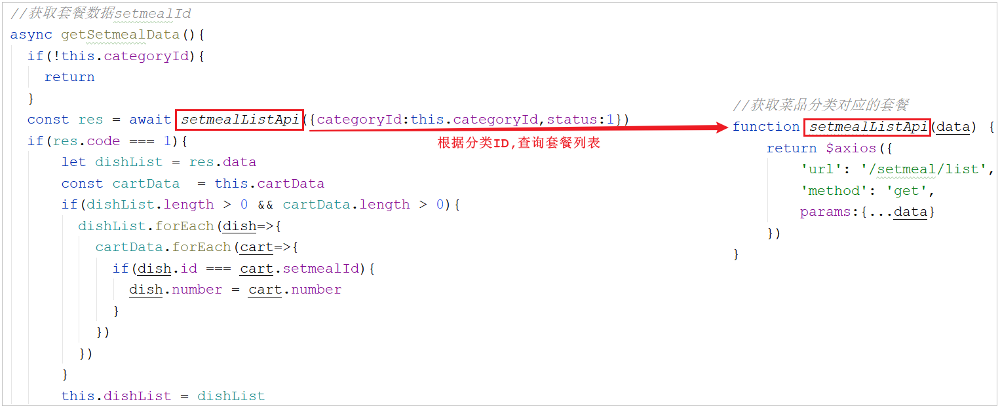 


B. 根据分类ID查询菜品列表： 

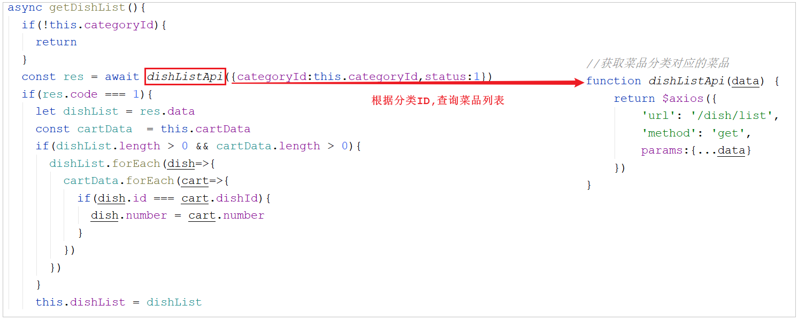 

异步请求，查询分类对应的菜品列表，功能我们已经实现了，但是我们之前查询的只是菜品的基本信息，不包含菜品的口味信息。所以在前端界面中，我们看不到选择菜品分类的信息。

 


经过上述的分析，我们可以看到，服务端我们主要提供两个方法， 分别用来：

A. 根据分类ID查询菜品列表(包含菜品口味列表), 具体请求信息如下: 

| 请求     | 说明                                     |
| -------- | ---------------------------------------- |
| 请求方式 | GET                                      |
| 请求路径 | /dish/list                               |
| 请求参数 | ?categoryId=1397844263642378242&status=1 |

<font color='red'>该功能在服务端已经实现，我们需要修改此方法，在原有方法的基础上增加查询菜品的口味信息。</font>


B. 根据分类ID查询套餐列表, 具体请求信息如下: 

| 请求     | 说明                                     |
| -------- | ---------------------------------------- |
| 请求方式 | GET                                      |
| 请求路径 | /setmeal/list                            |
| 请求参数 | ?categoryId=1397844263642378242&status=1 |

<font color='red'>该功能在服务端并未实现。</font>


### 2.3 代码开发

#### 2.3.1 查询菜品方法修改

由于之前我们实现的根据分类查询菜品列表，仅仅查询了菜品的基本信息，未查询菜品口味信息，而移动端用户在点餐时，是需要选择口味信息的，所以我们需要对之前的代码实现进行完善，那么如何完善呢？

我们需要修改DishController的list方法，原来此方法的返回值类型为：R<List<Dish>>。为了满足移动端对数据的要求(菜品基本信息和菜品对应的口味信息)，现在需要将方法的返回值类型改为：R<List<DishDto>> ，因为在DishDto中封装了菜品对应的口味信息： 

 


**代码逻辑:** 

A. 根据分类ID查询，查询目前正在启售的菜品列表 (已实现)

B. 遍历菜品列表，并查询菜品的分类信息及菜品的口味列表

C. 组装数据DishDto，并返回


**代码实现：**

```java
@GetMapping("/list")
    public R<List<DishDto>> list(Dish dish){
        //构造查询条件
        LambdaQueryWrapper<Dish> queryWrapper = new LambdaQueryWrapper<>();
        queryWrapper.eq(dish.getCategoryId() != null ,Dish::getCategoryId,dish.getCategoryId());
        //添加条件，查询状态为1（起售状态）的菜品
        queryWrapper.eq(Dish::getStatus,1);
        //添加排序条件
        queryWrapper.orderByAsc(Dish::getSort).orderByDesc(Dish::getUpdateTime);
		
        List<Dish> list = dishService.list(queryWrapper);
	
        List<DishDto> dishDtoList = list.stream().map((item) -> {
            DishDto dishDto = new DishDto();
            BeanUtils.copyProperties(item,dishDto);

            Long categoryId = item.getCategoryId();//分类id
            //根据id查询分类对象
            Category category = categoryService.getById(categoryId);
            if(category != null){
                String categoryName = category.getName();
                dishDto.setCategoryName(categoryName);
            }

            //当前菜品的id
            Long dishId = item.getId();
            LambdaQueryWrapper<DishFlavor> lambdaQueryWrapper = new LambdaQueryWrapper<>();
            lambdaQueryWrapper.eq(DishFlavor::getDishId,dishId);
            //SQL:select * from dish_flavor where dish_id = ?
            List<DishFlavor> dishFlavorList = dishFlavorService.list(lambdaQueryWrapper);
            dishDto.setFlavors(dishFlavorList);
            
            return dishDto;
        }).collect(Collectors.toList());

        return R.success(dishDtoList);
    }
```


#### 2.3.2 根据分类ID查询套餐

在SetmealController中创建list方法，根据条件查询套餐数据。

```java
/**
 * 根据条件查询套餐数据
 * @param setmeal
 * @return
 */
@GetMapping("/list")
public R<List<Setmeal>> list(Setmeal setmeal){
    LambdaQueryWrapper<Setmeal> queryWrapper = new LambdaQueryWrapper<>();
    queryWrapper.eq(setmeal.getCategoryId() != null,Setmeal::getCategoryId,setmeal.getCategoryId());
    queryWrapper.eq(setmeal.getStatus() != null,Setmeal::getStatus,setmeal.getStatus());
    queryWrapper.orderByDesc(Setmeal::getUpdateTime);

    List<Setmeal> list = setmealService.list(queryWrapper);
    return R.success(list);
}
```


### 2.4 功能测试

把菜品展示的功能代码完善完成之后，我们重新启动服务，来测试一个菜品展示的功能。测试过程中可以使用浏览器的监控工具查看页面和服务端的数据交互细节。

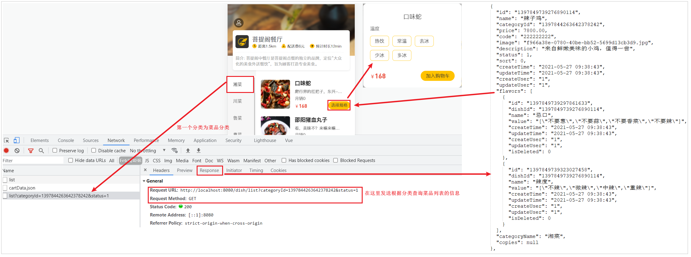 

点击分类，根据分类查询菜品列表/套餐列表:

 


## 3. 购物车

### 3.1 需求分析

移动端用户可以将菜品或者套餐添加到购物车。对于菜品来说，如果设置了口味信息，则需要选择规格后才能加入购物车;对于套餐来说，可以直接点击将当前套餐加入购物车。在购物车中可以修改菜品和套餐的数量，也可以清空购物车。

 

这里面我们需要实现的功能包括: 

1). 添加购物车

2). 查询购物车

3). 清空购物车


### 3.2 数据模型

用户的购物车数据，也是需要保存在数据库中的，购物车对应的数据表为shopping_cart表，具体表结构如下：

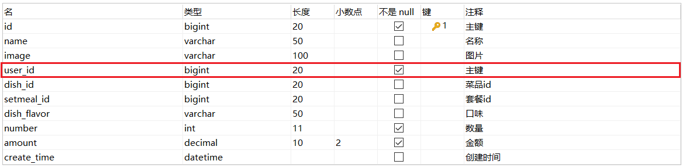 

说明： 

- 购物车数据是关联用户的，在表结构中，我们需要记录，每一个用户的购物车数据是哪些
- 菜品列表展示出来的既有套餐，又有菜品，如果APP端选择的是套餐，就保存套餐ID(setmeal_id)，如果APP端选择的是菜品，就保存菜品ID(dish_id)
- 对同一个菜品/套餐，如果选择多份不需要添加多条记录，增加数量number即可


**最终shopping_cart表中存储的数据示例:**

 


### 3.3 前端页面分析

在开发代码之前，需要梳理一下购物车操作时前端页面和服务端的交互过程：


1). 点击 "加入购物车" 或者 "+" 按钮，页面发送ajax请求，请求服务端，将菜品或者套餐添加到购物车

 

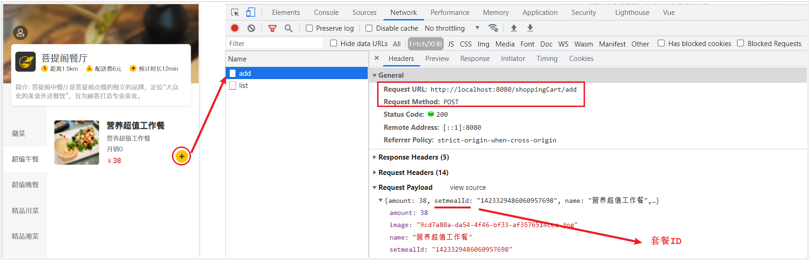 


2). 点击购物车图标，页面发送ajax请求，请求服务端查询购物车中的菜品和套餐

此时，我们就需要将查询购物车的代码放开，不用再加载静态的json数据了。

 

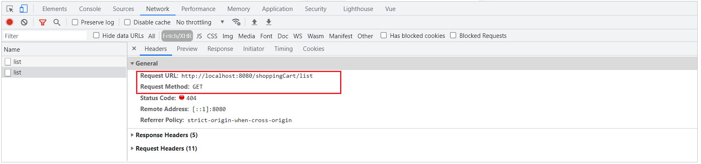 


3). 点击清空购物车按钮，页面发送ajax请求，请求服务端来执行清空购物车操作

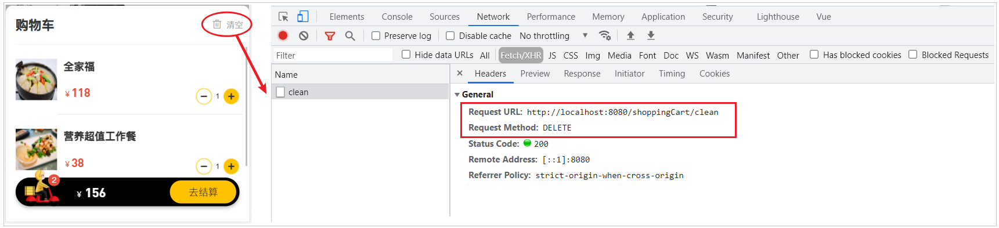 


经过上述的分析，我们可以看到，对于购物车的功能，我们主要需要开发以下几个功能，具体的请求信息如下：

**1). 加入购物车**

| 请求     | 说明              |
| -------- | ----------------- |
| 请求方式 | POST              |
| 请求路径 | /shoppingCart/add |
| 请求参数 | json格式          |

```json
菜品数据: 
{"amount":118,"dishFlavor":"不要蒜,微辣","dishId":"1397851099502260226","name":"全家福","image":"a53a4e6a-3b83-4044-87f9-9d49b30a8fdc.jpg"}

套餐数据: 
{"amount":38,"setmealId":"1423329486060957698","name":"营养超值工作餐","image":"9cd7a80a-da54-4f46-bf33-af3576514cec.jpg"}
```


**2). 查询购物车列表**

| 请求     | 说明               |
| -------- | ------------------ |
| 请求方式 | GET                |
| 请求路径 | /shoppingCart/list |


**3). 清空购物车功能**

| 请求     | 说明                |
| -------- | ------------------- |
| 请求方式 | DELETE              |
| 请求路径 | /shoppingCart/clean |


### 3.4 准备工作

分析完毕购物车的业务需求和实现思路之后，在开发业务功能前，先将需要用到的类和接口基本结构创建好：

**1). 实体类 ShoppingCart（直接从课程资料中导入即可）**

所属包: com.itheima.reggie.entity

```java
import lombok.Data;
import java.io.Serializable;
import java.math.BigDecimal;
import java.time.LocalDateTime;

/**
 * 购物车
 */
@Data
public class ShoppingCart implements Serializable {
    private static final long serialVersionUID = 1L;
	
    private Long id;

    //名称
    private String name;

    //用户id
    private Long userId;

    //菜品id
    private Long dishId;

    //套餐id
    private Long setmealId;

    //口味
    private String dishFlavor;

    //数量
    private Integer number;

    //金额
    private BigDecimal amount;

    //图片
    private String image;

    private LocalDateTime createTime;
}
```


**2). Mapper接口 ShoppingCartMapper**

所属包: com.itheima.reggie.mapper

```java
import com.baomidou.mybatisplus.core.mapper.BaseMapper;
import com.itheima.reggie.entity.ShoppingCart;
import org.apache.ibatis.annotations.Mapper;

@Mapper
public interface ShoppingCartMapper extends BaseMapper<ShoppingCart> {
}
```


**3). 业务层接口 ShoppingCartService**

所属包: com.itheima.reggie.service

```java
import com.baomidou.mybatisplus.extension.service.IService;
import com.itheima.reggie.entity.ShoppingCart;

public interface ShoppingCartService extends IService<ShoppingCart> {
}
```


**4). 业务层实现类 ShoppingCartServiceImpl**

所属包: com.itheima.reggie.service.impl

```java
import com.baomidou.mybatisplus.extension.service.impl.ServiceImpl;
import com.itheima.reggie.entity.ShoppingCart;
import com.itheima.reggie.mapper.ShoppingCartMapper;
import com.itheima.reggie.service.ShoppingCartService;
import org.springframework.stereotype.Service;

@Service
public class ShoppingCartServiceImpl extends ServiceImpl<ShoppingCartMapper, ShoppingCart> implements ShoppingCartService {
}
```


**5). 控制层 ShoppingCartController**

所属包: com.itheima.reggie.controller

```java
import com.itheima.reggie.service.ShoppingCartService;
import lombok.extern.slf4j.Slf4j;
import org.springframework.beans.factory.annotation.Autowired;
import org.springframework.web.bind.annotation.*;

/**
 * 购物车
 */
@Slf4j
@RestController
@RequestMapping("/shoppingCart")
public class ShoppingCartController {
    @Autowired
    private ShoppingCartService shoppingCartService;
 
 }   
```


### 3.5 代码开发

#### 3.5.1 添加购物车

在ShoppingCartController中创建add方法，来完成添加购物车的逻辑实现，具体的逻辑如下： 

A. 获取当前登录用户，为购物车对象赋值

B. 根据当前登录用户ID 及 本次添加的菜品ID/套餐ID，查询购物车数据是否存在

C. 如果已经存在，就在原来数量基础上加1

D. 如果不存在，则添加到购物车，数量默认就是1


代码实现如下：

```java
/**
* 添加购物车
* @param shoppingCart
* @return
*/
@PostMapping("/add")
public R<ShoppingCart> add(@RequestBody ShoppingCart shoppingCart){
    log.info("购物车数据:{}",shoppingCart);

    //设置用户id，指定当前是哪个用户的购物车数据
    Long currentId = BaseContext.getCurrentId();
    shoppingCart.setUserId(currentId);

    Long dishId = shoppingCart.getDishId();

    LambdaQueryWrapper<ShoppingCart> queryWrapper = new LambdaQueryWrapper<>();
    queryWrapper.eq(ShoppingCart::getUserId,currentId);

    if(dishId != null){
        //添加到购物车的是菜品
        queryWrapper.eq(ShoppingCart::getDishId,dishId);
    }else{
        //添加到购物车的是套餐
        queryWrapper.eq(ShoppingCart::getSetmealId,shoppingCart.getSetmealId());
    }

    //查询当前菜品或者套餐是否在购物车中
    //SQL:select * from shopping_cart where user_id = ? and dish_id/setmeal_id = ?
    ShoppingCart cartServiceOne = shoppingCartService.getOne(queryWrapper);

    if(cartServiceOne != null){
        //如果已经存在，就在原来数量基础上加一
        Integer number = cartServiceOne.getNumber();
        cartServiceOne.setNumber(number + 1);
        shoppingCartService.updateById(cartServiceOne);
    }else{
        //如果不存在，则添加到购物车，数量默认就是一
        shoppingCart.setNumber(1);
        shoppingCart.setCreateTime(LocalDateTime.now());
        shoppingCartService.save(shoppingCart);
        cartServiceOne = shoppingCart;
    }
    return R.success(cartServiceOne);
}
```


#### 3.5.2 查询购物车

在ShoppingCartController中创建list方法，根据当前登录用户ID查询购物车列表，并对查询的结果进行创建时间的倒序排序。

代码实现如下： 

```java
/**
* 查看购物车
* @return
*/
@GetMapping("/list")
public R<List<ShoppingCart>> list(){
    log.info("查看购物车...");
	
    LambdaQueryWrapper<ShoppingCart> queryWrapper = new LambdaQueryWrapper<>();
    queryWrapper.eq(ShoppingCart::getUserId,BaseContext.getCurrentId());
    queryWrapper.orderByAsc(ShoppingCart::getCreateTime);
	
    List<ShoppingCart> list = shoppingCartService.list(queryWrapper);

    return R.success(list);
}
```


#### 3.5.3 清空购物车

在ShoppingCartController中创建clean方法，在方法中获取当前登录用户，根据登录用户ID，删除购物车数据。

代码实现如下： 

```java
/**
* 清空购物车
* @return
*/
@DeleteMapping("/clean")
public R<String> clean(){
    //SQL:delete from shopping_cart where user_id = ?
    LambdaQueryWrapper<ShoppingCart> queryWrapper = new LambdaQueryWrapper<>();
    queryWrapper.eq(ShoppingCart::getUserId,BaseContext.getCurrentId());

    shoppingCartService.remove(queryWrapper);
    return R.success("清空购物车成功");
}
```


### 3.6 功能测试

按照前面分析的操作流程进行测试，测试功能以及数据库中的数据是否是否正常。

**1). 添加购物车**

当添加的是菜品信息，而这个用户的购物车中当前并没有这个菜品时，添加一条数据，数量为1。

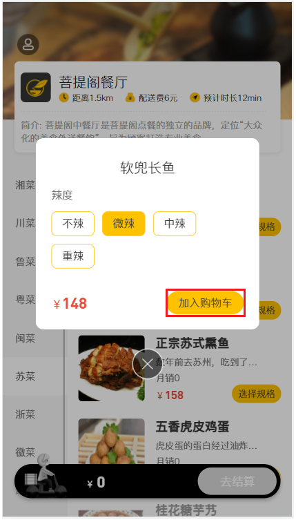 

检查数据库数据，由于是菜品保存的是dish_id。

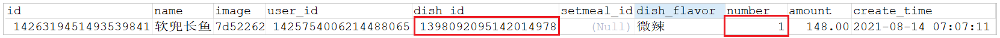 


这时在页面上，我们可以继续点击+号，在购物车中增加该菜品，此时，应该是对现有的购物车菜品数量加1，而不应该插入新的记录。

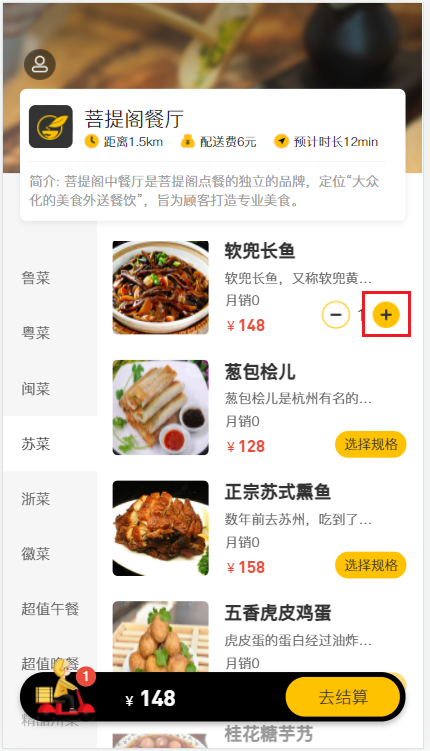 

检查数据库数据：

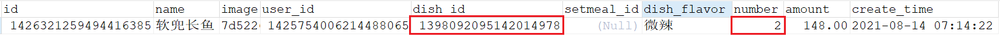 


如果添加的是套餐，该套餐在当前用户的购物车中并不存在，则添加一条数据，数量为1。

  

检查数据库数据：

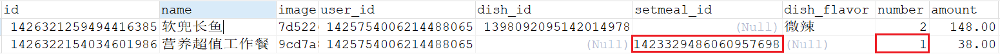 


**2). 查看购物车**

点击页面下面的购物车边栏，查看购物车数据列表是否正常展示。

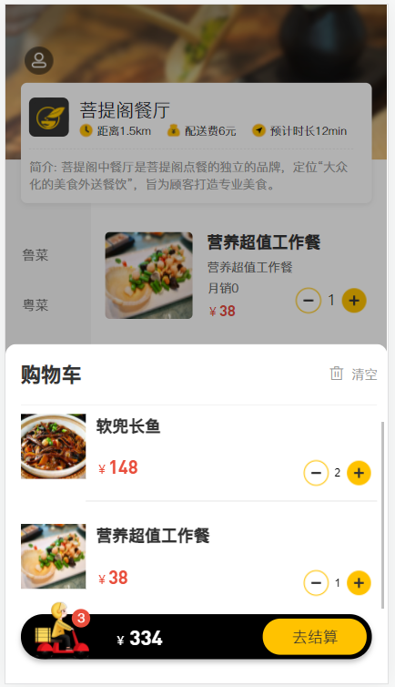 


**3). 清空购物车**

在购物车列表展示页中点击"清空", 查看购物车是否被清空。

 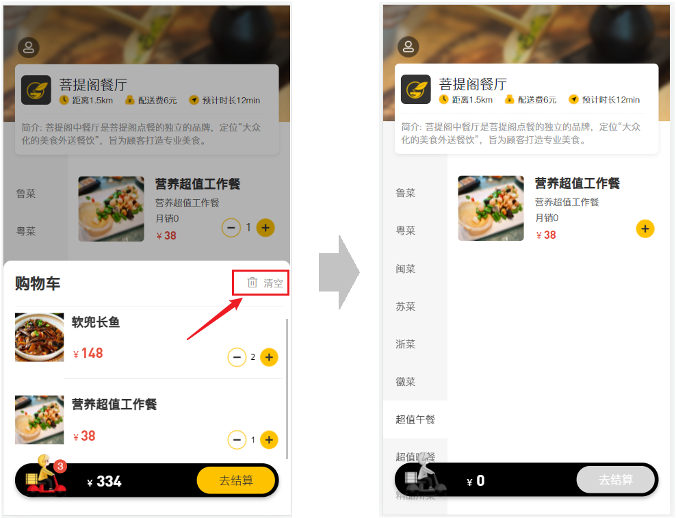 

并检查数据库中的数据，可以看到数据已经被删除。


## 4. 下单

### 4.1 需求分析

移动端用户将菜品或者套餐加入购物车后，可以点击购物车中的 "去结算" 按钮，页面跳转到订单确认页面，点击 "去支付" 按钮则完成下单操作。

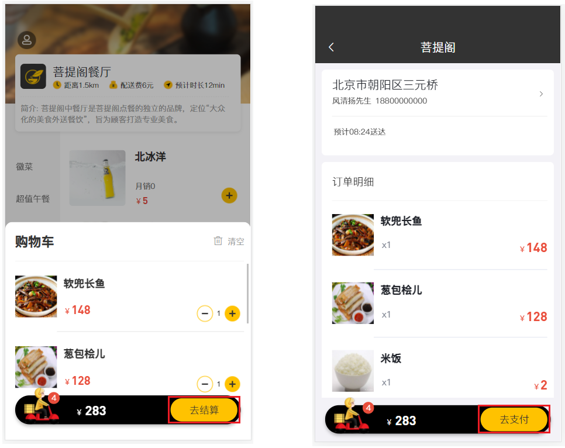 

这里，我们需要说明一下，这里并不会去开发支付功能，因为不论是支付宝的支付，还是微信支付，都是需要企业资质的，而我们大家在测试的时候，是没有办法提供企业资质的，所以这一部分支付功能我们就不去实现了。


### 4.2 数据模型

用户下单业务对应的数据表为orders表和order_detail表(一对多关系,一个订单关联多个订单明细)：

| 表名         | 含义       | 说明                                                         |
| ------------ | ---------- | ------------------------------------------------------------ |
| orders       | 订单表     | 主要存储订单的基本信息(如: 订单号、状态、金额、支付方式、下单用户、收件地址等) |
| order_detail | 订单明细表 | 主要存储订单详情信息(如: 该订单关联的套餐及菜品的信息)       |


具体的表结构如下: 

**A. orders 订单表**

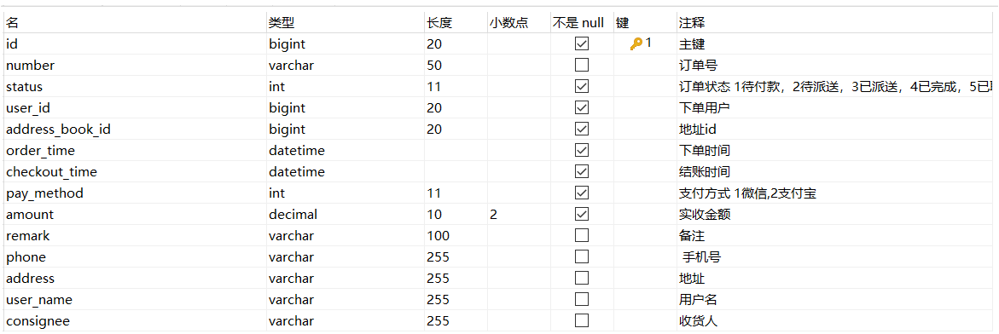  


**B. order_detail**

 


数据示例: 

 

用户提交订单时，需要往订单表orders中插入一条记录，并且需要往order_detail中插入一条或多条记录。


### 4.3 前端页面分析

在开发代码之前，需要梳理一下用户下单操作时前端页面和服务端的交互过程：


**1). 在购物车中点击按钮，页面跳转到订单确认页面**

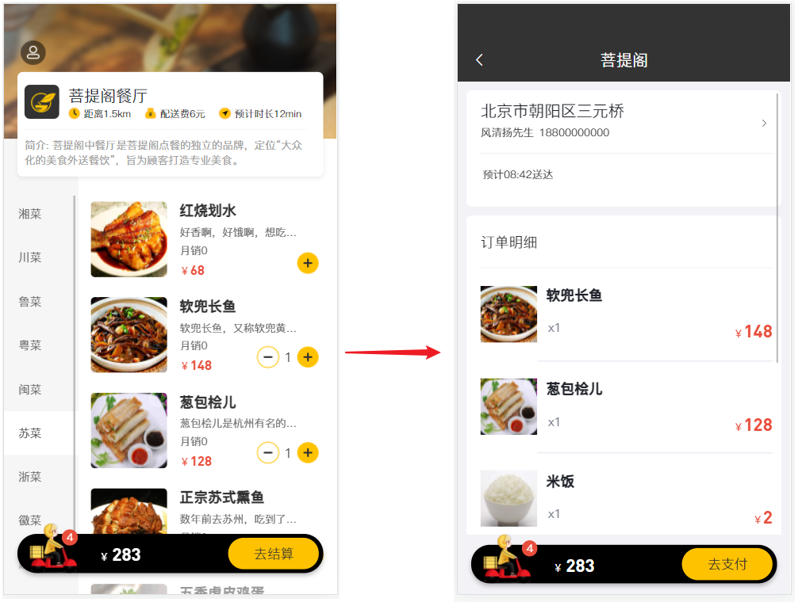 

页面跳转前端已经完成，我们无需操作。


**2). 在订单确认页面，发送ajax请求，请求服务端获取当前登录用户的默认地址**

 

该功能在用户地址簿管理功能开发时，已经实现(导入)，我们无需操作。


**3). 在订单确认页面，发送ajax请求，请求服务端获取当前登录用户的购物车数据**

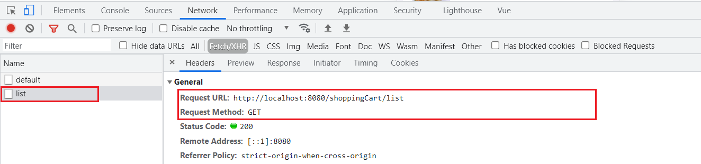 

该功能已经实现，我们无需操作。


**4). 在订单确认页面点击按钮，发送ajax请求，请求服务端完成下单操作**

 


经过上述的分析，我们看到前三步的功能我们都已经实现了，我们主要需要实现最后一步的下单功能，该功能具体的请求信息如下： 

| 请求     | 说明                                                         |
| -------- | ------------------------------------------------------------ |
| 请求方式 | POST                                                         |
| 请求路径 | /order/submit                                                |
| 请求参数 | {"remark":"老板,记得带一次性筷子","payMethod":1,"addressBookId":"1425792459560005634"} |


### 4.4 准备工作

在开发业务功能前，先将需要用到的类和接口基本结构创建好：

**1). 实体类 Orders、OrderDetail（直接从课程资料中导入即可）**

所属包: com.itheima.reggie.entity

```java
import lombok.Data;
import java.io.Serializable;
import java.math.BigDecimal;
import java.time.LocalDateTime;

/**
 * 订单
 */
@Data
public class Orders implements Serializable {
    private static final long serialVersionUID = 1L;

    private Long id;
    //订单号
    private String number;
    //订单状态 1待付款，2待派送，3已派送，4已完成，5已取消
    private Integer status;

    //下单用户id
    private Long userId;

    //地址id
    private Long addressBookId;

    //下单时间
    private LocalDateTime orderTime;

    //结账时间
    private LocalDateTime checkoutTime;

    //支付方式 1微信，2支付宝
    private Integer payMethod;

    //实收金额
    private BigDecimal amount;

    //备注
    private String remark;

    //用户名
    private String userName;

    //手机号
    private String phone;

    //地址
    private String address;

    //收货人
    private String consignee;
}
```


```java
import lombok.Data;
import java.io.Serializable;
import java.math.BigDecimal;

/**
 * 订单明细
 */
@Data
public class OrderDetail implements Serializable {
    private static final long serialVersionUID = 1L;

    private Long id;

    //名称
    private String name;

    //订单id
    private Long orderId;

    //菜品id
    private Long dishId;

    //套餐id
    private Long setmealId;

    //口味
    private String dishFlavor;

    //数量
    private Integer number;

    //金额
    private BigDecimal amount;

    //图片
    private String image;
}
```


**2). Mapper接口 OrderMapper、OrderDetailMapper**

所属包: com.itheima.reggie.mapper

```java
import com.baomidou.mybatisplus.core.mapper.BaseMapper;
import com.itheima.reggie.entity.Orders;
import org.apache.ibatis.annotations.Mapper;

@Mapper
public interface OrderMapper extends BaseMapper<Orders> {
}
```

```java
import com.baomidou.mybatisplus.core.mapper.BaseMapper;
import com.itheima.reggie.entity.OrderDetail;
import org.apache.ibatis.annotations.Mapper;

@Mapper
public interface OrderDetailMapper extends BaseMapper<OrderDetail> {
}
```


**3). 业务层接口 OrderService、OrderDetailService**

所属包: com.itheima.reggie.service

```java
import com.baomidou.mybatisplus.extension.service.IService;
import com.itheima.reggie.entity.Orders;

public interface OrderService extends IService<Orders> {
}
```

```java
import com.baomidou.mybatisplus.extension.service.IService;
import com.itheima.reggie.entity.OrderDetail;

public interface OrderDetailService extends IService<OrderDetail> {
}
```


**4). 业务层实现类 OrderServiceImpl、OrderDetailServiceImpl**

所属包: com.itheima.reggie.service.impl

```java
import com.baomidou.mybatisplus.extension.service.impl.ServiceImpl;
import com.itheima.reggie.entity.*;
import com.itheima.reggie.mapper.OrderMapper;
import com.itheima.reggie.service.*;
import lombok.extern.slf4j.Slf4j;
import org.springframework.stereotype.Service;

@Service
@Slf4j
public class OrderServiceImpl extends ServiceImpl<OrderMapper, Orders> implements OrderService {
}
```

```java
import com.baomidou.mybatisplus.extension.service.impl.ServiceImpl;
import com.itheima.reggie.entity.OrderDetail;
import com.itheima.reggie.mapper.OrderDetailMapper;
import com.itheima.reggie.service.OrderDetailService;
import org.springframework.stereotype.Service;

@Service
public class OrderDetailServiceImpl extends ServiceImpl<OrderDetailMapper, OrderDetail> implements OrderDetailService {
}
```


**5). 控制层 OrderController、OrderDetailController**

所属包: com.itheima.reggie.controller

```java
import com.itheima.reggie.service.OrderService;
import lombok.extern.slf4j.Slf4j;
import org.springframework.beans.factory.annotation.Autowired;
import org.springframework.web.bind.annotation.RequestMapping;
import org.springframework.web.bind.annotation.RestController;

/**
 * 订单
 */
@Slf4j
@RestController
@RequestMapping("/order")
public class OrderController {
    @Autowired
    private OrderService orderService;
}
```

```java
import com.itheima.reggie.service.OrderDetailService;
import lombok.extern.slf4j.Slf4j;
import org.springframework.beans.factory.annotation.Autowired;
import org.springframework.web.bind.annotation.*;

/**
 * 订单明细
 */
@Slf4j
@RestController
@RequestMapping("/orderDetail")
public class OrderDetailController {

    @Autowired
    private OrderDetailService orderDetailService;
}
```


### 4.5 代码开发

在OrderController中创建submit方法，处理用户下单的逻辑 ：

```java
/**
 * 用户下单
 * @param orders
 * @return
 */
@PostMapping("/submit")
public R<String> submit(@RequestBody Orders orders){
    log.info("订单数据：{}",orders);
    orderService.submit(orders);
    return R.success("下单成功");
}
```


由于下单的逻辑相对复杂，我们可以在OrderService中定义submit方法，来处理下单的具体逻辑：

```java
/**
* 用户下单
* @param orders
*/
public void submit(Orders orders);
```


然后在OrderServiceImpl中完成下单功能的具体实现，下单功能的具体逻辑如下： 

A. 获得当前用户id, 查询当前用户的购物车数据

B. 根据当前登录用户id, 查询用户数据

C. 根据地址ID, 查询地址数据

D. 组装订单明细数据, 批量保存订单明细 

E. 组装订单数据, 批量保存订单数据

F. 删除当前用户的购物车列表数据


具体代码实现如下: 

```java
@Autowired
private ShoppingCartService shoppingCartService;

@Autowired
private UserService userService;

@Autowired
private AddressBookService addressBookService;

@Autowired
private OrderDetailService orderDetailService;

/**
* 用户下单
* @param orders
*/
@Transactional
public void submit(Orders orders) {
    //获得当前用户id
    Long userId = BaseContext.getCurrentId();

    //查询当前用户的购物车数据
    LambdaQueryWrapper<ShoppingCart> wrapper = new LambdaQueryWrapper<>();
    wrapper.eq(ShoppingCart::getUserId,userId);
    List<ShoppingCart> shoppingCarts = shoppingCartService.list(wrapper);

    if(shoppingCarts == null || shoppingCarts.size() == 0){
    	throw new CustomException("购物车为空，不能下单");
    }

    //查询用户数据
    User user = userService.getById(userId);

    //查询地址数据
    Long addressBookId = orders.getAddressBookId();
    AddressBook addressBook = addressBookService.getById(addressBookId);
    if(addressBook == null){
    	throw new CustomException("用户地址信息有误，不能下单");
    }

    long orderId = IdWorker.getId();//订单号

    AtomicInteger amount = new AtomicInteger(0);

    //组装订单明细信息
    List<OrderDetail> orderDetails = shoppingCarts.stream().map((item) -> {
        OrderDetail orderDetail = new OrderDetail();
        orderDetail.setOrderId(orderId);
        orderDetail.setNumber(item.getNumber());
        orderDetail.setDishFlavor(item.getDishFlavor());
        orderDetail.setDishId(item.getDishId());
        orderDetail.setSetmealId(item.getSetmealId());
        orderDetail.setName(item.getName());
        orderDetail.setImage(item.getImage());
        orderDetail.setAmount(item.getAmount());
        amount.addAndGet(item.getAmount().multiply(new BigDecimal(item.getNumber())).intValue());
        return orderDetail;
    }).collect(Collectors.toList());

    //组装订单数据
    orders.setId(orderId);
    orders.setOrderTime(LocalDateTime.now());
    orders.setCheckoutTime(LocalDateTime.now());
    orders.setStatus(2);
    orders.setAmount(new BigDecimal(amount.get()));//总金额
    orders.setUserId(userId);
    orders.setNumber(String.valueOf(orderId));
    orders.setUserName(user.getName());
    orders.setConsignee(addressBook.getConsignee());
    orders.setPhone(addressBook.getPhone());
    orders.setAddress((addressBook.getProvinceName() == null ? "" : addressBook.getProvinceName())
        + (addressBook.getCityName() == null ? "" : addressBook.getCityName())
        + (addressBook.getDistrictName() == null ? "" : addressBook.getDistrictName())
        + (addressBook.getDetail() == null ? "" : addressBook.getDetail()));
    //向订单表插入数据，一条数据
    this.save(orders);

    //向订单明细表插入数据，多条数据
    orderDetailService.saveBatch(orderDetails);

    //清空购物车数据
    shoppingCartService.remove(wrapper);
}
```

> 备注: 
>
> ​	上述逻辑处理中，计算购物车商品的总金额时，为保证我们每一次执行的累加计算是一个原子操作，我们这里用到了JDK中提供的一个原子类 AtomicInteger


### 4.6 功能测试

代码编写完成，我们重新启动服务，按照前面分析的操作流程进行测试，查看数据是否正常即可。在测试过程中，我们可以通过debug的形式来跟踪代码的正常执行。

 


**检查数据库数据**

订单表插入一条记录： 

 


订单明细表插入四条记录()： 

 


同时，购物车的数据被删除： 

  


