# 环境搭建- 缓存短信验证码- 缓存菜品信息- SpringCache- 缓存套餐数据

## 课程内容

- 环境搭建
- 缓存短信验证码
- 缓存菜品信息
- SpringCache
- 缓存套餐数据


## 前言

> 1). 当前系统存在的问题

之前我们已经实现了移动端菜品展示、点餐、购物车、下单等功能，但是由于移动端是面向所有的消费者的，请求压力相对比较大，而我们当前所有的数据查询都是从数据库MySQL中直接查询的，那么可能就存在如下问题： ==频繁访问数据库，数据库访问压力大，系统性能下降，用户体验较差。==

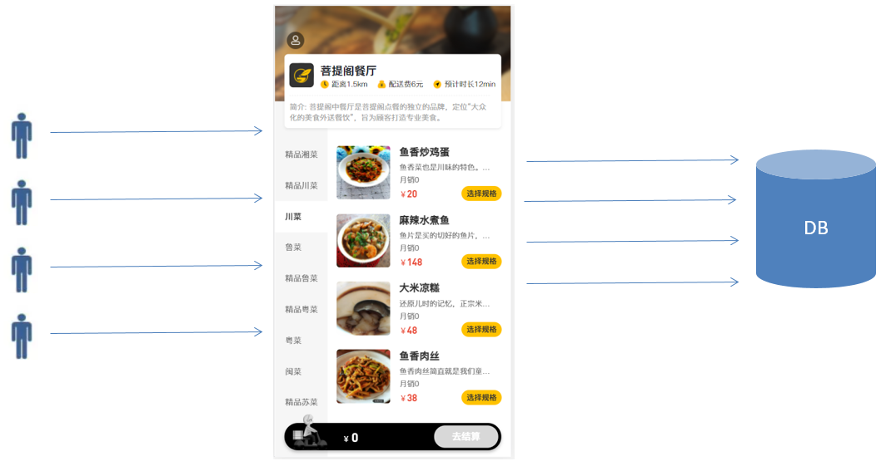 


> 2). 解决该问题的方法

要解决我们上述提到的问题，就可以使用我们前面学习的一个技术：Redis，通过Redis来做缓存，从而降低数据库的访问压力，提高系统的访问性能，从而提升用户体验。加入Redis做缓存之后，我们在进行数据查询时，就需要先查询缓存，如果缓存中有数据，直接返回，如果缓存中没有数据，则需要查询数据库，再将数据库查询的结果，缓存在redis中。


## 1. 环境搭建

### 1.1 版本控制

接下来，我们就需要对我们的功能进行优化，但是需要说明的是，我们不仅仅要对上述提到的缓存进行优化，还需要对我们程序的各个方面进行优化。我们本章节主要是针对于缓存进行优化，为了方便的对我们各个优化版本的代码进行管理，我们使用Git来控制代码版本。 那么此时我们就需要将我们之前开发完成的代码提交到Git，并且推送到码云Gitee的远程仓库，执行步骤如下： 


**1). 创建Gitee远程仓库**

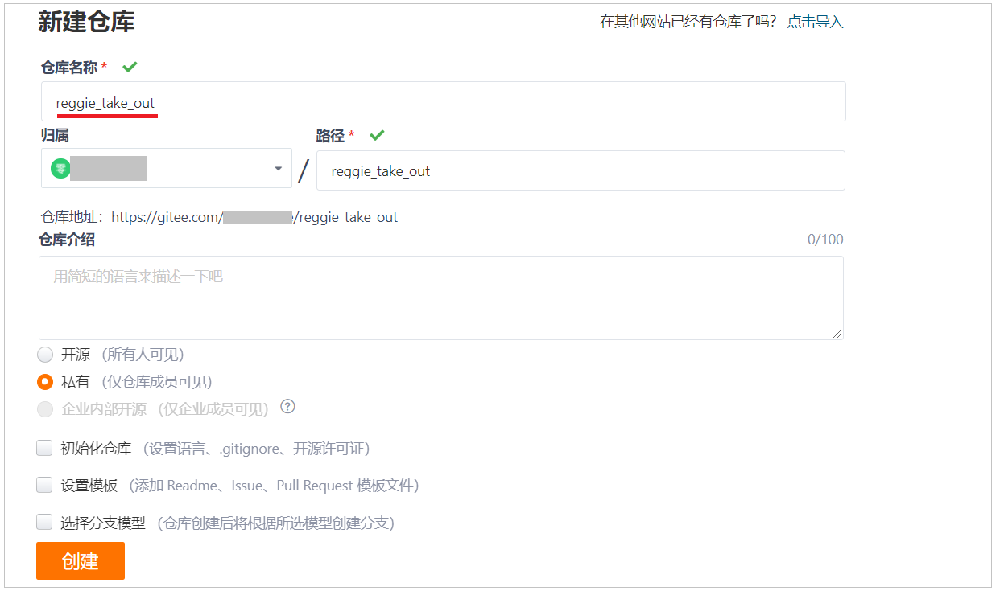 


**2). idea-创建本地仓库**

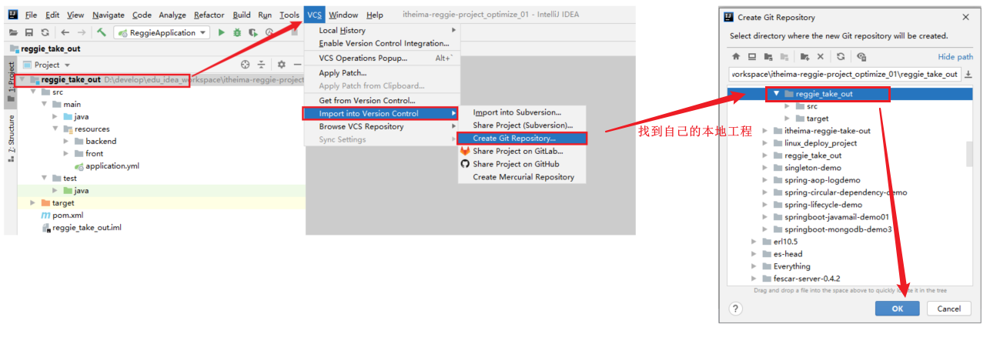 


**3). 准备忽略文件.gitignore**

在我们的项目中, 有一些文件是无需提交的到git，比如: .idea，target/，*.iml等。我们可以直接将今天课程资料中提供的.gitignore 文件导入到我们的项目中。

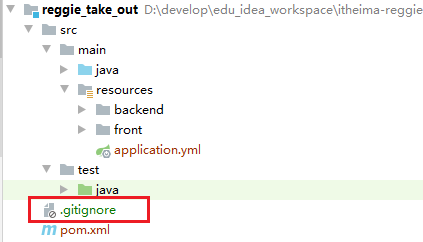 


**4). idea-提交并推送本地代码**

A. 添加项目文件进暂存区

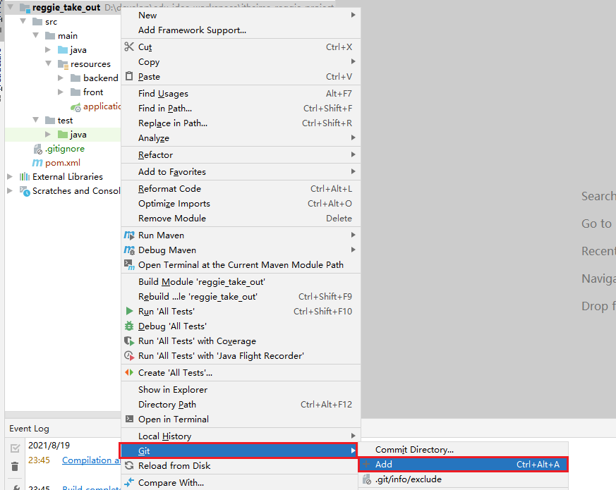 


B. 提交代码

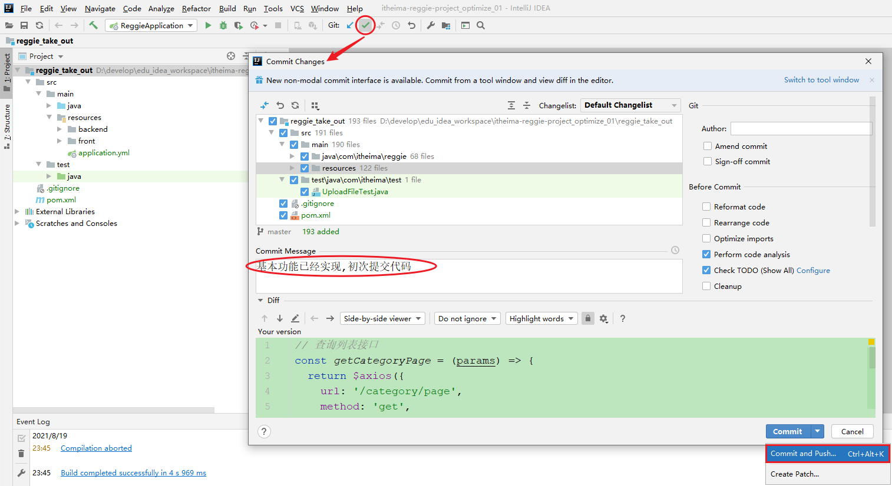 

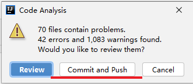 


C. 推送代码到远程仓库 

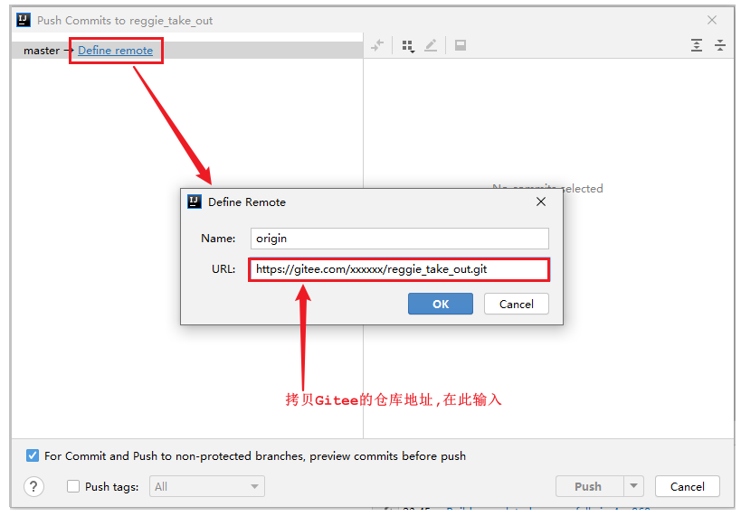 


**5). 查看gitee远程仓库**

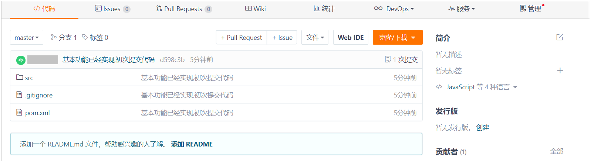 


**6). 创建分支**

目前默认git中只有一个主分支master，我们接下来进行缓存的优化，就不在master分支来操作了，我们需要在git上创建一个单独的分支v1.0，缓存的优化，我们就在该分支上进行操作。

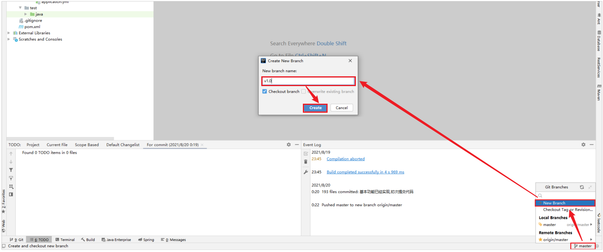  

当前创建的v1.0分支，是基于master分支创建出来的，所以目前master分支的代码， 和v1.0分支的代码是完全一样的，接下来把v1.0的代码也推送至远程仓库。


**7). 推送分支代码到远程**

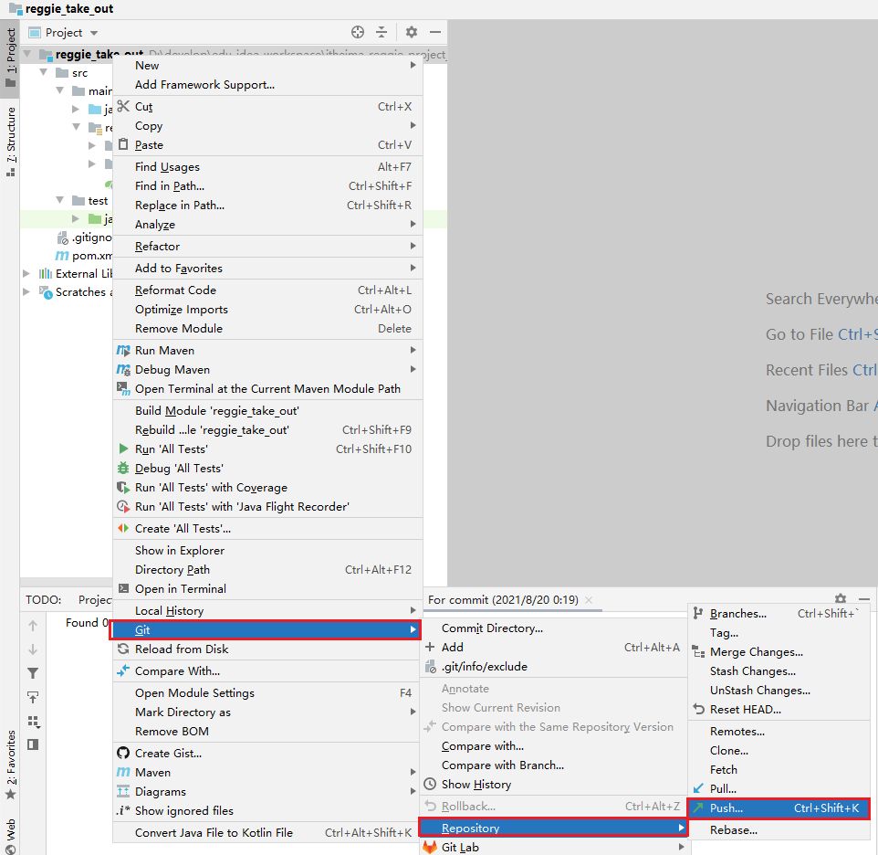 

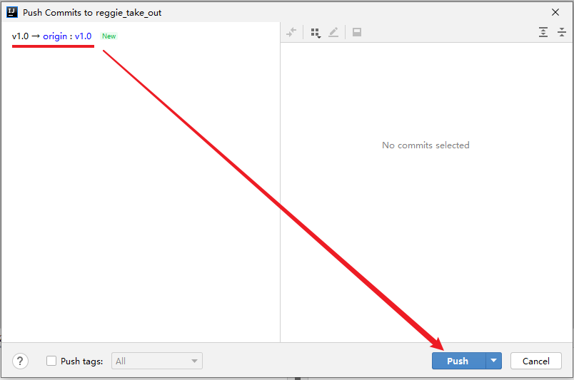 


### 1.2 环境准备

**1). 在项目的pom.xml文件中导入spring data redis的maven坐标**

```xml
<dependency>
    <groupId>org.springframework.boot</groupId>
    <artifactId>spring-boot-starter-data-redis</artifactId>
</dependency>
```


**2). 在项目的application.yml中加入redis相关配置**

```yml
  redis:
    host: 192.168.200.200
    port: 6379
    password: root@123456
    database: 0
```

==注意: 引入上述依赖时,需要注意yml文件前面的缩进,上述配置应该配置在spring层级下面。==


**3). 编写Redis的配置类RedisConfig,定义RedisTemplate**

```java
import org.springframework.cache.annotation.CachingConfigurerSupport;
import org.springframework.context.annotation.Bean;
import org.springframework.context.annotation.Configuration;
import org.springframework.data.redis.connection.RedisConnectionFactory;
import org.springframework.data.redis.core.RedisTemplate;
import org.springframework.data.redis.serializer.StringRedisSerializer;

@Configuration
public class RedisConfig extends CachingConfigurerSupport {
    @Bean
    public RedisTemplate<Object, Object> redisTemplate(RedisConnectionFactory connectionFactory) {
        RedisTemplate<Object, Object> redisTemplate = new RedisTemplate<>();
        //默认的Key序列化器为：JdkSerializationRedisSerializer
        redisTemplate.setKeySerializer(new StringRedisSerializer());
        redisTemplate.setConnectionFactory(connectionFactory);
        return redisTemplate;
    }
}
```

**解释说明:** 

1). 在SpringBoot工程启动时, 会加载一个自动配置类 RedisAutoConfiguration, 在里面已经声明了RedisTemplate这个bean

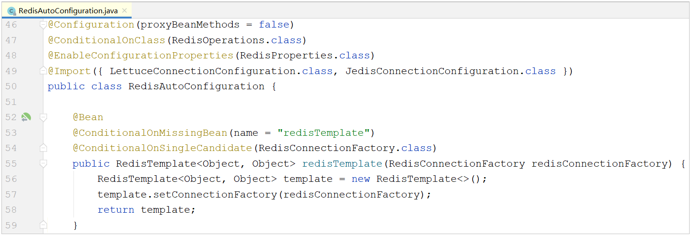 

上述框架默认声明的RedisTemplate用的key和value的序列化方式是默认的 JdkSerializationRedisSerializer，如果key采用这种方式序列化，最终我们在测试时通过redis的图形化界面查询不是很方便，如下形式：

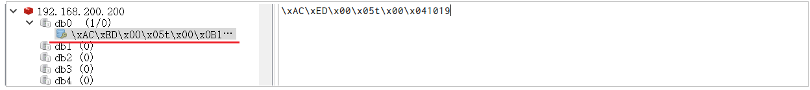 


2). 如果使用我们自定义的RedisTemplate, key的序列化方式使用的是StringRedisSerializer, 也就是字符串形式, 最终效果如下: 

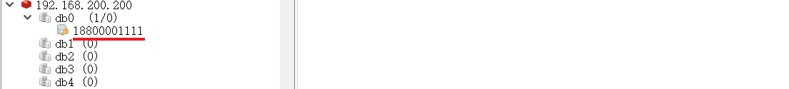 

 


3). 定义了两个bean会不会出现冲突呢? 答案是不会, 因为源码如下:

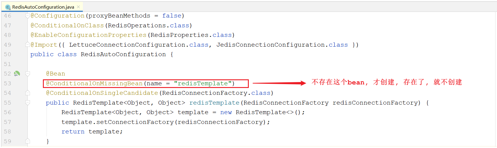 


## 2. 缓存短信验证码

### 2.1 思路分析

前面我们已经实现了移动端手机验证码登录，随机生成的验证码我们是保存在HttpSession中的。但是在我们实际的业务场景中，一般验证码都是需要设置过期时间的，如果存在HttpSession中就无法设置过期时间，此时我们就需要对这一块的功能进行优化。

现在需要改造为将验证码缓存在Redis中，具体的实现思路如下：

1). 在服务端UserController中注入RedisTemplate对象，用于操作Redis;

2). 在服务端UserController的sendMsg方法中，将随机生成的验证码缓存到Redis中，并设置有效期为5分钟;

3). 在服务端UserController的login方法中，从Redis中获取缓存的验证码，如果登录成功则删除Redis中的验证码;


### 2.2 代码改造

1). 在UserController中注入RedisTemplate对象，用于操作Redis

```java
@Autowired
private RedisTemplate redisTemplate;
```


2). 在UserController的sendMsg方法中，将生成的验证码保存到Redis

```java
//需要将生成的验证码保存到Redis,设置过期时间
redisTemplate.opsForValue().set(phone, code, 5, TimeUnit.MINUTES);
```

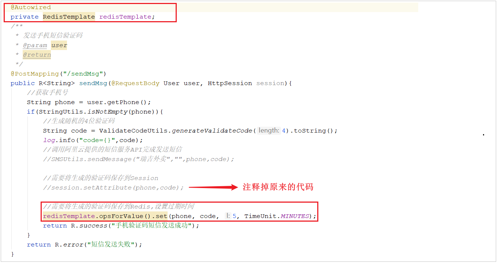 


3). 在UserController的login方法中，从Redis中获取生成的验证码，如果登录成功则删除Redis中缓存的验证码

```java
//从Redis中获取缓存的验证码
Object codeInSession = redisTemplate.opsForValue().get(phone);
```


```java
//从Redis中删除缓存的验证码
redisTemplate.delete(phone);
```

 


### 2.3 功能测试

代码编写完毕之后,重启服务。

**1). 访问前端工程，获取验证码**

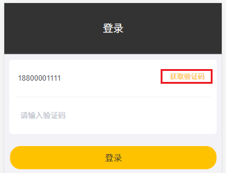 

通过控制台的日志，我们可以看到生成的验证码：

  


**2). 通过Redis的图形化界面工具查看Redis中的数据**

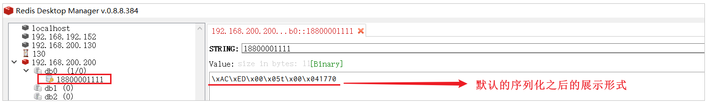 


**3). 在登录界面填写验证码登录完成后,查看Redis中的数据是否删除**

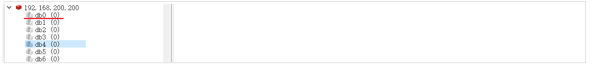 


## 3. 缓存菜品信息

### 3.1 实现思路

前面我们已经实现了移动端菜品查看功能，对应的服务端方法为DishController的list方法，此方法会根据前端提交的查询条件(categoryId)进行数据库查询操作。在高并发的情况下，频繁查询数据库会导致系统性能下降，服务端响应时间增长。现在需要对此方法进行缓存优化，提高系统的性能。


那么,我们又需要思考一个问题, 具体缓存几份数据呢, 所有的菜品缓存一份 , 还是说需要缓存多份呢? 我们可以看一下我们之前做的移动端效果: 

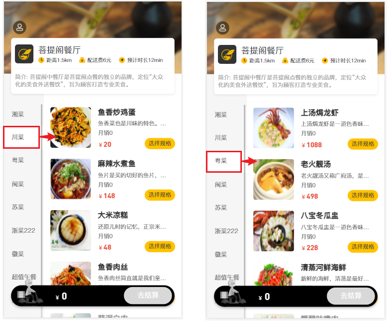 

我们点击哪一个分类,展示的就是该分类下的菜品, 其他菜品无需展示。所以，这里面我们在缓存时，可以根据菜品的分类，缓存多份数据，页面在查询时，点击的是哪个分类，我们就查询该分类下的菜品缓存数据。


**具体的实现思路如下：**

1). 改造DishController的list方法，先从Redis中获取分类对应的菜品数据，如果有则直接返回，无需查询数据库;如果没有则查询数据库，并将查询到的菜品数据存入Redis。

2). 改造DishController的save和update方法，加入清理缓存的逻辑。

> 注意： 
>
> ​	在使用缓存过程中，要注意保证数据库中的数据和缓存中的数据一致，如果数据库中的数据发生变化，需要及时清理缓存数据。否则就会造成缓存数据与数据库数据不一致的情况。


### 3.2 代码改造

需要改造的代码为： DishController

#### 3.2.1 查询菜品缓存

| 改造的方法 | redis的数据类型 | redis缓存的key                              | redis缓存的value |
| ---------- | --------------- | ------------------------------------------- | ---------------- |
| list       | string          | dish_分类Id_状态 , 比如: dish_12323232323_1 | List<DishDto>    |


**1). 在DishController中注入RedisTemplate**

```java
@Autowired
private RedisTemplate redisTemplate;
```


**2). 在list方法中,查询数据库之前,先查询缓存, 缓存中有数据, 直接返回**

```java
List<DishDto> dishDtoList = null;
//动态构造key
String key = "dish_" + dish.getCategoryId() + "_" + dish.getStatus();//dish_1397844391040167938_1
//先从redis中获取缓存数据
dishDtoList = (List<DishDto>) redisTemplate.opsForValue().get(key);
if(dishDtoList != null){
    //如果存在，直接返回，无需查询数据库
    return R.success(dishDtoList);
}
```

 


**3). 如果redis不存在，查询数据库，并将数据库查询结果，缓存在redis，并设置过期时间**

```java
//如果不存在，需要查询数据库，将查询到的菜品数据缓存到Redis
redisTemplate.opsForValue().set(key,dishDtoList,60, TimeUnit.MINUTES);
```

 


#### 3.2.2 清理菜品缓存

为了保证数据库中的数据和缓存中的数据一致，如果数据库中的数据发生变化，需要及时清理缓存数据。所以，我们需要在添加菜品、更新菜品时清空缓存数据。


**1). 保存菜品,清空缓存**

在保存菜品的方法save中，当菜品数据保存完毕之后，需要清空菜品的缓存。那么这里清理菜品缓存的方式存在两种：

A. 清理所有分类下的菜品缓存

```java
//清理所有菜品的缓存数据
Set keys = redisTemplate.keys("dish_*"); //获取所有以dish_xxx开头的key
redisTemplate.delete(keys); //删除这些key
```


B. 清理当前添加菜品分类下的缓存

```java
//清理某个分类下面的菜品缓存数据
String key = "dish_" + dishDto.getCategoryId() + "_1";
redisTemplate.delete(key);
```

此处, 我们推荐使用第二种清理的方式, 只清理当前菜品关联的分类下的菜品数据。

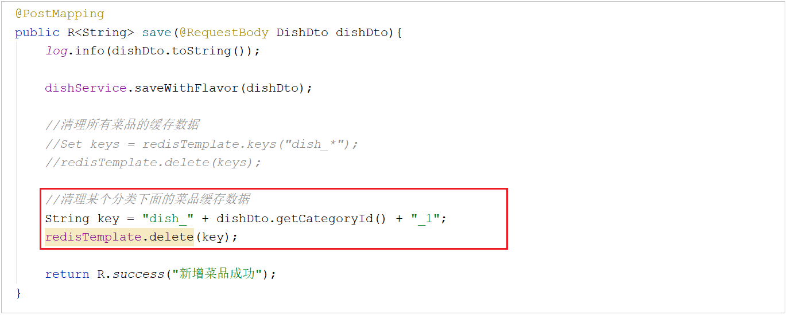 


**2). 更新菜品,清空缓存**

在更新菜品的方法update中，当菜品数据更新完毕之后，需要清空菜品的缓存。这里清理缓存的方式和上述基本一致。

A. 清理所有分类下的菜品缓存

```java
//清理所有菜品的缓存数据
Set keys = redisTemplate.keys("dish_*"); //获取所有以dish_xxx开头的key
redisTemplate.delete(keys); //删除这些key
```


B. 清理当前添加菜品分类下的缓存

```java
//清理某个分类下面的菜品缓存数据
String key = "dish_" + dishDto.getCategoryId() + "_1";
redisTemplate.delete(key);
```

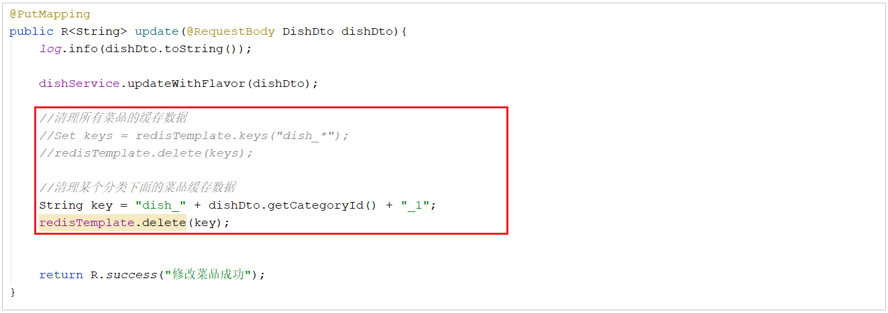 


==注意: 在这里我们推荐使用第一种方式进行清理，这样逻辑更加严谨。 因为对于修改操作，用户是可以修改菜品的分类的，如果用户修改了菜品的分类，那么原来分类下将少一个菜品，新的分类下将多一个菜品，这样的话，两个分类下的菜品列表数据都发生了变化。==


### 3.3 功能测试

代码编写完毕之后,重新启动服务。

1). 访问移动端，根据分类查询菜品列表，然后再检查Redis的缓存数据，是否可以正常缓存；

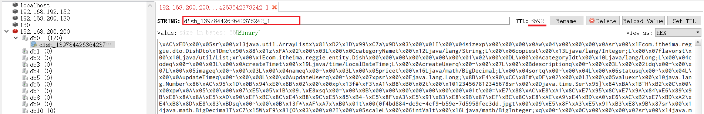 

我们也可以在服务端，通过debug断点的形式一步一步的跟踪代码的执行。


2). 当我们在进行新增及修改菜品时, 查询Redis中的缓存数据, 是否被清除;


### 3.4 提交并推送代码

**1). 提交并推送代码**

在v1.0分支中, 将我们已经实现并且测试通过的使用redis缓存验证码和菜品信息的代码,提交并推送至Gitee

 

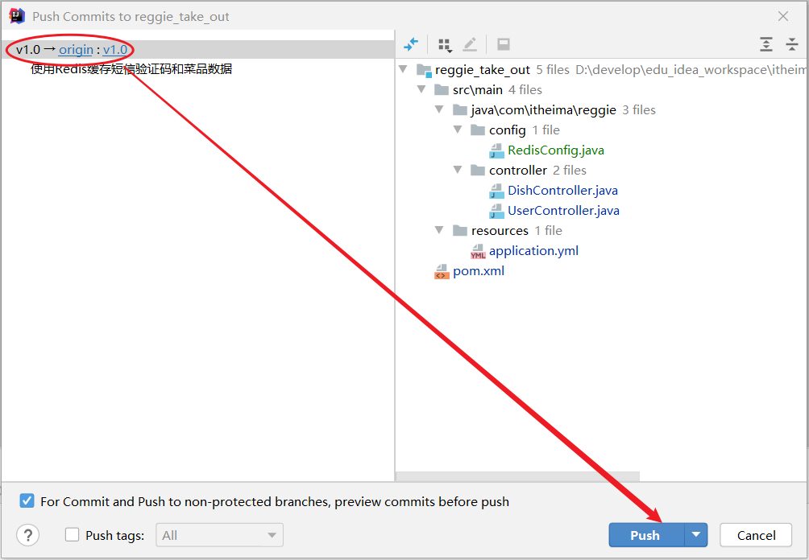 


**2). 合并代码到master分支**

A. 将代码切换到master分支

 


B. 将v1.0分支的代码合并到当前master分支

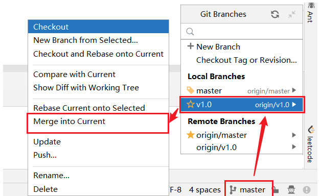 


C. 将master分支合并后代码推送到Gitee

 

 


## 4. SpringCache

### 4.1 介绍

**Spring Cache**是一个框架，实现了基于注解的缓存功能，只需要简单地加一个注解，就能实现缓存功能，大大简化我们在业务中操作缓存的代码。

Spring Cache只是提供了一层抽象，底层可以切换不同的cache实现。具体就是通过**CacheManager**接口来统一不同的缓存技术。CacheManager是Spring提供的各种缓存技术抽象接口。


针对不同的缓存技术需要实现不同的CacheManager：

| **CacheManager**    | **描述**                           |
| ------------------- | ---------------------------------- |
| EhCacheCacheManager | 使用EhCache作为缓存技术            |
| GuavaCacheManager   | 使用Google的GuavaCache作为缓存技术 |
| RedisCacheManager   | 使用Redis作为缓存技术              |


### 4.2 注解

在SpringCache中提供了很多缓存操作的注解，常见的是以下的几个：

| **注解**       | **说明**                                                     |
| -------------- | ------------------------------------------------------------ |
| @EnableCaching | 开启缓存注解功能                                             |
| @Cacheable     | 在方法执行前spring先查看缓存中是否有数据，如果有数据，则直接返回缓存数据；若没有数据，调用方法并将方法返回值放到缓存中 |
| @CachePut      | 将方法的返回值放到缓存中                                     |
| @CacheEvict    | 将一条或多条数据从缓存中删除                                 |


在spring boot项目中，使用缓存技术只需在项目中导入相关缓存技术的依赖包，并在启动类上使用@EnableCaching开启缓存支持即可。

例如，使用Redis作为缓存技术，只需要导入Spring data Redis的maven坐标即可。


### 4.3 入门程序

接下来，我们将通过一个入门案例来演示一下SpringCache的常见用法。 上面我们提到，SpringCache可以集成不同的缓存技术，如Redis、Ehcache甚至我们可以使用Map来缓存数据， 接下来我们在演示的时候，就先通过一个Map来缓存数据，最后我们再换成Redis来缓存。


#### 4.3.1 环境准备

**1). 数据库准备**

将今天资料中的SQL脚本直接导入数据库中。

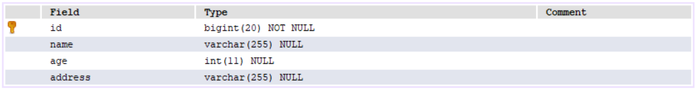 


**2). 导入基础工程**

基础环境的代码，在我们今天的资料中已经准备好了， 大家只需要将这个工程导入进来就可以了。导入进来的工程结构如下： 

 

由于SpringCache的基本功能是Spring核心(spring-context)中提供的，所以目前我们进行简单的SpringCache测试，是可以不用额外引入其他依赖的。


**3). 注入CacheManager**

我们可以在UserController注入一个CacheManager，在Debug时，我们可以通过CacheManager跟踪缓存中数据的变化。

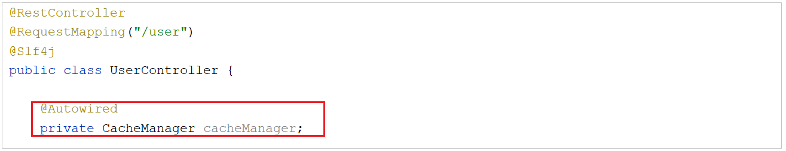 


我们可以看到CacheManager是一个接口，默认的实现有以下几种 ；

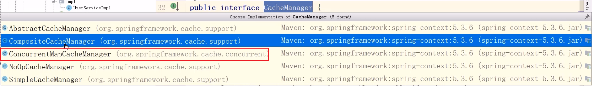 

而在上述的这几个实现中，默认使用的是 ConcurrentMapCacheManager。稍后我们可以通过断点的形式跟踪缓存数据的变化。


**4). 引导类上加@EnableCaching**

在引导类上加该注解，就代表当前项目开启缓存注解功能。

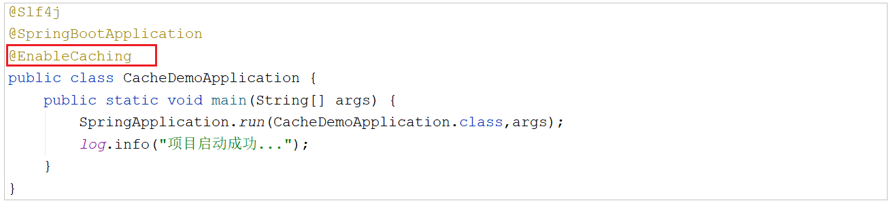 


#### 4.3.2 @CachePut注解

> @CachePut 说明： 
>
> ​	作用: 将方法返回值，放入缓存
>
> ​	value: 缓存的名称, 每个缓存名称下面可以有很多key
>
> ​	key: 缓存的key  ----------> 支持Spring的表达式语言SPEL语法


**1). 在save方法上加注解@CachePut**

当前UserController的save方法是用来保存用户信息的，我们希望在该用户信息保存到数据库的同时，也往缓存中缓存一份数据，我们可以在save方法上加上注解 @CachePut，用法如下： 

```java
/**
* CachePut：将方法返回值放入缓存
* value：缓存的名称，每个缓存名称下面可以有多个key
* key：缓存的key
*/
@CachePut(value = "userCache", key = "#user.id")
@PostMapping
public User save(User user){
    userService.save(user);
    return user;
}
```


> key的写法如下： 
>
> ​	#user.id : #user指的是方法形参的名称, id指的是user的id属性 , 也就是使用user的id属性作为key ;
>
> ​	#user.name: #user指的是方法形参的名称, name指的是user的name属性 ,也就是使用user的name属性作为key ;
>
> ​	
>
> ​	#result.id : #result代表方法返回值，该表达式 代表以返回对象的id属性作为key ；
>
> ​	#result.name : #result代表方法返回值，该表达式 代表以返回对象的name属性作为key ；


**2). 测试**

启动服务,通过postman请求访问UserController的方法, 然后通过断点的形式跟踪缓存数据。

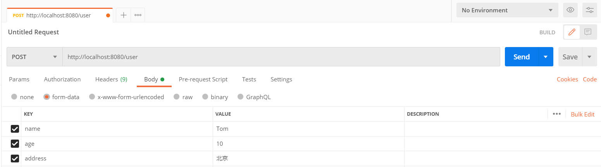


第一次访问时，缓存中的数据是空的，因为save方法执行完毕后才会缓存数据。 

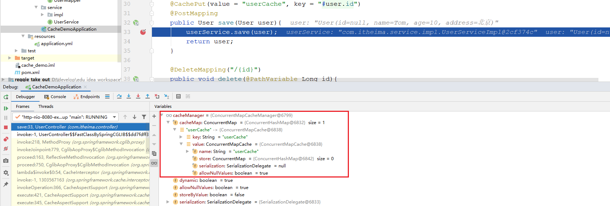 


第二次访问时，我们通过debug可以看到已经有一条数据了，就是上次保存的数据，已经缓存了，缓存的key就是用户的id。

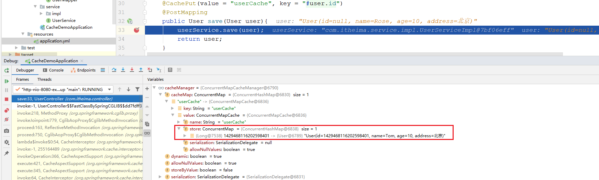 


==注意: 上述的演示，最终的数据，实际上是缓存在ConcurrentHashMap中，那么当我们的服务器重启之后，缓存中的数据就会丢失。 我们后面使用了Redis来缓存就不存在这样的问题了。==


#### 4.3.3 @CacheEvict注解

> @CacheEvict 说明： 
>
> ​	作用: 清理指定缓存
>
> ​	value: 缓存的名称，每个缓存名称下面可以有多个key
>
> ​	key: 缓存的key  ----------> 支持Spring的表达式语言SPEL语法


**1). 在 delete 方法上加注解@CacheEvict**

当我们在删除数据库user表的数据的时候,我们需要删除缓存中对应的数据,此时就可以使用@CacheEvict注解, 具体的使用方式如下: 

```java
/**
* CacheEvict：清理指定缓存
* value：缓存的名称，每个缓存名称下面可以有多个key
* key：缓存的key
*/
@CacheEvict(value = "userCache",key = "#p0")  //#p0 代表第一个参数
//@CacheEvict(value = "userCache",key = "#root.args[0]") //#root.args[0] 代表第一个参数
//@CacheEvict(value = "userCache",key = "#id") //#id 代表变量名为id的参数
@DeleteMapping("/{id}")
public void delete(@PathVariable Long id){
    userService.removeById(id);
}
```


**2). 测试**

要测试缓存的删除，我们先访问save方法4次，保存4条数据到数据库的同时，也保存到缓存中，最终我们可以通过debug看到缓存中的数据信息。 然后我们在通过postman访问delete方法， 如下： 

 


删除数据时，通过debug我们可以看到已经缓存的4条数据：

 


当执行完delete操作之后，我们再次保存一条数据，在保存的时候debug查看一下删除的ID值是否已经被删除。

 


**3). 在 update 方法上加注解@CacheEvict**

在更新数据之后，数据库的数据已经发生了变更，我们需要将缓存中对应的数据删除掉，避免出现数据库数据与缓存数据不一致的情况。

``` java
//@CacheEvict(value = "userCache",key = "#p0.id")   //第一个参数的id属性
//@CacheEvict(value = "userCache",key = "#user.id") //参数名为user参数的id属性
//@CacheEvict(value = "userCache",key = "#root.args[0].id") //第一个参数的id属性
@CacheEvict(value = "userCache",key = "#result.id")         //返回值的id属性
@PutMapping
public User update(User user){
    userService.updateById(user);
    return user;
}
```


加上注解之后，我们可以重启服务，然后测试方式，基本和上述相同，先缓存数据，然后再更新某一条数据，通过debug的形式查询缓存数据的情况。


#### 4.3.4 @Cacheable注解

> @Cacheable 说明:
>
> ​	作用: 在方法执行前，spring先查看缓存中是否有数据，如果有数据，则直接返回缓存数据；若没有数据，调用方法并将方法返回值放到缓存中
>
> ​	value: 缓存的名称，每个缓存名称下面可以有多个key
>
> ​	key: 缓存的key  ----------> 支持Spring的表达式语言SPEL语法


**1). 在getById上加注解@Cacheable**

```java
/**
* Cacheable：在方法执行前spring先查看缓存中是否有数据，如果有数据，则直接返回缓存数据；若没有数据，调用方法并将方法返回值放到缓存中
* value：缓存的名称，每个缓存名称下面可以有多个key
* key：缓存的key
*/
@Cacheable(value = "userCache",key = "#id")
@GetMapping("/{id}")
public User getById(@PathVariable Long id){
    User user = userService.getById(id);
    return user;
}
```


**2). 测试**

我们可以重启服务，然后通过debug断点跟踪程序执行。我们发现，第一次访问，会请求我们controller的方法，查询数据库。后面再查询相同的id，就直接获取到数据库，不用再查询数据库了，就说明缓存生效了。

 


当我们在测试时，查询一个数据库不存在的id值，第一次查询缓存中没有，也会查询数据库。而第二次再查询时，会发现，不再查询数据库了，而是直接返回，那也就是说如果根据ID没有查询到数据,那么会自动缓存一个null值。 我们可以通过debug，验证一下： 

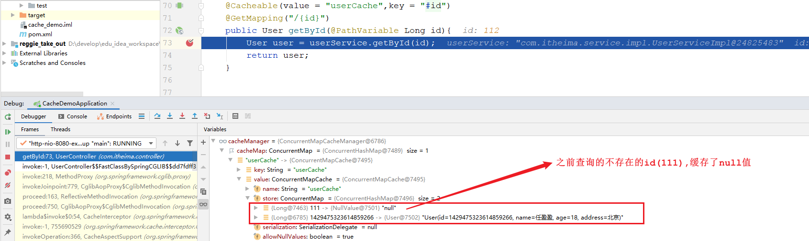 


我们能不能做到，当查询到的值不为null时，再进行缓存，如果为null，则不缓存呢? 答案是可以的。


**3). 缓存非null值**

在@Cacheable注解中，提供了两个属性分别为： condition， unless 。

> condition : 表示满足什么条件, 再进行缓存 ;
>
> unless : 表示满足条件则不缓存 ; 与上述的condition是反向的 ;


具体实现方式如下: 

```java
/**
 * Cacheable：在方法执行前spring先查看缓存中是否有数据，如果有数据，则直接返回缓存数据；若没有数据，调用方法并将方法返回值放到缓存中
 * value：缓存的名称，每个缓存名称下面可以有多个key
 * key：缓存的key
 * condition：条件，满足条件时才缓存数据
 * unless：满足条件则不缓存
 */
@Cacheable(value = "userCache",key = "#id", unless = "#result == null")
@GetMapping("/{id}")
public User getById(@PathVariable Long id){
    User user = userService.getById(id);
    return user;
}
```

==注意： 此处，我们使用的时候只能够使用 unless， 因为在condition中，我们是无法获取到结果 #result的。==


**4). 在list方法上加注解@Cacheable**

在list方法中进行查询时，有两个查询条件，如果传递了id，根据id查询； 如果传递了name， 根据name查询，那么我们缓存的key在设计的时候，就需要既包含id，又包含name。 具体的代码实现如下： 

```java
@Cacheable(value = "userCache",key = "#user.id + '_' + #user.name")
@GetMapping("/list")
public List<User> list(User user){
    LambdaQueryWrapper<User> queryWrapper = new LambdaQueryWrapper<>();
    queryWrapper.eq(user.getId() != null,User::getId,user.getId());
    queryWrapper.eq(user.getName() != null,User::getName,user.getName());
    List<User> list = userService.list(queryWrapper);
    return list;
}
```


然后再次重启服务，进行测试。

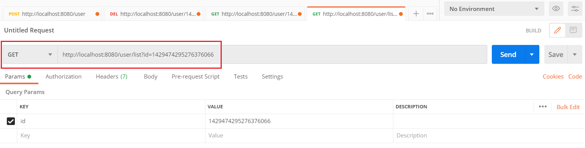 

第一次查询时，需要查询数据库，在后续的查询中，就直接查询了缓存，不再查询数据库了。


### 4.4 集成Redis

在使用上述默认的ConcurrentHashMap做缓存时，服务重启之后，之前缓存的数据就全部丢失了，操作起来并不友好。在项目中使用，我们会选择使用redis来做缓存，主要需要操作以下几步： 

1). pom.xml

```xml
<dependency>
    <groupId>org.springframework.boot</groupId>
    <artifactId>spring-boot-starter-cache</artifactId>
</dependency>

<dependency>
    <groupId>org.springframework.boot</groupId>
    <artifactId>spring-boot-starter-data-redis</artifactId>
</dependency>
```


2). application.yml

```yml
spring:
  redis:
    host: 192.168.200.200
    port: 6379
    password: root@123456
    database: 0
  cache:
    redis:
      time-to-live: 1800000   #设置缓存过期时间，可选
```


3). 测试

重新启动项目，通过postman发送根据id查询数据的请求，然后通过redis的图形化界面工具，查看redis中是否可以正常的缓存数据。

  

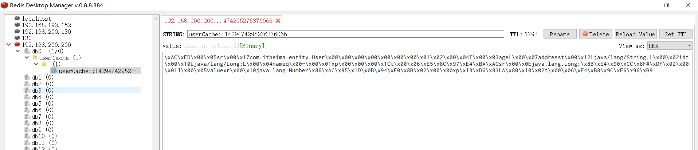


## 5. 缓存套餐数据

### 5.1 实现思路

前面我们已经实现了移动端套餐查看功能，对应的服务端方法为SetmealController的list方法，此方法会根据前端提交的查询条件进行数据库查询操作。在高并发的情况下，频繁查询数据库会导致系统性能下降，服务端响应时间增长。现在需要对此方法进行缓存优化，提高系统的性能。


具体的实现思路如下：

1). 导入Spring Cache和Redis相关maven坐标

2). 在application.yml中配置缓存数据的过期时间

3). 在启动类上加入@EnableCaching注解，开启缓存注解功能

4). 在SetmealController的list方法上加入@Cacheable注解

5). 在SetmealController的save和delete方法上加入CacheEvict注解


### 5.2 缓存套餐数据

#### 5.2.1 代码实现

1). pom.xml中引入依赖

```xml
<dependency>
    <groupId>org.springframework.boot</groupId>
    <artifactId>spring-boot-starter-cache</artifactId>
</dependency>
```

==备注: spring-boot-starter-data-redis 这个依赖前面已经引入了, 无需再次引入。==


2). application.yml中设置缓存过期时间

```yml
spring:  
  cache:
    redis:
      time-to-live: 1800000 #设置缓存数据的过期时间
```


3). 启动类上加入@EnableCaching注解

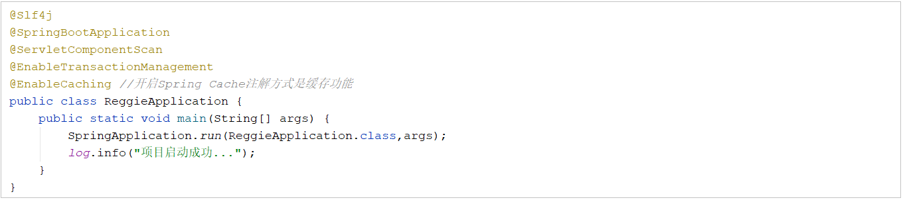 


4). SetmealController的list方法上加入@Cacheable注解

在进行套餐数据查询时，我们需要根据分类ID和套餐的状态进行查询，所以我们在缓存数据时，可以将套餐分类ID和套餐状态组合起来作为key，如： 1627182182_1 (1627182182为分类ID，1为状态)。

```java
/**
* 根据条件查询套餐数据
* @param setmeal
* @return
*/
@GetMapping("/list")
@Cacheable(value = "setmealCache",key = "#setmeal.categoryId + '_' + #setmeal.status")
public R<List<Setmeal>> list(Setmeal setmeal){
    LambdaQueryWrapper<Setmeal> queryWrapper = new LambdaQueryWrapper<>();
    queryWrapper.eq(setmeal.getCategoryId() != null,Setmeal::getCategoryId,setmeal.getCategoryId());
    queryWrapper.eq(setmeal.getStatus() != null,Setmeal::getStatus,setmeal.getStatus());
    queryWrapper.orderByDesc(Setmeal::getUpdateTime);

    List<Setmeal> list = setmealService.list(queryWrapper);

    return R.success(list);
}
```


#### 5.2.2 测试

缓存数据的代码编写完毕之后，重新启动服务，访问移动端进行测试，我们登陆之后在点餐界面，点击某一个套餐分类，查询套餐列表数据时，服务端报错了，错误信息如下： 

 

 


==为什么会报出这个错误呢？==

因为 @Cacheable 会将方法的返回值R缓存在Redis中，而在Redis中存储对象，该对象是需要被序列化的，而对象要想被成功的序列化，就必须得实现 Serializable 接口。而当前我们定义的R，并未实现 Serializable 接口。所以，要解决该异常，只需要让R实现  Serializable 接口即可。如下： 

 


修复完毕之后，再次重新测试，访问套餐分类下对应的套餐列表数据后，我们会看到Redis中确实可以缓存对应的套餐列表数据。

 


### 5.3 清理套餐数据

#### 5.3.1 代码实现

为了保证数据库中数据与缓存数据的一致性，在我们添加套餐或者删除套餐数据之后，需要清空当前套餐缓存的全部数据。那么@CacheEvict注解如何清除某一份缓存下所有的数据呢，这里我们可以指定@CacheEvict中的一个属性 allEnties，将其设置为true即可。


**1). 在delete方法上加注解@CacheEvict**

```java
/**
 * 删除套餐
 * @param ids
 * @return
 */
@DeleteMapping
@CacheEvict(value = "setmealCache",allEntries = true) //清除setmealCache名称下,所有的缓存数据
public R<String> delete(@RequestParam List<Long> ids){
    log.info("ids:{}",ids);
    setmealService.removeWithDish(ids);
    return R.success("套餐数据删除成功");
}
```


**2). 在delete方法上加注解@CacheEvict**

```java
/**
 * 新增套餐
 * @param setmealDto
 * @return
 */
@PostMapping
@CacheEvict(value = "setmealCache",allEntries = true) //清除setmealCache名称下,所有的缓存数据
public R<String> save(@RequestBody SetmealDto setmealDto){
    log.info("套餐信息：{}",setmealDto);

    setmealService.saveWithDish(setmealDto);

    return R.success("新增套餐成功");
}
```


#### 5.3.2 测试

代码编写完成之后,重启工程,然后访问后台管理系统,对套餐数据进行新增 以及 删除, 然后通过Redis的图形化界面工具,查看Redis中的套餐缓存是否已经被删除。


### 5.4 提交推送代码

到目前为止，我们已经在v1.0这个分支中完成了套餐数据的缓存，接下来我们就需要将代码提交并推送到远程仓库。

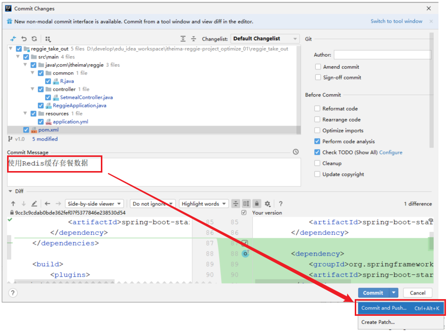 

然后，在idea中切换到master分支，然后将v1.0分支的代码合并到master。

 


再将合并后的master分支的代码，推送到远程仓库。

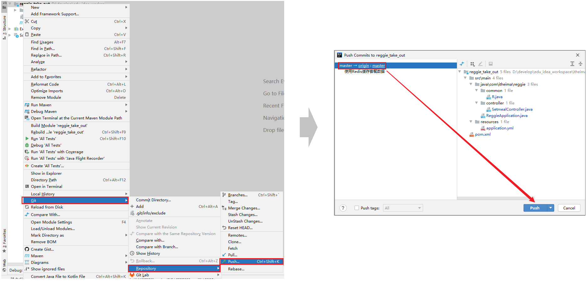 


# MySQL主从复制- 读写分离案例- 项目实现读写分离- Nginx-概述- Nginx-命令- Nginx-应用

## 课程内容

- MySQL主从复制
- 读写分离案例
- 项目实现读写分离
- Nginx-概述
- Nginx-命令
- Nginx-应用


## 前言

> 1). 存在的问题

在前面基础功能实现的过程中，我们后台管理系统及移动端的用户，在进行数据访问时，都是直接操作数据库MySQL的。结构如下图： 

 

而在当前，MySQL服务器只有一台，那么就可能会存在如下问题： 

1). 读和写所有压力都由一台数据库承担，压力大

2). 数据库服务器磁盘损坏则数据丢失，单点故障


> 2). 解决方案

为了解决上述提到的两个问题，我们可以准备两台MySQL，一台主(Master)服务器，一台从(Slave)服务器，主库的数据变更，需要同步到从库中(主从复制)。而用户在访问我们项目时，如果是写操作(insert、update、delete)，则直接操作主库；如果是读(select)操作，则直接操作从库(在这种读写分离的结构中，从库是可以有多个的)，这种结构我们称为 读写分离 。

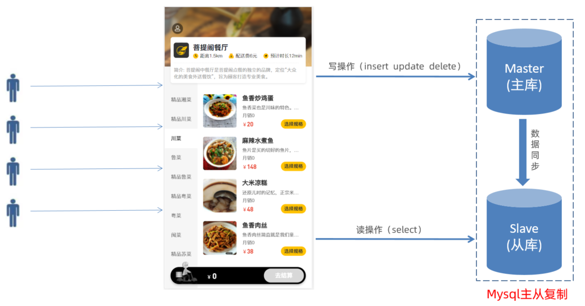 

今天我们就需要实现上述的架构，来解决业务开发中所存在的问题。


## 1. MySQL主从复制

MySQL数据库默认是支持主从复制的，不需要借助于其他的技术，我们只需要在数据库中简单的配置即可。接下来，我们就从以下的几个方面，来介绍一下主从复制：


### 1.1 介绍

MySQL主从复制是一个异步的复制过程，底层是基于Mysql数据库自带的 **二进制日志** 功能。就是一台或多台MySQL数据库（slave，即**从库**）从另一台MySQL数据库（master，即**主库**）进行日志的复制，然后再解析日志并应用到自身，最终实现 **从库** 的数据和 **主库** 的数据保持一致。MySQL主从复制是MySQL数据库自带功能，无需借助第三方工具。

> **二进制日志：** 
>
> ​	二进制日志（BINLOG）记录了所有的 DDL（数据定义语言）语句和 DML（数据操纵语言）语句，但是不包括数据查询语句。此日志对于灾难时的数据恢复起着极其重要的作用，MySQL的主从复制， 就是通过该binlog实现的。默认MySQL是未开启该日志的。


**MySQL的主从复制原理如下：** 

 


**MySQL复制过程分成三步：**

1). MySQL master 将数据变更写入二进制日志( binary log)

2). slave将master的binary log拷贝到它的中继日志（relay log）

3). slave重做中继日志中的事件，将数据变更反映它自己的数据


### 1.2 搭建

#### 1.2.1 准备工作

提前准备两台服务器，并且在服务器中安装MySQL，服务器的信息如下：

| 数据库 | IP              | 数据库版本 |
| ------ | --------------- | ---------- |
| Master | 192.168.200.200 | 5.7.25     |
| Slave  | 192.168.200.201 | 5.7.25     |


**并在两台服务器上做如下准备工作:** 

1). 防火墙开放3306端口号

```
firewall-cmd --zone=public --add-port=3306/tcp --permanent

firewall-cmd --zone=public --list-ports
```

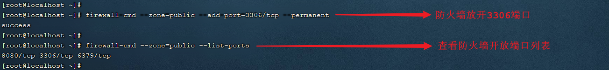 


2). 并将两台数据库服务器启动起来：

```
systemctl start mysqld
```

登录MySQL，验证是否正常启动

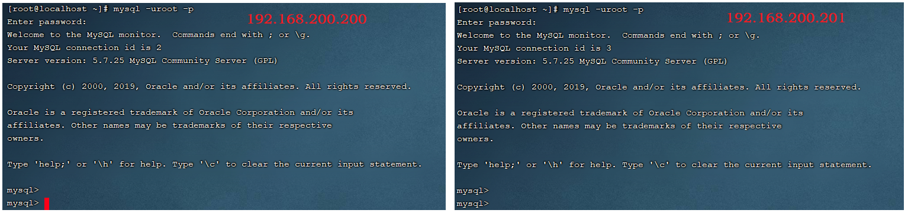 


#### 1.2.2 主库配置

> 服务器： 192.168.200.200


**1). 修改Mysql数据库的配置文件/etc/my.cnf**

在最下面增加配置: 

```
log-bin=mysql-bin   #[必须]启用二进制日志
server-id=200       #[必须]服务器唯一ID(唯一即可)
```

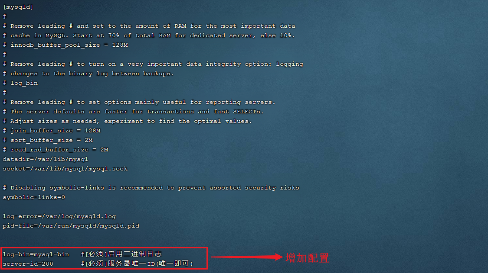 


**2). 重启Mysql服务**

执行指令： 

```
 systemctl restart mysqld
```

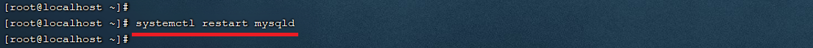 


**3). 创建数据同步的用户并授权**

登录mysql，并执行如下指令，创建用户并授权：

```sql
GRANT REPLICATION SLAVE ON *.* to 'xiaoming'@'%' identified by 'Root@123456';
```

==注：上面SQL的作用是创建一个用户 xiaoming ，密码为 Root@123456 ，并且给xiaoming用户授予REPLICATION SLAVE权限。常用于建立复制时所需要用到的用户权限，也就是slave必须被master授权具有该权限的用户，才能通过该用户复制。==


> MySQL密码复杂程度说明: 
>
> ​	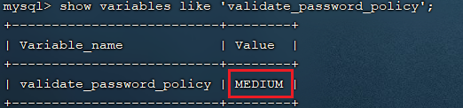 
>
> ​	目前mysql5.7默认密码校验策略等级为 MEDIUM , 该等级要求密码组成为: 数字、小写字母、大写字母 、特殊字符、长度至少8位


**4). 登录Mysql数据库，查看master同步状态**

执行下面SQL，记录下结果中**File**和**Position**的值

```
show master status;
```

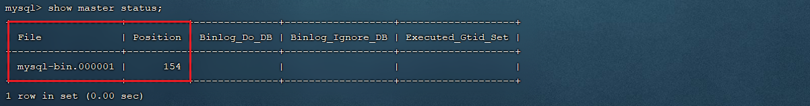 


==注：上面SQL的作用是查看Master的状态，执行完此SQL后不要再执行任何操作==


#### 1.2.3 从库配置

> 服务器： 192.168.200.201


**1). 修改Mysql数据库的配置文件/etc/my.cnf**

```
server-id=201 	#[必须]服务器唯一ID
```

 


**2). 重启Mysql服务**

```
systemctl restart mysqld
```


**3). 登录Mysql数据库，设置主库地址及同步位置**

```
change master to master_host='192.168.200.200',master_user='xiaoming',master_password='Root@123456',master_log_file='mysql-bin.000001',master_log_pos=154;

start slave;
```

> 参数说明： 
>
> ​	A. master_host : 主库的IP地址
>
> ​	B. master_user : 访问主库进行主从复制的用户名(上面在主库创建的)
>
> ​	C. master_password : 访问主库进行主从复制的用户名对应的密码
>
> ​	D. master_log_file : 从哪个日志文件开始同步(上述查询master状态中展示的有)
>
> ​	E. master_log_pos : 从指定日志文件的哪个位置开始同步(上述查询master状态中展示的有)


**4). 查看从数据库的状态**

```
show slave status;
```

然后通过状态信息中的 Slave_IO_running 和 Slave_SQL_running 可以看出主从同步是否就绪，如果这两个参数全为Yes，表示主从同步已经配置完成。

 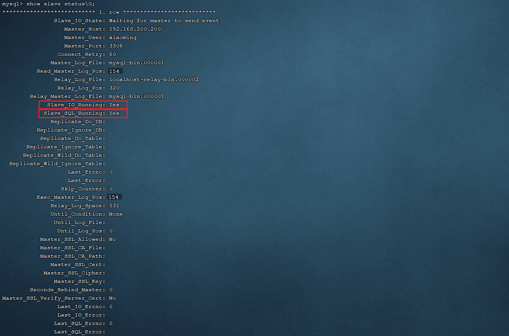


> MySQL命令行技巧： 
>
> ​	\G : 在MySQL的sql语句后加上\G，表示将查询结果进行按列打印，可以使每个字段打印到单独的行。即将查到的结构旋转90度变成纵向；


### 1.3 测试

主从复制的环境,已经搭建好了,接下来,我们可以通过Navicat连接上两台MySQL服务器,进行测试。测试时，我们只需要在主库Master执行操作，查看从库Slave中是否将数据同步过去即可。

1). 在master中创建数据库itcast, 刷新slave查看是否可以同步过去

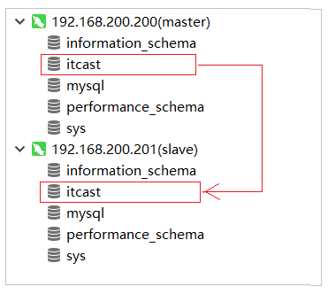 


2). 在master的itcast数据下创建user表, 刷新slave查看是否可以同步过去

 


3). 在master的user表中插入一条数据, 刷新slave查看是否可以同步过去

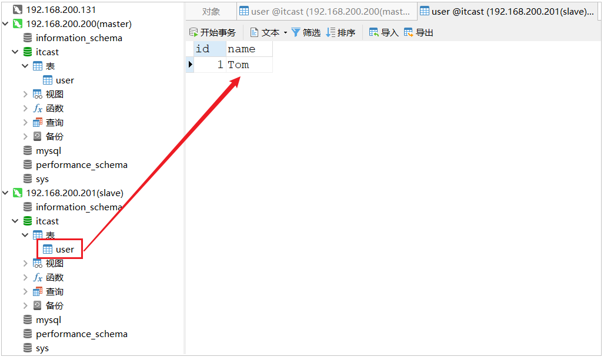 


## 2. 读写分离案例

### 2.1 背景介绍

面对日益增加的系统访问量，数据库的吞吐量面临着巨大瓶颈。 对于同一时刻有大量并发读操作和较少写操作类型的应用系统来说，将数据库拆分为**主库**和**从库**，主库负责处理事务性的增删改操作，从库负责处理查询操作，能够有效的避免由数据更新导致的行锁，使得整个系统的查询性能得到极大的改善。

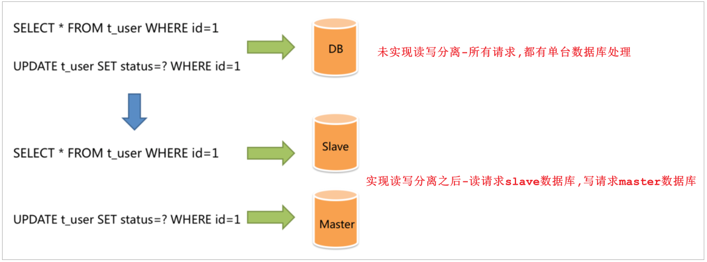 

通过读写分离,就可以降低单台数据库的访问压力, 提高访问效率，也可以避免单机故障。

主从复制的结构，我们在第一节已经完成了，那么我们在项目中，如何通过java代码来完成读写分离呢，如何在执行select的时候查询从库，而在执行insert、update、delete的时候，操作主库呢？这个时候，我们就需要介绍一个新的技术 ShardingJDBC。


### 2.2 ShardingJDBC介绍

Sharding-JDBC定位为轻量级Java框架，在Java的JDBC层提供的额外服务。 它使用客户端直连数据库，以jar包形式提供服务，无需额外部署和依赖，可理解为增强版的JDBC驱动，完全兼容JDBC和各种ORM框架。

使用Sharding-JDBC可以在程序中轻松的实现数据库读写分离。


Sharding-JDBC具有以下几个特点： 

1). 适用于任何基于JDBC的ORM框架，如：JPA, Hibernate, Mybatis, Spring JDBC Template或直接使用JDBC。

2). 支持任何第三方的数据库连接池，如：DBCP, C3P0, BoneCP, Druid, HikariCP等。

3). 支持任意实现JDBC规范的数据库。目前支持MySQL，Oracle，SQLServer，PostgreSQL以及任何遵循SQL92标准的数据库。


依赖: 

```xml
<dependency>
    <groupId>org.apache.shardingsphere</groupId>
    <artifactId>sharding-jdbc-spring-boot-starter</artifactId>
    <version>4.0.0-RC1</version>
</dependency>
```


### 2.3 数据库环境

在主库中创建一个数据库rw, 并且创建一张表， 该数据库及表结构创建完毕后会自动同步至从数据库，SQL语句如下： 

```SQL
create database rw default charset utf8mb4;

use rw;

CREATE TABLE `user` (
  `id` int(11) NOT NULL AUTO_INCREMENT,
  `name` varchar(255) DEFAULT NULL,
  `age` int(11) DEFAULT NULL,
  `address` varchar(255) DEFAULT NULL,
  PRIMARY KEY (`id`)
) ENGINE=InnoDB DEFAULT CHARSET=utf8mb4;
```


 


### 2.4 初始工程导入

我们本案例主要是演示一下读写分离操作，对于基本的增删改查的业务操作，我们就不再去编写了，我们可以直接导入资料中提供的demo工程（rw_demo），在demo工程中，我们已经完成了user的增删改查操作，具体的工程结构如下： 

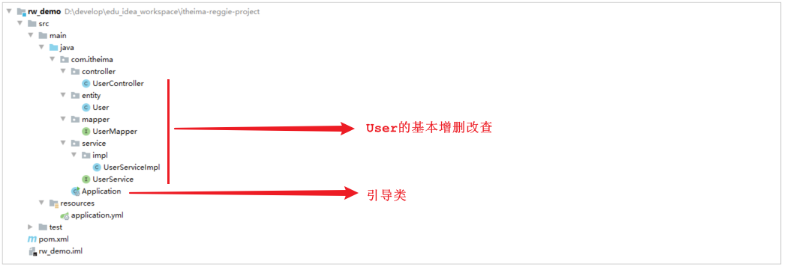 


### 2.5 读写分离配置

1). 在pom.xml中增加shardingJdbc的maven坐标

```xml
<dependency>
    <groupId>org.apache.shardingsphere</groupId>
    <artifactId>sharding-jdbc-spring-boot-starter</artifactId>
    <version>4.0.0-RC1</version>
</dependency>
```


2). 在application.yml中增加数据源的配置

```yml
spring:
  shardingsphere:
    datasource:
      names:
        master,slave
      # 主数据源
      master:
        type: com.alibaba.druid.pool.DruidDataSource
        driver-class-name: com.mysql.cj.jdbc.Driver
        url: jdbc:mysql://192.168.200.200:3306/rw?characterEncoding=utf-8
        username: root
        password: root
      # 从数据源
      slave:
        type: com.alibaba.druid.pool.DruidDataSource
        driver-class-name: com.mysql.cj.jdbc.Driver
        url: jdbc:mysql://192.168.200.201:3306/rw?characterEncoding=utf-8
        username: root
        password: root
    masterslave:
      # 读写分离配置
      load-balance-algorithm-type: round_robin #轮询
      # 最终的数据源名称
      name: dataSource
      # 主库数据源名称
      master-data-source-name: master
      # 从库数据源名称列表，多个逗号分隔
      slave-data-source-names: slave
    props:
      sql:
        show: true #开启SQL显示，默认false
```


配置解析: 

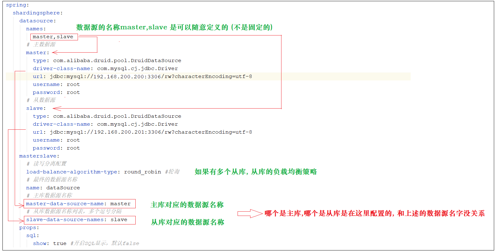 


3). 在application.yml中增加配置

```yml
spring:  
  main:
    allow-bean-definition-overriding: true
```

该配置项的目的,就是如果当前项目中存在同名的bean,后定义的bean会覆盖先定义的。


==如果不配置该项，项目启动之后将会报错：== 

 

报错信息表明，在声明 org.apache.shardingsphere.shardingjdbc.spring.boot 包下的SpringBootConfiguration中的dataSource这个bean时出错, 原因是有一个同名的 dataSource 的bean在com.alibaba.druid.spring.boot.autoconfigure包下的DruidDataSourceAutoConfigure类加载时已经声明了。

 

 

而我们需要用到的是 shardingjdbc包下的dataSource，所以我们需要配置上述属性，让后加载的覆盖先加载的。


### 2.6 测试

我们使用shardingjdbc来实现读写分离，直接通过上述简单的配置就可以了。配置完毕之后，我们就可以重启服务，通过postman来访问controller的方法，来完成用户信息的增删改查，我们可以通过debug及日志的方式来查看每一次执行增删改查操作，使用的是哪个数据源，连接的是哪个数据库。

**1). 保存数据**

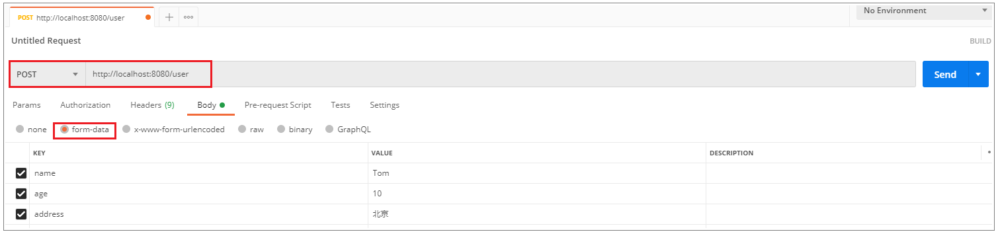 

控制台输出日志，可以看到操作master主库：

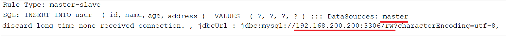  


**2). 修改数据**

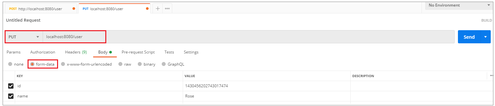 

控制台输出日志，可以看到操作master主库：

  


**3). 查询数据**

 

控制台输出日志，可以看到操作slave主库： 

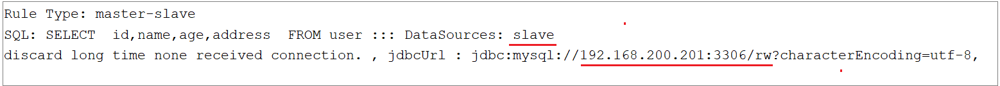 


**4). 删除数据**

 

控制台输出日志，可以看到操作master主库：

 


## 3. 项目实现读写分离

### 3.1 数据库环境准备

直接使用我们前面在虚拟机中搭建的主从复制的数据库环境即可。在主库中创建瑞吉外卖项目的业务数据库reggie, 并导入相关表结构和数据(我们可以将自己之前在本地开发时使用的数据库数据导出, 然后导入到服务器中的主库即可)。

**1). 将自己本地的reggie数据库的数据导出SQL文件**

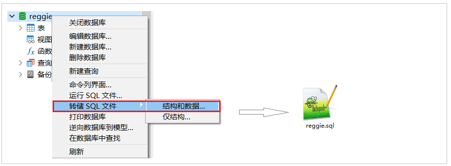 

这样做的话，我们之前自己开发时，添加的测试数据都还在的，便于测试。


**2). 在主数据库master中，创建数据库reggie，并导入该SQL文件**

master中创建数据库，会自动同步至slave从库

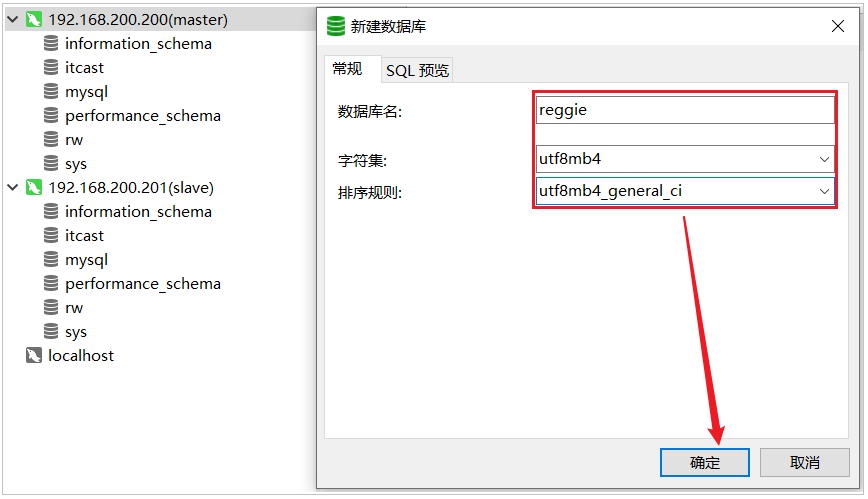 

在master的reggie中导入sql文件

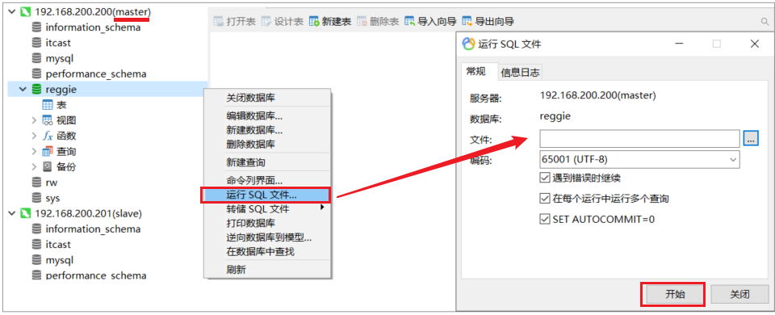 


### 3.2 创建Git分支

目前默认git中有两个分支master 和 v1.0 ，我们接下来进行读写分离的优化，就不在master和v1.0分支来操作了，我们需要在git上创建一个单独的分支v1.1，读写分离的优化，我们就在该分支上进行操作。具体创建分支的操作，和前面演示的一致。

当前创建的v1.1分支，是基于master分支创建出来的，所以目前master分支的代码， 和v1.1分支的代码是完全一样的，接下来把v1.1的代码也推送至远程仓库。


### 3.3 读写分离配置

**1). 在项目的pom.xml增加依赖**

```xml
<dependency>
    <groupId>org.apache.shardingsphere</groupId>
    <artifactId>sharding-jdbc-spring-boot-starter</artifactId>
    <version>4.0.0-RC1</version>
</dependency>
```


**2). 在项目的application.yml中配置数据源相关信息**

```yml
spring:
  shardingsphere:
    datasource:
      names:
        master,slave
      # 主数据源
      master:
        type: com.alibaba.druid.pool.DruidDataSource
        driver-class-name: com.mysql.cj.jdbc.Driver
        url: jdbc:mysql://192.168.200.200:3306/reggie?characterEncoding=utf-8
        username: root
        password: root
      # 从数据源
      slave:
        type: com.alibaba.druid.pool.DruidDataSource
        driver-class-name: com.mysql.cj.jdbc.Driver
        url: jdbc:mysql://192.168.200.201:3306/reggie?characterEncoding=utf-8
        username: root
        password: root
    masterslave:
      # 读写分离配置
      load-balance-algorithm-type: round_robin #轮询
      # 最终的数据源名称
      name: dataSource
      # 主库数据源名称
      master-data-source-name: master
      # 从库数据源名称列表，多个逗号分隔
      slave-data-source-names: slave
    props:
      sql:
        show: true #开启SQL显示，默认false
  main:
    allow-bean-definition-overriding: true
```


### 3.4 功能测试

配置完毕之后，我们启动项目进行测试，直接访问系统管理后台的页面，然后执行相关业务操作，看控制台输出的日志信息即可。

查询操作： 

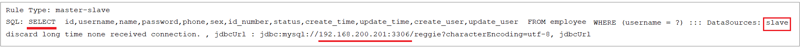 


更新操作：

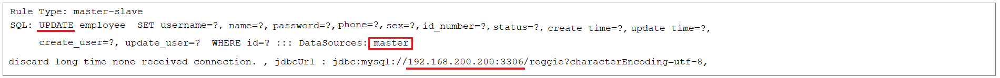 


插入操作：

 


删除操作：

 


### 3.5 Git合并代码

读写分离的功能我们已经实现完毕了，那么接下来，我们就可以将当前分支v1.1代码提交并推送到远程仓库。

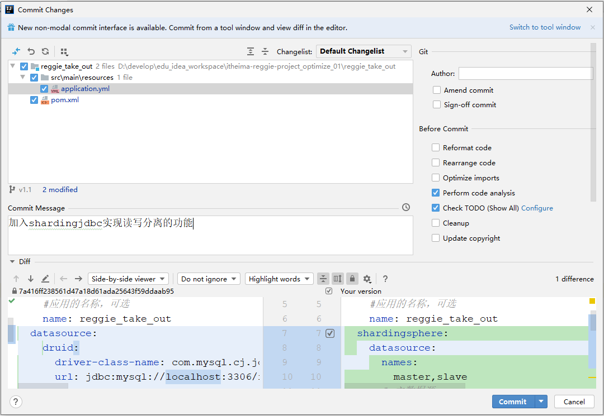 

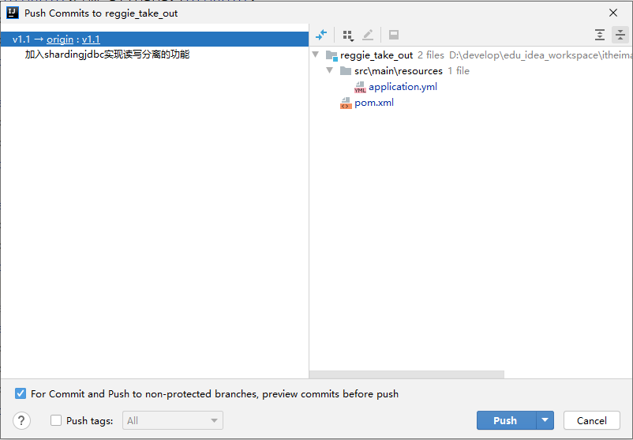 


然后，再将v1.1的代码，合并到master分支，然后推送至远程仓库。

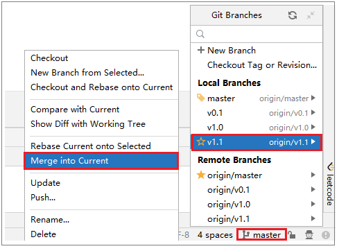 


## 4. Nginx-概述

### 4.1 介绍

 

Nginx是一款轻量级的Web服务器/反向代理服务器及电子邮件（IMAP/POP3）代理服务器。其特点是占有内存少，并发能力强，事实上nginx的并发能力在同类型的网页服务器中表现较好，中国大陆使用nginx的网站有：百度、京东、新浪、网易、腾讯、淘宝等。


Nginx是由**伊戈尔·赛索耶夫**为俄罗斯访问量第二的Rambler.ru站点（俄文：Рамблер）开发的，第一个公开版本0.1.0发布于2004年10月4日。


官网：https://nginx.org/


### 4.2 下载和安装

#### 4.2.1 下载

在Nginx的官网的下载页面中(http://nginx.org/en/download.html)，就展示了当前Nginx版本，并提供了下载的连接。 如下： 

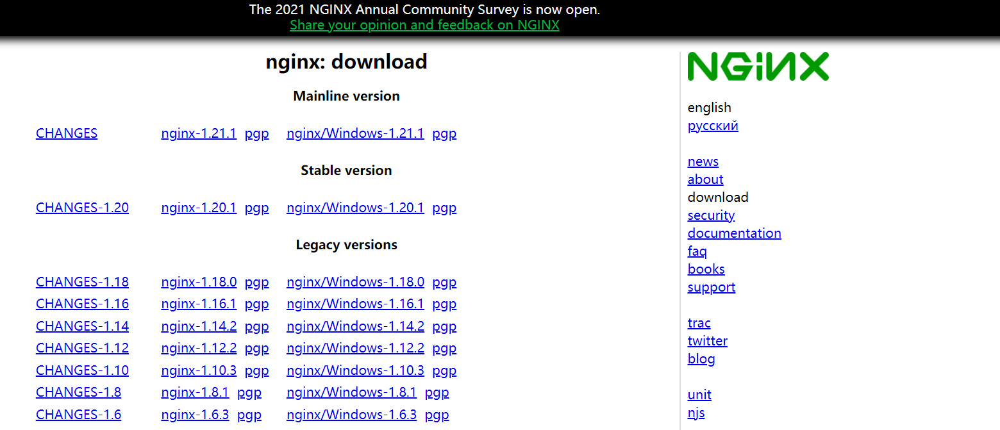 

在本项目中，我们所学习的Nginx选择的是稳定版本的1.16这个版本，我们可以直接从官网下载，当然在我们的课程资料中也已经提供了该版本的安装包。

 


#### 4.2.2 安装

**1). 安装依赖包**

由于nginx是基于c语言开发的，所以需要安装c语言的编译环境，及正则表达式库等第三方依赖库。

```
yum -y install gcc pcre-devel zlib-devel openssl openssl-devel
```


**2). 下载Nginx安装包**

```
yum install wget
wget https://nginx.org/download/nginx-1.16.1.tar.gz
```

> wget : 
>
> ​	wget命令用来从指定的URL下载文件。wget非常稳定，它在带宽很窄的情况下和不稳定网络中有很强的适应性，如果是由于网络的原因下载失败，wget会不断的尝试，直到整个文件下载完毕。如果是服务器打断下载过程，它会再次联到服务器上从停止的地方继续下载。

执行完wget指令后，就会在当前所在目录看到下载下来的文件。


**3). 解压nginx压缩包**

```
tar -zxvf nginx-1.16.1.tar.gz
```


**4). 配置Nginx编译环境**

```
cd nginx-1.16.1
./configure --prefix=/usr/local/nginx
```

说明: 

​	--prefix 指定的目录，就是我们安装Nginx的目录。


**5). 编译&安装**

```
make & make install
```


### 4.3 目录结构

安装完Nginx后，我们可以切换到Nginx的安装目录(/usr/local/nginx)，先来熟悉一下Nginx的目录结构，如下图：

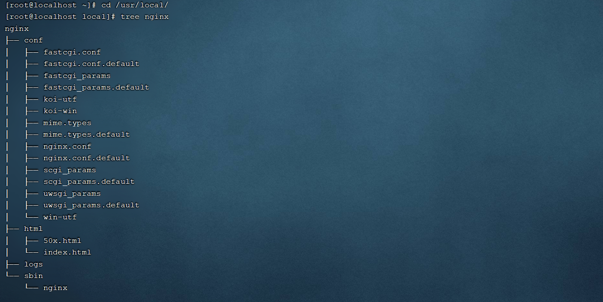 

> 备注： 
>
> ​	上述我们用到的一个指令 tree，该指令可以将我们指定的目录以树状结构展示出来。如果没有这个指令，可以通过以下指令进行安装。
>
> ​	yum install tree


重点目录和文件如下: 

| 目录/文件       | 说明                                | 备注                                                      |
| --------------- | ----------------------------------- | --------------------------------------------------------- |
| conf            | 配置文件的存放目录                  |                                                           |
| conf/nginx.conf | Nginx的核心配置文件                 | conf下有很多nginx的配置文件，我们主要操作这个核心配置文件 |
| html            | 存放静态资源(html, css, )           | 部署到Nginx的静态资源都可以放在html目录中                 |
| logs            | 存放nginx日志(访问日志、错误日志等) |                                                           |
| sbin/nginx      | 二进制文件，用于启动、停止Nginx服务 |                                                           |


## 5. Nginx-命令

### 5.1 常用命令

Nginx中，我们的二进制可执行文件(nginx)存放在sbin目录下，虽然只有一个可执行文件，但是我们可以通过该指令配合不同的参数达到更加强大的功能。接下来，我们就演示一下Nginx常见指令, 在执行下面的指令时,都需要在/usr/local/nginx/sbin/目录下执行。


**1). 查看版本**

```
./nginx -v
```

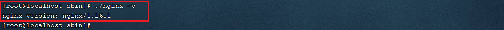 


**2). 检查配置文件**

修改了nginx.conf核心配置文件之后，在启动Nginx服务之前，可以先检查一下conf/nginx.conf文件配置的是否有错误，命令如下：

```
./nginx -t
```

 


**3). 启动**

```
./nginx
```

启动之后，我们可以通过ps -ef指令来查看nginx的进程是否存在。

 

注意： nginx服务启动后，默认就会有两个进程。


启动之后，我们可以直接访问Nginx的80端口， http://192.168.200.200

 


> 注意：
>
> ​	要想正常访问Nginx，需要关闭防火墙或开放指定端口号，执行的指令如下： 
>
> ​	A. 关闭防火墙
>
> ​		systemctl stop firewalld
>
> ​	B. 开放80端口
>
> ​		firewall-cmd --zone=public --add-port=80/tcp --permanent
>
> ​		firewall-cmd --reload


**4). 停止**

```
./nginx -s stop
```

停止之后，我们可以查看nginx的进程： 

```
ps -ef|grep nginx
```

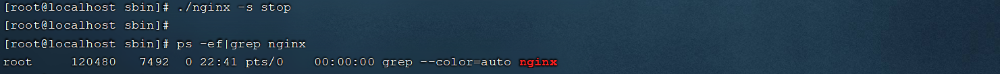 


**5). 重新加载**

当修改了Nginx配置文件后，需要重新加载才能生效，可以使用下面命令重新加载配置文件：

```
./nginx -s reload
```


### 5.2 环境变量配置

在上述我们在使用nginx命令在进行服务的启动、停止、重新加载时，都需要用到一个指令nginx，而这个指令是在nginx/sbin目录下的，我们每一次使用这个指令都需要切换到sbin目录才可以，使用相对繁琐。那么我们能不能在任意目录下都可以执行该指令来操作nginx呢？答案是可以的，配置nginx的环境变量即可。


通过vim编辑器，打开/etc/profile文件, 在PATH环境变量中增加nginx的sbin目录，如下： 

 

修改完配置文件之后，需要执行 source /etc/profile 使文件生效。 接下来，我们就可以在任意目录下执行nginx的指令了，如： 

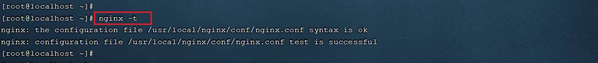 


## 6. Nginx-应用

介绍了并安装了Nginx之后，本章节将要讲解的是Nginx的使用，我们主要从以下四个方面进行讲解。

### 6.1 配置文件结构

nginx的配置文件(conf/nginx.conf)整体上分为三部分: 全局块、events块、http块。这三块的分别配置什么样的信息呢，看下表： 

| 区域     | 职责                                     |
| -------- | ---------------------------------------- |
| 全局块   | 配置和nginx运行相关的全局配置            |
| events块 | 配置和网络连接相关的配置                 |
| http块   | 配置代理、缓存、日志记录、虚拟主机等配置 |


具体结构图如下: 

 

> 在全局块、events块以及http块中，我们经常配置的是http块。
>
> 在http块中可以包含多个server块,每个server块可以配置多个location块。


### 6.2 部署静态资源

#### 6.2.1 介绍

Nginx可以作为静态web服务器来部署静态资源。这里所说的静态资源是指在服务端真实存在，并且能够直接展示的一些文件，比如常见的html页面、css文件、js文件、图片、视频等资源。

相对于Tomcat，Nginx处理静态资源的能力更加高效，所以在生产环境下，一般都会将静态资源部署到Nginx中。

将静态资源部署到Nginx非常简单，只需要将文件复制到Nginx安装目录下的html目录中即可。

```properties
server {
    listen 80;				#监听端口	
    server_name localhost;	#服务器名称
    location / {			#匹配客户端请求url
        root html;			#指定静态资源根目录
        index index.html;	#指定默认首页
    }
}
```


#### 6.2.2 测试

在资料中，我们提供了一个静态的html文件，我们需要将这个文件部署到nginx中，然后通过nginx访问html静态资源。


**1). 将静态资源上传到 /usr/local/nginx/html 目录**

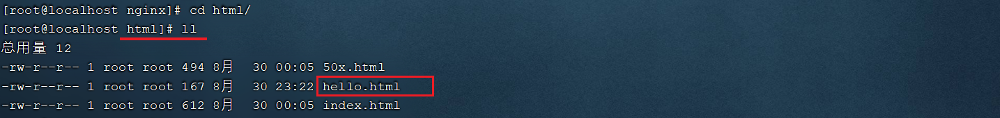 


**2). 启动nginx**

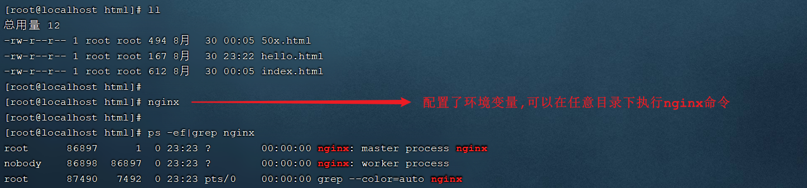 


**3). 访问**

http://192.168.200.200/hello.html

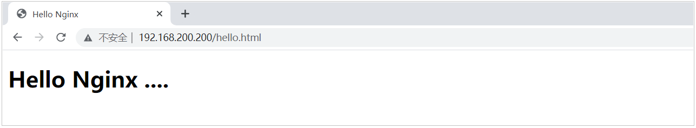 


http://192.168.200.200 ， 访问该地址，访问的是nginx的默认首页

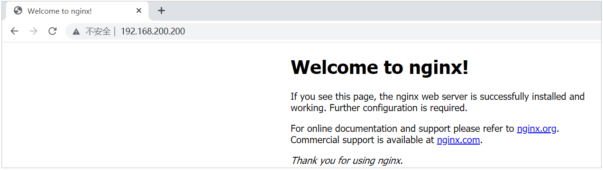 


**4). 配置首页**

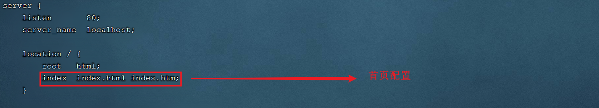 

如果我们需要将hello.html作为nginx的首页，可以修改location的index指令，配置为hello.html，如下：

 

配置完毕后，我们可以通过指令，来检查配置文件是否配置正确： nginx -t

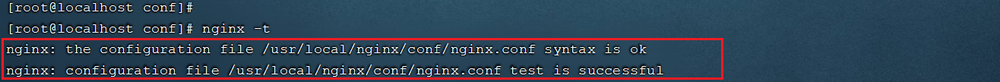 

配置文件修改了，我们需要重新加载一下，才可以生效： 

```
nginx -s reload
```


**5). 访问**

http://192.168.200.200

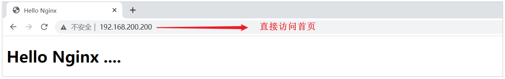 


### 6.3 反向代理

#### 6.3.1 概念介绍

1). 正向代理

正向代理服务器是一个位于客户端和原始服务器(origin server)之间的服务器，为了从原始服务器取得内容，客户端向代理发送一个请求并指定目标(原始服务器)，然后代理向原始服务器转交请求并将获得的内容返回给客户端。

正向代理的典型用途是为在防火墙内的局域网客户端提供访问Internet的途径。

正向代理一般是**在客户端设置代理服务器**，通过代理服务器转发请求，最终访问到目标服务器。

 


2). 反向代理

反向代理服务器位于用户与目标服务器之间，但是对于用户而言，反向代理服务器就相当于目标服务器，即用户直接访问反向代理服务器就可以获得目标服务器的资源，反向代理服务器负责将请求转发给目标服务器。用户不需要知道目标服务器的地址，也无须在用户端作任何设定，对于用户来说，访问反向代理服务器是完全无感知的。

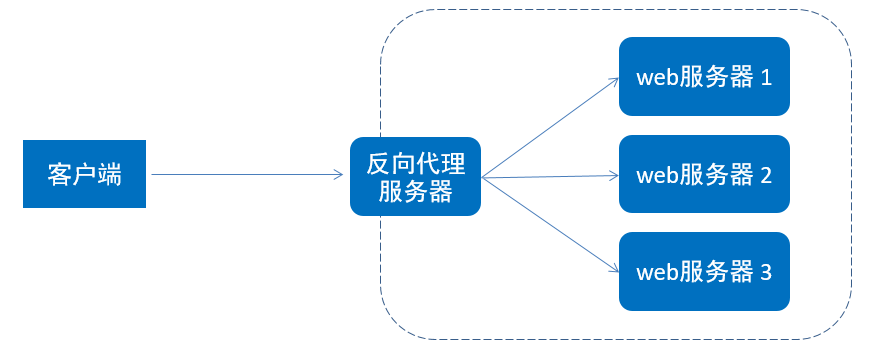 

那么在本小节，我们就是要使用nginx来作为反向代理服务器使用。 在nginx中，我们可以在nginx.conf中配置反向代理: 

```properties
server {
    listen 82;
    server_name localhost;
    location / {
        proxy_pass http://192.168.200.201:8080; 	#反向代理配置，将请求转发到指定服务
    }
}
```

上述配置的含义为: 当我们访问nginx的82端口时，根据反向代理配置，会将请求转发到 http://192.168.200.201:8080 对应的服务上。


#### 6.3.2 测试

需求: 在192.168.200.201这台服务器中部署了java应用，运行端口为8080，并提供了一个可访问的链接 /hello。现在我们需要在访问nginx的82端口时，通过nginx将请求转发到192.168.200.201:8080的服务。

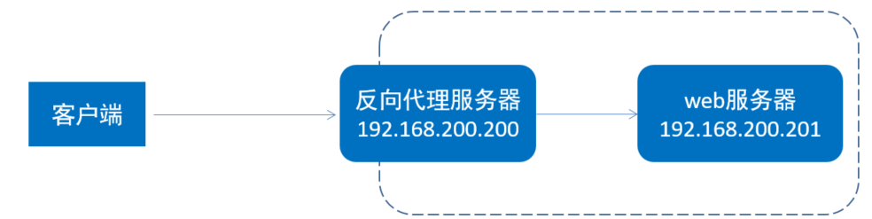 


**1). 在192.168.200.201部署服务并启动**

将资料中提供的 helloworld-1.0-SNAPSHOT.jar 上传到服务器端，并通过指令 java -jar helloworld-1.0-SNAPSHOT.jar 运行服务。

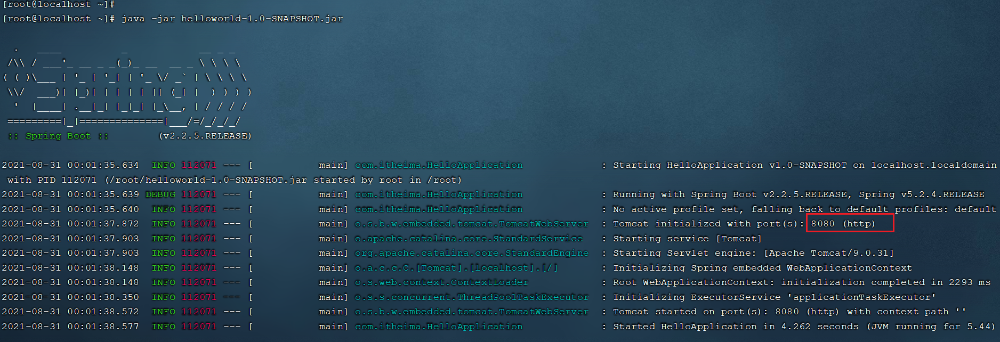 


**2). 在192.168.200.200中的nginx.conf中配置反向代理**

进入nginx的安装目录，并编辑配置文件nginx.conf:

```
cd /usr/local/nginx/conf/
vim nginx.conf
```


在http块中,再添加一个server块虚拟主机的配置,监听82端口,并配置反向代理proxy_pass: 

```
server {
    listen 82;
    server_name localhost;
    location / {
        proxy_pass http://192.168.200.201:8080; 	#反向代理配置，将请求转发到指定服务
    }
}
```

 


**3). 检查配置文件，并重新加载**

```
nginx -t
```

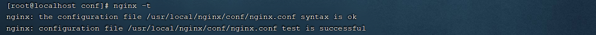 


```
nginx -s reload
```


**4). 访问**

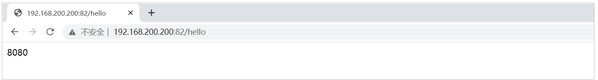 


==注意: 在访问82端口时，有可能访问不通，原因是以为防火墙中没有开放端口号。我们可以通过两种方式来解决该问题：== 

==A. 关闭防火墙== 

```
systemctl stop firewalld
```

==B. 开发指定端口==

```
firewall-cmd --zone=public --add-port=82/tcp --permanent

firewall-cmd --reload
```


### 6.4 负载均衡

#### 6.4.1 概念介绍

早期的网站流量和业务功能都比较简单，单台服务器就可以满足基本需求，但是随着互联网的发展，业务流量越来越大并且业务逻辑也越来越复杂，单台服务器的性能及单点故障问题就凸显出来了，因此需要多台服务器组成应用集群，进行性能的水平扩展以及避免单点故障出现。

**应用集群：**将同一应用部署到多台机器上，组成应用集群，接收负载均衡器分发的请求，进行业务处理并返回响应数据

**负载均衡器：**将用户请求根据对应的负载均衡算法分发到应用集群中的一台服务器进行处理

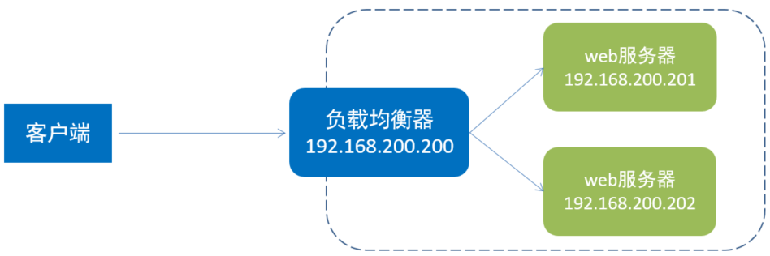  

此处的负载均衡器，我们将会使用Nginx来实现，而Nginx的负载均衡是基于反向代理的，只不过此时所代理的服务器不是一台，而是多台。


#### 6.4.2 测试

**1). 将资料中提供的两个jar包，上传到192.168.200.201服务器上**

| jar                                                          | 运行端口 | 请求链接 | 响应数据 |
| ------------------------------------------------------------ | -------- | -------- | -------- |
|  | 8080     | /hello   | 8080     |
|  | 8081     | /hello   | 8081     |

> 我们在测试时，并没有那么多服务器，我们可以在一台服务器中启动多个服务，运行在不同的端口号上进行测试。


**2). 运行上传上来的两个jar包，运行端口分别是 8080 ， 8081**

由于我们执行 java -jar 指令会占用前台窗口，所以我们可以开启两个窗口进行测试。

 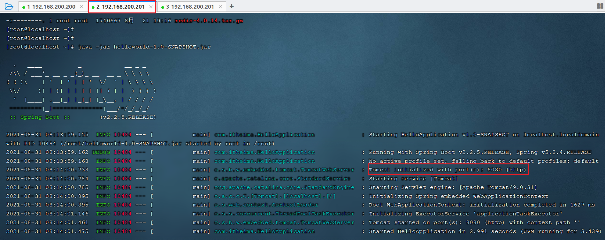

 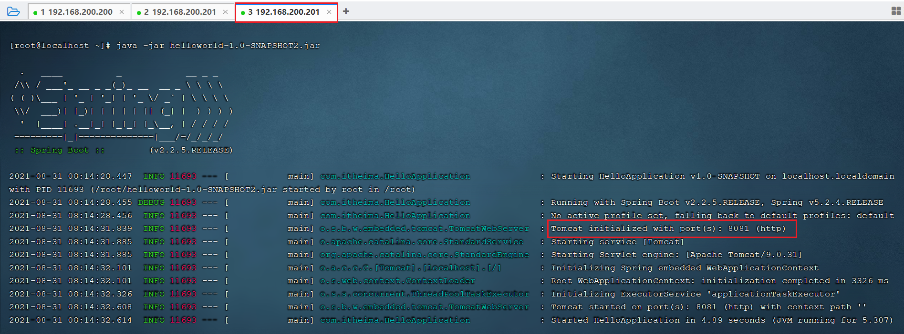


**3). 在nginx中配置负载均衡**

打开nginx的配置文件nginx.conf并增加如下配置: 

```properties
#upstream指令可以定义一组服务器
upstream targetserver{	
    server 192.168.200.201:8080;
    server 192.168.200.201:8081;
}

server {
    listen       8080;
    server_name  localhost;
    location / {
        proxy_pass http://targetserver;
    }
}
```


具体的配置位置如下: 

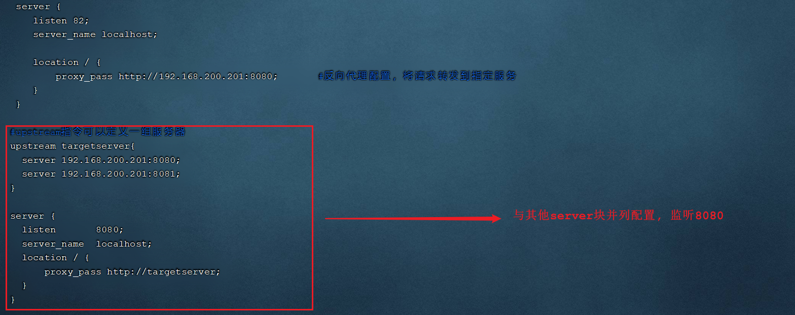 


**4). 重新加载nginx配置文件,访问**

```shell
nginx -s reload
```

测试时,我们直接访问nginx的8080端口(http://192.168.200.200:8080), 此时nginx会根据负载均衡策略,将请求转发到后面的两台服务器。

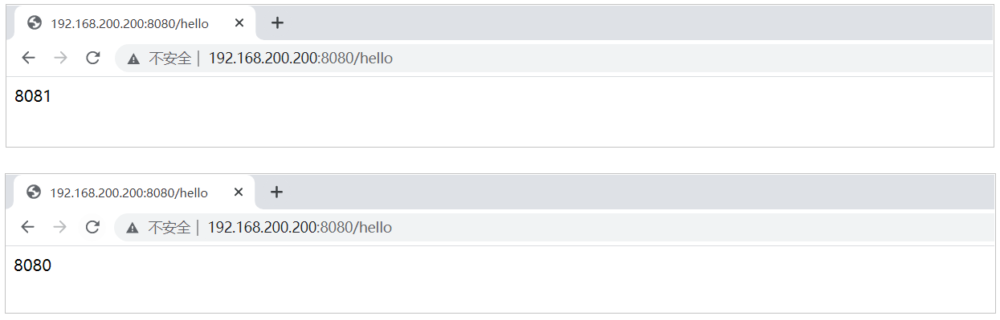 

在上述的测试过程中，我们看到请求均衡的转发到了8080和8081，因为模式的负载均衡策略是轮询。


<font color="red" size="5">注意: 上述所有涉及到的端口号，都需要在对应的服务器的防火墙中开放，或者彻底关闭防火墙</font>


#### 6.4.3 负载均衡策略

处理上述默认的轮询策略以外，在Nginx中还提供了其他的负载均衡策略，如下： 

| **名称**   | **说明**         | 特点                                                         |
| ---------- | ---------------- | ------------------------------------------------------------ |
| 轮询       | 默认方式         |                                                              |
| weight     | 权重方式         | 根据权重分发请求,权重大的分配到请求的概率大                  |
| ip_hash    | 依据ip分配方式   | 根据客户端请求的IP地址计算hash值， 根据hash值来分发请求, 同一个IP发起的请求, 会发转发到同一个服务器上 |
| least_conn | 依据最少连接方式 | 哪个服务器当前处理的连接少, 请求优先转发到这台服务器         |
| url_hash   | 依据url分配方式  | 根据客户端请求url的hash值，来分发请求, 同一个url请求, 会发转发到同一个服务器上 |
| fair       | 依据响应时间方式 | 优先把请求分发给处理请求时间短的服务器                       |


权重的配置： 

```properties
#upstream指令可以定义一组服务器
upstream targetserver{	
    server 192.168.200.201:8080 weight=10;
    server 192.168.200.201:8081 weight=5;
}
```

上述配置的weight权重是相对的，在上述的配置中，效果就是，在大数据量的请求下，最终8080接收的请求数是8081的两倍。


# 前后端分离开发- Yapi- Swagger- 项目部署

## 课程内容

- 前后端分离开发

- Yapi

- Swagger

- 项目部署


## 前言

> 当前项目中，前端代码和后端代码混合在一起，是存在问题的，存在什么问题呢？

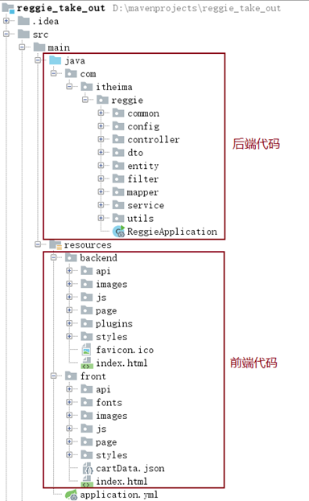 

主要存在以下几点问题： 

1). 开发人员同时负责前端和后端代码开发，分工不明确

2). 开发效率低

3). 前后端代码混合在一个工程中，不便于管理

4). 对开发人员要求高(既会前端，又会后端)，人员招聘困难


为了解决上述提到的问题，现在比较主流的开发方式，就是**前后端分离开发**，前端人员开发前端的代码，后端开发人员开发服务端的业务功能，分工明确，各司其职。我们本章节，就是需要将之前的项目进行优化改造，变成前后端分离开发的项目。


## 1. 前后端分离开发

### 1.1 介绍

**前后端分离开发**，就是在项目开发过程中，对于前端代码的开发由专门的前端开发人员负责，后端代码则由后端开发人员负责，这样可以做到分工明确、各司其职，提高开发效率，前后端代码并行开发，可以加快项目开发进度。

目前，前后端分离开发方式已经被越来越多的公司所采用，成为当前项目开发的主流开发方式。


前后端分离开发后，从工程结构上也会发生变化，即前后端代码不再混合在同一个maven工程中，而是分为 **前端工程** 和 **后端工程** 。

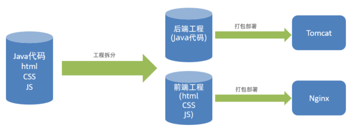 

前后端分离之后，不仅工程结构变化，后期项目上线部署时，与之前也不同:

1). 之前: 前后端代码都混合在一起，我们只需要将前端和后端的代码统一打成jar包，直接运行就可以了。 

2). 现在: 拆分为前后端分离的项目后，最终部署时，后端工程会打成一个jar包，运行在Tomcat中(springboot内嵌的tomcat)。前端工程的静态资源，会直接部署在Nginx中进行访问。


### 1.2 开发流程

前后端分离开发后，面临一个问题，就是前端开发人员和后端开发人员如何进行配合来共同开发一个项目？可以按照如下流程进行：

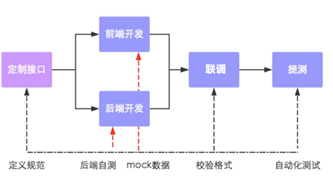             


1). 定制接口: 这里所说的接口不是我们之前在service， mapper层定义的interface； 这里的接口(API接口)就是一个http的请求地址，主要就是去定义：请求路径、请求方式、请求参数、响应数据等内容。(具体接口文档描述的信息, 如上图)

2). 前后端并行开发: 依据定义好的接口信息，前端人员开发前端的代码，服务端人员开发服务端的接口； 在开发中前后端都需要进行测试，后端需要通过对应的工具来进行接口的测试，前端需要根据接口定义的参数进行Mock数据模拟测试。

3). 联调: 当前后端都开发完毕并且自测通过之后，就可以进行前后端的联调测试了，在这一阶段主要就是校验接口的参数格式。

4). 提测: 前后端联调测试通过之后，就可以将项目部署到测试服务器，进行自动化测试了。

 


### 1.3 前端技术栈

**1). 开发工具**

Visual Studio Code (简称VsCode)

Hbuilder


**2). 技术框架**

A. Node.js:  Node.js 是一个基于 Chrome V8 引擎的 JavaScript 运行环境。(类似于java语言中的JDK)。

B. Vue : 目前最火的的一个前端javaScript框架。

C. ElementUI: 一套为开发者、设计师和产品经理准备的基于 Vue 2.0 的桌面端组件库，通过ElementUI组件可以快速构建项目页面。

D. Mock: 生成随机数据，拦截 Ajax 请求，前端可以借助于Mock生成测试数据进行功能测试。

E. Webpack: webpack 是一个现代 JavaScript 应用程序的模块打包器(module bundler)，分析你的项目结构，找到JavaScript模块以及其它的一些浏览器不能直接运行的拓展语言（Sass，TypeScript等），并将其转换和打包为合适的格式供浏览器使用。


## 2. Yapi

### 2.1 介绍

 

YApi 是高效、易用、功能强大的 api 管理平台，旨在为开发、产品、测试人员提供更优雅的接口管理服务。可以帮助开发者轻松创建、发布、维护 API，YApi 还为用户提供了优秀的交互体验，开发人员只需利用平台提供的接口数据写入工具以及简单的点击操作就可以实现接口的管理。

YApi让接口开发更简单高效，让接口的管理更具可读性、可维护性，让团队协作更合理。


源码地址: https://github.com/YMFE/yapi

官方文档: https://hellosean1025.github.io/yapi/


要使用YApi，项目组需要自己进行部署，在本项目中我们可以使用课程提供的平台进行测试，域名： https://mock-java.itheima.net/

  


### 2.2 使用

#### 2.2.1 准备

注册账号，登录平台

 


#### 2.2.2 定义接口

登录到Yapi平台之后，我们可以创建项目，在项目下创建接口分类，在对应的分类中添加接口。

 1). 创建项目

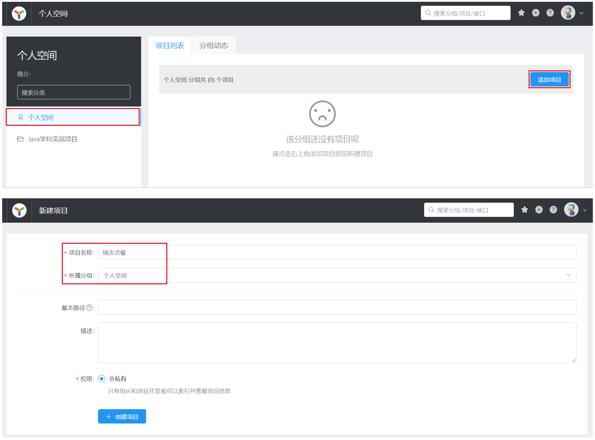 

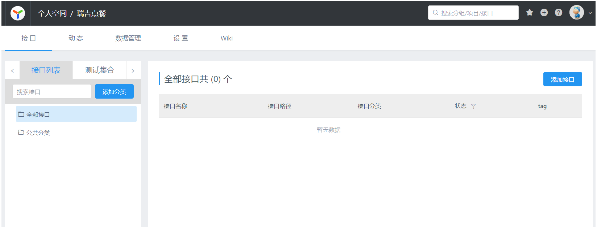 


2). 添加分类

在当前项目中,有针对于员工、菜品、套餐、订单的操作，我们在进行接口维护时，可以针对接口进行分类，如果没有对应的分类，我们自己添加分类。

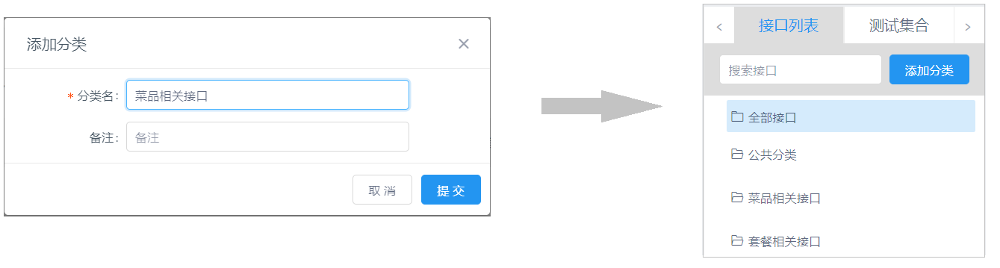 


3). 添加接口

 

接口基本信息录入之后，添加提交，就可以看到该接口的基本信息：

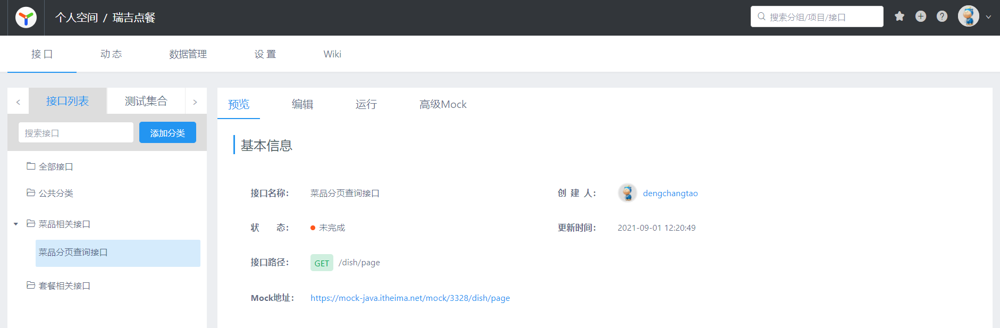  

但是目前，接口中我们并未指定请求参数，响应数据等信息，我们可以进一步点击编辑，对该接口 详情进行编辑处理。

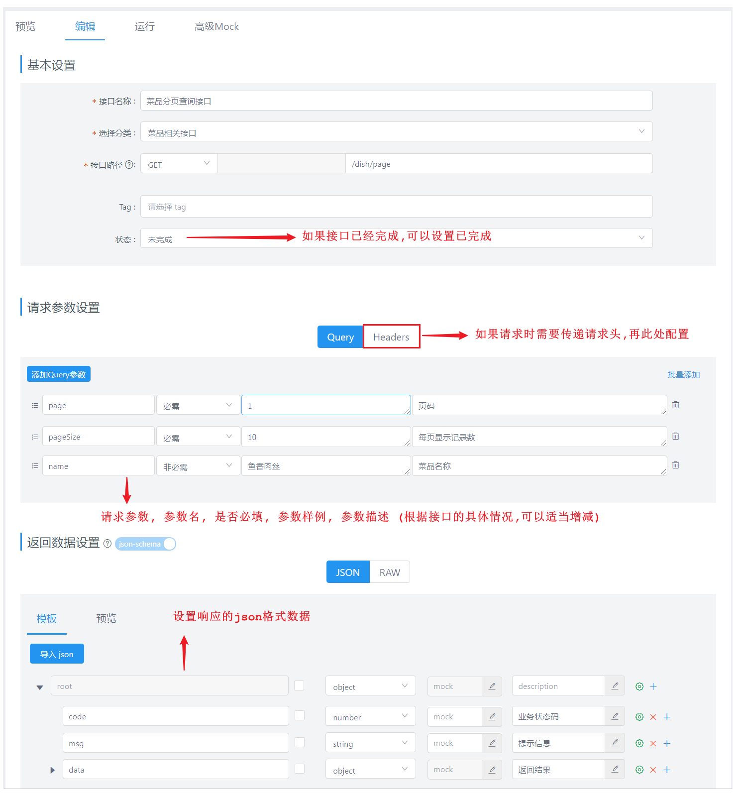 


4). 运行接口

Yapi也提供了接口测试功能，当我们接口编辑完毕后，后端服务的代码开发完毕，启动服务，就可以使用Yapi进行接口测试了。

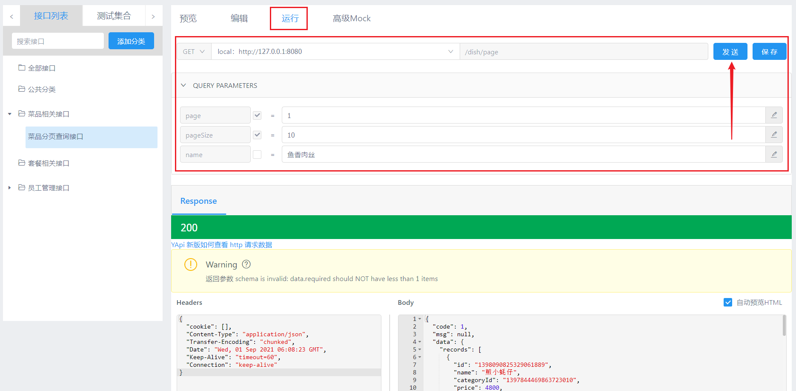 

<font color='red'>注意： 由于菜品分页查询接口，是需要登录后才可以访问的，所以在测试该接口时，需要先请求员工管理接口中的登录接口，登录完成后，再访问该接口。</font>


在Yapi平台中，将接口文档定义好了之后，前后端开发人员就需要根据接口文档中关于接口的描述进行前端和后端功能的开发。


#### 2.2.3 导出接口文档

在Yapi平台中我们不仅可以在线阅读文档，还可以将Yapi中维护的文档直接导出来，可以导出md，json，html格式，在导出时自行选择即可 。

 

而在导出的html文件或md文件中，主要描述的就是接口的基本信息， 包括： 请求路径、请求方式、接口描述、请求参数、返回数据等信息。展示形式如下： 

 


#### 2.2.4 导入接口文档

上述我们讲解了接口文档的导出，我们也可以将外部的接口文档导入到Yapi的平台中，这样我们就不用一个接口一个接口的添加了。我们可以将课程资料中提供的json格式的接口文档直接导入Yapi平台中来。

 

导入过程中出现的确认弹窗，选择"确认"。

 

导入成功之后，我们就可以在Yapi平台查看到已导入的接口。

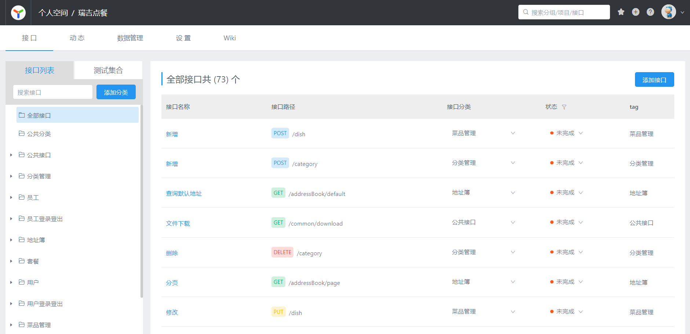 


## 3. Swagger

### 3.1 介绍

官网：https://swagger.io/

 

Swagger 是一个规范和完整的框架，用于生成、描述、调用和可视化 RESTful 风格的 Web 服务。功能主要包含以下几点:

A. 使得前后端分离开发更加方便，有利于团队协作

B. 接口文档在线自动生成，降低后端开发人员编写接口文档的负担

C. 接口功能测试

使用Swagger只需要按照它的规范去定义接口及接口相关的信息，再通过Swagger衍生出来的一系列项目和工具，就可以做到生成各种格式的接口文档，以及在线接口调试页面等等。


直接使用Swagger, 需要按照Swagger的规范定义接口, 实际上就是编写Json文件，编写起来比较繁琐、并不方便, 。而在项目中使用，我们一般会选择一些现成的框架来简化文档的编写，而这些框架是基于Swagger的，如knife4j。knife4j是为Java MVC框架集成Swagger生成Api文档的增强解决方案。而我们要使用kinfe4j，需要在pom.xml中引入如下依赖即可： 

```xml
<dependency>
    <groupId>com.github.xiaoymin</groupId>
    <artifactId>knife4j-spring-boot-starter</artifactId>
    <version>3.0.2</version>
</dependency>
```


### 3.2 使用方式

接下来，我们就将我们的项目集成Knife4j，来自动生成接口文档。这里我们还是需要再创建一个新的分支v1.2，在该分支中进行knife4j的集成，集成测试完毕之后，没有问题，我们再将v1.2分支合并到master。

使用knife4j，主要需要操作以下几步:

**1). 导入knife4j的maven坐标**

```xml
<dependency>
    <groupId>com.github.xiaoymin</groupId>
    <artifactId>knife4j-spring-boot-starter</artifactId>
    <version>3.0.2</version>
</dependency>
```


**2). 导入knife4j相关配置类**

这里我们就不需要再创建一个新的配置类了，我们直接在WebMvcConfig配置类中声明即可。

A. 在该配置类中加上两个注解 @EnableSwagger2 @EnableKnife4j ,开启Swagger和Knife4j的功能。

B. 在配置类中声明一个Docket类型的bean, 通过该bean来指定生成文档的信息。

```java
@Slf4j
@Configuration
@EnableSwagger2
@EnableKnife4j
public class WebMvcConfig extends WebMvcConfigurationSupport {
	
    /**
     * 设置静态资源映射
     * @param registry
     */
    @Override
    protected void addResourceHandlers(ResourceHandlerRegistry registry) {
        log.info("开始进行静态资源映射...");
        registry.addResourceHandler("/backend/**").addResourceLocations("classpath:/backend/");
        registry.addResourceHandler("/front/**").addResourceLocations("classpath:/front/");
    }
	
    /**
     * 扩展mvc框架的消息转换器
     * @param converters
     */
    @Override
    protected void extendMessageConverters(List<HttpMessageConverter<?>> converters) {
        log.info("扩展消息转换器...");
        //创建消息转换器对象
        MappingJackson2HttpMessageConverter messageConverter = new MappingJackson2HttpMessageConverter();
        //设置对象转换器，底层使用Jackson将Java对象转为json
        messageConverter.setObjectMapper(new JacksonObjectMapper());
        //将上面的消息转换器对象追加到mvc框架的转换器集合中
        converters.add(0,messageConverter);
    }
	
    @Bean
    public Docket createRestApi() {
        // 文档类型
        return new Docket(DocumentationType.SWAGGER_2)
                .apiInfo(apiInfo())
                .select()
                .apis(RequestHandlerSelectors.basePackage("com.itheima.reggie.controller"))
                .paths(PathSelectors.any())
                .build();
    }
	
    private ApiInfo apiInfo() {
        return new ApiInfoBuilder()
                .title("瑞吉外卖")
                .version("1.0")
                .description("瑞吉外卖接口文档")
                .build();
    }
}
```

> 注意： Docket声明时，指定的有一个包扫描的路径，该路径指定的是Controller所在包的路径。因为Swagger在生成接口文档时，就是根据这里指定的包路径，自动的扫描该包下的@Controller， @RestController， @RequestMapping等SpringMVC的注解，依据这些注解来生成对应的接口文档。


**3). 设置静态资源映射**

由于Swagger生成的在线文档中，涉及到很多静态资源，这些静态资源需要添加静态资源映射，否则接口文档页面无法访问。因此需要在 WebMvcConfig类中的addResourceHandlers方法中增加如下配置。

```java
registry.addResourceHandler("doc.html").addResourceLocations("classpath:/META-INF/resources/");
registry.addResourceHandler("/webjars/**").addResourceLocations("classpath:/META-INF/resources/webjars/");
```


**4). 在LoginCheckFilter中设置不需要处理的请求路径**

需要将Swagger及Knife4j相关的静态资源直接放行，无需登录即可访问，否则我们就需要登录之后，才可以访问接口文档的页面。

在原有的不需要处理的请求路径中，再增加如下链接： 

```java
"/doc.html",
"/webjars/**",
"/swagger-resources",
"/v2/api-docs"
```

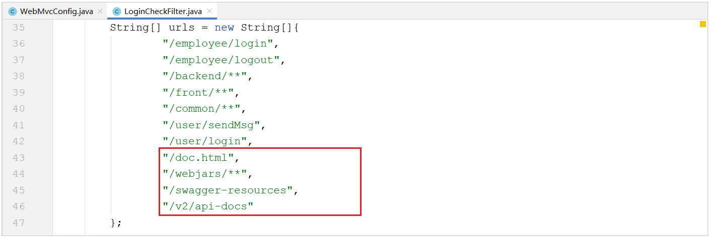 


### 3.3 查看接口文档

经过上面的集成配置之后，我们的项目集成Swagger及Knife4j就已经完成了，接下来我们可以重新启动项目，访问接口文档，访问链接为： http://localhost:8080/doc.html

 

我们可以看到，在所有的Controller中提供的所有的业务增删改查的接口，全部都已经自动生成了，我们通过接口文档可以看到请求的url、请求方式、请求参数、请求实例、响应的参数，响应的示例。 并且呢，我们也可以通过这份在线的接口文档，对接口进行测试。

 


注意： 由于我们服务端的Controller中的业务增删改查的方法，都是必须登录之后才可以访问的，所以，我们在测试时候，也是需要先访问登录接口。登录完成之后，我们可以再访问其他接口进行测试。


我们不仅可以在浏览器浏览生成的接口文档，Knife4j还支持离线文档，对接口文档进行下载，支持下载的格式有：markdown、html、word、openApi。

 


### 3.4 常用注解

#### 3.4.1 问题说明

在上面我们直接访问Knife4j的接口文档页面，可以查看到所有的接口文档信息，但是我们发现，这些接口文档分类及接口描述都是Controller的类名(驼峰命名转换而来)及方法名，而且在接口文档中，所有的请求参数，响应数据，都没有中文的描述，并不知道里面参数的含义，接口文档的可读性很差。

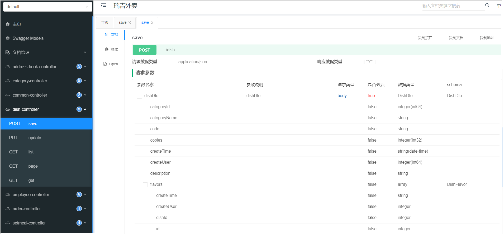 


#### 3.4.2 注解介绍

为了解决上述的问题，Swagger提供了很多的注解，通过这些注解，我们可以更好更清晰的描述我们的接口，包含接口的请求参数、响应数据、数据模型等。核心的注解，主要包含以下几个： 

| 注解               | 位置             | 说明                                                         |
| ------------------ | ---------------- | ------------------------------------------------------------ |
| @Api               | 类               | 加载Controller类上,表示对类的说明                            |
| @ApiModel          | 类(通常是实体类) | 描述实体类的作用                                             |
| @ApiModelProperty  | 属性             | 描述实体类的属性                                             |
| @ApiOperation      | 方法             | 说明方法的用途、作用                                         |
| @ApiImplicitParams | 方法             | 表示一组参数说明                                             |
| @ApiImplicitParam  | 方法             | 用在@ApiImplicitParams注解中，指定一个请求参数的各个方面的属性 |


#### 3.4.3 注解测试

**1). 实体类**

> 可以通过 @ApiModel , @ApiModelProperty 来描述实体类及属性

```java
@Data
@ApiModel("套餐")
public class Setmeal implements Serializable {
    private static final long serialVersionUID = 1L;
    @ApiModelProperty("主键")
    private Long id;
    
    //分类id
    @ApiModelProperty("分类id")
    private Long categoryId;
    
    //套餐名称
    @ApiModelProperty("套餐名称")
    private String name;

    //套餐价格
    @ApiModelProperty("套餐价格")
    private BigDecimal price;

    //状态 0:停用 1:启用
    @ApiModelProperty("状态")
    private Integer status;

    //编码
    @ApiModelProperty("套餐编号")
    private String code;

    //描述信息
    @ApiModelProperty("描述信息")
    private String description;

    //图片
    @ApiModelProperty("图片")
    private String image;

    @TableField(fill = FieldFill.INSERT)
    private LocalDateTime createTime;

    @TableField(fill = FieldFill.INSERT_UPDATE)
    private LocalDateTime updateTime;

    @TableField(fill = FieldFill.INSERT)
    private Long createUser;

    @TableField(fill = FieldFill.INSERT_UPDATE)
    private Long updateUser;
}
```


**2). 响应实体R**

```java
@Data
@ApiModel("返回结果")
public class R<T> implements Serializable{

    @ApiModelProperty("编码")
    private Integer code; //编码：1成功，0和其它数字为失败

    @ApiModelProperty("错误信息")
    private String msg; //错误信息

    @ApiModelProperty("数据")
    private T data; //数据

    @ApiModelProperty("动态数据")
    private Map map = new HashMap(); //动态数据
	
	//省略静态方法 ....
}    
```


**3). Controller类及其中的方法**

> 描述Controller、方法及其方法参数，可以通过注解： @Api， @APIOperation， @ApiImplicitParams, @ApiImplicitParam

```java
@RestController
@RequestMapping("/setmeal")
@Slf4j
@Api(tags = "套餐相关接口")
public class SetmealController {

    @Autowired
    private SetmealService setmealService;
    @Autowired
    private CategoryService categoryService;
    @Autowired
    private SetmealDishService setmealDishService;

    /**
     * 新增套餐
     * @param setmealDto
     * @return
     */
    @PostMapping
    @CacheEvict(value = "setmealCache",allEntries = true)
    @ApiOperation(value = "新增套餐接口")
    public R<String> save(@RequestBody SetmealDto setmealDto){
        log.info("套餐信息：{}",setmealDto);

        setmealService.saveWithDish(setmealDto);

        return R.success("新增套餐成功");
    }

    /**
     * 套餐分页查询
     * @param page
     * @param pageSize
     * @param name
     * @return
     */
    @GetMapping("/page")
    @ApiOperation(value = "套餐分页查询接口")
    @ApiImplicitParams({
            @ApiImplicitParam(name = "page",value = "页码",required = true),
            @ApiImplicitParam(name = "pageSize",value = "每页记录数",required = true),
            @ApiImplicitParam(name = "name",value = "套餐名称",required = false)
    })
    public R<Page> page(int page,int pageSize,String name){
        //分页构造器对象
        Page<Setmeal> pageInfo = new Page<>(page,pageSize);
        Page<SetmealDto> dtoPage = new Page<>();

        LambdaQueryWrapper<Setmeal> queryWrapper = new LambdaQueryWrapper<>();
        //添加查询条件，根据name进行like模糊查询
        queryWrapper.like(name != null,Setmeal::getName,name);
        //添加排序条件，根据更新时间降序排列
        queryWrapper.orderByDesc(Setmeal::getUpdateTime);

        setmealService.page(pageInfo,queryWrapper);

        //对象拷贝
        BeanUtils.copyProperties(pageInfo,dtoPage,"records");
        List<Setmeal> records = pageInfo.getRecords();

        List<SetmealDto> list = records.stream().map((item) -> {
            SetmealDto setmealDto = new SetmealDto();
            //对象拷贝
            BeanUtils.copyProperties(item,setmealDto);
            //分类id
            Long categoryId = item.getCategoryId();
            //根据分类id查询分类对象
            Category category = categoryService.getById(categoryId);
            if(category != null){
                //分类名称
                String categoryName = category.getName();
                setmealDto.setCategoryName(categoryName);
            }
            return setmealDto;
        }).collect(Collectors.toList());

        dtoPage.setRecords(list);
        return R.success(dtoPage);
    }

    /**
     * 删除套餐
     * @param ids
     * @return
     */
    @DeleteMapping
    @CacheEvict(value = "setmealCache",allEntries = true)
    @ApiOperation(value = "套餐删除接口")
    public R<String> delete(@RequestParam List<Long> ids){
        log.info("ids:{}",ids);

        setmealService.removeWithDish(ids);

        return R.success("套餐数据删除成功");
    }

    /**
     * 根据条件查询套餐数据
     * @param setmeal
     * @return
     */
    @GetMapping("/list")
    @Cacheable(value = "setmealCache",key = "#setmeal.categoryId + '_' + #setmeal.status")
    @ApiOperation(value = "套餐条件查询接口")
    public R<List<Setmeal>> list(Setmeal setmeal){
        LambdaQueryWrapper<Setmeal> queryWrapper = new LambdaQueryWrapper<>();
        queryWrapper.eq(setmeal.getCategoryId() != null,Setmeal::getCategoryId,setmeal.getCategoryId());
        queryWrapper.eq(setmeal.getStatus() != null,Setmeal::getStatus,setmeal.getStatus());
        queryWrapper.orderByDesc(Setmeal::getUpdateTime);

        List<Setmeal> list = setmealService.list(queryWrapper);

        return R.success(list);
    }
}

```


**4). 重启服务测试**

我们上述通过Swagger的注解，对实体类及实体类中的属性，以及Controller和Controller的方法进行描述，接下来，我们重新启动服务，然后看一下自动生成的接口文档有何变化。

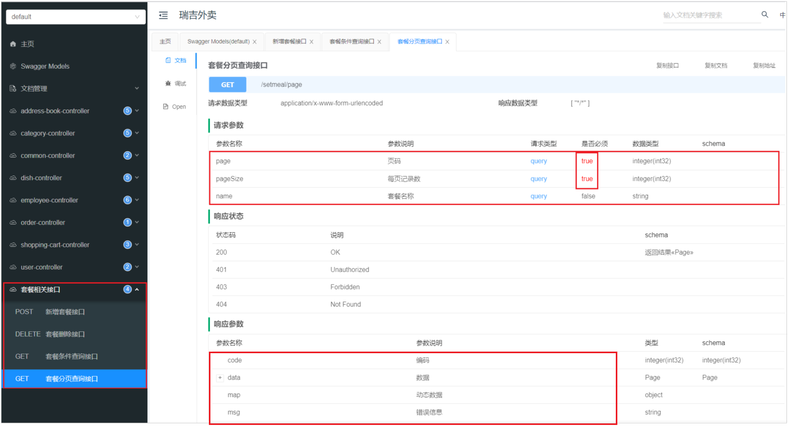 

在接口文档的页面中，我们可以看到接口的中文描述，清晰的看到每一个接口是做什么的，接口方法参数什么含义，参数是否是必填的，响应结果的参数是什么含义等，都可以清楚的描述出来。

总之，我们要想清晰的描述一个接口，就需要借助于Swagger给我们提供的注解。


## 4. 项目部署

在本章节，我们要做的是项目的部署，包含前端项目的部署，及后端项目的部署。

### 4.1 部署架构

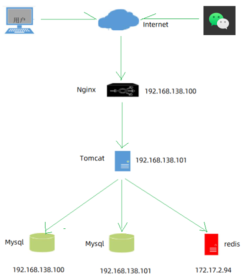 

PC端： 主要是为餐厅的员工及管理员使用的后台管理系统，对分类、菜品、套餐信息进行维护。

移动端： 可以基于微信公众号或小程序实现，我们课上并未实现，这部分的工作是前端开发人员需要开发的。


前端部署服务器： Nginx

后端部署服务器： Tomcat(内嵌)


### 4.2 环境说明

由于我们的服务器数量有限，就使用这三台服务器，具体的软件规划如下: 

| 服务器          | 软件                                                         | 名称    |
| --------------- | ------------------------------------------------------------ | ------- |
| 192.168.138.100 | Nginx(部署前端项目、配置反向代理)，MySQL(主从复制的主库)     | 服务器A |
| 192.168.138.101 | JDK1.8、Git、Maven、jar(项目jar包基于内嵌Tomcat运行)、MySQL(主从复制的从库) | 服务器B |
| 172.17.2.94     | Redis(缓存中间件)                                            | 服务器C |


由于我们前面的课程中Nginx、MySQL的主从复制、Redis、JDK、Git、Maven都已经演示过安装及配置了，这里我们就不再演示软件的安装了。


### 4.3 前端部署

**1). 在服务器A(192.168.138.100)中安装Nginx，将课程资料中的dist目录上传到Nginx的html目录下**

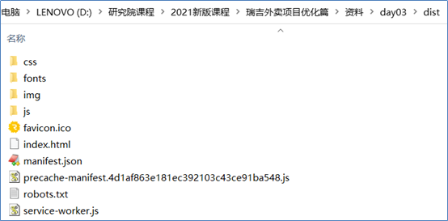 

将整个dist目录上传至/usr/local/nginx/html目录下

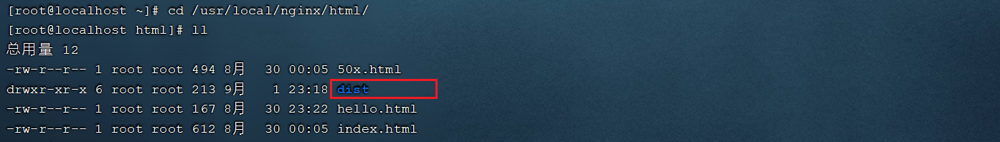 


**2). 修改Nginx配置文件nginx.conf**

将nginx.conf配置文件中，将原有的监听80, 82, 8080端口号 的虚拟主机注释掉，引入如下的配置信息：

```properties
    server {
        listen       80;
        server_name  localhost;

        location / {
            root   html/dist;
            index  index.html;
        }
		
		location ^~ /api/ {
			rewrite ^/api/(.*)$ /$1 break;
			proxy_pass http://192.168.138.101:8080;
		}
		
        location = /50x.html {
            root   html;
        }
    }
```

 


**3). 通过nginx访问前端工程**

http://192.168.138.100

 


### 4.4 反向代理配置

前端工程部署完成之后，我们可以正常的访问到系统的登录页面，点击登录按钮，可以看到服务端发起的请求，请求信息如下： 

 

而大家知道，在我们之前开发的工程中，是没有/api这个前缀的,那这个时候,在不修改服务端代码的情况下，如何处理该请求呢? 

实际上，通过nginx的就可以轻松解决这个问题。


在上述我们配置的nginx.conf中，除了配置了静态资源的加载目录以外，我们还配置了一段反向代理的配置，配置信息如下： 

```properties
location ^~ /api/ {
    rewrite ^/api/(.*)$ /$1 break;
    proxy_pass http://192.168.138.101:8080;
}
```

这一段配置代表，如果请求当前nginx，并且请求的路径如果是 /api/ 开头，将会被该location处理。而在该location中，主要配置了两块儿信息： rewrite(url重写) 和 proxy_pass(反向代理)。 接下来我们就来解析一下这两项的配置。


**1). 路径重写rewrite**

```
rewrite ^/api/(.*)$ /$1 break;
```

这里写的是一个正则表达式，代表如果请求路径是以 `/api/` 开头，后面的请求路径任意，此时将原始的url路径重写为 `/$1`，这里的`$1`指代的就是通配符 .* 这一块的内容。比如： 

```
/api/employee/login ------> ^/api/(.*)$ --------> 此时 (.*) 匹配的就是 employee/login ------> 最终重写为/$1 : /employee/login
```


**2). 反向代理**

```
proxy_pass http://192.168.138.101:8080;
```

路径重写后的请求，将会转发到后端的 http://192.168.138.101:8080 服务器中。 而这台服务器中，就部署的是我们的后端服务。


### 4.5 服务端部署

**1). 在服务器B(192.168.138.101)中安装jdk、git、maven、MySQL，使用git clone命令将git远程仓库的代码克隆下来**

A. 确认JDK环境

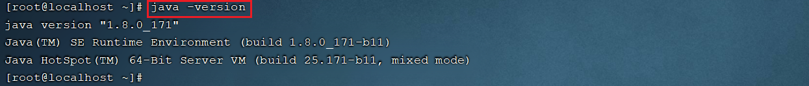 


B. 确认Git环境

 


C. 确认Maven环境

 


D. 将我们开发完成的代码推送至远程仓库,并在服务器B中克隆下来

```shell
#创建java代码存放目录
mkdir -p /usr/local/javaapp

#切换目录
cd /usr/local/javaapp

#克隆代码 , 需要使用自己的远程仓库
git clone https://gitee.com/ChuanZhiBoKe/reggie_take_out.git 
```

  


**2). 将资料中提供的reggieStart.sh文件上传到服务器B，通过chmod命令设置执行权限**

 


**3). 执行reggieStart.sh脚本文件，自动部署项目**

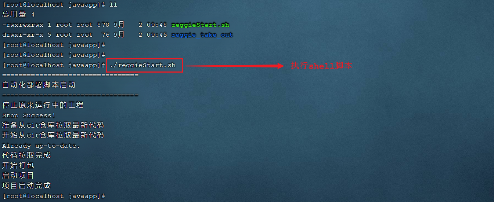 

执行完shell脚本之后，我们可以通过 ps -ef|grep java 指令，查看服务是否启动。

 


**4). 访问系统测试**

http://192.168.138.101/

 


### 4.6 图片展示问题处理

在上述的测试中，我们发现菜品的图片无法正常展示。原因是因为，在我们的配置文件中，图片信息依然是从 D:/img 中加载的，但是在Linux服务器中，是不存在D盘的。

 


**1). 修改文件存储目录**

将文件存储目录修改为：

```
reggie:
  path: /usr/local/img/
```

 修改完成之后，需要将变动的代码提交到本地仓库，并推送至远程仓库。

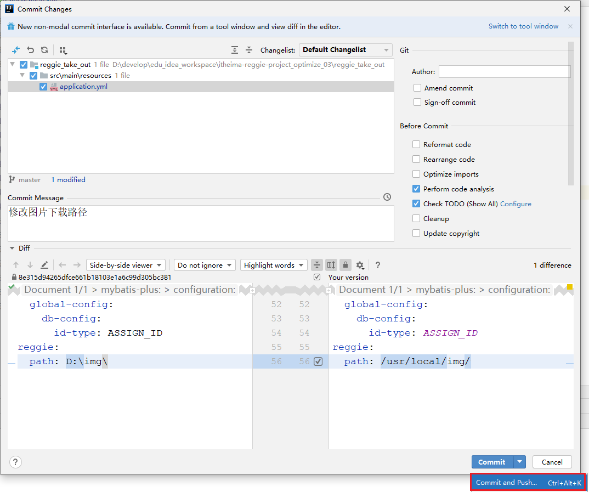 


**2). 执行shell脚本,进行自动化部署**

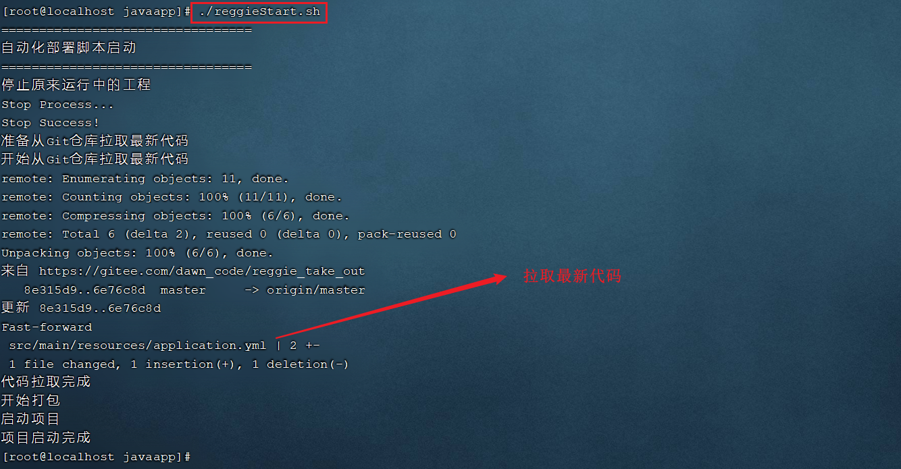 


**3). 将本地的测试图片文件夹img(整个文件夹)上传到服务器B的/usr/local目录下**

 


**4).访问测试**

http://192.168.138.101/

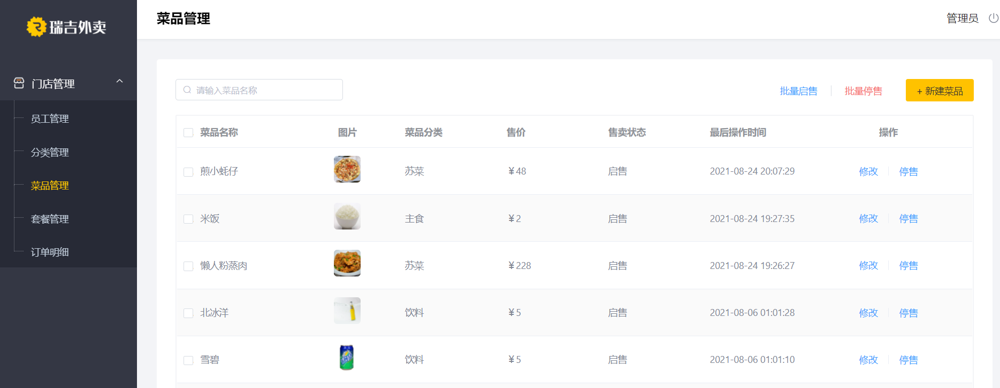 


